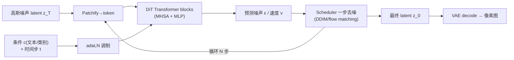

---
tags:
  - 生成模型基础
  - DiT
  - 扩散模型
  - Transformer
  - flow-matching
---

# DiT 是什么，核心流程

> 两个问题：**DiT 到底是什么?它一次生成图像的核心流程是怎么走的?**
>
> 本文从定义、三大构件、推理/训练流程、与 U-Net/LLM 的差异，到现代变体(flow matching / MM-DiT)走一遍。这块正对应 vllm-omni 的 diffusion 引擎跑的模型骨干。

## 一句话

**DiT = Diffusion Transformer**（Peebles & Xie, 2023）——把扩散模型里负责「去噪」的骨干，从传统 **U-Net 换成 Transformer**。

更完整地说：**DiT = 在 latent 空间上、把图像切成 patch token、用 Transformer 做去噪、用 adaLN 注入时间步与条件的扩散模型。**

它现在是主流生成模型的底座：Stable Diffusion 3 / PixArt-α / Flux / Sora 等，以及 vllm-omni 里 diffusion 引擎跑的就是这类 DiT。核心动机是 **scalability**——Transformer 随参数/算力扩展的规律比 U-Net 更干净，加大模型几乎稳定涨质量。

## 一、三个关键构件

| 构件 | 作用 | 备注 |
|---|---|---|
| **VAE** | 像素图 ↔ latent 压缩（如 512×512×3 → 64×64×4），扩散在 latent 上做，省算力 | 在 omni 里是独立的 encode/decode 阶段 |
| **Patchify** | 把 latent 切成 patch，拉平成 token 序列 + 位置编码 | 和 ViT 一模一样 |
| **adaLN-Zero** | 把「时间步 t + 条件 c（类别/文本）」编码成 scale/shift，调制每个 Transformer block 的 LayerNorm；初始化成零（恒等）让训练稳 | **DiT 的标志性设计**，条件注入方式 |

## 二、核心流程（推理 / 采样）

逐步：

1. **起点**：纯高斯噪声 latent $z_T$。
2. **循环去噪**（一般 20~50 步，由 scheduler 决定步数）：
   - Patchify → token；
   - 把当前时间步 $t$ 和条件 $c$ 经 adaLN 注入；
   - 跑 DiT，**预测噪声 $\epsilon$（或速度 $v$ / $x_0$）**；
   - Scheduler 据预测把 $z_t$ 推进到更干净的 $z_{t-1}$；
   - **CFG（无分类器引导）**：通常一步里跑「有条件 + 无条件」两份，按 guidance scale 外推，控制贴合提示词的强度（代价是算力翻倍）。
3. **解码**：最终 latent $z_0$ 经 VAE decode 还原成图像。

## 三、训练流程（对照理解）

VAE 编码得 latent → 按随机时间步 $t$ 加噪（前向扩散）→ patchify → DiT 在条件下**预测被加的噪声** → 与真实噪声算 MSE。即「学会从带噪 latent 里认出噪声」。

## 四、和 U-Net / LLM 的关键差异

- **vs U-Net**：去掉卷积 + 跳连的归纳偏置，纯 attention，扩展性更好，但**算力更重、对长 token 序列敏感**（分辨率↑ → patch token↑ → attention 平方增长）。
- **vs LLM（GPT）**：LLM 是**自回归**、单向 causal、逐 token、有 KV Cache；DiT 是**迭代去噪**、全序列**双向 attention**、所有 patch 并行更新、**没有 KV Cache**（每个去噪步是对全图的一次完整 forward）。

> 所以 DiT 的显存/算力画像和 [每 token 的 KV Cache](../llm-basics/kv-cache-per-token.md) 那题完全不同——它是「**步数 × 全序列 forward**」，没有随生成长度线性增长的 KV 缓存，但每一步都是稠密全图计算。

## 五、现代变体（一句话）

- **Flow Matching / Rectified Flow**（SD3、Flux）：把「逐步去噪」换成「学一条从噪声到数据的直线速度场」，采样步数更少。
- **MM-DiT**（SD3）：文本和图像各一条 stream，在 attention 里联合交互，比单纯 cross-attention 注入更强。

## 小结

| 维度 | DiT |
|---|---|
| 是什么 | 用 Transformer 当去噪骨干的扩散模型 |
| 在哪算 | VAE 压出的 latent 空间 |
| 输入 | patchify 的 latent token + (时间步 t, 条件 c) |
| 条件注入 | adaLN-Zero（标志性设计） |
| 输出 | 预测噪声/速度，scheduler 迭代去噪 |
| 关键特征 | 双向 attention、无 KV Cache、步数 × 全序列 forward |

!!! info "与 vllm-omni 的关系"
    vllm-omni 的 **diffusion 引擎**跑的就是 DiT 骨干，涉及 diffusion attention backend 与 diffusion CustomOp（见 [vLLM IR：从 CustomOp 的困境说起](../vllm/vllm-ir-and-customop.md)）。本文讲「DiT 模型本身」，那篇讲「承载它的算子分发机制」。
