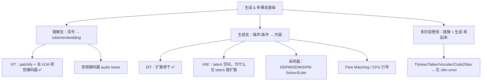

# 生成模型基础

打底生成式与多模态模型（扩散、视觉编码、VAE、采样器等）的核心概念与流程，和 [LLM 基础](../llm-basics/index.md) 并列——后者偏文本自回归推理，这里偏视觉/多模态生成与理解。

## 知识脉络

这个领域可以拆成两支再加一条主线：**理解支**（把像素/音频压成 token）、**生成支**（从噪声+条件造出内容），以及把两者串起来的**多阶段管线**。

**建议阅读顺序**：

1. **理解支**——先看 [ViT 是什么，核心流程](vit.md) ✅：patchify、在 VLM 里当视觉编码器，这是多模态输入侧的地基。
2. **生成支**——[DiT 是什么，核心流程](dit.md) ✅ 是扩散骨干；往下补 VAE（latent 空间）→ 采样器 → Flow Matching / CFG，构成一条完整的"造内容"链路。
3. **管线**——把理解与生成拼成端到端的多阶段流水线（Thinker/Talker/Code2Wav），落地实例见 [vllm-omni 板块](../vllm-omni/index.md)。

> ✅ = 已有笔记；其余为推进方向。视觉/音频编码器如何接进推理引擎，参见 [全模态与纯文本路径区别](../vllm-omni/multimodal-vs-text-path.md)。

## 目录

> 随学习推进逐步补充。

- [DiT 是什么，核心流程](dit.md) — Diffusion Transformer 的定义、三大构件、推理/训练流程、与 U-Net/LLM 的差异
- [ViT 是什么，核心流程](vit.md) — Vision Transformer：patchify 流程、在 VLM 里当视觉编码器、与 DiT 的异同

待补充方向：

- VAE：latent 压缩与重建，为什么扩散要在 latent 空间做
- 扩散采样器：DDPM / DDIM / DPM-Solver / Euler 的取舍
- Flow Matching / Rectified Flow：与传统扩散的关系
- Classifier-Free Guidance（CFG）原理与算力代价
- 多阶段生成管线：Thinker / Talker / Vocoder / Code2Wav 的分工

另见 [碎片知识](snippets/index.md)：速查、结论快照等零散条目。

## 如何新增一篇

1. 在 `docs/generative-basics/` 下新建 Markdown 文件
2. 在 `mkdocs.yml` 的 `nav` → `生成模型基础` 下登记一行
