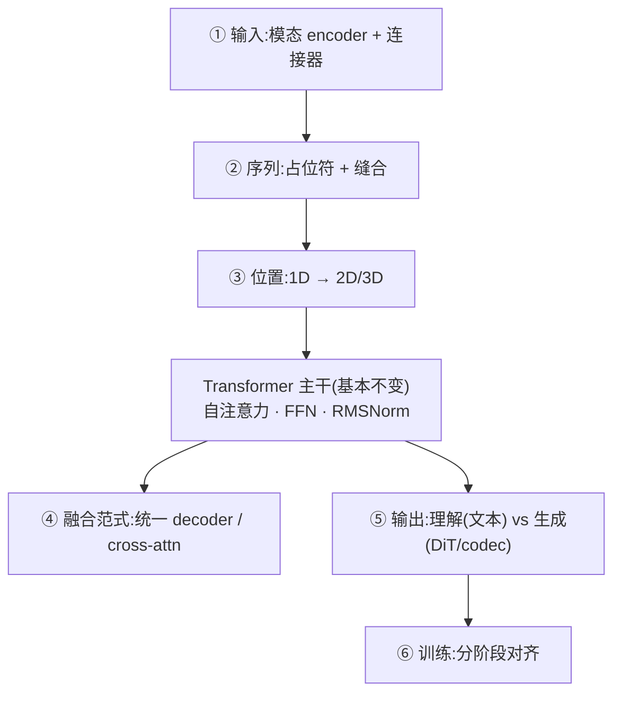

---
tags:
  - 多模态
  - VLM
  - Transformer
  - ViT
  - 连接器
  - M-RoPE
  - 收口
---

# 多模态模型在 Transformer 基础上有哪些变化

> 收口页。一句话抓住:**Transformer 主干(decoder + 自注意力)几乎不动,变化几乎全在主干"周围"** —— 自注意力不在乎序列里的向量来自文本还是图像 patch,它只处理一串 embedding。所以真正的改动集中在**输入怎么变 token、位置怎么编、输出怎么解码**。
>
> 本页把散落各处的点串成"相对纯文本 Transformer 改了什么"的总纲;主干那部分就是 [手写 Transformer](../llm-basics/handwritten-transformer.md) 那套,这里只讲多出来的部分。

## 全景:改在哪六层

## 1. 输入端:模态编码器 + 连接器(最核心)

文本是「查词表得离散 token embedding」;其它模态没有词表,得先编码再对齐到 LLM 的 embedding 空间。

- **每模态一个 encoder**:图像 → **ViT**([vit.md](vit.md));音频 → Whisper/Conformer 类 audio tower;视频 → ViT + 时序。
- **连接器 / projector(对齐的关键)**:把 encoder 输出投到 LLM 词嵌入空间。常见形态:

| 连接器 | 机制 | 代表 |
|---|---|---|
| MLP | 两层线性投影,最简单 | LLaVA |
| Q-Former | 一组可学习 query 用 cross-attn 抽取固定数量视觉 token | BLIP-2 |
| Perceiver Resampler | 用 latent query 重采样到固定长度 | Flamingo |
| pixel-shuffle / merger | 空间下采样合并相邻 patch,压 token 数 | Qwen-VL 系 |

- **视觉 token 又多又连续**:一张图几百~上千 token,序列暴涨 → 需要 token merging / resampler 压缩(否则 KV Cache 与算力都吃不消)。

## 2. 序列构造:占位符 + 缝合

文本序列里放特殊占位 token(如 `<image>`),forward 前把视觉 embedding **scatter 进 `input_embeds` 的对应位置**,再整条喂给主干。

> 这正是 [全模态 vs 纯文本路径](../vllm-omni/multimodal-vs-text-path.md) 的结论:**分叉只在 backbone 之前,入 backbone 即合流**。多图、图文交错、视频帧都在这一层拼装。

## 3. 位置编码:1D → 2D/3D

文本一维位置不够描述图像/视频的空间与时间结构。于是有 **2D-RoPE / M-RoPE(multimodal RoPE)**:图像按二维、视频按三维(时+高+宽)分配位置。

> Qwen2-VL 的 `mrope` 即此;工程侧你在 [runner-compare](../npu-adaptation/runner-compare/index.md) 见过的 `_calc_mrope_positions` 就是算这个。对比纯文本的 1D RoPE 见 [手写 Transformer § RoPE](../llm-basics/handwritten-transformer.md)。

## 4. 融合范式:两大流派

| 范式 | 做法 | 主干改动 | 代表 |
|---|---|---|---|
| **统一 decoder(early fusion)** | 视觉 token 直接拼进序列做自注意力 | **零改动** | LLaVA、Qwen-VL、多数现代 VLM |
| **Cross-attention 注入** | 视觉作 KV,插新的 cross-attn 层 | 加层 | Flamingo |

现在**主流是统一 decoder**——这正是"主干不变"成立的原因。细节:视觉 token 内部有时用**双向**注意力,文本仍**因果**。

## 5. 输出端:理解 vs 生成(分水岭)

| 类型 | 主干 | 额外部件 |
|---|---|---|
| **只输出文本(理解型 VLM)** | 完全不动 | 仅需第 1 层输入改造 |
| **生成图像/视频** | 不动(产语义/条件) | 扩散 **DiT**([dit.md](dit.md))+ VAE decoder,或自回归离散 VQ token |
| **生成音频** | 不动 | 音频 codec / vocoder(code2wav) |

生成式还多一层**多段编排**:omni 的 **Thinker → Talker → Code2Wav** 三段式 —— 理解主干产语义,生成段各接各的解码器,由 orchestrator 串。落地见 [Qwen3-Omni 怎么跑起来](../vllm-omni/qwen3-omni-npu.md) 与 [Orchestrator 编排核心](../vllm-omni/engine-orchestrator.md)。

## 6. 训练:分阶段对齐

通常**冻结 encoder 与 LLM,先只训连接器**做模态对齐,再联合微调;数据是图文对 + 交错语料。核心工作量在"让视觉 embedding 落到 LLM 能听懂的分布"。

## 一句话总结

> **VLM = 冻的文本 Transformer 主干 + 各模态 encoder + 把它们投到同一 embedding 空间的连接器 + (生成式才需要的)解码器/编排。**
> 主干还是 [手写 Transformer](../llm-basics/handwritten-transformer.md) 那套自注意力,只是输入端多了"编码→连接→缝合",位置编码升到多维,生成式再在输出端接 DiT/codec。

## 关联

- 理解支:[ViT](vit.md) · 生成支:[DiT](dit.md)
- 主干本体:[手写 Transformer / RMSNorm](../llm-basics/handwritten-transformer.md)、[注意力变体](../llm-basics/attention-variants.md)
- 工程落地:[全模态 vs 纯文本路径](../vllm-omni/multimodal-vs-text-path.md)、[多模态全流程与 omni 类关联](../vllm-omni/multimodal-runtime-overview.md)、[Qwen3-Omni](../vllm-omni/qwen3-omni-npu.md)
