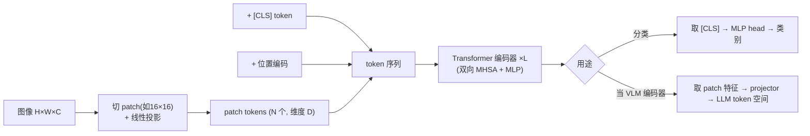

---
tags:
  - 生成模型基础
  - ViT
  - 视觉编码器
  - Transformer
  - VLM
  - 多模态
---

# ViT 是什么，核心流程

> 两个问题：**ViT 到底是什么?它把一张图变成特征的核心流程怎么走?**
>
> 本文从定义、patchify 流程、要点、在 VLM/omni 里的位置，到与 DiT 的异同走一遍。ViT 是当今几乎所有多模态大模型的视觉编码器底座。

## 一句话

**ViT = Vision Transformer**（Dosovitskiy et al. 2020，《An Image is Worth 16×16 Words》）——把**纯 Transformer 直接用到图像**上：不靠卷积，而是把图片切成一格格 patch，当成「视觉单词」序列喂进 Transformer。

完整说：**ViT = 图像切 patch → 线性投影成 token → 过 Transformer 编码器 → 取特征/分类。** 它证明了「足够数据 + 规模下，Transformer 在视觉上能追平甚至超过 CNN」，是 VLM（如 Qwen-VL / InternVL）的视觉编码器底座。

## 一、核心流程

逐步：

1. **Patchify**：图像 $H\times W\times C$ 切成固定大小 patch（如 16×16），每块拉平后线性投影成一个 $D$ 维 token。
   - 例：224×224 图、16×16 patch → 14×14 = **196 个 patch token**。
2. **[CLS] + 位置编码**：前置一个可学习的 `[CLS]` token（汇聚全局信息）；加位置编码（attention 本身无序，需要位置信息）。
3. **Transformer 编码器**：$L$ 层 (MHSA + MLP)，**全双向 attention**——每个 patch 都能看到所有 patch。
4. **取输出**：
   - **分类**：用 `[CLS]` 的输出过 MLP head 出类别；
   - **当 VLM 视觉编码器**：取所有 patch 的输出特征，经 projector/merger 投到 LLM 的 token 空间，与文本 token 拼接喂大模型。

## 二、几个要点

- **vs CNN**：去掉卷积的归纳偏置（局部性、平移等变），所以**更吃数据/预训练**，但规模化更好。
- **算力**：attention 对 patch 数是 $O(n^2)$ → **高分辨率 = patch 暴增 = 很贵**。这也是 VLM 里要做 patch 合并 / 动态分辨率的原因。
- **主流变体**：DeiT（省数据）、Swin（窗口化/层次化 attention）、**CLIP / SigLIP 的 ViT**（图文对比预训练，VLM 用得最多）、**NaViT / 原生动态分辨率**（变分辨率、序列打包）。

## 三、在 VLM / omni 里的位置

- ViT 是**视觉编码器**：图像 → patch token → projector（MLP/merger）压到 LLM token 空间 → 当「图像 token」和文本一起进 LLM。
- Qwen2-VL / Qwen3-VL 这类用 **2D-RoPE + 原生动态分辨率 + 窗口注意力**的 ViT，再用 **merger（如 2×2 合并）压 token 数**——直接决定一张图占多少「图像 token」，进而影响序列长度与 [KV Cache](../llm-basics/kv-cache-per-token.md)。
- 在 vllm / omni 的多模态输入管线里，ViT 前向属于 multimodal encoder 阶段，产出的视觉 token 数会叠加到上下文里。

## 四、ViT vs DiT

接 [DiT 笔记](dit.md)——两者同源（都 patchify + Transformer + 全双向 attention），但任务相反：

| | **ViT** | **DiT** |
|---|---|---|
| 任务 | 理解/编码（判别式） | 生成（扩散） |
| 输入 | 图像 patch token | 带噪 latent patch token + (t, 条件) |
| 条件注入 | 无（或 [CLS]） | **adaLN-Zero**（时间步+条件） |
| 前向次数 | **一次** | **迭代去噪 N 步** |
| 输出 | 特征 / 类别 | 预测噪声 / 速度 |
| attention | 全双向 | 全双向 |

## 小结

| 维度 | ViT |
|---|---|
| 是什么 | 把图像当 patch 序列、用 Transformer 编码的视觉模型 |
| 输入 | patchify 的 patch token + [CLS] + 位置编码 |
| 主体 | L 层双向 Transformer 编码器 |
| 输出 | [CLS] 分类，或 patch 特征（VLM 用） |
| 关键特征 | 无卷积偏置、O(n²) 随分辨率涨、一次前向 |
| 在 VLM | 视觉编码器 → projector → 图像 token 进 LLM |

!!! info "说明"
    ViT 属多模态理解侧，与本板块的 DiT（生成侧）同根（patchify + Transformer），故并入「生成模型基础」一起讲。后续可补 CLIP/SigLIP、projector/merger、音频编码器等。
