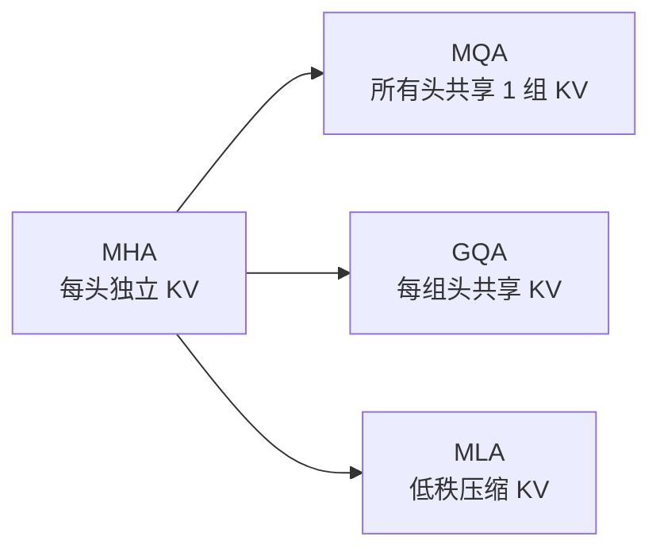

---
tags:
  - LLM
  - 基础
  - attention
  - GQA
  - MQA
  - MLA
  - KV-Cache
---

# 注意力变体:GQA / MQA / MLA(骨架)

> 🏗 学习骨架。所属 [LLM 基础](index.md) § 2 · 现代变体。核心动机一句话:**都是在省 KV Cache**。

## 学习目标

学完能:说清 MHA→MQA→GQA→MLA 的演进主线,并**定量**算出各方案的 KV Cache 大小差异 —— 直接呼应 [KV Cache 显存题](kv-cache-per-token.md) 与你的 NPU 适配工作。

## 一图速览

## 带着问题读

- MHA 的 KV Cache 大小公式?换成 MQA / GQA(g 组)后除以多少?
- GQA 是 MHA 与 MQA 的折中 —— 组数 g 如何权衡「显存」与「质量」?
- **MLA**(DeepSeek)不是共享,而是**低秩压缩** —— 它存的是什么(压缩隐向量),推理时怎么还原 K/V?
- 为什么这些变体对 **decode 阶段**(访存受限)收益最大?

## 要点提纲(待填)

- 各方案 KV 大小对比表:`2 · L · n_kv_heads · d_head · dtype`
- GQA 分组机制与主流模型取值(Llama/Qwen)
- MLA 低秩分解、与 RoPE 的兼容处理
- 对 KV Cache 显存 / 带宽的定量影响

## 关联

- 定量:[每生成一个 Token 的 KV Cache 显存](kv-cache-per-token.md)
- 上游:[Self-Attention 机制](self-attention.md)
- 工程/NPU:MLA 在 runner 里的处理见 [NPU 适配](../npu-adaptation/index.md)。
