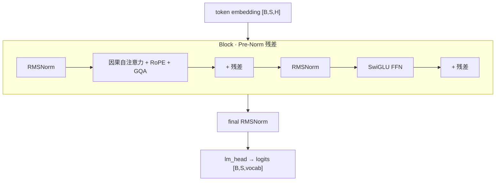

---
tags:
  - LLM
  - 基础
  - Transformer
  - RMSNorm
  - RoPE
  - GQA
  - SwiGLU
  - 手写
---

# 深入理解:PyTorch 手写 Transformer / RMSNorm

> 属 [LLM 基础](index.md) § 1 · Transformer 架构的**动手篇**。用 ~180 行从零实现一个 GPT/LLaMA 风格的 decoder-only 模型,**刻意不用** `nn.Transformer` / `nn.MultiheadAttention`,把每个组件亲手写一遍。
>
> 配套可运行代码:[`code/minimal_transformer.py`](code/minimal_transformer.py) —— **已在 torch 2.8 (CPU) 实跑验证**(见 [§ 跑起来验证](#验证))。理论对照见 [Self-Attention 机制](self-attention.md) 与 [注意力变体 GQA/MQA/MLA](attention-variants.md);同款组件在真实模型里的样子见 [DeepSeek V4 Flash](../vllm/deepseek-v4-flash.md)。

## 为什么要手写

调 API 会用 ≠ 懂。手写强迫你面对三件容易含糊的事:**张量形状怎么变、维度为什么这么切、每个组件解决什么问题**。下面每个组件都按「原理一句 → 代码 → 形状/为什么」讲。

架构(LLaMA 风格,Pre-Norm):



## 1. RMSNorm —— 比 LayerNorm 少一半操作

**原理**:LayerNorm 要减均值、除标准差、再缩放平移。RMSNorm 发现「减均值」和「平移 bias」其实可省,只保留**按均方根缩放**:`y = x / sqrt(mean(x²)+ε) · weight`。更少算子、更省显存,现代 LLM(LLaMA/Qwen/DeepSeek)几乎都用它。

```python
class RMSNorm(nn.Module):
    def __init__(self, dim, eps=1e-6):
        super().__init__()
        self.eps = eps
        self.weight = nn.Parameter(torch.ones(dim))   # 可学习缩放,初始 1

    def forward(self, x):                             # x: [..., H]
        dtype = x.dtype
        x = x.float()                                 # fp32 算 norm,数值稳定
        rms = torch.rsqrt(x.pow(2).mean(-1, keepdim=True) + self.eps)
        return (x * rms).to(dtype) * self.weight
```

**要点**:① 只在最后一维(特征维 H)统计;② 用 fp32 算再转回,是 bf16 训练里的常见稳定技巧;③ 没有 bias。

## 2. RoPE —— 把位置「旋转」进 Q/K

**原理**:注意力本身对 token 顺序无感知,得注入位置。RoPE 不加到 embedding 上,而是把 Q/K 的相邻两维看成复数,按「位置 m × 频率 θ」做二维旋转。妙处:两个向量旋转后的点积**只依赖相对位置 m−n**,天然编码相对距离,且能外推更长序列。

```python
def build_rope_cache(head_dim, max_seq_len, theta):
    inv_freq = 1.0 / (theta ** (torch.arange(0, head_dim, 2).float() / head_dim))
    freqs = torch.outer(torch.arange(max_seq_len).float(), inv_freq)  # [S, hd/2]
    return torch.cos(freqs), torch.sin(freqs)

def apply_rope(x, cos, sin):                    # x: [B, nh, S, hd]
    x_even, x_odd = x[..., 0::2], x[..., 1::2]
    cos, sin = cos[None, None], sin[None, None]
    rot_even = x_even * cos - x_odd * sin        # 复数旋转实部
    rot_odd  = x_even * sin + x_odd * cos        # 虚部
    return torch.stack([rot_even, rot_odd], -1).flatten(-2).type_as(x)
```

**要点**:cos/sin 预算成 cache(不参与梯度);只施加在 Q/K,**不动 V**。

## 3. 因果自注意力(含 GQA)

**原理**:`softmax(QKᵀ/√d + 因果掩码)·V`。除 √d 防止点积过大把 softmax 推向饱和(梯度消失)。因果掩码把「未来」位置置 −∞,softmax 后为 0,保证自回归。**GQA**:让多个 query 头共享一组 KV 头 —— K/V 投影按 `n_kv_heads` 缩小,直接决定 KV Cache 大小([为什么见此](attention-variants.md))。

```python
# 投影时 K/V 维度按 n_kv_heads 缩小 —— GQA 省 KV 的根源
self.wq = nn.Linear(dim, n_heads    * head_dim, bias=False)
self.wk = nn.Linear(dim, n_kv_heads * head_dim, bias=False)
self.wv = nn.Linear(dim, n_kv_heads * head_dim, bias=False)

# forward:拆头 -> RoPE -> GQA 复制 KV -> 缩放点积 + 因果掩码
q = apply_rope(q, cos, sin); k = apply_rope(k, cos, sin)
if self.n_rep > 1:                               # GQA:KV 头重复对齐 query 头
    k = k.repeat_interleave(self.n_rep, dim=1)
    v = v.repeat_interleave(self.n_rep, dim=1)
scores = (q @ k.transpose(-2, -1)) / math.sqrt(self.head_dim)   # [B,nh,S,S]
scores = scores + torch.triu(torch.full((S, S), float("-inf")), diagonal=1)
out = F.softmax(scores, dim=-1) @ v              # [B,nh,S,hd]
```

**形状主线**:`[B,S,H] → [B,nh,S,hd] → scores[B,nh,S,S] → out[B,nh,S,hd] → 合并回 [B,S,H]`。参数里 `n_kv_heads == n_heads` 即 MHA,`< ` 即 GQA,`==1` 即 MQA —— 一份代码覆盖三种。

## 4. SwiGLU FFN

**原理**:`W_down( SiLU(W_gate·x) ⊙ (W_up·x) )`。相比 `W2·ReLU(W1·x)`,多一条门控分支,用 SiLU 平滑激活逐元素调制 up 分支,表达力更强,是 LLaMA 系标配。

```python
def forward(self, x):
    return self.w_down(F.silu(self.w_gate(x)) * self.w_up(x))
```

**注意**:三个权重(gate/up/down),参数量比普通 FFN 多,通常把中间维调小些平衡。

## 5. Pre-Norm 残差块 + 组装

**Pre-Norm**(先 Norm 再进子层)比 Post-Norm 训练更稳,是现代默认:

```python
x = x + self.attn(self.attn_norm(x), cos, sin)   # 残差 1
x = x + self.ffn(self.ffn_norm(x))               # 残差 2
```

整模型:`embedding → N×Block → final RMSNorm → lm_head`。用了 **weight tying**(`lm_head.weight = tok_emb.weight`)省参数。

## 跑起来验证 { #验证 }

两个自检,直接 `python3 docs/llm-basics/code/minimal_transformer.py`:

1. **形状检查**:`idx[2,16] → logits[2,16,256]`。
2. **过拟合一小段序列**:实现正确的话,loss 应从 `ln(vocab)≈5.5` 降到接近 0。

实跑输出(torch 2.8 / CPU):

```text
参数量: 0.59M  (GQA: 8 q-heads / 2 kv-heads)
前向形状 OK: idx(2, 16) -> logits(2, 16, 256)
初始 loss ≈ ln(vocab) = 5.545
  step   0  loss 5.5733
  step  40  loss 0.1335
  step  80  loss 0.0093
  step 199  loss 0.0026
✓ 过拟合成功(loss→0)，实现正确。
```

**两个信号都要对得上**:step-0 ≈ `ln(vocab)`(说明初始化没崩)+ 能过拟合到 ~0(说明前向/反向/掩码都对)。

## 我踩的坑:初始化(一个真实教训)

第一版没做权重初始化,step-0 loss 是 **123**,而不是理论的 5.5。原因:`nn.Embedding` 默认按 `N(0,1)` 初始化,配合 **weight tying** 会让初始 logits 爆炸,softmax 对正确类给出极端负值 → loss 冲到上百。

修法(GPT 风格小初始化):

```python
self.apply(self._init_weights)
@staticmethod
def _init_weights(m):
    if isinstance(m, (nn.Linear, nn.Embedding)):
        nn.init.normal_(m.weight, std=0.02)
```

加上后 step-0 回到 5.57 ≈ `ln(256)`。**教训**:「step-0 loss ≈ ln(vocab)」是判断初始化对不对的第一道体检 —— 对不上,先查初始化,别急着调 lr。

## 关联

- 理论:[Self-Attention 机制](self-attention.md)、[注意力变体 GQA/MQA/MLA](attention-variants.md)
- 真实模型里的这些组件:[DeepSeek V4 Flash](../vllm/deepseek-v4-flash.md)(MLA 是本文 MHA→GQA 的下一步:把 KV 压到低秩潜在空间)
- 下一步动手方向:加 KV Cache 做增量 decode、把 FFN 换成 MoE、接 [roofline](prefill-decode-roofline.md) 复算 prefill/decode 的算力/访存
