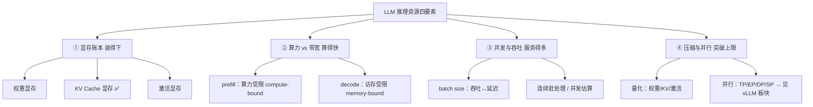

# LLM 基础

以**问题驱动**的方式打底：从一道道「给定条件、动手算/推导」的题出发，把 LLM 推理的显存、带宽、算力、并发等基础吃透。每题都尽量做到「公式可推导、数字可复算、坑能识别」。

## 知识脉络

LLM 推理的性能问题，几乎都绕着**四种资源**打转：**显存、带宽、算力、并发**。本板块沿"先把资源账本算清 → 再理解两阶段瓶颈 → 最后看怎么压榨吞吐"的主线推进：

**建议阅读顺序**：

1. **显存账本**——先会算「一个 token 占多少 KV」：[每生成一个 Token 的 KV Cache 显存](kv-cache-per-token.md) ✅；再扩到权重显存、激活显存、一次完整请求(prefill+decode)的总量。
2. **两阶段瓶颈**——理解为什么 prefill 算力受限、decode 访存受限（roofline 视角），这决定了所有优化的方向。
3. **并发与吞吐**——batch size 的吞吐/延迟取舍、并发数估算。
4. **压缩与并行**——量化对显存与精度的影响；并行维度切分见 vLLM 板块的 [EP/DP/TP/SP（从 FusedMoE 讲起）](../vllm/ep-dp-tp-sp-fused-moe.md)。

> ✅ = 已有笔记；其余为推进方向。与 [生成模型基础](../generative-basics/index.md) 并列——后者偏视觉/多模态生成。

## 题目序列

> 随学习推进逐步补充。

1. [给定 config.json 与 H100，算「每生成一个 Token」的 KV Cache 显存](kv-cache-per-token.md) — KV Cache 公式推导、GQA/MLA 差异、H100 容量换算

待补充方向：

- 一次请求的总 KV（prefill + decode）与并发数估算
- 为什么解码是访存受限（HBM 带宽），prefill 是算力受限
- 模型权重显存、激活显存怎么估
- 吞吐 vs 延迟：batch size 的取舍
- 量化（权重 / KV / 激活）对显存与精度的影响

另见 [碎片知识](snippets/index.md)：速查、结论快照等零散条目。

## 如何新增一题

1. 在 `docs/llm-basics/` 下新建 Markdown 文件
2. 在 `mkdocs.yml` 的 `nav` → `LLM 基础` 下登记一行
