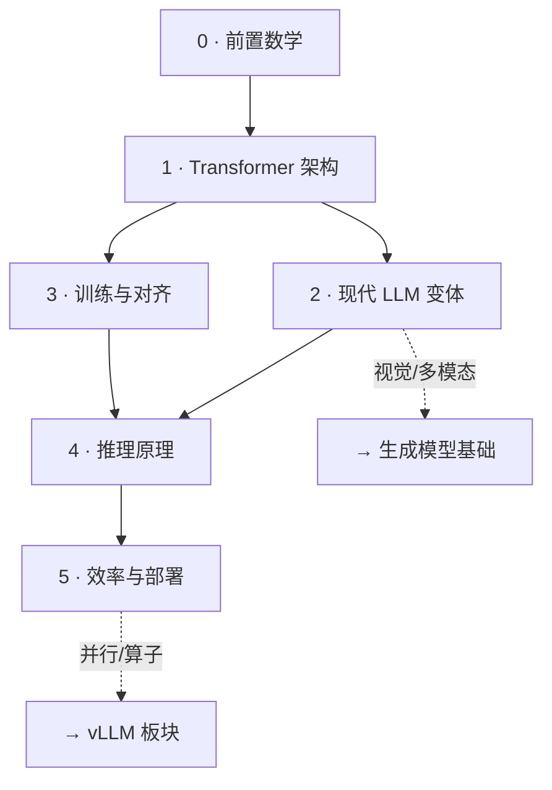

---
tags:
  - LLM
  - 基础
  - 学习路径
---

# LLM 基础

本板块有**两条互补的线**,建议交替推进:

- **理解线(面向掌握)**——系统地搞懂「LLM 长什么样、能力从哪来、怎么跑起来」,即下面的 [§ 系统性目录](#系统性目录)。
- **动手线(面向计算)**——以「给定条件、动手算/推导」的题把显存/带宽/算力/并发吃透,即 [§ 动手题目序列](#题目序列)。

> 理解线搭骨架,动手线补肌肉:每学完理解线的一个主题,尽量配一道动手题把数字算实。✅ = 完整笔记,🏗 = 骨架已建待填,🚧 = 待建。

## 系统性目录 { #系统性目录 }

一张自底向上的学习地图:**前置 → 架构 → 现代变体 → 训练 → 推理 → 效率部署**。前四部分回答"模型是什么、怎么来的",后两部分回答"怎么跑得起、跑得快"。

### 0 · 前置数学(够用即可)

- 🚧 矩阵乘 / 张量形状:`[B, S, H]` 在各层怎么流动
- 🚧 softmax、交叉熵、log-likelihood
- 🚧 概率与采样:分布、温度、Top-k/Top-p 的数学含义

### 1 · Transformer 架构(模型长什么样)

> 目标:能徒手画出一个 decoder block,并说清每个组件为什么存在。

- ✅ **[深入理解:PyTorch 手写 Transformer / RMSNorm](handwritten-transformer.md)** —— 从零手写 RMSNorm/RoPE/因果注意力(GQA)/SwiGLU,**可运行已验证**;本节各组件的动手总览
- 🏗 **[Self-Attention 机制](self-attention.md)**:QKV、缩放点积、为什么要除 √d、多头的意义
- 🚧 Tokenizer 与 Embedding:文本 → token id → 向量;位置编码 RoPE/ALiBi 与长度外推(RoPE 实现见手写篇)
- 🚧 FFN / MLP 与激活:GeLU、**SwiGLU**
- 🚧 归一化:LayerNorm vs **RMSNorm**、Pre-LN vs Post-LN
- 🚧 残差连接、堆叠成 block、因果掩码与自回归生成

### 2 · 现代 LLM 变体(为什么现在这么设计)

> 目标:理解主流开源模型(Qwen / DeepSeek / Llama)相对原版 Transformer 改了什么、为什么。

- 🏗 **[注意力变体:GQA / MQA / MLA](attention-variants.md)**:头共享与低秩压缩 —— 直接决定 KV Cache 大小(与 [KV 显存题](kv-cache-per-token.md) 呼应)
- 🏗 **[MoE 基础](moe-basics.md)**:稀疏专家、路由、负载均衡(工程侧见 [EPLB 笔记](../vllm-omni/snippets/eplb-inheritance.md))
- 🚧 长上下文:位置外推、稀疏 / 滑窗注意力

### 3 · 训练与对齐(能力从哪来)

> 目标:理解一个 base 模型如何被训练出来、又如何变成能对话的 chat 模型。

- 🚧 预训练目标:next-token prediction、为什么它能学到"智能"
- 🚧 数据与 tokenization、缩放定律 scaling laws
- 🚧 后训练:SFT → RLHF / DPO 的动机与差别

### 4 · 推理原理(怎么跑起来)

> 目标:理解一次生成在 GPU 上到底发生了什么 —— 这是连接"理解"与"性能"的枢纽。

- 🏗 **[两阶段与 Roofline](prefill-decode-roofline.md)**:prefill(算力受限 compute-bound)vs decode(访存受限 memory-bound)—— 决定一切优化方向
- ✅ **KV Cache**:[每生成一个 Token 的 KV Cache 显存](kv-cache-per-token.md) —— 公式推导、GQA/MLA 差异、H100 容量换算
- 🚧 采样与解码:greedy / temperature / Top-k / Top-p / beam
- 🚧 投机解码 speculative decoding、MTP

### 5 · 效率与部署(怎么跑得快、跑得多)

> 目标:把资源账本算清,理解压缩与并行如何突破单卡上限。工程实现下钻到 vLLM 板块。

- 🏗 **[显存账本与量化](memory-and-quantization.md)**:权重 / KV / 激活 三块怎么估;量化对显存与精度的影响
- 🚧 并发与吞吐:连续批处理、batch size 的吞吐↔延迟取舍
- 🚧 注意力算子:FlashAttention / PagedAttention(实现见 vLLM 板块)
- 🚧 并行维度:[EP/DP/TP/SP(从 FusedMoE 讲起)](../vllm/ep-dp-tp-sp-fused-moe.md)

## 题目序列 { #题目序列 }

> 动手线:每题做到「公式可推导、数字可复算、坑能识别」。随学习推进补充。

1. ✅ [给定 config.json 与 H100,算「每生成一个 Token」的 KV Cache 显存](kv-cache-per-token.md) — 对应 §4 KV Cache

**待补题目(按系统性目录归位)**

- §4 一次请求的总 KV(prefill + decode)与并发数估算
- §4 为什么 decode 访存受限、prefill 算力受限(roofline 复算)
- §5 模型权重显存、激活显存怎么估
- §5 吞吐 vs 延迟:batch size 的取舍
- §5 量化(权重 / KV / 激活)对显存与精度的影响

另见 [碎片知识](snippets/index.md):速查、结论快照等零散条目。

## 与其它板块的关系

- **[生成模型基础](../generative-basics/index.md)** —— 并列板块,偏视觉 / 多模态生成(ViT / DiT)。
- **[vLLM](../vllm/index.md)** —— §5 的工程落地:算子、图模式、并行的真实实现。
- **[NPU 适配](../npu-adaptation/index.md)** —— 昇腾后端的适配与 release 视角。

## 如何新增一条

1. 在 `docs/llm-basics/` 下新建 Markdown 文件(理解笔记或动手题均可)。
2. 在 `mkdocs.yml` 的 `nav` → `LLM 基础` 下登记一行。
3. 回到本页,把系统性目录里对应的 🚧 改成 ✅ 并挂上链接。
