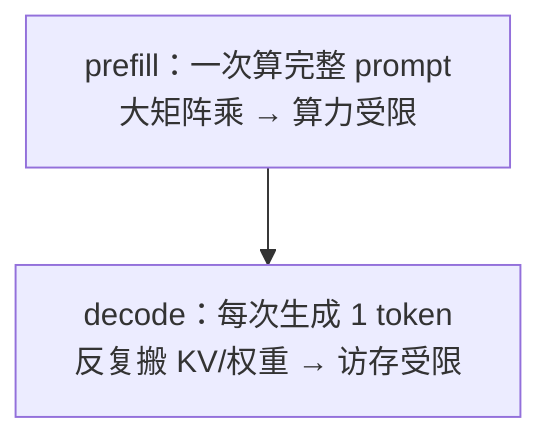

---
tags:
  - LLM
  - 基础
  - 推理
  - roofline
  - prefill
  - decode
---

# 两阶段与 Roofline:prefill 算力受限 vs decode 访存受限(骨架)

> 🏗 学习骨架。所属 [LLM 基础](index.md) § 4 · 推理原理。**这是连接「理解」与「性能」的枢纽** —— 几乎所有推理优化的方向都由它决定。
>
> 长上下文下这两阶段各自可再切并行:prefill → **PCP**、decode → **DCP**,见 [上下文并行 CP:PCP 与 DCP](../vllm/context-parallel-pcp-dcp.md)。

## 学习目标

学完能:用 roofline(算力 vs 带宽)解释为什么 **prefill 是 compute-bound、decode 是 memory-bound**,并据此判断某个优化(量化/批处理/投机解码)该用在哪个阶段。

## 一图速览

## 带着问题读

- 算术强度(arithmetic intensity = FLOPs / bytes)是什么?prefill 与 decode 各自大概落在 roofline 的哪一侧?
- decode 每步只算 1 个 token,却要把**整个模型权重 + KV** 从 HBM 搬一遍 —— 为什么这让它带宽受限?
- 由此推论:**量化**(减字节)主要救哪个阶段?**增大 batch**(提高算术强度)又救哪个阶段?
- 投机解码 / MTP 为什么能缓解 decode 的访存瓶颈?

## 要点提纲(待填)

- roofline 模型:峰值算力线、带宽斜线、拐点
- prefill FLOPs 估算、decode 每步 bytes 估算
- 各类优化在两阶段上的定位表

## 关联

- 前置:[KV Cache 显存](kv-cache-per-token.md)(decode 要搬的就是它)
- 下游:[显存账本与量化](memory-and-quantization.md)
- 动手:§4「为什么 decode 访存受限」复算题(见 [index](index.md#题目序列))
