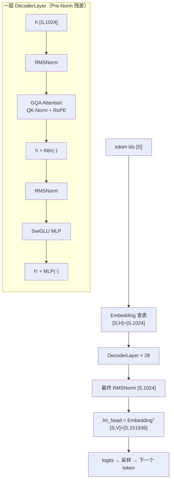

---
tags:
  - LLM基础
  - Qwen3
  - Transformer
  - 模型结构
  - 数学推导
  - QK-Norm
  - GQA
  - SwiGLU
  - RoPE
---

# Qwen3-0.6B 端到端：模型结构与数学计算关系

> 前面几篇拆过 [手写 Transformer/RMSNorm](handwritten-transformer.md)、[Self-Attention](self-attention.md)、[GQA/MQA/MLA](attention-variants.md)、[MoE](moe-basics.md)。本文把它们**串成一个真实的小模型**，从一个 token id 走到下一个 token 的 logits，每一步给出**形状 + 数学公式**。
>
> ⚠️ 先澄清：**Qwen3 dense 没有 0.8B 这个规格**，最小是 **0.6B**。本文按 Qwen3-0.6B 的真实 config 写；换更大的 dense 型号（1.7B/4B/8B…）只是把下表几个数字改大，**结构完全相同**。
>
> **一句话骨架**：Qwen3-0.6B = **decoder-only Transformer**，28 层，每层 `Pre-RMSNorm → GQA注意力(带 QK-Norm + RoPE) → 残差 → Pre-RMSNorm → SwiGLU MLP → 残差`，最后 `RMSNorm → 与词嵌入共享权重的 lm_head → logits`。相对 Qwen2，签名差异是 **QK-Norm**。

## 一、配置表（记住这几个数，全文形状都从这来）

| 符号 | 含义 | Qwen3-0.6B |
|---|---|---|
| $V$ | 词表大小 vocab_size | 151936 |
| $H$ | 隐藏维 hidden_size | 1024 |
| $L$ | 层数 num_hidden_layers | 28 |
| $n_h$ | 注意力头数 | 16 |
| $n_{kv}$ | KV 头数（GQA） | 8 |
| $d$ | 每头维度 head_dim | 128 |
| $I$ | FFN 中间维 intermediate_size | 3072 |
| — | 激活 | SiLU（SwiGLU 门控） |
| $\epsilon$ | RMSNorm eps | 1e-6 |
| $\theta$ | RoPE base | 1,000,000 |
| — | tie_word_embeddings | True（embedding 与 lm_head 共享） |

**注意两个"不相等"**，这是 Qwen3 的工程细节：

1. $n_h \times d = 16 \times 128 = 2048 \neq H = 1024$。head_dim 与 hidden **解耦**——注意力内部工作在 2048 维，`q_proj` 把 1024 升到 2048、`o_proj` 再降回 1024。
2. $n_{kv} = 8 < n_h = 16$，**GQA 分组数 = 2**，即每 2 个 Query 头共享 1 组 KV。

## 二、总览：一次前向的数据流

**残差主干（residual stream）** 是一条贯穿始终、维度恒为 $H=1024$ 的"信息高速路"；每层的注意力和 MLP 只往这条路上**加增量**，不改宽度。这是理解 Transformer 的核心心智模型。

## 三、逐组件 + 数学

### 0. Embedding：token id → 向量

输入 $S$ 个 token id。embedding 是一张 $V \times H$ 的查找表 $W_E$：

$$h^{(0)} = W_E[\text{ids}] \in \mathbb{R}^{S \times 1024}$$

因 `tie_word_embeddings=True`，这张表**最后还会当 lm_head 复用**（省一份 $V\times H$ 参数，对小模型意义重大——见参数账本）。

### 1. RMSNorm：稳定每个向量的尺度

Qwen3 用 RMSNorm（比 LayerNorm 少算均值、更省）。对一个向量 $x\in\mathbb{R}^{d}$：

$$\text{RMSNorm}(x) = \frac{x}{\sqrt{\dfrac{1}{d}\sum_{i=1}^{d} x_i^2 + \epsilon}} \odot g$$

$g\in\mathbb{R}^{d}$ 是可学习缩放。它**只归一化方向、按 RMS 缩放幅度**，不做零均值。**Pre-Norm** 指归一化放在子层输入端（进注意力/MLP 前），主干残差不被归一化——这让深层训练稳定。

### 2. GQA 注意力（含 QK-Norm + RoPE）

设本层输入（已过 RMSNorm）为 $x\in\mathbb{R}^{S\times1024}$。

**① 线性投影到 Q/K/V**（无 bias）：

$$Q = xW_Q\in\mathbb{R}^{S\times2048},\quad K = xW_K\in\mathbb{R}^{S\times1024},\quad V = xW_V\in\mathbb{R}^{S\times1024}$$

reshape 成多头：$Q\to[S,16,128]$，$K,V\to[S,8,128]$。Q 有 16 头、KV 只 8 头（GQA）。

**② QK-Norm（Qwen3 签名，别的模型多半没有）**：对**每个头的 128 维**再做一次 RMSNorm：

$$\hat{Q}_{s,h} = \text{RMSNorm}_{d}(Q_{s,h}),\quad \hat{K}_{s,h} = \text{RMSNorm}_{d}(K_{s,h})$$

注意是在 head_dim（128）上归一化、**在 RoPE 之前**。作用：压住 Q/K 的数值尺度，让注意力 logits 不炸，训练更稳。源码 `q_norm/k_norm`（`modeling_qwen3.py` 注释写明 *"only on the head dim!"*）。

**③ RoPE 注入位置**：把每个头的 128 维两两配对旋转，角度 = 位置 × 频率（频率由 $\theta=10^6$ 决定）：

$$\tilde{Q}_{s} = \text{RoPE}(\hat{Q}_{s}, s),\quad \tilde{K}_{s} = \text{RoPE}(\hat{K}_{s}, s)$$

RoPE 的性质：点积后只留**相对位置** $s_i-s_j$（细节见 [位置编码/RoPE 讨论]）。**只转 Q/K，不转 V。**

**④ GQA 展开**：把 8 组 KV 各复制 2 份，凑齐 16 头（`repeat_kv`），与 Q 头一一对应。

**⑤ 缩放点积注意力 + 因果掩码**：对每个头 $h$，

$$A_h = \text{softmax}\!\left(\frac{\tilde{Q}_h \tilde{K}_h^{\top}}{\sqrt{d}} + M\right)\in\mathbb{R}^{S\times S},\qquad O_h = A_h V_h\in\mathbb{R}^{S\times128}$$

- $\sqrt{d}=\sqrt{128}$ 是缩放（源码 `scaling = head_dim**-0.5`），防止点积过大使 softmax 饱和。
- $M$ 是**因果掩码**：$M_{ij}=-\infty$ 当 $j>i$（不许看未来），否则 0。这是 decoder-only 自回归的关键。

**⑥ 合并头 + 输出投影**：拼回 $[S,2048]$，过 $W_O$ 降回 1024：

$$\text{Attn}(x) = \text{concat}(O_1,\dots,O_{16})\,W_O\in\mathbb{R}^{S\times1024}$$

### 3. 残差相加（第一次）

$$h' = h + \text{Attn}(\text{RMSNorm}(h))$$

### 4. SwiGLU MLP（逐 token 独立加工）

Qwen3 的 FFN 是 **SwiGLU**（门控版 MLP），三个矩阵 gate/up/down：

$$\text{MLP}(x) = \Big(\underbrace{\text{SiLU}(xW_{\text{gate}})}_{\text{门}}\;\odot\;\underbrace{xW_{\text{up}}}_{\text{值}}\Big)\,W_{\text{down}}$$

其中 $W_{\text{gate}},W_{\text{up}}\in\mathbb{R}^{1024\times3072}$，$W_{\text{down}}\in\mathbb{R}^{3072\times1024}$，$\text{SiLU}(z)=z\cdot\sigma(z)$。

直觉：`up` 分支是"要传的内容"，`gate` 分支经 SiLU 变成一个软门控，逐元素决定放多少过去——比朴素 `Linear→act→Linear` 表达力更强，是现代 LLM 的标配。**它逐 token 独立，不跨位置**（跨位置交给注意力）。

### 5. 残差相加（第二次）

$$h'' = h' + \text{MLP}(\text{RMSNorm}(h'))$$

$h''$ 就是这一层的输出，喂给下一层。**2–5 步重复 $L=28$ 次。**

### 6. 输出头：hidden → 下一个 token 的分布

28 层后，最终 RMSNorm，再乘共享的词嵌入转置（tied lm_head）：

$$\text{logits} = \text{RMSNorm}(h^{(28)})\,W_E^{\top}\in\mathbb{R}^{S\times151936}$$

取最后一个位置的 logits，过 softmax（带温度/top-p/top-k）采样出下一个 token，追加到序列，回到第 0 步——**自回归循环**。

## 四、形状流水账（一条 token 走完全程）

| 阶段 | 张量 | 形状（S=序列长） |
|---|---|---|
| 输入 | token ids | $[S]$ |
| Embedding | $h^{(0)}$ | $[S, 1024]$ |
| q_proj | $Q$ | $[S,2048]\to[S,16,128]$ |
| k/v_proj | $K,V$ | $[S,1024]\to[S,8,128]$ |
| GQA 后 | $K,V$ | $[S,16,128]$ |
| 注意力分数 | $A_h$ | $[16, S, S]$ |
| 注意力输出 | $O$ | $[S,2048]\to W_O\to[S,1024]$ |
| MLP 中间 | gate/up | $[S,3072]$ |
| 每层输出 | $h^{(\ell)}$ | $[S,1024]$（恒定！） |
| logits | — | $[S,151936]$ |

**主干恒为 $[S,1024]$**，只有注意力内部临时上到 2048、MLP 临时上到 3072——"变宽计算、变回来传递"。

## 五、参数量账本（为什么 embedding 占大头）

| 部件 | 公式 | 参数量 |
|---|---|---|
| Embedding（= lm_head，tied 只算一份） | $V\times H = 151936\times1024$ | ≈ 155.6 M |
| 每层注意力 | $W_Q(1024{\times}2048){+}W_K/W_V(1024{\times}1024){\times}2{+}W_O(2048{\times}1024)$ | ≈ 6.3 M |
| 每层 MLP | $(1024{\times}3072)\times2 + 3072{\times}1024$ | ≈ 9.4 M |
| 每层小计 | 注意力 + MLP + 2×RMSNorm | ≈ 15.7 M |
| 28 层 | $15.7\text{M}\times28$ | ≈ 440 M |
| **合计** | 440 M + 155.6 M | **≈ 0.6 B** ✅ |

**要点**：小模型里词表嵌入占了约 1/4 参数——这正是 Qwen3-0.6B **tie embedding** 的原因（不共享就要多背一份 155M）。大模型（如 8B）层参数占绝对多数，tie 的收益变小，所以大号往往不 tie。

## 六、三个"记住就好"的 Qwen3 记忆点

1. **QK-Norm**：q/k 投影后、RoPE 前，在 head_dim 上多做一次 RMSNorm。这是 Qwen3 相对 Qwen2 的**结构签名**，为训练稳定性。
2. **GQA(16 Q / 8 KV)**：KV 头减半，KV cache 显存直接砍一半（推理省显存的关键，见 [KV Cache 显存](kv-cache-per-token.md)）。
3. **SwiGLU + Pre-RMSNorm + tied embedding + head_dim 解耦**：现代 dense LLM 的通用配方，Qwen3 一样不落。

## 七、和后续的连接

- 这是 **dense** 版；把第 4 步的**单个 MLP 换成"路由 + 多专家 MLP"**就是 Qwen3-**MoE**（[MoE 基础](moe-basics.md)），Qwen3-Omni 的 Thinker backbone 正是 MoE 版。
- 这里讲的是**数学前向**；真正部署时每层的 KV cache、continuous batching、图捕获由推理引擎(vLLM)接管——数学不变，工程加壳（见 [两阶段与 Roofline](prefill-decode-roofline.md)）。
- 多模态（Qwen3-Omni）= 在第 0 步的 embedding 序列里，把图/音占位符位置用 encoder 输出 **scatter** 覆盖，backbone 这 28 层**原样复用**。
