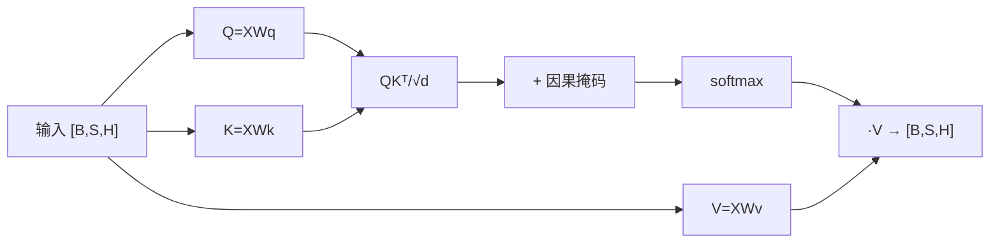

---
tags:
  - LLM
  - 基础
  - Transformer
  - attention
---

# Self-Attention 机制(骨架)

> 🏗 学习骨架:先立框架与问题,细节随学习填充。所属 [LLM 基础](index.md) § 1 · Transformer 架构。

## 学习目标

学完能:徒手写出单头 attention 的公式与形状变化,说清「为什么除 √d」「多头到底多在哪」「因果掩码怎么保证自回归」。

## 一图速览

## 带着问题读

- 缩放点积里 **为什么除以 √dₖ**?不除会怎样(梯度/softmax 饱和)?
- 多头是「把 H 切成 h 份分别算」,参数量和单头相比变了吗?多头强在哪?
- 因果掩码填 `-inf` 而不是 0,为什么?对 softmax 意味着什么?
- attention 的计算量随序列长度 S 如何增长(O(S²))?这为什么是长上下文的痛点?

## 要点提纲(待填)

- QKV 投影与形状:`[B,S,H] → [B,h,S,d]`
- 缩放点积 `softmax(QKᵀ/√d)·V` 推导
- 多头拼接与输出投影 Wₒ
- 因果掩码 / padding 掩码
- 复杂度 O(S²·d) 与显存占用

## 常见误区

- 把「多头」误解为参数翻倍(实为切分)。
- 忽略 attention 分数矩阵 `[B,h,S,S]` 的显存(长序列爆炸的根源)。

## 延伸与关联

- 下一步:位置编码与 RoPE(🚧 待建,见 [index § 1](index.md#系统性目录))—— attention 本身对位置无感知,靠它注入顺序。
- 变体:[注意力变体:GQA / MQA / MLA](attention-variants.md) —— 如何省 KV。
- 工程:算子实现(FlashAttention / PagedAttention)见 [vLLM 板块](../vllm/index.md)。
