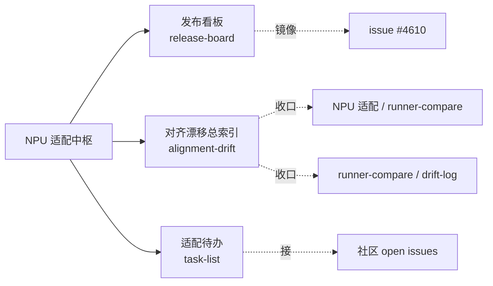

---
tags:
  - NPU
  - Ascend
  - 适配
  - release
---

# NPU 适配 · 运维与对齐中枢

> **这个板块和别的板块不一样**:vLLM-Omni / vLLM-Ascend 板块回答"**它怎么工作**"(学习笔记);本板块回答"**适配到什么程度、下一步做什么**"(release owner 的操作台)。它不重复那些深挖笔记,而是**收口**它们,叠加协调型产物:发布看板、漂移索引、适配待办。
>
> 服务对象:NPU release 协调(见 [#4610](https://github.com/vllm-project/vllm-omni/issues/4610))。三棵源码树以 [`~/git/vllm_omni/{vllm,vllm-ascend,vllm-omni}`](#baseline) 为准。

## 板块地图

- **[发布看板](release-board.md)** — 镜像 #4610 的 v0.23.0 checklist,本地可勾选;含下一版(v0.24)前瞻项。
- **[对齐漂移总索引](alignment-drift.md)** — 所有"跟上游/ascend 会漂移"的轴的总表(runner / 平台层 / EPLB / 量化 / attention),各自指向深挖笔记与巡检命令。
- **[适配待办](task-list.md)** — 按"契合度 × 难度"排的 NPU issue 清单,过滤掉已认领的。

## 当前对齐基线 { #baseline }

| repo | SHA | 角色 |
|---|---|---|
| `vllm` | `6c427dd40` | 上游真相源(GPUModelRunner 基准) |
| `vllm-ascend` | `12c8da7a` | 对齐目标(NPUModelRunner) |
| `vllm-omni` | `724f5d13` | 本仓(v0.23 线) |

> 更新基线时,同步改这里、[发布看板](release-board.md) 与 [漂移索引](alignment-drift.md) 三处头部,并重跑 [`tools/runner_matrix.py`](runner-compare/index.md#regen)。

## 现有深挖笔记(不搬,只索引)

本板块**交叉链接**以下既有笔记,按适配关注点分组:

**① runner 对齐(核心)**

- [model_runner 四方对比模块](runner-compare/index.md) — 覆盖矩阵 + L2 逐方法差异 + 漂移日志
- [npu_model_runner 上游适配困境与解耦](../vllm-omni/snippets/npu-runner-decoupling.md)
- [三处 worker 的职责与继承关系](../vllm-omni/worker-class-hierarchy.md)

**② 平台层解耦**

- [Omni 平台无关/相关解耦:现状与演进](../vllm-omni/platform-decoupling.md)
- [platforms/npu 架构导读](../vllm-omni/npu-platform-architecture.md)

**③ 图捕获雷区**

- [图模式在 runner 里的实现:NPU 与 GPU 差异](../vllm-omni/npu-gpu-graph-in-runner.md)
- [嵌套图捕获为什么不行(#4519)](../vllm-omni/nested-graph-capture.md)
- [talker_mtp 图安全](../vllm-omni/talker-mtp-graph-safety.md)
- [transformers 的 is_tracing 为什么在 NPU 上失灵](../vllm-omni/transformers-is-tracing-npu.md)
- [案例倒推:NPU 上 talker 因前缀缓存缺兜底而崩](../vllm-omni/npu-prefix-cache-missing.md)

**④ MoE / 量化 / 昇腾特性**

- [EPLB 工作原理与 omni 的继承透传](../vllm-omni/snippets/eplb-inheritance.md)
- [昇腾量化特性支持速查](../vllm-ascend/snippets/ascend-quantization.md)
- [昇腾代次与原生低精度格式](../vllm-ascend/snippets/ascend-generations-low-precision.md)

**⑤ 调试**

- [在 VSCode 里远程调试 Ascend 容器内的 vLLM-Omni](../vllm-omni/debug-ascend-remote.md)
- [断点点位地图(启动期 + 请求期)](../vllm-omni/breakpoint-map.md)
