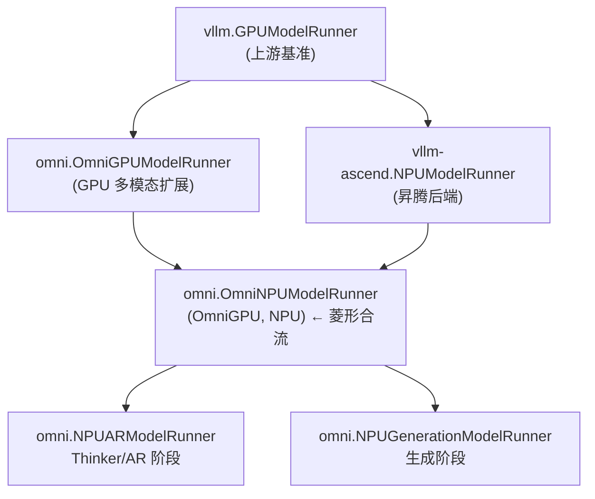

---
tags:
  - vllm-omni
  - vllm-ascend
  - vllm
  - model_runner
  - NPU
  - GPU
  - 继承
  - 对齐
---

# model_runner 四方对比:vllm / vllm-ascend / vllm-omni(GPU·NPU)

> **这个模块干什么**:把 `GPUModelRunner`(上游)、`NPUModelRunner`(vllm-ascend)、`OmniGPUModelRunner` / `OmniNPUModelRunner`(vllm-omni)四个 runner 的实现差异做成一张**活看板**——既是学习地图,也是 NPU release 对齐(见 [#4610])的可视化待办。
>
> **怎么读**:先看 §一 继承拓扑 → §二 覆盖矩阵(spine)定位分叉点 → 点进 L2 逐方法下钻看「为什么不一样」→ §四 漂移日志跟进版本 delta。
>
> **抗腐烂设计**:矩阵结构(override/inherit)由 [`tools/runner_matrix.py`](#regen) 从源码 AST 自动抽取,永不腐烂;语义标注(⚠️ 分叉、❌ 缺兜底)是人工在本页维护。行号一律不写,只锚方法名。
>
> 相关阅读:[npu_model_runner 上游适配困境与解耦](../../vllm-omni/snippets/npu-runner-decoupling.md) · [三处 worker 的职责与继承关系](../../vllm-omni/worker-class-hierarchy.md) · [runner 图捕获实现差异](../../vllm-omni/npu-gpu-graph-in-runner.md)

## 一、继承拓扑:一个真实的菱形

四个 runner 不是平行关系,而是一张带**菱形多继承**的类图。`OmniNPUModelRunner` 同时继承 omni 的 GPU 扩展**和** vllm-ascend 的 NPU runner——这正是"对齐 vLLM-Ascend"是 release 硬约束的根因:`NPUModelRunner` 是它的**直接基类**,ascend 侧一改,MRO 立刻影响 omni。



!!! warning "MRO 陷阱"
    当一个方法在 `GPUModelRunner` **和** `NPUModelRunner` 里都被 override(下表中 vllm GPU 🔧 且 ascend NPU 🔧,而 omni NPU ⬆️),`OmniNPUModelRunner` 到底拿到谁的实现,由 MRO 决定 —— `(OmniGPUModelRunner, NPUModelRunner)` 的顺序意味着 **omni GPU 侧优先**。这类格子是对齐时最容易出隐藏 bug 的地方,逐一在 L2 里核对。

## 二、覆盖矩阵 · Spine(人工精选 + 语义标注)

只列最关键的一条脊线。结构标记来自生成器,`⚠️`/`❌` 是人工语义叠加;完整 110 个分叉方法见 [§三 附录](#appendix)。

| 方法 | vllm GPU | omni GPU | ascend NPU | omni NPU | AR | Gen | 语义备注 |
|---|:---:|:---:|:---:|:---:|:---:|:---:|---|
| `_prepare_inputs` | 🔧 | ⬆️ | 🔧 | ⬆️ | ⬆️ | ⬆️ | ⚠️ **MRO 分叉**:上游与 ascend 都改,omni NPU 走 MRO 拿 omni GPU 版——需确认没丢 ascend 的 NPU 输入处理。[下钻 →](prepare-inputs.md) |
| `_dummy_run` | 🔧 | 🔧 | 🔧 | 🔧 | ⬆️ | 🔧 | ⚠️ 图捕获,**四方全 override 且无一 super()**。omni NPU 直调 `self.model()` 绕过 `_model_forward`(有意避 `make_omni_output`),副作用是**捕获期跳过 SP all-gather**+少 3 个 ascend context 参数——capture 路径 ≠ execution 路径,待核实。[下钻 →](graph-capture.md) |
| `_model_forward` | 🔧 | 🔧 | 🔧 | 🔧 | ⬆️ | ⬆️ | 前向入口,四方各自定制 |
| `_preprocess` | 🔧 | 🔧 | 🔧 | ⬆️ | ⬆️ | ⬆️ | omni NPU 靠 MRO 复用,注意 ascend 的预处理是否被覆盖 |
| `_check_and_update_cudagraph_mode` | 🔧 | ⬆️ | 🔧 | ⬆️ | ⬆️ | ⬆️ | 图模式选择;ascend 有 NPU 专属约束(cap PIECEWISE,见 #4674) |
| `_allocate_kv_cache_tensors` | 🔧 | ⬆️ | 🔧 | ⬆️ | ⬆️ | ⬆️ | KV 分配;ascend 走 NPU 对齐(int8 cache 等) |
| `_build_attention_metadata` | 🔧 | ⬆️ | 🔧 | ⬆️ | ⬆️ | ⬆️ | attention backend 元数据,后端差异集中点 |
| `_calc_mrope_positions` | 🔧 | 🔧 | ⬆️ | ⬆️ | ⬆️ | ⬆️ | mrope;omni GPU 改了,**ascend 未改** → NPU 上是否需同步? |
| `_gather_mm_embeddings` | 🔧 | ⬆️ | 🔧 | ⬆️ | ⬆️ | ⬆️ | 多模态 embedding 收集 |
| `_capture_talker_mtp_graphs` | · | · | · | · | 🔧 | · | ➕ **仅 AR 阶段**;talker_mtp 图安全,见[对应笔记](../../vllm-omni/talker-mtp-graph-safety.md) |
| `_maybe_update_prefix_cache` | · | · | · | · | 🔧 | · | ➕ 仅 AR;❌ 前缀缓存缺兜底崩溃的相关点,见[案例](../../vllm-omni/npu-prefix-cache-missing.md) |
| `_build_multimodal_outputs` | · | · | · | · | 🔧 | · | ➕ 仅 AR,多模态输出装配 |

> 图例:🔧 本类直接 override · ⬆️ 继承自集合内父类 · `·` 继承链上无人定义 · ⚠️ 需人工核对的分叉 · ❌ 缺失/兜底缺口 · ➕ omni 阶段专属新增

## 三、附录:完整覆盖矩阵(110 个分叉方法) { #appendix }

??? note "展开全量矩阵(由 tools/runner_matrix.py 自动生成)"

    --8<-- "docs/npu-adaptation/runner-compare/_matrix.generated.md"

## 四、漂移日志

见 [drift-log.md](drift-log.md) —— 每次更新对齐基线后,把矩阵新增的 ⚠️/❌ 转成带 owner 的行动项,直接回填 [#4610]。

## 五、重新生成 { #regen }

对齐基线更新(拉了新的 vllm / vllm-ascend / vllm-omni)后,重跑生成器即可,矩阵结构永不手抄:

```bash
# 在 learn-omni 根目录
OMNI_SRC=~/git/vllm_omni python3 tools/runner_matrix.py \
  > docs/npu-adaptation/runner-compare/_matrix.generated.md
```

生成器只负责**结构**(哪些方法在哪一层 override);**语义**(为什么、有没有丢 NPU 逻辑)永远是人工在 spine 表和 L2 页面里维护——这正是这份笔记相对 `git diff` 的增量价值。

[#4610]: https://github.com/vllm-project/vllm-omni/issues/4610
