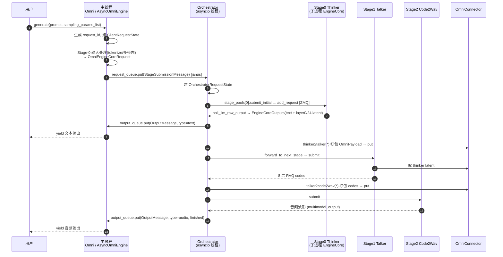

---
tags:
  - vllm-omni
  - Qwen3-Omni
  - 架构
  - model_executor
  - 请求流转
---

# 以 Qwen3-Omni 拆解 vllm-omni 核心组件与请求流转

> 一个问题：**vllm-omni 有哪些核心组件(engine / model_executor / core / worker / distributed …),一个请求是怎么在它们之间流转的?**
>
> 本文以 Qwen3-Omni 的三阶段流水线(**Thinker → Talker → Code2Wav**)为线索,先给组件分工全景,再用一条端到端请求时序串起来,然后重点拆 `model_executor`,最后深入"单个 stage 内部"与"跨 stage 数据通路"。基于源码阅读;类名/方法名可靠,行号可能随版本漂移。
>
> 前置阅读:[Qwen3-Omni 在 NPU 上是怎么跑起来的](qwen3-omni-npu.md)(讲三阶段模型本身)。本文讲"承载这三个模型的引擎机器"。

## 一、核心组件全景

vllm-omni 在 vLLM 引擎之上,套了一层**多阶段编排**。可分四层:

```
┌─ API 层 ────────────────────────────────────────────────────────┐
│  entrypoints/  : Omni / AsyncOmni / OmniBase / ClientRequestState │
│  config/       : pipeline_registry / stage_config(拓扑定义)       │
├─ 编排层(主线程 + 后台 asyncio 线程)──────────────────────────────┤
│  engine/       : AsyncOmniEngine(janus 队列网关) · Orchestrator   │
│                  · stage_pool · stage_client · output_processor   │
│  inputs/       : OmniInputPreprocessor(Stage-0 tokenize/多模态)   │
├─ 执行层(每个 stage 一个独立子进程,ZMQ 通信)─────────────────────┤
│  engine/stage_engine_core_proc : 子进程里跑 vLLM EngineCore       │
│  core/sched/   : OmniARScheduler / OmniGenerationScheduler        │
│  worker/       : GPUARWorker / GPUGenerationWorker + ModelRunner  │
│  model_executor/ : ModelRegistry · 模型 forward · 阶段间转换函数  │
├─ 数据通路 ───────────────────────────────────────────────────────┤
│  distributed/omni_connectors : SharedMemory / Mooncake / Yuanrong │
│                                + OmniPayload + KV transfer        │
└──────────────────────────────────────────────────────────────────┘
```

| 组件(目录) | 职责 | Qwen3-Omni 里干什么 |
|---|---|---|
| `entrypoints/` | 用户 API、请求状态 | `Omni.generate()` 收 prompt + 每阶段 sampling params |
| `config/` | 解析多阶段拓扑 | 由 `model_type=qwen3_omni_moe` → `QWEN3_OMNI_PIPELINE` |
| `engine/` | 请求编排、阶段流转 | `Orchestrator` 轮询三 stage、转发输出 |
| `inputs/` | 输入预处理 | Stage-0 tokenize + 音频/视频特征 |
| `model_executor/` | 模型加载 + forward + 阶段间转换 | thinker/talker/code2wav 的注册、加载、计算 |
| `core/sched/` | 单 stage 调度 | AR 反压、KV 转移触发 |
| `worker/` | 设备/分布式/执行 | `execute_model` 两阶段 + connector 收发 |
| `distributed/` | 跨 stage 传数据 | `OmniPayload`(embed/hidden/codes)经共享内存 |

> **职责边界一句话**:`engine` 决定请求"去哪个 stage",`core/sched` 决定 stage 内"这一拍算哪些请求",`worker` 决定"怎么执行",`model_executor` 决定"算什么(模型)",`distributed` 决定"数据怎么传到下一站"。

---

## 二、端到端请求流转

以 `Omni.generate({"prompt": "...", "modalities": ["text","audio"]})` 为例:



### 数据结构的逐跳演变

| # | 数据结构 | 内容 | 产生处 |
|---|---|---|---|
| 1 | `OmniPromptType` | `{prompt, modalities, multi_modal_data}` | 用户 |
| 2 | `request_id` | `"{batch_idx}_{uuid}"` | `Omni._run_generation` |
| 3 | `OmniEngineCoreRequest` | tokenized `prompt_token_ids` + `additional_information`(注入 `omni_final_stage_id`) | `OmniInputPreprocessor.process_inputs` |
| 4 | `StageSubmissionMessage` | 上面的 request + `sampling_params_list`(每阶段一套) | `_build_add_request_message` |
| 5 | `OrchestratorRequestState` | 跨阶段状态:`stage_submit_ts`/`pipeline_timings`/`mm_features` | `Orchestrator._handle_add_request` |
| 6 | `EngineCoreOutputs` | `token_ids` + `multimodal_output` + `finished` | stage 子进程经 ZMQ |
| 7 | `OmniPayload` | `embed` / `hidden_states` / `ids` / `codes` / `meta` | `stage_input_processors` |
| 8 | `OmniRequestOutput` | `final_output_type` + `request_output` + `_custom_output={"audio",...}` | `output_processor` / `_process_single_result` |

**关键**:`modalities=["text","audio"]` 决定了 Thinker(stage 0, `final_output_type=text`)和 Code2Wav(stage 2, `final_output_type=audio`)**都是 final_output stage**——所以用户会**先后收到两次** yield(文本、音频)。`final_output_stage_ids` 全部完成,请求才算结束。

---

## 三、重点:model_executor 组件

`model_executor` 只管三件事:**模型注册/加载、forward 执行、阶段间数据转换**。它不碰请求调度(engine)、不碰 KV 内存(worker/上游)。

### 3.1 注册:每个 stage 一个独立模型类

`model_executor/models/registry.py` 的 `_OMNI_MODELS` 用三元组 `(folder, module, class)` 注册,**不用 if-else 区分 stage**:

```python
_OMNI_MODELS = {
  "Qwen3OmniMoeForConditionalGeneration":        ("qwen3_omni", "qwen3_omni",              "...ForConditionalGeneration"),
  "Qwen3OmniMoeThinkerForConditionalGeneration": ("qwen3_omni", "qwen3_omni_moe_thinker", "...Thinker..."),
  "Qwen3OmniMoeTalkerForConditionalGeneration":  ("qwen3_omni", "qwen3_omni_moe_talker",  "...Talker..."),
  "Qwen3OmniMoeCode2Wav":                         ("qwen3_omni", "qwen3_omni_code2wav",    "Qwen3OmniMoeCode2Wav"),
}
```

`OmniModelRegistry` 把它和上游 `_VLLM_MODELS` 合并成一张懒加载表;worker 加载模型时按 `model_arch` 反射 import + 实例化 `model_cls(vllm_config, prefix="")`。

### 3.2 加载:权重按前缀分流,三 stage 互不重叠

`qwen3_omni.py::load_weights()` 按权重 key 前缀分桶,**当前 stage 只加载自己那份**:

| Stage | 权重前缀 | 含 | 额外动作 |
|---|---|---|---|
| Thinker | `thinker.` | 多模态 encoder(audio/vision) + 主 MoE LLM | — |
| Talker | `talker.` | MoE + `codec_head` + `code_predictor` + `text/hidden_projection` | `WeightsMapper` 重命名前缀 |
| Code2Wav | `code2wav.` | 声码器(上采样 + decoder) | 预计算 SnakeBeta 缓存 + CUDA Graph |

### 3.3 forward:统一入口按 model_stage 三路分支

`Qwen3OmniMoeForConditionalGeneration.forward()` 由 worker 的 model_runner 调用,按 `self.model_stage` 路由:

- **thinker**:多模态合并 → MoE LLM → 返回 text hidden + `capture_layer_indices=[0,24]`(给 talker 的 latent)
- **talker**:`talker_preprocess` 投影 thinker latent(3584→2048)→ MoE → `codec_head` 出 layer-0 → `code_predictor`(MTP)出 layer-1..7 → 返回 `codes.audio [8, seq]`
- **code2wav**:`input_ids` reshape 成 codes → `generate_audio` 声码 → 返回波形

### 3.4 阶段间转换:stage_input_processors(model_executor 的"接口胶水")

`model_executor/stage_input_processors/qwen3_omni.py` 提供一组转换函数,**由 Orchestrator / connector 在"stage N 输出 → stage N+1 输入"环节调用**(不在 forward 里):

| 函数 | 模式 | 调用方 | 作用 |
|---|---|---|---|
| `thinker2talker_full_payload` | 同步全量 | Orchestrator(sync) | 取 layer-0/24 → 打包 OmniPayload |
| `thinker2talker_async_chunk` | 流式 | worker transfer mgr | 每个 decode chunk 增量推 |
| `thinker2talker` | — | connector(async) | source outputs → talker prompt |
| `talker2code2wav_full_payload` | 同步全量 | Orchestrator(sync) | 取 8 层 codes 打包 |
| `talker2code2wav_async_chunk` | 流式 | worker transfer mgr | 按 `codec_chunk_frames` 聚合 |
| `talker2code2wav` | — | connector(async) | codes 展平 → code2wav prompt |

> 这就是为什么前一篇说 model_executor"显式数据流、与 forward 解耦":**模型只管算,阶段怎么接由独立函数定义**,在 `pipeline.py` 里用 `custom_process_*_func` 字段挂上。

### 3.5 layers:omni 的少量定制

`model_executor/layers/` 主要有 **MRoPE**(多模态多维位置编码,thinker 用)和 **timestep_embedding**(code2wav 的 pre_transformer 用),其余复用 vLLM 上游 layers。

---

## 四、单个 stage 内部:调度 → 执行 → 采样

每个 stage 是独立子进程,里面跑的是 vLLM `EngineCore`,但调度器和 worker 被换成 omni 版本。

### 4.1 调度器:多阶段感知

- **`OmniARScheduler`**(Thinker/Talker, `core/sched/omni_ar_scheduler.py`)继承 `OmniSchedulerMixin + VLLMScheduler`,比上游多了:
  - **KV 转移跟踪**:`requests_needing_kv_transfer` / `active_kv_transfers` / `waiting_for_transfer_free`。
  - **反压**:`has_unfinished_requests` 即使 running 空,只要有未完成的 KV 转移就不退出;`schedule()` 开头 `_consume_pending_connector_output` 读下游反压信号。
  - **延迟释放**:请求完成若 KV 还在转移,先进 `waiting_for_transfer_free`,转移完才真正 free block。
- **`OmniGenerationScheduler`**(Code2Wav)走"快速路径":一次性分配全部 token,`num_computed >= num_prompt` 立即停止(非自回归)。

### 4.2 worker vs model_runner 分工

- **Worker**(`gpu_ar_worker.py`):`init_device` 设 CUDA 设备、`init_worker_distributed_environment`(NCCL)、内存快照、建 model_runner。
- **ModelRunner**(`gpu_ar_model_runner.py`):建输入缓冲、`OmniKVTransferManager`、`init_omni_connectors`(收发线程);跑 `execute_model` + `sample_tokens`。

### 4.3 execute_model 两阶段执行(AR)

omni 的 AR runner 把一次迭代拆成两段(便于多模态/连接器介入):

```
execute_model(scheduler_output):
  handle_finished_requests_kv_transfer()   # 给完成的请求打包 KV → 下游
  recv_full_payload_inputs()               # 从 connector 取上游 payload
  _update_states() / _prepare_inputs()
  _preprocess() → _model_forward()         # 调 model_executor 的 forward
  extract_multimodal_outputs()
  保存 ExecuteModelState; return None       # 信号:下一拍执行 sample
sample_tokens():
  _sample(logits) → _bookkeeping_sync()
  _build_multimodal_outputs()              # 打包 hidden/codes 供跨 stage
  return OmniModelRunnerOutput(sampled_token_ids, multimodal_output, kv_extracted_req_ids)
```

### 4.4 inputs vs stage_input_processors

- `OmniInputPreprocessor`(`inputs/preprocess.py`):**engine core 启动前**,把原始 prompt → token_ids / embeddings,注入 `additional_information`。
- `stage_input_processors`:**worker execute 期间 / 阶段转移时**,做 stage 间张量重打包。两者一前一后,别混。

---

## 五、跨 stage 数据通路

### 5.1 配置驱动拓扑

`Omni(model="Qwen3-Omni...")` → `StageConfigFactory.create_from_model` 读 HF `config.json` 的 `model_type` → `pipeline_registry` 查到 `QWEN3_OMNI_PIPELINE` → 合并 `deploy/qwen3_omni_moe.yaml`。`StagePipelineConfig` 的 `input_sources`(依赖哪个 stage)、`engine_output_type`、`custom_process_*_func` 共同定义"谁接谁、怎么接"。

### 5.2 connector:put/get + OmniPayload

- `OmniConnectorFactory` 注册 `SharedMemoryConnector`(本机,Qwen3-Omni 默认)/ `MooncakeStoreConnector` / `YuanrongConnector`(NPU)。
- key 形如 `"{request_id}@{from}_{to}"`(如 `req-123@0_1`)。
- 载荷 `OmniPayload`(`TypedDict`):`hidden_states` / `embed` / `ids` / `codes` / `meta` / `speaker` / `language`;张量经 `OmniMsgpackEncoder` 编码成 `{dtype, shape, data(bytes)}`。
- worker 侧 `OmniConnectorModelRunnerMixin` 用**两个后台线程**(`_recv_loop` / `_save_loop`)异步收发,结果缓存在 `_local_stage_payload_cache`,model 线程非阻塞读取。

### 5.3 full_payload vs async_chunk

| | full_payload | async_chunk |
|---|---|---|
| 时机 | 整个 stage 跑完一次性发 | 每生成若干 token 增量发 |
| 延迟 | 高 | 低(实时语音) |
| 开关 | 默认 | deploy YAML `async_chunk: true` |
| Qwen3 参数 | — | `codec_chunk_frames:25` / `initial_codec_chunk_frames:4` / `codec_left_context_frames:25` |

### 5.4 KV transfer 与 PD 分离

`OmniKVTransferManager` 处理跨 stage / PD(Prefill-Decode 分离)的 KV cache 传递,支持异构 TP 切片(sender TP < receiver TP 时按 rank 切 KV)。PD 模式下 prefill 端产出的 mm 输出存在 bridge,decode 端 `_merge_pd_embeddings` 合并,避免重算。

---

## 六、关键文件索引

| 组件 | 关键文件 |
|---|---|
| 入口 | `entrypoints/omni.py`、`async_omni.py`、`omni_base.py`、`client_request_state.py` |
| 引擎/编排 | `engine/async_omni_engine.py`、`orchestrator.py`、`messages.py`、`stage_pool.py`、`stage_client.py`、`stage_engine_core_proc.py`、`output_processor.py` |
| 配置/拓扑 | `config/pipeline_registry.py`、`config/stage_config.py`、`model_executor/models/qwen3_omni/pipeline.py`、`deploy/qwen3_omni_moe.yaml` |
| model_executor | `model_executor/models/registry.py`、`models/qwen3_omni/*.py`、`model_loader/`、`layers/`、`stage_input_processors/qwen3_omni.py` |
| 调度 | `core/sched/omni_ar_scheduler.py`、`omni_generation_scheduler.py` |
| worker | `worker/gpu_ar_worker.py`、`gpu_generation_worker.py`、`gpu_ar_model_runner.py`、`omni_connector_model_runner_mixin.py` |
| 输入预处理 | `inputs/preprocess.py` |
| 数据通路 | `distributed/omni_connectors/factory.py`、`connectors/shm_connector.py`、`utils/serialization.py`、`data_entry_keys.py`、`kv_transfer_manager.py` |

---

!!! info "说明"
    本文综合多份源码阅读整理,类名/方法名/调用关系可靠,行号与个别字段可能随版本漂移,以实际仓库为准。相关:[Qwen3-Omni 在 NPU 上是怎么跑起来的](qwen3-omni-npu.md)、[Omni 平台无关/相关解耦](platform-decoupling.md)。
