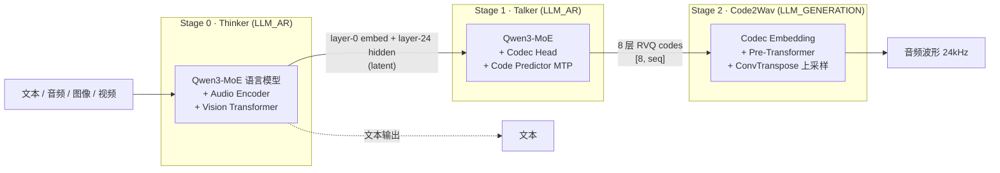
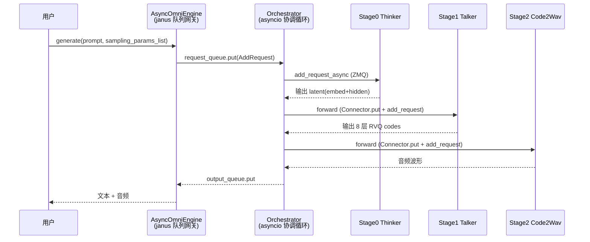

---
tags:
  - vllm
  - vllm-omni
  - vllm-ascend
  - NPU
  - Qwen3-Omni
---

# Qwen3-Omni 在 NPU 上是怎么跑起来的

> 一个问题：**vLLM 结合 vllm-ascend / vllm-omni 启动 Qwen3-Omni，到底是怎么串起来、又怎么在昇腾 NPU 上计算的？**
>
> 本文从「三层依赖 → 三阶段模型 → 启动拼装 → 运行时协调 → NPU 计算 → 最小复现」逐层拆开。基于源码阅读整理（`vllm` / `vllm-ascend` / `vllm-omni` 三仓库），文末附关键文件索引。

## 一句话总结

**vLLM 是硬件无关的引擎骨架；vllm-ascend 把骨架的「GPU 关节」换成「NPU 关节」；vllm-omni 在这副 NPU 骨架上拼出「多模态 / 多阶段」的肌肉。** 三者通过 *entry-point 插件* + *Platform/Worker 类继承* 解耦。Qwen3-Omni 则是这套机制上的一条具体三阶段流水线：**Thinker → Talker → Code2Wav**。

```
┌──────────────────────────────────────────────────────────────┐
│  vllm-omni    多模态 / 多阶段：OmniPlatform · Orchestrator      │
│               · Qwen3-Omni Pipeline(thinker/talker/code2wav)   │
│               register_omni_models_to_vllm  [general_plugins]  │
└───────────────────────────┬──────────────────────────────────┘
                            │ 菱形继承（复用 NPU 能力）
                            ▼
┌──────────────────────────────────────────────────────────────┐
│  vllm-ascend  NPU 后端：NPUPlatform · NPUWorker · Ascend       │
│               Attention/MoE/Quant kernels                     │
│               register → NPUPlatform   [platform_plugins]     │
└───────────────────────────┬──────────────────────────────────┘
                            │ 实现 vLLM 接口
                            ▼
┌──────────────────────────────────────────────────────────────┐
│  vLLM         引擎骨架：Engine · Scheduler · Platform ·        │
│               WorkerBase · ModelRegistry · KV Cache           │
└───────────────────────────┬──────────────────────────────────┘
                            │ torch + torch_npu (PrivateUse1 后端)
                            ▼
                  Ascend NPU （HCCL / ATB / aclnn / ACLGraph）
```

---

## 二、Qwen3-Omni 是什么：三阶段流水线

Qwen3-Omni（MoE 版）是一个把「多模态理解」和「语音合成」拆成三个独立模型阶段的系统。每个阶段是一个独立注册的模型、独立的 worker、独立的调度器。



| 阶段 | 模型类 | 执行类型 | 输入 | 输出 | 角色 |
|---|---|---|---|---|---|
| 0 Thinker | `Qwen3OmniMoeThinkerForConditionalGeneration` | `LLM_AR` | text+audio+image+video | text logits + 隐层（latent） | 多模态理解 + 文本生成 |
| 1 Talker | `Qwen3OmniMoeTalkerForConditionalGeneration` | `LLM_AR` | Thinker 的隐层 | 8 层 RVQ 离散音频码 | 文本语义 → 音频码 |
| 2 Code2Wav | `Qwen3OmniMoeCode2Wav` | `LLM_GENERATION` | RVQ 码 | PCM 波形 | 声码器（码 → 声音） |

### 逐跳数据流（关键张量语义）

**Hop 1 · Thinker → Talker**

- Thinker 把文本 token、`audio_tower` 产出的音频嵌入、`Qwen3Omni_VisionTransformer` 产出的视觉嵌入，按 `is_multimodal` mask 合并成统一序列 `[seq, 3584]`，过 Qwen3-MoE。
- 关键产出不是文本，而是两份隐层：**layer-0 embedding** 与 **layer-24 hidden states**（都是 `[seq, 3584]`）。
- `stage_input_processor` 的 `thinker2talker_*` 把它们打包成 `OmniPayload`，并用 `Qwen3OmniMoeTalkerResizeMLP` 投影 `3584 → 2048`（Talker 隐层维度）。

**Hop 2 · Talker 内部（含 Code Predictor MTP）**

- Talker（同样是 MoE）以 Thinker 投影后的隐层为条件，**自回归**生成音频码。
- `Codec Head` 先产出 **layer-0** RVQ 码（词表 2048）。
- `Qwen3OmniMoeTalkerCodePredictor`（MTP，re-prefill、无 KV cache）逐步产出 **layer-1…7**。
- 最终输出 8 层残差量化码 `codes.audio: [8, seq]`，层 0 最粗（音色骨架），层 7 最细（残差细节）。

**Hop 3 · Talker → Code2Wav**

- `talker2code2wav` 把 `[8, seq]` 展平为 `[seq*8]` 交给 Code2Wav。
- Code2Wav 给每层加 offset 后查 `code_embedding`，层维取均值 → `[seq, 2048]`，过 Pre-Transformer，再经多级 `ConvTranspose1d` 上采样（总倍率 ≈ **1280×**）得到波形，clamp 到 `[-1, 1]`。

!!! note "为什么拆三段"
    三个阶段计算特性完全不同：Thinker/Talker 是自回归 LLM（吃 KV cache、TP/EP 并行），Code2Wav 是非自回归卷积声码器。拆开后可各自独立调度、独立分配显存/设备、独立并行度——这正是 vllm-omni「多阶段引擎」的意义。

---

## 三、启动：插件发现 → 多阶段拼装

### 3.1 vLLM 用 entry points 发现插件

vLLM 启动时（每个 engine-core / worker 子进程都会）调用 `load_platform_plugins()` / `load_general_plugins()`，从 `importlib.metadata` 读两组入口点：

```toml
# vllm-ascend/setup.py
[vllm.platform_plugins]   ascend = vllm_ascend:register          # → "vllm_ascend.platform.NPUPlatform"
[vllm.general_plugins]    ascend_kv_connector / ascend_model_loader / ascend_model ...

# vllm-omni/pyproject.toml
[vllm.general_plugins]    vllm_omni_register_models = "vllm_omni.engine.arg_utils:register_omni_models_to_vllm"
```

- `ascend:register` 返回 `NPUPlatform`，vLLM 反射加载它替换默认 platform。
- `register_omni_models_to_vllm()` 把 Qwen3-Omni 的各阶段架构注册进 `vllm.ModelRegistry`（见下）。
- 因为 `general_plugins` 在每个子进程都会重新 load，所以 ascend 的 patch 与 omni 的模型注册能**跨进程生效**。

### 3.2 omni 注册的模型与流水线

```python
# vllm_omni/engine/arg_utils.py · register_omni_models_to_vllm()
_OMNI_MODELS = {
  "Qwen3OmniMoeForConditionalGeneration":        ("qwen3_omni", "qwen3_omni",                "Qwen3OmniMoeForConditionalGeneration"),
  "Qwen3OmniMoeThinkerForConditionalGeneration": ("qwen3_omni", "qwen3_omni_moe_thinker",   "...Thinker..."),
  "Qwen3OmniMoeTalkerForConditionalGeneration":  ("qwen3_omni", "qwen3_omni_moe_talker",    "...Talker..."),
  "Qwen3OmniMoeCode2Wav":                         ("qwen3_omni", "qwen3_omni_code2wav",      "Qwen3OmniMoeCode2Wav"),
}

# vllm_omni/config/pipeline_registry.py
_OMNI_PIPELINES = {"qwen3_omni_moe": (".../qwen3_omni/pipeline", "QWEN3_OMNI_PIPELINE")}
```

`QWEN3_OMNI_PIPELINE`（`pipeline.py`）是把三阶段连起来的「拓扑表」：每个 `StagePipelineConfig` 声明 `stage_id`、`model_stage`、`execution_type`、`input_sources`（依赖哪个阶段）、`engine_output_type`，以及阶段间的转换函数 `custom_process_*` / `async_chunk_process_*`。

### 3.3 Platform / Worker 的菱形继承（复用 NPU 能力）

omni 不直接接管 platform，而是用**多继承**把 ascend 的 NPU 实现拼进来：

```
vllm.Platform                         vllm WorkerBase
     │                                     │
vllm_ascend.NPUPlatform           vllm_ascend.NPUWorker
     │  (被 omni 继承)                  │  (被 omni 继承)
vllm_omni NPUOmniPlatform         vllm_omni OmniNPUWorkerBase
     ▲  多继承(MRO)                     ▲  多继承(MRO)
vllm_omni OmniPlatform            vllm_omni OmniWorkerMixin
                                       │
                                       ▼
                          NPUARWorker / NPUGenerationWorker
                          (AR 阶段 / 生成阶段)
```

- `NPUPlatform.check_and_update_config()` 把 `parallel_config.worker_cls` 改写成 NPU 的 worker 类。
- 阶段执行类型映射到 worker + scheduler：
  - `LLM_AR`（Thinker / Talker）→ `*ARWorker` + `OmniARScheduler`（异步时 `OmniARAsyncScheduler`）
  - `LLM_GENERATION`（Code2Wav）→ `*GenerationWorker` + `OmniGenerationScheduler`
- `NPUWorker._init_device()` 做真正的 NPU 上电（见第五节）。

---

## 四、运行时：Orchestrator 怎么把三阶段串起来

vllm-omni 的运行时是分层的：**API 层 → Engine 代理层（同步）→ Orchestrator 协调层（asyncio 后台线程）→ Execution 执行层（子进程，ZMQ 通信）**。



- **阶段间数据传递**走 `OmniConnector`（工厂可选 `SharedMemoryConnector`（本机共享内存）/ `MooncakeConnector` / `YuanrongConnector`（NPU 转移引擎）等）。worker 侧由 `OmniConnectorModelRunnerMixin` 用后台收发线程处理。
- **两种传输模式**：
  - **full_payload**：阶段完整跑完再整体转发（离线、要完整结果）。
  - **async_chunk**：Thinker 每解码若干 token 就把增量推给 Talker，Talker 流式产码，Code2Wav 分块出声——**低延迟实时**链路。由 deploy YAML 顶层 `async_chunk: true` 启用。
- **调度器是「多阶段感知」的**：当下游阶段缓冲区满时，会反压暂停上游推理。

---

## 五、在 NPU 上到底怎么算

### 5.1 设备上电与分布式

`NPUWorker._init_device()`（`vllm_ascend/worker/worker.py`）：

```
register_ascend_customop() → init_ascend_config() → check_ascend_device_type()
torch.npu.set_device(device)                       # dispatch_key = "PrivateUse1"
import torch_npu._inductor                          # Triton on NPU
init_distributed_environment(backend="hccl")        # HCCL 集合通信
init_ascend_model_parallel()                        # MC2: (PP) × (DP×TP×EP) 二维分组
→ 构造 ModelRunner → 加载模型 → forward
```

### 5.2 算子替换清单（vLLM 抽象 → 昇腾实现）

| 功能 | NPU 实现 | 实现方式 |
|---|---|---|
| Attention | `AscendAttentionBackend` / `AscendMLABackend`（Qwen3 Thinker 用 MLA） | `torch_npu.npu_*` + 自定义算子，ACLGraph 图模式加速 |
| MoE | `AscendFusedMoE`；omni 侧 `AscendHunyuanFusedMoE` 包装 | expert 路由 + AllGather(A2/310P) / AllToAll(A3/A5)，MC2 并行 |
| RMSNorm | `AscendRMSNorm` | `torch_npu.npu_rms_norm` + residual 融合 |
| RoPE | `get_cos_and_sin_mla` / Triton `rope_forward` | NPU 要求 cos/sin **分离**存储并 detach |
| Linear | `unquantized_gemm` / 量化 quant_method | `PrivateUse1` dispatch |
| 量化 | W4A16 / W4A8 / W8A8(静态·动态) / MXFP8 / MXFP4 / FP8 | 权重 int32 打包解包 + 融合 GEMM-SwiGLU |
| 激活 | `AscendSwigluOAIAndMul` | 融合 SwiGLU+Mul |
| Conv（Code2Wav） | `AscendConv3dLayer`（aclnn BatchMatMulV2） | 见下方特化 |

### 5.3 各阶段的 NPU 路径

- **Thinker / Talker（MoE LLM）**：MLA Attention + `AscendFusedMoE` + 融合 RMSNorm + 量化 Linear + 融合 SwiGLU；DP×TP×EP 并行，MoE token 用 AllGather/AllToAll dispatch/combine。Talker 的 MoE 走 omni 定制的 `AscendHunyuanFusedMoE`（前置 `prepare_hunyuan_fused_moe_runtime()` 按 SOC 版本选通信方式）。
- **Code2Wav（卷积声码器）特化**：卷积在 ACLnn 上兼容性不佳，omni 在 `vllm_omni/platforms/npu/models/qwen3_tts_code2wav.py` 里**关掉编译、走 eager**：

```python
torch.npu.config.allow_internal_format = False
torch.npu.set_compile_mode(jit_compile=False)
```

### 5.4 编译与图执行

- `AscendCompiler` 替代 inductor；通过 `GraphFusionPassManager` 跑融合 Pass，再用 `torch._inductor.compile_fx` + `ACLGraph`（cudagraph 的昇腾等价物）。
- 常见配置：`cudagraph_mode = FULL_DECODE_ONLY`（仅 decode 用图）或 `NONE`（eager）。Code2Wav 阶段通常 `enforce_eager`。
- 性能优化：权重预取（`weight_prefetch`，独立 stream）、共享专家多流 overlap、`CaMemAllocator`（HBM 分配 + sleep offload）。

---

## 六、最小可复现：怎么启动

### 6.1 离线推理（同步）

```bash
# examples/offline_inference/qwen3_omni/
python end2end.py --output-wav output_audio --query-type use_audio
```

```python
from vllm_omni.entrypoints.omni import Omni
from vllm import SamplingParams

omni = Omni(model="Qwen/Qwen3-Omni-30B-A3B-Instruct")  # 自动加载 deploy/qwen3_omni_moe.yaml

# 每个阶段一套采样参数（顺序 = stage 顺序）
sampling_params_list = [
    SamplingParams(temperature=0.9, top_p=0.9, max_tokens=1200),                       # Thinker：detokenize=True
    SamplingParams(temperature=0.9, top_k=50, max_tokens=4096,
                   detokenize=False, stop_token_ids=[2150]),                            # Talker：输出码，不 detokenize
    SamplingParams(temperature=0.0, max_tokens=4096*16,
                   detokenize=True, repetition_penalty=1.1),                            # Code2Wav：长输出
]

prompt = {
    "prompt": "<|im_start|>system\n...<|im_end|>\n"
              "<|im_start|>user\n<|audio_start|><|audio_pad|><|audio_end|>...<|im_end|>\n"
              "<|im_start|>assistant\n",
    "multi_modal_data": {"audio": (audio_np_float32, 16000)},  # (信号, 采样率)
    "modalities": ["text", "audio"],                            # 控制输出模态
}

for stage_outputs in omni.generate([prompt], sampling_params_list, py_generator=True):
    out = stage_outputs.request_output
    if stage_outputs.final_output_type == "text":
        print(out.outputs[0].text)
    elif stage_outputs.final_output_type == "audio":
        import soundfile as sf
        sf.write("out.wav", out.outputs[0].multimodal_output["audio"].cpu().numpy(), samplerate=24000)
omni.close()
```

异步流式版换 `AsyncOmni` + `--deploy-config vllm_omni/deploy/qwen3_omni_moe.yaml`（YAML 里 `async_chunk: true`）。

### 6.2 在线服务

```bash
# 单进程（所有阶段同进程）
vllm serve Qwen/Qwen3-Omni-30B-A3B-Instruct --omni --port 8091

# 阶段分离（每阶段独立进程 / 设备，靠 omni-master 协调）
CUDA_VISIBLE_DEVICES=0 vllm serve ... --omni --port 8091 --stage-id 0 --omni-master-address 127.0.0.1 --omni-master-port 26000
CUDA_VISIBLE_DEVICES=1 vllm serve ... --omni --stage-id 1 --headless --omni-master-address 127.0.0.1 --omni-master-port 26000
CUDA_VISIBLE_DEVICES=1 vllm serve ... --omni --stage-id 2 --headless --omni-master-address 127.0.0.1 --omni-master-port 26000
```

- HTTP：`/v1/chat/completions`，body 带 `"modalities": ["text", "audio"]`。
- 实时语音：`/v1/realtime`（WebSocket，PCM16/单声道/16kHz 输入，24kHz 输出）。
- per-stage 调参：`--stage-overrides '{"1": {"gpu_memory_utilization": 0.5}}'`。

> 在 NPU 上：把上面的 `CUDA_VISIBLE_DEVICES` 换成 `ASCEND_RT_VISIBLE_DEVICES`，并安装 `vllm-ascend`——platform 插件会自动接管，模型/流水线逻辑不变。

### 6.3 deploy YAML（节选）

```yaml
async_chunk: true
connectors:
  connector_of_shared_memory:
    name: SharedMemoryConnector
    extra: { initial_codec_chunk_frames: 4, codec_chunk_frames: 25, codec_left_context_frames: 25 }
stages:
  - { stage_id: 0, devices: "0", gpu_memory_utilization: 0.9, max_num_batched_tokens: 32768 }   # Thinker
  - { stage_id: 1, devices: "1", gpu_memory_utilization: 0.6, max_num_batched_tokens: 32768 }   # Talker
  - { stage_id: 2, devices: "1", gpu_memory_utilization: 0.1, max_num_batched_tokens: 65536 }   # Code2Wav
```

---

## 七、关键文件索引

| 角色 | 文件 |
|---|---|
| ascend 插件入口 / 注册 | `vllm-ascend/vllm_ascend/__init__.py`、`setup.py` |
| NPU Platform / Worker | `vllm-ascend/vllm_ascend/platform.py`、`worker/worker.py` |
| NPU 算子库 | `vllm-ascend/vllm_ascend/ops/`（`fused_moe/`、`rotary_embedding.py`、`layernorm.py`、`conv.py`、`activation.py`） |
| NPU Attention 后端 | `vllm-ascend/vllm_ascend/attention/`（`attention_v1.py`、`mla_v1.py`） |
| NPU 量化 | `vllm-ascend/vllm_ascend/quantization/` |
| NPU 编译 | `vllm-ascend/vllm_ascend/compilation/`（`compiler_interface.py`、`acl_graph.py`） |
| omni × ascend 菱形继承 | `vllm-omni/vllm_omni/platforms/npu/platform.py`、`worker/base.py` |
| omni Code2Wav NPU 特化 | `vllm-omni/vllm_omni/platforms/npu/models/qwen3_tts_code2wav.py`、`hunyuan_fused_moe.py` |
| omni 模型 / 流水线注册 | `vllm-omni/vllm_omni/engine/arg_utils.py`、`config/pipeline_registry.py` |
| Qwen3-Omni 模型 | `vllm-omni/vllm_omni/model_executor/models/qwen3_omni/`（`qwen3_omni_moe_thinker.py`、`_talker.py`、`_code_predictor_mtp.py`、`_code2wav.py`、`pipeline.py`） |
| 阶段间转换 | `vllm-omni/vllm_omni/model_executor/stage_input_processors/qwen3_omni.py` |
| 引擎 / 协调器 | `vllm-omni/vllm_omni/engine/async_omni_engine.py`、`engine/orchestrator.py` |
| 调度器 | `vllm-omni/vllm_omni/core/sched/omni_ar_scheduler.py`、`omni_generation_scheduler.py` |
| 连接器 | `vllm-omni/vllm_omni/distributed/omni_connectors/factory.py` |
| 入口 / 配置 | `vllm-omni/vllm_omni/entrypoints/omni.py`、`async_omni.py`；`vllm_omni/deploy/qwen3_omni_moe.yaml` |
| 示例 | `vllm-omni/examples/offline_inference/qwen3_omni/`、`examples/online_serving/qwen3_omni/` |

---

!!! info "说明"
    本文为源码阅读笔记，文件路径与结构基于当时仓库快照；行号可能随版本漂移，请以实际仓库为准。重点是把「三层依赖 + 三阶段流水线 + 插件拼装 + NPU 算子替换」这条主线讲清楚。
