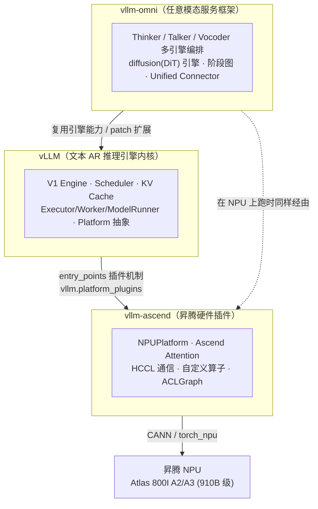
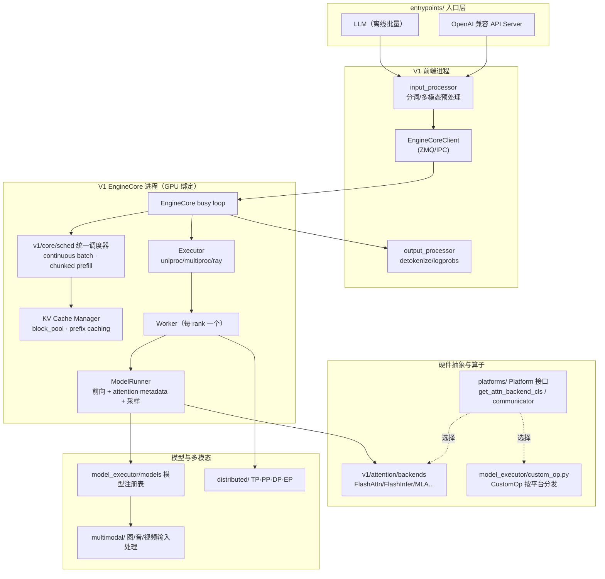
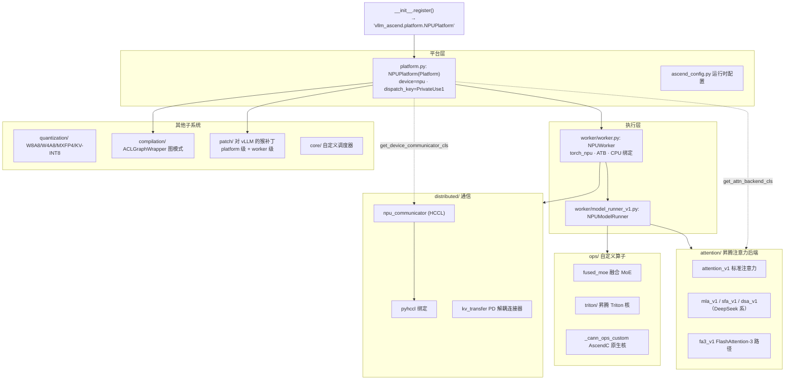
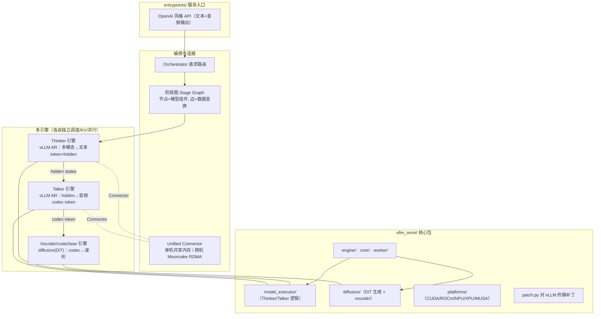
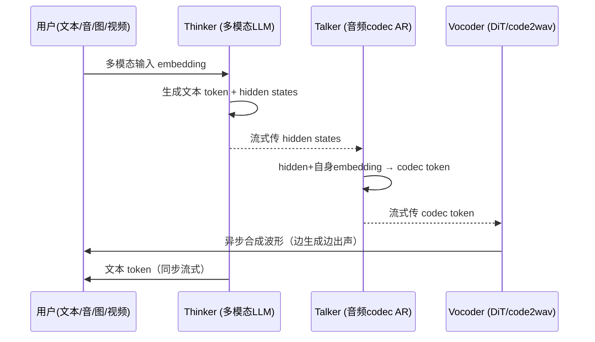
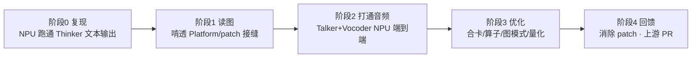

---
tags:
  - vLLM
  - Ascend
  - NPU
  - Omni
---

# vLLM / vllm-ascend / vllm-omni 模块导图与 Omni NPU 适配研究方向

> 目标：先建立三个项目的「模块地图」，看清它们的边界与依赖，再确定第一阶段研究方向 —— **Omni 模型在昇腾 NPU 上的适配**。
>
> 信息核对时间：2026-06，对照各项目 `main` 分支与官方文档。版本演进很快，写代码前请以当时源码为准。

## 0. 三者关系速览

三个项目是**分层 + 插件**关系，不是三个并列的竞品：

- **vLLM**：文本自回归（AR）推理内核，定义了 `Platform` 硬件抽象接口。
- **vllm-ascend**：vLLM 的**树外硬件插件**，通过 Python `entry_points` 把昇腾 NPU 注册成一个 `Platform`，不 fork vLLM。
- **vllm-omni**：vLLM 官方组织下的**任意模态（any-to-any）服务框架**，在 vLLM 之上扩展出「文本 + 音频 + 图像 + 视频」输出、非自回归（diffusion/DiT）、多阶段解耦流水线；不是 fork，而是 companion + monkey-patch。

> 关键认知：**主线 vLLM 只内置了 Qwen-Omni 的 Thinker（仅文本输出）**；真正的「语音输出」由 vllm-omni 的 Talker + Vocoder 流水线完成。NPU 上跑 Omni，本质是 `vllm-omni × vllm-ascend` 两个扩展的交叉点。

---

## 1. vLLM 内核模块导图（V1 引擎为主）

**V1 相对 V0 的关键变化**：`EngineCore` 跑在**独立进程**，前端（分词/detokenize/流式输出）与 GPU 调度执行解耦，经 ZMQ 通信；统一调度器把 prefill / decode 融合成基于 token 预算的单一决策。

### 硬件后端必须实现的扩展点（写适配的「接缝」）

| 扩展点 | 接口/位置 | 作用 |
|---|---|---|
| **Platform** | `platforms/interface.py: Platform` | 设备识别、`check_and_update_config`、能力开关 |
| **Attention 后端选择** | `Platform.get_attn_backend_cls()` | 把硬件映射到具体 attention 实现（**核心分发点**） |
| **设备通信器** | `Platform.get_device_communicator_cls()` | 集合通信（NPU 用 HCCL） |
| **自定义算子** | `model_executor/custom_op.py: CustomOp` | 按平台分发的逐算子实现 |
| **静态图** | `Platform.get_static_graph_wrapper_cls()` | CUDA Graph / ACLGraph 等 |
| **插件注册** | `entry_points: vllm.platform_plugins` 等 | 树外后端注入；返回 `Platform` 子类全限定名 |

---

## 2. vllm-ascend 模块导图（昇腾 NPU 插件）

**软件栈与版本耦合（强耦合，按 release 对齐）**：

| 组件 | `main` 当前要求 |
|---|---|
| Python | ≥3.10, <3.13 |
| 硬件 | Atlas 800I A2/A3 推理、Atlas A2/A3 训练、Atlas 300I Duo(实验) |
| CANN / NNAL | == 9.0.0 |
| torch / torch-npu | == 2.10.0 |
| vLLM | 每个 release 锁定具体版本（如 v0.18.0 ↔ vLLM 对应版） |

**特性支持矩阵（摘要）**：Chunked Prefill / APC / 投机解码 / 多模态 / TP·PP·EP·DP / PD 解耦 / 量化 / 图模式 / Sleep Mode / Context Parallel 均 🟢 可用；LoRA / Pooling / Beam search 🔵 实验；Enc-Dec 🟡 计划中。多模态已支持 Qwen2.5-VL、Qwen3-VL、Qwen2-Audio。310P 为实验级，尚未实现 MLA/SFA。

**Patch 两段式**（值得重点理解，是适配「真相」所在）：

- `patch/platform/*`：worker 启动前、全局生效（分布式对齐、调度器、KV cache、工具调用解析等）。
- `patch/worker/*`：每个 worker init 时生效（cudagraph、triton、模型专属补丁如 qwen3vl、deepseek_mtp）。
- 每个补丁都带 Why/How/Related-PR/Future-Plan 注释，意图是逐步上游化后删除 —— **读 patch 目录 = 读「vLLM 与昇腾还差哪些没对齐」的清单**。

---

## 3. vllm-omni 模块导图（任意模态服务框架）

**Qwen-Omni（Thinker-Talker-Vocoder）流水线**：

**要点**：每个 stage 是**独立引擎**（独立 scheduler / KV cache / 并行度 / 硬件分配），通过 Unified Connector 流式传递 hidden states / codec token，实现「边想边说」。论文（arXiv 2602.02204，*Fully Disaggregated Serving for Any-to-Any Multimodal Models*）报告 Qwen3-Omni RTF 下降约 90%。

---

## 4. Omni NPU 适配 —— 第一阶段研究方向

### 为什么从这里切入

`vllm-omni × vllm-ascend` 的交叉点是当前**最新、最薄、最有空白**的地带：

- 主线 vLLM 在 NPU 上跑 Qwen-Omni **Thinker（仅文本）** 已有路径（vllm-ascend 有 Qwen3-Omni-30B-A3B-Thinking 教程 + 已合入的量化适配 PR #6828）。
- 但 **Talker + Vocoder（音频输出）在 NPU 上端到端** 仍在推进中（vllm-omni 有 NPU 2026 Q1 Roadmap，issue #886）。
- 现存约束：Qwen2.5/3-Omni 的 Talker 当前需与 Thinker **分卡部署**，合卡降卡数是公开目标 —— 这正是可研究的工程问题。

### 路线图（由浅入深）

- **阶段 0 · 复现基线**：按 vllm-ascend 教程在昇腾上 `serve` Qwen3-Omni Thinker，跑通文本；记录 CANN/torch_npu/vLLM/vllm-ascend/vllm-omni 的版本组合矩阵（这是后面一切的前提）。
- **阶段 1 · 读懂接缝**：精读 `vllm/platforms/interface.py` ↔ `vllm_ascend/platform.py` 的映射；通读 `vllm_ascend/patch/`（= 未对齐清单）；理解 `get_attn_backend_cls` 如何把 Omni 各 stage 的注意力路由到昇腾后端。
- **阶段 2 · 打通音频输出**：聚焦 Talker（音频 codec AR）与 Vocoder（DiT/code2wav）在 NPU 上的可运行性 —— DiT 引擎是否依赖 NPU 缺失的算子？Unified Connector 在 NPU 上走共享内存/HCCL 的传输路径是否就绪？
- **阶段 3 · 性能/部署优化**：Talker-Thinker 合卡、降卡数；fused MoE / 自定义算子；ACLGraph 图模式覆盖 Omni 路径；W8A8/W4A8 量化对音频质量的影响。
- **阶段 4 · 回馈上游**：把 `patch/` 中与 Omni 相关的临时补丁上游化，向 vllm-ascend / vllm-omni 提 PR。

### 优先要回答的开放问题

1. NPU 上 Omni 的**音频输出路径**目前到哪一步？（Thinker 已通；Talker/Vocoder 端到端是否就绪？—— 见 issue #886）
2. **DiT vocoder** 在昇腾上缺哪些算子？需要在 `_cann_ops_custom/` 补什么？
3. **Unified Connector** 跨 stage 传 hidden states，在 NPU 上走 HCCL 还是共享内存？延迟如何？
4. Thinker/Talker **分卡 vs 合卡** 的调度与显存权衡，能否降到更少 NPU 卡？

---

## 参考链接

- vLLM：<https://github.com/vllm-project/vllm> · 插件机制 <https://docs.vllm.ai/en/latest/design/plugin_system/>
- vllm-ascend：<https://github.com/vllm-project/vllm-ascend> · 文档 <https://docs.vllm.ai/projects/ascend/> · 硬件插件博客 <https://blog.vllm.ai/2025/05/12/hardware-plugin.html>
- vllm-omni：<https://github.com/vllm-project/vllm-omni> · 文档 <https://docs.vllm.ai/projects/vllm-omni> · 论文 <https://arxiv.org/abs/2602.02204>
- Qwen3-Omni-30B-A3B-Thinking on Ascend（教程）：<https://docs.vllm.ai/projects/ascend/en/v0.13.0/tutorials/Qwen3-Omni-30B-A3B-Thinking.html>
- vllm-ascend Qwen3-Omni 量化 PR #6828：<https://github.com/vllm-project/vllm-ascend/pull/6828>
- vllm-omni NPU 2026 Q1 Roadmap（issue #886）：<https://github.com/vllm-project/vllm-omni/issues/886>
- 模型：<https://github.com/QwenLM/Qwen3-Omni> · <https://github.com/QwenLM/Qwen2.5-Omni>
