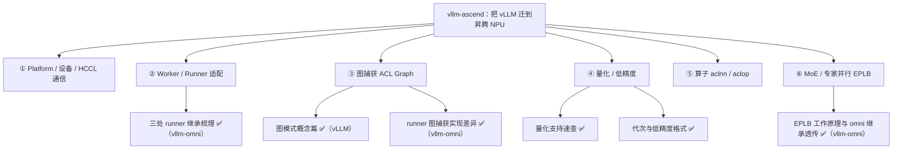

# vLLM-Ascend（昇腾）

记录 vLLM 在昇腾 NPU 上的适配层 `vllm-ascend`：Platform / Worker 适配、量化方案、算子与设备管理等平台相关的内容。

## 知识脉络

`vllm-ascend` 是 vLLM 的"第二类后端"——把一套为 CUDA 设计的引擎迁到昇腾 NPU。它的工作可以按**适配维度**拆成五条线，每条都是"上游有什么 → 昇腾怎么对应/重写"：



**脉络说明**（不少昇腾主题是结合 omni 一起写的，已交叉链接）：

- **① Platform/设备**——设备初始化、HCCL 通信、内存管理。推进方向。
- **② Worker/Runner 适配**——`NPUWorker` 直接继承 `WorkerBase`、`NPUModelRunner` 复用 `GPUModelRunner`：见 [三处 worker 的职责与继承关系梳理](../vllm-omni/worker-class-hierarchy.md) ✅。
- **③ 图捕获 ACL Graph**——概念见 [图模式：eager / PIECEWISE / FULL](../vllm/cudagraph-modes.md) ✅；runner 层实现与 GPU 的差异见 [图模式在 runner 里的实现](../vllm-omni/npu-gpu-graph-in-runner.md) ✅。
- **④ 量化/低精度**——[量化特性支持速查](snippets/ascend-quantization.md) ✅、[代次与原生低精度格式](snippets/ascend-generations-low-precision.md) ✅。
- **⑤ 算子**——aclnn/aclop 与可图性，推进方向（相关坑见 [talker_mtp 图安全](../vllm-omni/talker-mtp-graph-safety.md)）。
- **⑥ MoE/专家并行**——EPLB 负载均衡:vllm 主干机制 + 昇腾异步子进程改造 + omni 的继承透传，见 [EPLB 工作原理与 omni 的继承透传](../vllm-omni/snippets/eplb-inheritance.md) ✅。

> ✅ = 已有笔记；其余为推进方向。

另见 [碎片知识](snippets/index.md)：
- [昇腾(vllm-ascend)量化特性支持速查](snippets/ascend-quantization.md) — W8A8 / W4A8 / W4A4 / MXFP8 / KV C8 支持矩阵
- [昇腾代次与原生低精度格式(A2/A3/A5·950)](snippets/ascend-generations-low-precision.md) — 各硬件代次原生支持的 FP8 / MXFP8 / HiF8 / MXFP4 / INT8 对比与 950 算力表

## 如何新增一篇笔记

1. 在 `docs/vllm-ascend/` 下新建 Markdown 文件，例如 `docs/vllm-ascend/platform.md`
2. 在 `mkdocs.yml` 的 `nav` → `vllm-ascend` 下添加一行：

   ```yaml
   - Platform 适配: vllm-ascend/platform.md
   ```

3. 本地预览：`mkdocs serve`，推送到 `main` 后自动部署
