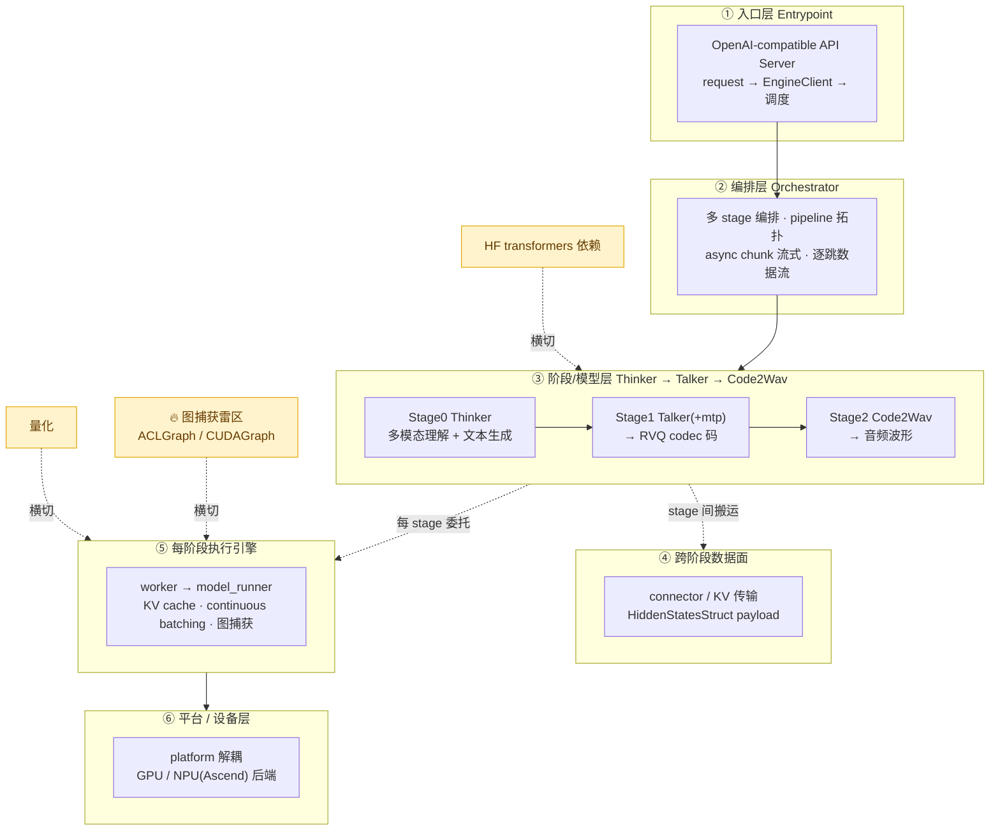

---
tags:
  - vllm-omni
  - 架构地图
  - 中枢
  - Orchestrator
  - 多阶段流水线
  - 平台解耦
  - 索引
---

# vllm-omni 架构地图（核心中枢）

> 本页是整个 vllm-omni 板块的**中枢**：先给一张分层架构总图，再把每一层挂上对应的深潜笔记。**看图定位 → 点进深度**。第一次读建议从这里进，需要细节再下钻。
>
> 一句话定位：**vllm-omni = 架在 vLLM 之上的「多阶段任意模态服务框架」**。vanilla vLLM 服务单模型（token 进 token 出）；vllm-omni 补的是 vLLM 缺的那层——多模型流水编排、跨阶段隐状态传递、非 LLM 的波形/扩散 stage、以及 NPU 平台解耦。为什么非它不可，见 [多模态全流程综述](multimodal-runtime-overview.md)。

## 一、架构总图

**读图的两条主线**（本板块的方法论底座）：

- **读系统**（①②④⑤⑥）：靠断点抓栈找路径——服务怎么起、请求怎么流、图怎么捕获。工具：[断点点位地图](breakpoint-map.md)。
- **读模型**（③内部）：靠双代码库三角定位——HF `transformers` 读语义、vllm-omni 读工程、官方 repo 对边界。地图：[Qwen3-Omni 七路径](qwen3-omni-mastery-roadmap.md)。

---

## 二、分层导览（每层 = 定位 + 关键思想 + 笔记）

### ① 入口层：从 curl 到返回

**定位**：OpenAI 兼容 API 收请求，转成 EngineClient 调用，最终把文本/音频吐回。
**关键思想**：请求在启动期和请求期各有一套调用栈；多模态数据在入口就被识别、预处理（占位符铺位、mm 特征打包）。

- [从 curl 到返回：请求完整生命周期](request-lifecycle-end-to-end.md)（GPU/NPU × vllm/omni/ascend）
- [以 Qwen3-Omni 拆解核心组件与请求流转](components-request-flow.md) — engine / orchestrator / connector / scheduler 四件套
- [断点点位地图](breakpoint-map.md) — 启动期 + 请求期该在哪断

### ② 编排层：Orchestrator 是 vllm-omni 的心脏

**定位**：把多个模型 stage 串成流水，调度谁先跑、谁的输出喂给谁、何时开始流式消费上一 stage 的分块输出。
**关键思想**：这是 vanilla vLLM **没有**的一层——单模型引擎不管"多模型接力"。pipeline 拓扑用 `execution_type`（LLM_AR / LLM_GENERATION）+ `engine_output_type`（latent / audio）声明每个 stage 的性质。

- [Orchestrator：多 stage 编排核心](engine-orchestrator.md)
- [Qwen3-Omni 在 NPU 上是怎么跑起来的](qwen3-omni-npu.md) — 三段式逐跳数据流实例
- [语音/TTS 服务链路：接口到 Code2Wav](tts-serving-path.md)（骨架，待填 P6）

### ③ 阶段/模型层：真正的模型在这里

**定位**：Thinker（理解+文本）→ Talker(+mtp)（→codec 码）→ Code2Wav（→波形）。语音尾巴可关（thinker-only 拓扑）。
**关键思想**：用 [Qwen3-Omni 七路径 P1–P7](qwen3-omni-mastery-roadmap.md) 把这一层"吃透"——每条路径可画 10–20 行调用链 + 说清关键数据结构。

**输入/多模态处理（Thinker 前段）**

- [全模态(图/音)与纯文本用例的路径区别](multimodal-vs-text-path.md) — 分叉只在 Thinker 前段，入 backbone 即合流
- [P1 音频路径：mel→AuT→embedding→scatter](audio-encoder-path.md)
- [P2 图/视频→ViT→embedding 与 TMRoPE 时间对齐](vision-tmrope-path.md)

**Thinker → 语音尾巴**

- [P4 Thinker→Talker 交接：哪层 hidden/怎么拼/speaker](thinker-talker-handoff.md)
- [P5 talker_mtp 是什么与图安全问题](talker-mtp-graph-safety.md)

**独立/相关模型**

- [Qwen3-TTS 三种音色模式：Base/VoiceDesign/CustomVoice](qwen3-tts-voice-modes.md) — 独立 TTS 模型，含 ECAPA/enc_dim
- [BAGEL-7B-MoT 模型解剖（统一理解+生成）](bagel-model-anatomy.md)
- [Diffusion pipeline 内部：去噪到 VAE](diffusion-pipeline-internals.md)（骨架）

### ④ 跨阶段数据面：stage 之间搬什么、怎么搬

**定位**：stage N 的输出（hidden / codec 码 / latent）如何送到 stage N+1。
**关键思想**：Thinker→Talker 目前走 `HiddenStatesStruct` 的 CPU payload（`.detach().cpu()` 跨 stage），**不是** KV connector——这是 P4 走读的实测结论，也是 NPU 上 device↔CPU 搬运的对齐雷点。

- [跨 stage 数据面：连接器与 KV 传输](distributed-connectors-kv.md)（骨架）
- [P4 交接机制](thinker-talker-handoff.md) 的"跨 stage device→CPU→device" diff 缝

### ⑤ 每阶段执行引擎：委托给 vLLM 的那半

**定位**：单个 stage 内部的 worker / model_runner，负责 KV cache、continuous batching、paged attention、图捕获——**复用 vLLM**。
**关键思想**：三套硬件×角色的 worker 有菱形继承；runner 的图捕获在 NPU/GPU 上实现不同。数据流对齐有隐式契约。

- [三处 worker 的职责与继承关系梳理](worker-class-hierarchy.md) — 硬件×角色矩阵、菱形继承、§十 数据流对齐契约
- [图模式在 runner 里的实现：NPU 与 GPU 差异](npu-gpu-graph-in-runner.md)
- [npu_model_runner 上游适配困境与解耦](snippets/npu-runner-decoupling.md)（PR #4454）

### ⑥ 平台/设备层：GPU/NPU 解耦

**定位**：把平台无关逻辑和平台相关（`torch_npu`/ACLGraph/Ascend）代码分开，让同一套上层跑在不同后端。
**关键思想**：这是你们做 NPU 发布的主场——对别人是噪声的平台 if-else，对我们是主线。

- [Omni 平台无关/相关解耦：现状与演进](platform-decoupling.md)
- [platforms/npu 架构导读：昇腾后端入口地图](npu-platform-architecture.md)
- [vLLM / vllm-ascend / vllm-omni 模块导图与 NPU 适配研究方向](vllm-omni-npu.md)

---

## 三、横切关注点（穿透多层）

### 🔥 图捕获雷区（本板块踩坑最密处）

图捕获（CUDAGraph/ACLGraph）横切 ⑤ 执行引擎与 ③ 模型层，是 NPU 上崩溃的高发地：

- [talker_mtp 图安全](talker-mtp-graph-safety.md) — 三段式语义骨架与捕获边界
- [嵌套图捕获为什么不行（#4519）](nested-graph-capture.md)
- [transformers 的 is_tracing 为什么在 NPU 上失灵](transformers-is-tracing-npu.md)
- [案例倒推：NPU 上 talker 因前缀缓存缺兜底而崩(6 vs 9)](npu-prefix-cache-missing.md)

### 量化 / HF 依赖 / 注意力后端

- [量化全景：factory 到各 config](quantization-overview.md)（骨架）
- [vLLM-Omni 为什么依赖 transformers](why-depend-on-transformers.md)
- [Diffusion 注意力后端全貌（以 ring_pytorch_attn 为例）](diffusion-attention-backend.md)

### 实操

- [在 VSCode 里远程调试 Ascend 容器内的 vLLM-Omni](debug-ascend-remote.md)

---

## 四、按问题找（troubleshooting 索引）

| 你遇到的问题 | 先看 |
|---|---|
| **服务/请求流不清楚**，想找断点 | [请求生命周期](request-lifecycle-end-to-end.md) · [断点地图](breakpoint-map.md) |
| **多 stage 怎么串**、为什么要 orchestrator | [Orchestrator](engine-orchestrator.md) · [核心组件与请求流转](components-request-flow.md) |
| **NPU 上图捕获崩了** | [图安全](talker-mtp-graph-safety.md) · [嵌套捕获#4519](nested-graph-capture.md) · [is_tracing 失灵](transformers-is-tracing-npu.md) · [前缀缓存崩](npu-prefix-cache-missing.md) |
| **多模态精度对不齐**（音/图 embedding） | [P1 音频](audio-encoder-path.md) · [P2 视觉/TMRoPE](vision-tmrope-path.md)（查 HF↔vllm diff 缝） |
| **语音输出/音色**问题 | [P4 交接](thinker-talker-handoff.md) · [P5 talker_mtp](talker-mtp-graph-safety.md) · [Qwen3-TTS 音色模式](qwen3-tts-voice-modes.md) |
| **要加新模型 / 新后端** | [平台解耦](platform-decoupling.md) · [platforms/npu 导读](npu-platform-architecture.md) · [worker 继承](worker-class-hierarchy.md) |
| **想系统吃透 Qwen3-Omni** | [七路径覆盖地图](qwen3-omni-mastery-roadmap.md)（P1–P7 逐条） |

---

## 五、这张图和「知识脉络」的关系

[vllm-omni 首页](index.md) 的"知识脉络"是**按学习顺序**（从宏观到微观、正常路径到踩坑）组织的七主题清单；本页是**按系统架构分层**组织的中枢图。两者互补：**先用本页的架构图建立空间感，再用首页的脉络图安排阅读顺序。**
