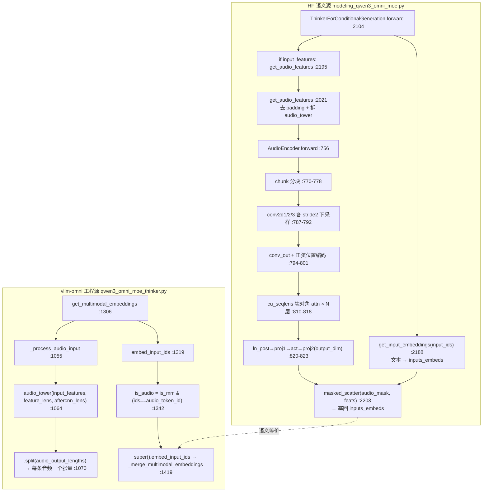

---
tags:
  - vllm-omni
  - Qwen3-Omni
  - AuT
  - 音频编码器
  - scatter
  - 占位符
  - TMRoPE
  - NPU
  - P1
---

# P1：一段音频如何 mel → AuT encoder → embedding → scatter 进 Thinker 序列

> [吃透 Qwen3-Omni 覆盖地图](qwen3-omni-mastery-roadmap.md) 里排在 ROI 第一的缺口。本文用**双代码库三角定位**把它拿下：HF `transformers` 读语义（正确结果应该是什么），vllm-omni 读工程（服务化后怎么拆），只 diff 语义变化点。宏观位置见 [多模态全流程](multimodal-runtime-overview.md)，下游交接见 [P4/P5 talker_mtp](talker-mtp-graph-safety.md)。
>
> **一句话结论**：音频路径的题眼不是 encoder 卷积栈（那是普通 Whisper-style 下采样），而是**两处约定**——① AuT 输出维度必须等于 text hidden，才能原地 `masked_scatter` 回序列；② `<|audio_pad|>` 占位符 token 数必须精确等于 encoder 输出帧数，否则 scatter 长度对不齐。NPU 精度/崩溃几乎都发生在这两处的缝里。

## 调用链（10–20 行，双库对照）



## 一、HF 语义源：正确结果应该是什么

文件：`transformers/models/qwen3_omni_moe/modeling_qwen3_omni_moe.py`（v 对应本地 anaconda py3.10 环境，4196 行）。

### 1. 入口分叉：文本先 embed，音频再 scatter 覆盖

`Qwen3OmniMoeThinkerForConditionalGeneration.forward`（:2104）先把 `input_ids` 过 `get_input_embeddings`（:2188）拿到文本 embedding，占位符 token 此刻还是**普通词表 embedding**（占位，将被覆盖）。随后若 `input_features is not None`（:2194）走音频：

```python
audio_features = self.get_audio_features(...).last_hidden_state   # :2195
audio_features = audio_features.to(inputs_embeds.device, inputs_embeds.dtype)  # :2201
_, _, audio_mask = self.get_placeholder_mask(input_ids, inputs_embeds=inputs_embeds)  # :2202
inputs_embeds = inputs_embeds.masked_scatter(audio_mask, audio_features)  # :2203 ← 题眼
```

`get_placeholder_mask`（:2052）用 `input_ids == self.config.audio_token_id`（:2081）取 mask，再 `unsqueeze(-1).expand_as(inputs_embeds)`（:2099）。**scatter 约定就在这里**：mask 为 True 的位置按行优先顺序被 `audio_features` 逐个填入——所以占位符 token 数 × 无所谓，被填进去的是**按 mask 展平后的元素总数**必须等于 `audio_features.numel()`。数量不匹配时普通 VLM 会静默错位，这里 `get_placeholder_mask` 对 image/video 有 `torch_compilable_check`（:2086/2094），但**音频那条 :2099 没有 check**——静默风险点。

### 2. `get_audio_features`（:2021）：去 padding，转发 audio_tower

```python
if feature_attention_mask is not None:                              # :2036
    audio_feature_lengths = torch.sum(feature_attention_mask, dim=1)
    input_features = input_features.permute(0,2,1)[feature_attention_mask.bool()].permute(1,0)  # :2038 把 batch padding 拆掉，变成一条 ragged mel
audio_outputs = self.audio_tower(input_features, feature_lens=feature_lens, ...)  # :2043
```

注意 HF 这里**不**传 `aftercnn_lens`，留给 encoder 内部算（见下）。这是与 vllm-omni 的第一个 diff 点。

### 3. `Qwen3OmniMoeAudioEncoder.forward`（:756）：Whisper-style 下采样 + 块对角窗口注意力

结构（`__init__` :695）：3 个 `Conv2d(stride=2)` + `conv_out` 线性 + 正弦位置编码 + N 层 `AudioEncoderLayer` + `ln_post` + `proj1/act/proj2`。前向要点：

- **长度公式**（`_get_feat_extract_output_lengths` :865）：`(L-1)//2+1` 再 `(L-2)//2+1`。这个公式决定"多少 mel 帧 → 多少 embedding 帧"，**必须和占位符扩展数、vllm-omni 侧的 split 长度三方一致**。
- **分块防 OOM**（:770-792）：按 `n_window*2` 切 chunk，pad 后过 conv，再按 `conv_chunksize` 分批卷积。工程细节，语义上等价于"整段过 3 次 stride-2 卷积"。
- **conv_out**（:794）：`[b, c, f, t] → [b, t, c*f] → Linear → d_model`，把频率维吃进通道。
- **块对角注意力**（:810-818）：`cu_seqlens` 让每个 window 内部双向 attend、跨 window 不 attend（`_prepare_attention_mask` :735，FA2 走 varlen）。这是 AuT 相对朴素 Whisper encoder 的主要结构差异（对应 roadmap Open question 1）。
- **输出投影**（:820-823）：`proj2` 把 `d_model → output_dim`。**`output_dim` 必须 == Thinker text hidden**，否则 :2203 的 masked_scatter 维度对不上。返回 `last_hidden_state`，形状 `[总帧数, output_dim]`。

## 二、vllm-omni 工程源：服务化后怎么拆

文件：`vllm_omni/model_executor/models/qwen3_omni/qwen3_omni_moe_thinker.py`（1780 行）。

### 1. audio_tower 子类只加 quant，不改语义

`Qwen3OmniMoeAudioEncoder`（:323）继承 HF 的同名类，`AudioAttention`（:242）/`AudioEncoderLayer`（:292）子类只是"加 `quant_config` 支持"（见类 docstring）。**语义 forward 透传 HF**，可黑盒。构造在 `__init__ :1170` 的 `_mark_tower_model(vllm_config, "audio")` 上下文里，为 torch.compile / 量化作用域打标记。

### 2. `_process_audio_input`（:1055）：HF `get_audio_features` 的工程对应

```python
audio_output_lengths = _get_feat_extract_output_lengths(audio_feature_lengths)  # :1062 ← 外部先算
audio_outputs = self.audio_tower(input_features, feature_lens=audio_feature_lengths,
                                 aftercnn_lens=audio_output_lengths)             # :1064 ← 显式传入
audio_features = audio_outputs.last_hidden_state
return audio_features.split(audio_output_lengths.tolist())                       # :1070 ← 拆成 tuple
```

两个关键工程差异：
1. **`aftercnn_lens` 外部预算并显式传入**（:1062/1067），HF 是 encoder 内部算（:769）。两边都调 `_get_feat_extract_output_lengths`，**只要该函数实现一致就对齐**；NPU 若替换/改写该长度函数，这里立刻错位。
2. **`.split()` 成 per-audio tuple**（:1070），HF 保持一条拼接张量。因为 vllm 把每个 mm item 当独立 embedding 对象管理，供占位符按 item scatter。

### 3. 合并回序列：`embed_input_ids`（:1319）

vllm-omni 不用 HF 的 `masked_scatter`，走 vLLM 通用合并：

```python
audio_token_id = self.config.audio_token_id                    # :1340
is_audio = is_mm_device & (input_ids == audio_token_id)        # :1342 ← 占位符 mask
...
return super().embed_input_ids(input_ids, multimodal_embeddings=..., is_multimodal=is_multimodal)  # :1419 → _merge_multimodal_embeddings
```

纯音频（无 deepstack、非 interleaved）落到 :1419 的 `super()`，即 vLLM 公共 helper `_merge_multimodal_embeddings`（import :105）——**这是 HF `masked_scatter`（:2203）的工程等价物**。`is_multimodal` 掩码来自 worker、可能在 CPU，:1338 显式 `.to(input_ids.device)` 后才做位运算（NPU 上 CPU/device 混算会崩）。

## 三、必须钉死的数据结构

| 数据结构 | 值 / 约定 | HF 锚点 | vllm-omni 锚点 |
|---|---|---|---|
| 音频占位符 token | `<\|audio_pad\|>`，id = `config.audio_token_id` | :2081 | :611 / :1340 |
| 占位符字符串模板 | `<\|audio_start\|><\|audio_pad\|><\|audio_end\|>` | — | `get_placeholder_str` :1120 |
| encoder 输出形状 | `[总帧数, output_dim]`，`output_dim == text hidden` | proj2 :823 | 透传 |
| 帧数长度公式 | `(L-1)//2+1` → `(L-2)//2+1` | :865 | `_get_feat_extract_output_lengths` :1062 |
| scatter 约定 | mask=`ids==audio_token_id` 展平后逐元素填 | `masked_scatter` :2203 | `_merge_multimodal_embeddings` :1419 |
| per-item 切分 | HF 不切；vllm 按 `audio_output_lengths` split 成 tuple | — | :1070 |

## 四、HF ↔ vllm-omni 的 diff 缝（NPU 精度/崩溃优先查这里）

1. **`aftercnn_lens` 计算位置**：HF 内部（:769）vs vllm 外部预算传入（:1062）。改了长度函数 → 帧数错位 → scatter 崩。
2. **拼接 vs 切分**：HF 一条 ragged masked_scatter（:2203）；vllm split 成 tuple 再 merge（:1070→:1419）。逐 item 边界是新增出错面。
3. **占位符数量校验缺失**：HF 音频那条 :2099 没有 `torch_compilable_check`（image/video 有），vllm 侧靠 `_compute_audio_token_count`（:1474）在预处理阶段保证。占位符数与帧数不等时都是**静默错位**，不是报错。
4. **interleaved audio-in-video**：vllm 有专门分支（`check_interleaved_audio_video` :1346 → `merge_interleaved_embeddings` :1405），HF 靠 `use_audio_in_video` + `get_rope_index` 处理。音视频交织时时间戳对齐（TMRoPE）走这条，属 P2 交界。
5. **量化作用域**：`audio_tower` 在 fp8/nvfp4 预量化 checkpoint 下**保持 BF16**（:1136-1153，无 scale 张量）。NPU 上若量化配置误伤 audio_tower → encoder 出 garbage embedding。

## 五、待真机补的两个实测值

静态链已打通，下面两个值只有真机跑纯音频 example 才准，跑通后回填：

- [ ] **AuT encoder 出口** `audio_features.shape` / `dtype`（HF :2200 或 vllm :1069 处断点）——确认 `output_dim == text hidden`：⟨待真机填⟩
- [ ] **scatter 处** `audio_token_id` 实际值 + `is_audio.sum()`（占位符帧数）是否 == encoder 输出帧数（vllm :1342 断点）：⟨待真机填⟩

> 复现路径：`examples/offline_inference/qwen3_omni` 跑纯音频输入，在上述两处各断一点。

## Open questions（承接 roadmap）

- [ ] AuT 的块对角窗口注意力（`cu_seqlens` :810）相对 Qwen2-Audio 的 Whisper encoder，除窗口化外是否还有 RoPE/结构差异？（roadmap OQ1 深挖）
- [ ] `_get_feat_extract_output_lengths` 在 NPU 上是否有专门实现/kernel？两库共用同一 Python 函数即可对齐，还是各自有 device 版本？
- [ ] P1 → P3 交接：scatter 后的 `inputs_embeds` 进 Qwen3-MoE backbone，TMRoPE 位置张量此刻是否已算好（:2256 `get_rope_index`）？与 [P2 视觉/TMRoPE](qwen3-omni-mastery-roadmap.md) 的边界。
