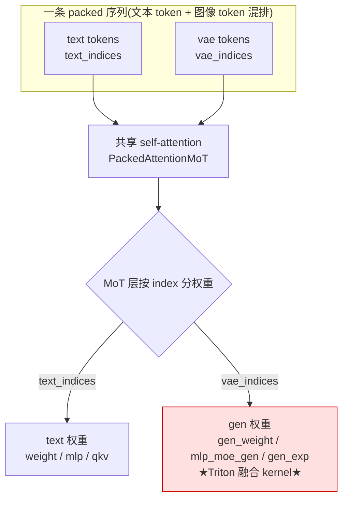
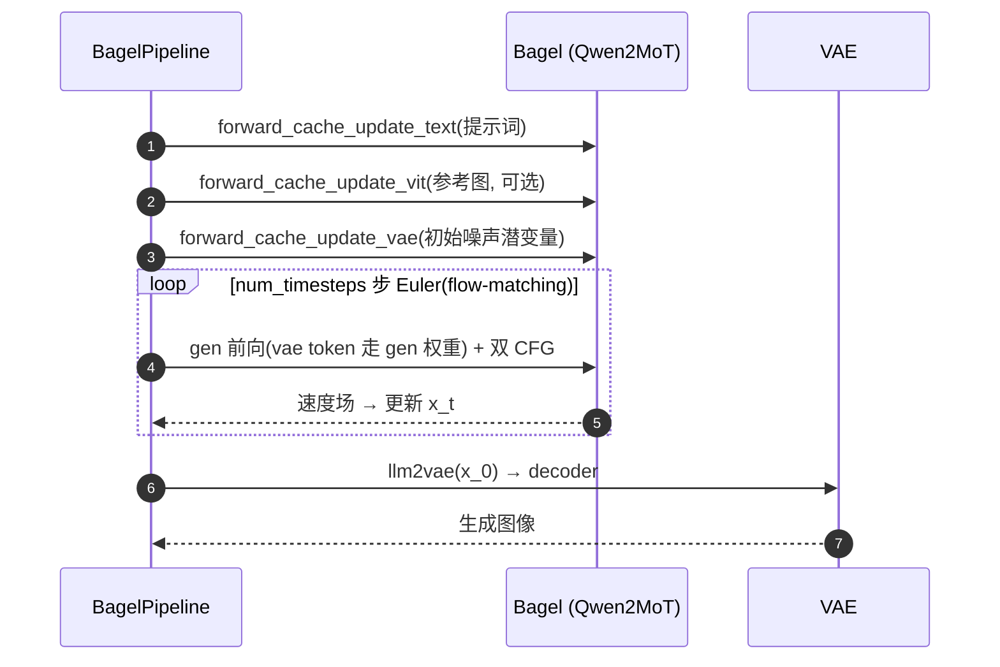

---
tags:
  - vllm-omni
  - BAGEL
  - MoT
  - diffusion
  - 多模态
  - 统一模型
  - 模型解剖
---

# BAGEL-7B-MoT 模型解剖：统一理解+生成，及它在 omni 里怎么跑

> 一个问题：**ByteDance-Seed/BAGEL-7B-MoT 是个什么模型?它的 MoT 结构是什么?在 vllm-omni 里由哪些组件承载、一次图像生成怎么流转?** 顺带把「模型结构如何决定了 NPU 适配的落点」讲清。
>
> 本文基于 omni 里 BAGEL 的**实际实现**(`vllm_omni/diffusion/models/bagel/`)。类名/行号对照源码,可能随版本漂移。配套:[Diffusion 注意力后端全貌](diffusion-attention-backend.md)、[DiT 是什么](../generative-basics/dit.md)。

## 结论速览

- **BAGEL = 一个 Qwen2 骨干,用 MoT 双权重把「理解(ViT+文本)」和「生成(VAE+flow-matching)」缝进同一条序列。** 一个模型同时干图→文和文→图。
- **MoT(Mixture-of-Transformers)= 每层持两套权重**(text / gen),按 `text_indices`/`vae_indices` 路由;**注意力共享,norm/FFN/投影按 token 类型分权重**。
- 在 omni 里它跑在 **diffusion worker**(不是 AR/LLM worker),入口是 `BagelPipeline`。
- **NPU 适配的本质**:und(理解)模式退化成普通 Qwen2、基本免费;**gen(生成)模式走 Triton 融合算子(`mot_rms_norm`/`mot_gemm`)——这才是 NPU 上要补的**。

---

## 一、MoT 架构核心(这是理解 BAGEL 的钥匙)

不同于普通 transformer 每层一套权重,MoT **每层持两套**,按 token 类型路由:

| 部件 | text 权重 | gen/vae 权重 | 路由依据 |
|---|---|---|---|
| RMSNorm | `self.weight` | `self.gen_weight` | `text_indices` / `vae_indices` |
| QKV / O 投影 | 父类 text 权重 | `self.gen_exp` | 同上 |
| FFN(gate/up/down) | `self.mlp` | `self.mlp_moe_gen` | 同上 |

**注意力是共享的**——所有 token(文本+图像)一起 attend;只有 **norm / FFN / 投影** 按 token 类型分权重。这就是为什么每个 MoT 层都收 `(x, text_indices, vae_indices)` 三个参数。

承载 MoT 的三个自定义层(`vllm_omni/diffusion/layers/mot/`):

| 层 | 类 | 作用 |
|---|---|---|
| norm | `MoTRMSNorm` | q/k norm + 各 layernorm |
| qkv/o 投影 | `MoTQKVParallelLinear` / `MoTRowParallelLinear` | 注意力投影、FFN |
| gen 融合 kernel | `ops/mot_rms_norm.py`、`ops/mot_gemm.py` | Triton,text/gen 权重一次 gather-matmul-scatter |

---

## 二、und vs gen:两种模式(直接决定 NPU 兼容性)

| | **und 模式** | **gen 模式** |
|---|---|---|
| 触发 | `text_indices is None` | 提供 text/vae indices |
| 行为 | 所有 token 走 text 权重 → **退化成普通 Qwen2** | text→text 权重、vae→gen 权重 |
| 实现 | 复用父类 / `forward_native` | **Triton 融合 kernel** |
| 用途 | 理解 / 文本 | 图像生成 |
| NPU | 大概率已能跑 | **崩在这**(Triton 专用) |

代码里的分叉:`PackedAttentionMoT._forward_und`(`bagel_transformer.py:657`)vs `_forward_gen`(`:502`)。

> 一句话:**BAGEL 的核心卖点(图像生成)恰恰全压在 Triton 上**,所以 NPU 适配 = 让 gen 模式跑起来,und 模式几乎免费。

---

## 三、三条 token 流 / 三个编码器

BAGEL 把三种东西 pack 成一条序列,喂给同一个 Qwen2 骨干:

| 流 | 来源 | 入 LLM 路径 | 用途 |
|---|---|---|---|
| **text** | `embed_tokens`(Qwen2) | 直接 embedding | 提示词 / 理解输出 |
| **VAE(生成)** | VAE 编码图像潜变量(`autoencoder.py::DistributedAutoEncoder`) | `vae2llm` 投影 + timestep embed + pos embed | 要去噪的图像 token |
| **ViT(理解)** | SigLIP ViT(`pipeline_bagel.py::SiglipNaViTWrapper`) | `connector`(MLPconnector)投影 | 输入参考图的理解 |

生成出的 token 再经 `llm2vae` → VAE decoder → 出图。三个投影 `vae2llm` / `llm2vae` / `connector` 是「模态↔LLM 空间」的胶水。

---

## 四、生成流程:LLM 潜空间里的 flow-matching + 双 CFG

主体是 `Bagel(CFGParallelMixin).generate_image()`(`bagel_transformer.py:1781`),一个 **flow-matching 去噪循环**(不是 DDPM):

1. **建 KV cache(分三步)**——把上下文缓存好,去噪循环针对它生成:
   - `forward_cache_update_text` — 提示词
   - `forward_cache_update_vit` — 参考图(理解)
   - `forward_cache_update_vae` — 图像潜变量(生成上下文)
2. **去噪循环**:`num_timesteps` 步 Euler,`TimestepEmbedder` + `timestep_shift`;每步对 vae token 走 gen 权重前向,预测速度场,更新 `x_t`。
3. **双 CFG**:`cfg_text_scale`(文本引导)+ `cfg_img_scale`(图像引导)+ `cfg_interval`/`cfg_renorm`——这是要 `CFGParallelMixin` 的原因(并行跑 cond/uncond 分支)。
4. **出图**:最终 latent 经 `llm2vae` → VAE decoder。

默认生成参数见 `pipeline_bagel.py::BagelGenParams`(`num_timesteps=50`、`timestep_shift=3.0`、`cfg_text_scale=4.0`、`cfg_img_scale=1.5`…)。

---

## 五、组件全景(类 → 职责)

| 类 | 文件:行 | 职责 |
|---|---|---|
| `BagelPipeline` | `pipeline_bagel.py:153` | diffusion 引擎入口;组件发现;跑在 diffusion worker |
| `Bagel(CFGParallelMixin)` | `bagel_transformer.py:1250` | 顶层:cache 更新 + `generate_image` 去噪循环 |
| `Qwen2MoTForCausalLM` | `bagel_transformer.py:1006` | Qwen2 骨干(MoT 版) |
| `PackedAttentionMoT` | `bagel_transformer.py:423` | 共享注意力 + MoT 投影;`_forward_und`/`_forward_gen` |
| `BagelMLP` | `bagel_transformer.py:213` | MoT FFN(text 用 `mlp`,gen 用 `mlp_moe_gen`) |
| `DistributedAutoEncoder` | `autoencoder.py:337` | 图像 VAE(编码潜变量 / 解码出图) |
| `SiglipNaViTWrapper` | `pipeline_bagel.py:125` | 理解侧 SigLIP ViT |
| `TimestepEmbedder` / `PositionEmbedding` | `bagel_transformer.py:1205` / `1225` | flow-matching 时间步 / 潜变量位置 |
| `NaiveCache` | `bagel_transformer.py:326` | 分请求 KV cache(gen 模式要按请求切分) |
| `MoTRMSNorm` / `MoTQKV/RowParallelLinear` | `layers/mot/` | MoT 双权重算子(**NPU 适配落点**) |

配置三份:`config.json`(顶层)+ `llm_config.json`(`Qwen2MoTConfig`)+ `vit_config.json`(`SiglipVisionConfig`)。

---

## 六、回到 NPU 适配:模型结构如何决定落点

把「墙」和「模型」对上,适配就不是盲改:

| 模型部件 | NPU 墙 | 为什么 |
|---|---|---|
| MoT norm(q/k_norm、input/post/final layernorm) | 墙 1 | gen 路径 = Triton `mot_rms_norm`,`MoTRMSNorm` 无 `forward_npu` → `NotImplementedError` |
| MoT 投影(qkv/o + FFN gate/up/down) | 墙 2 | gen 路径 = Triton `invoke_mot_gemm`(`mot_gemm.py` 还硬调 `torch.cuda.get_device_name`) |
| ViT / VAE / vae2llm 等 | 大概率没事 | 标准算子,设备无关 |

**适配本质**:把 gen 模式那几个 Triton 融合算子换成昇腾能跑的 Triton-free 路径(先纯 PyTorch gather/scatter 保正确,再谈性能)。详见配套的适配笔记(TODO)。

---

!!! info "说明"
    本文为源码阅读笔记,类名/行号以实际仓库为准。重点结构:**Qwen2 骨干 + MoT 双权重(text/gen)+ 三模态编码器(text/ViT/VAE)+ flow-matching 生成**;NPU 适配集中在 gen 模式的 Triton 算子。相关:[Diffusion 注意力后端全貌](diffusion-attention-backend.md)、[DiT](../generative-basics/dit.md)、[ViT](../generative-basics/vit.md)。
