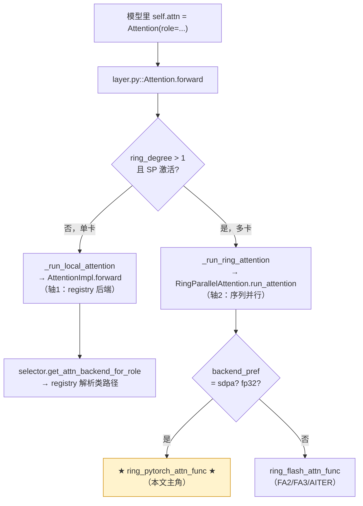

---
tags:
  - vllm-omni
  - diffusion
  - attention
  - Ring Attention
  - 序列并行
  - 架构
---

# Diffusion 注意力后端全貌：以 `ring_pytorch_attn.py` 为例

> 一个问题：**vllm-omni 的 diffusion 注意力后端是怎么组织的？** 从 `vllm_omni/diffusion/attention/backends/ring_pytorch_attn.py` 这一个文件切进去，把「选后端 → 建后端 → 跑 kernel → 多卡 ring」整条链路摊开。
>
> 本文基于 `vllm-omni` 源码（`vllm_omni/diffusion/attention/`）。类名/继承关系可靠，行号可能随版本漂移。相关阅读：[Omni 平台无关/相关解耦](platform-decoupling.md)；这里的 ring attention 正是 LLM 侧 **CP(上下文并行)** 的通信 kernel,概念见 [上下文并行 CP:PCP 与 DCP](../vllm/context-parallel-pcp-dcp.md)。

## 结论速览

`ring_pytorch_attn.py` 容易让人误会成「又一个注意力后端」，其实**它根本不在「后端注册表」那一层**。diffusion 注意力被切成**两个正交的轴**：

1. **单卡算子轴（backend）**：`AttentionBackend` / `AttentionImpl` + 枚举注册表（`FLASH_ATTN` / `TORCH_SDPA` / `SAGE_ATTN`…），决定「这一层 attention 用哪个 kernel、在哪个硬件上跑」。
2. **多卡序列并行轴（parallel strategy）**：`RingParallelAttention` / `UlyssesParallelAttention`，决定「序列被切到多卡后怎么拼回来」。

**`ring_pytorch_attn_func` 属于第 2 轴**——它是 Ring Attention 在「没有 FlashAttention、只能用 PyTorch SDPA」时的那个具体 ring kernel。理解全貌的关键就是先把这两轴分开看，再看 `layer.py::Attention` 怎么把它们缝在一起。



---

## 一、轴 1：单卡后端注册表（`ring_pytorch_attn` 不在这里）

这是「正常」的后端体系，三个文件构成：

### `registry.py` —— 枚举即类路径 + 可覆盖

```python
class DiffusionAttentionBackendEnum(Enum):
    FLASH_ATTN      = "vllm_omni.diffusion.attention.backends.flash_attn.FlashAttentionBackend"
    TORCH_SDPA      = "vllm_omni.diffusion.attention.backends.sdpa.SDPABackend"
    SAGE_ATTN       = "...sage_attn.SageAttentionBackend"
    CUDNN_ATTN      = "...cudnn_attn.CuDNNAttentionBackend"
    FLASHINFER_ATTN = "...flashinfer_attn.FlashInferAttentionBackend"
    # 注意：这里没有任何 ring_* 条目
```

- **枚举值就是「全限定类路径字符串」**，`get_class()` 用 `resolve_obj_by_qualname()` 动态加载。与上游 vLLM 的 `AttentionBackendEnum` 同构。
- `register_diffusion_backend()` 提供**运行时覆盖**（写进 `_DIFFUSION_ATTN_OVERRIDES`），平台插件（如昇腾）可以把 `ASCEND_ATTN` 指到自己的实现，无需改这张表——这正是 [平台解耦笔记](platform-decoupling.md) 里推崇的「注册表 + 单点分派」形态。

### `abstract.py` —— 后端的两个抽象类

| 类 | 职责 |
|---|---|
| `AttentionBackend` | 元信息工厂：`get_name()` / `get_impl_cls()` / `get_metadata_cls()` / `get_supported_head_sizes()`。 |
| `AttentionImpl` | 真正干活的实现，构造时拿 `num_heads/head_size/softmax_scale/causal…`。 |

`AttentionImpl.forward()` 里有一处**平台分派**（和上游 CustomOp 同款写法）：

```python
def forward(self, q, k, v, attn_metadata=None):
    if   current_omni_platform.is_rocm(): return self.forward_hip(...)   # 默认转 cuda
    elif current_omni_platform.is_cuda(): return self.forward_cuda(...)
    elif current_omni_platform.is_npu():  return self.forward_npu(...)
    elif current_omni_platform.is_xpu():  return self.forward_xpu(...)
    elif current_omni_platform.is_musa(): return self.forward_musa(...)  # 默认转 cuda
```

`forward_hip` / `forward_musa` 默认回退到 `forward_cuda`（"HIP/MUSA ops 与 CUDA 兼容"），这是二等公民复用一等公民的常见手法。KV-cache 量化支持也声明在这里（`_supported_kv_cache_dtypes` 按平台 key 分集合）。

### `selector.py` —— 按 role 解析后端

`get_attn_backend_for_role(role, head_size, attention_config, role_category)` 的优先级：

```
1. attention_config.per_role[role]        # 精确：如 "ltx2.audio_to_video"
2. attention_config.per_role[role_category]# 类别回退：如 "cross"
3. attention_config.default               # 全局默认
4. 平台默认 get_diffusion_attn_backend_cls # 硬件相关（经 OmniPlatform hook）
```

> 这就是 omni 比上游多出来的维度：**同一个模型里不同 role 的 attention（self / cross / joint）可以走不同后端**。解析结果用 `@cache` 按 `(backend_name, head_size)` 缓存，避免重复打日志和重复做能力校验。

---

## 二、轴 2：序列并行（`ring_pytorch_attn` 的真正归属）

当 `parallel_config.ring_degree > 1`，序列维被切到多张卡，单卡 kernel 不够用了——需要 **Ring Attention**：每张卡只持有一段 K/V，靠 P2P 把 K/V「传成一圈」，边收边算，用 online-softmax 累积。

### `parallel/ring.py::RingParallelAttention` —— 策略层

`run_attention()` 在这里做**第二次后端选择**（注意：与轴 1 的 registry 完全独立）：

```python
# fp32 不被 Flash 支持 → 强制 sdpa；没有任何 FA → 强制 sdpa
if query.dtype == torch.float32: backend_pref = "sdpa"
elif not HAS_FA3 and not HAS_FLASH_ATTN and not HAS_AITER: backend_pref = "sdpa"

if backend_pref in {"sdpa", "torch", "torch_sdpa"}:
    from ...ring_pytorch_attn import ring_pytorch_attn_func   # ← 本文主角
    return ring_pytorch_attn_func(...)

from ...ring_flash_attn import ring_flash_attn_func           # FA3 > AITER > FA2
return ring_flash_attn_func(...)
```

策略层还负责 **joint tensor**（diffusion 特有：文本条件 token 作为可见前缀拼到图像 token 上）的 `pre_attention` 拼接 / `post_attention` 还原。Ring 的特殊处理：`joint_query` 在 `pre_attention` 里就 cat 进 query，但 **`joint_key/value` 不 cat**，而是留在 metadata 里交给 ring kernel 当「每步都可见的静态前缀」。

### `ring_pytorch_attn.py` —— 主角逐行拆解

它就一个 `torch.autograd.Function`（**inference-only，无 backward**），核心是 ring 循环：

```python
comm = RingComm(group)                 # P2P 环：send→(rank+1), recv←(rank-1)
for step in range(comm.world_size):
    if step + 1 != world_size:         # 还没转完一圈，先把本地 K/V 发给下一个 rank
        next_k = comm.send_recv(k); next_v = comm.send_recv(v); comm.commit()

    if not is_causal or step <= comm.rank:        # causal 时只算「该看见」的那些 step
        step_k, step_v = k, v
        if step == 0 and joint_tensor_key is not None:   # joint 前缀只在第 0 步拼一次
            step_k = cat([joint_k, step_k]) / cat([step_k, joint_k])  # front/rear
        block_out, block_lse = pytorch_attn_forward(q, step_k, step_v, causal=is_causal and step==0)
        out, lse = update_out_and_lse(out, lse, block_out, block_lse)  # online softmax 累积

    if step + 1 != world_size:
        comm.wait(); k = next_k; v = next_v          # 收下下一段 K/V，进入下一步
```

三个配套零件：

| 零件 | 文件 | 作用 |
|---|---|---|
| `pytorch_attn_forward` | `ring/ring_kernels.py` | 单段 SDPA：直接调 `torch.ops.aten._scaled_dot_product_{flash,efficient}_attention`，**返回 `(out, lse)`**——ring 累积必须拿到 LSE。内含 Volta(sm<8) bf16→fp16 兜底、MUSA 专用算子替换。 |
| `update_out_and_lse` | `ring/ring_utils.py` | online-softmax 合并：`out -= sigmoid(block_lse-lse)*(out-block_out)`；LSE 全程留 fp32 防 NaN。一大坨代码在做 `(B,H,S)` vs `(B,S,H)` 的形状纠偏。 |
| `RingComm` | `distributed/comm.py` | 环形 P2P：`send_rank=(rank+1)%ws`，`recv_rank=(rank-1)%ws`，`commit/wait` 包 `batch_isend_irecv`，把通信和计算 overlap。 |

> **为什么单独有个 pytorch 版？** FlashAttention 系（FA2/FA3/AITER）走 `ring_flash_attn.py`；但 fp32、或环境里压根没装 FA 时，必须有一个**纯 PyTorch SDPA 的 ring 兜底**，这就是 `ring_pytorch_attn`。它和 `ring_flash_attn` 是「同一个 ring 骨架、换了内层单段 kernel」的关系。

### Ring vs Ulysses（轴 2 内部还分两种）

`parallel/` 下并列两种序列并行策略，由 `build_parallel_attention_strategy()` / `factory.py` 装配：

- **Ring**：K/V 绕环传，online-softmax 累积。省显存、对 head 数无要求；通信步数 = world_size。
- **Ulysses**：靠 AllToAll 把「序列切分」换成「head 切分」，算完再换回来。通信少但要求 head 能整除卡数。
- **NoParallel**：SP 未激活区域（如 Z-Image 的 refiner 段）的退化策略。

注：KV 量化与 ring **互斥**（`layer.py:180` 直接报错）——ring kernel 不传量化 descale 因子，要量化得用 Ulysses。

---

## 三、`layer.py::Attention` —— 两轴的缝合点

模型里写的 `self.attn = Attention(role="self", ...)`，构造时同时备好两轴：

```python
# 轴1：解析单卡后端 + 实例化 impl + 永远备一个 SDPA fallback（给 fp32）
attn_backend_cls, spec = get_attn_backend_for_role(role, head_size, attention_config, role_category)
self.attention   = attn_backend_cls.get_impl_cls()(...)
self.sdpa_fallback = SDPABackend.get_impl_cls()(...)

# 轴2：ring_degree>1 时备 ring runner
if config.parallel_config.ring_degree > 1:
    self.ring_runner = RingParallelAttention(get_sp_group(), attn_backend_pref=self.backend_pref)
```

`forward` 的三段式（`_forward_impl`）：

```python
strategy = self._get_active_parallel_strategy()           # SP 没激活就用 NoParallel
q,k,v,meta,ctx = strategy.pre_attention(q,k,v,meta)        # 1. 通信/重排（Ulysses AllToAll / Ring 拼 joint_q）
meta = self._with_kv_cache_dtype(meta)                     #    注入 KV 量化 dtype
if self.use_ring and strategy is not no_parallel:
    out = self._run_ring_attention(q,k,v,meta)            # 2a. 走轴2 ring → ring_pytorch/flash
else:
    out = self._run_local_attention(q,k,v,meta)          # 2b. 走轴1 单卡 impl（fp32 自动降级到 sdpa_fallback）
out = strategy.post_attention(out, ctx)                    # 3. 反向通信（Ulysses AllToAll 回去）
```

`_get_active_parallel_strategy` 是个细节亮点：同一层 attention 在「SP sharded 区域内」用并行策略，在区域外（refiner 等）自动退回 `NoParallel`，避免无谓的 SP 通信。

---

## 四、一次 ring SDPA 注意力的完整调用栈

把全貌串成一条线（`ring_degree>1` 且无 FA / fp32 的场景）：

```
model.forward
└─ Attention.forward (layer.py)
   └─ _forward_impl
      ├─ RingParallelAttention.pre_attention      # 拼 joint_query
      ├─ _run_ring_attention
      │  └─ RingParallelAttention.run_attention   # backend_pref→sdpa
      │     └─ ring_pytorch_attn_func             # ★ 本文主角
      │        └─ RingAttentionFunc.apply
      │           └─ for step in world_size:
      │              ├─ RingComm.send_recv/commit/wait   # P2P 传 K/V
      │              ├─ pytorch_attn_forward             # 单段 SDPA → (out, lse)
      │              └─ update_out_and_lse               # online softmax
      └─ RingParallelAttention.post_attention     # ring 输出已正确分片，直接返回
```

---

## 五、关键文件索引

| 角色 | 文件 |
|---|---|
| 后端注册表（枚举=类路径，可覆盖） | `diffusion/attention/backends/registry.py` |
| 后端抽象（`AttentionBackend`/`AttentionImpl`，平台分派） | `diffusion/attention/backends/abstract.py` |
| 按 role 解析后端 | `diffusion/attention/selector.py` |
| 缝合两轴的 `Attention` 模块 | `diffusion/attention/layer.py` |
| **Ring SDPA kernel（本文主角）** | `diffusion/attention/backends/ring_pytorch_attn.py` |
| Ring FA kernel（FA2/FA3/AITER） | `diffusion/attention/backends/ring_flash_attn.py` |
| Ring 策略层（选 kernel + joint 处理） | `diffusion/attention/parallel/ring.py` |
| 单段 SDPA / 各家 kernel 实现 | `diffusion/attention/backends/ring/ring_kernels.py` |
| online-softmax 累积 + 形状纠偏 | `diffusion/attention/backends/ring/ring_utils.py` |
| 依赖探测（HAS_FA3/FLASHINFER/SAGE/NPU…） | `diffusion/attention/backends/ring/ring_globals.py` |
| ring kernel 选择（AttnType 枚举） | `diffusion/attention/backends/ring/ring_selector.py` |
| 环形 P2P 通信 | `diffusion/distributed/comm.py`（`RingComm`） |
| Ulysses 序列并行（对照） | `diffusion/attention/parallel/ulysses.py` |

---

!!! info "说明"
    本文为源码阅读笔记，重点在结构：**注意力被切成「单卡后端注册表」与「多卡序列并行」两条正交轴，`ring_pytorch_attn` 属于后者的 SDPA 兜底分支**。行号、依赖探测细节以实际仓库为准。相关阅读：[Omni 平台无关/相关解耦](platform-decoupling.md)、[DiT 是什么](../generative-basics/dit.md)。
