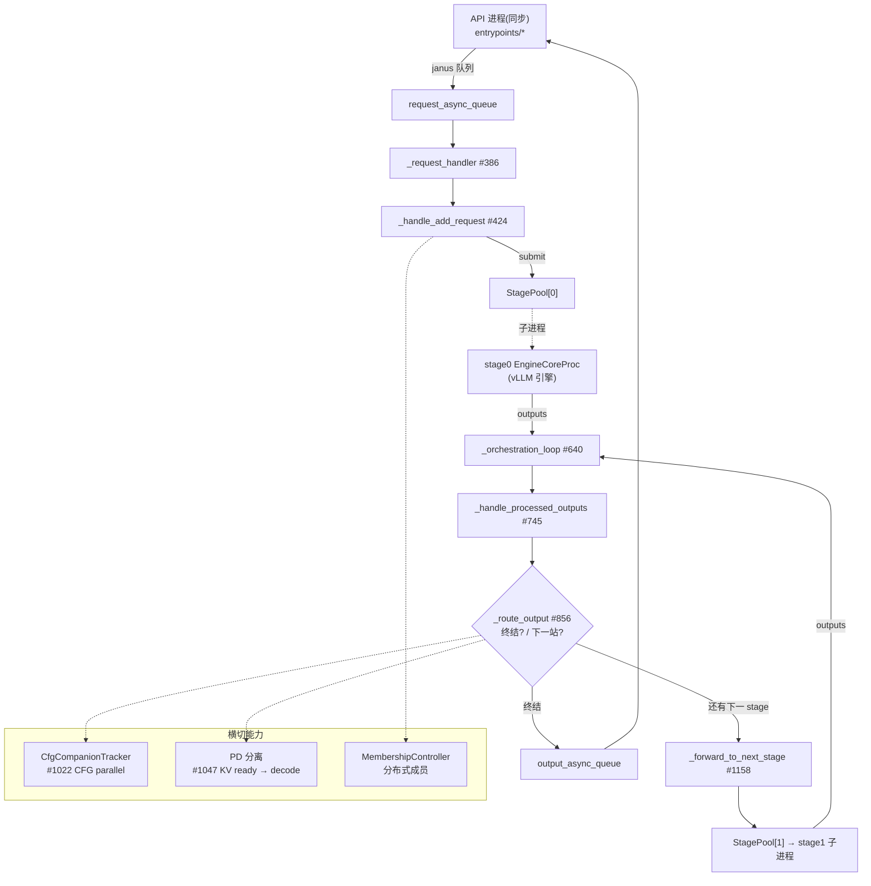

---
tags:
  - vllm-omni
  - Orchestrator
  - stage engine
  - 多 stage 编排
  - 请求路由
  - CFG parallel
  - PD 分离
---

# Orchestrator：多 stage 编排核心（omni 相对 vllm 的最大增量）

> 三问连答：① omni 的「多 stage」到底由谁驱动、跑在哪个进程？② 一个请求怎么从 stage0 被路由到 stage1、stage2…直到出结果？③ CFG companion / PD 分离 / KV 传输这些横切能力挂在编排的哪一环？
>
> 这是 [请求生命周期](request-lifecycle-end-to-end.md) 的「编排层」放大版，也是 [断点点位地图](breakpoint-map.md) 里那个「Orchestrator 线程」的源码解剖。源码 `~/git/vllm_omni/vllm-omni/vllm_omni/engine/orchestrator.py`，类名/继承可靠，行号随版本漂移。相关：[以 Qwen3-Omni 拆解核心组件与请求流转](components-request-flow.md)、[worker 类层级](worker-class-hierarchy.md)。

## 一句话定位

`Orchestrator`（`engine/orchestrator.py:202`）是 **omni 把「一个请求 → 多个 vLLM 引擎(stage)」串起来的调度中枢**。它 **不做 forward、不做 attention**，只做一件事：**把请求在 stage 之间搬运、按模态决定下一站、在末端把结果回吐给 API**。

> 类 docstring 原话：*"Runs inside a background thread's asyncio event loop."* —— 它**跑在主进程的一个后台线程的 asyncio 事件循环里**,不是独立进程。真正算力在各 stage 子进程(vLLM `EngineCoreProc`)。

⚠️ 别和这两个同名近亲搞混:
- `distributed/omni_coordinator/omni_coordinator.py:19` 的 **`OmniCoordinator`** —— 是分布式部署下用 ZMQ ROUTER/PUB 管 **replica 成员心跳** 的服务,和请求编排无关。
- `core/sched/omni_scheduling_coordinator.py:85` 的 **`OmniSchedulingCoordinator`** —— 调度层。

## 入口断点（按你 breakpoint-map 的范式，全部在主进程后台线程）

| 你要看的行为 | 入口 `file:line` |
|---|---|
| 编排线程总入口 | `engine/orchestrator.py:321` `Orchestrator.run()` |
| 从队列取请求 | `:386` `_request_handler()` |
| 新请求进入 stage0 | `:424` `_handle_add_request()` |
| 流式输入追加 | `:478` `_handle_streaming_update()` |
| **编排主循环(核心)** | `:640` `_orchestration_loop()` |
| stage 出结果后处理 | `:745` `_handle_processed_outputs()` |
| **决定下一站/是否终结** | `:856` `_route_output()` |
| 构造下一 stage 请求 | `:986` `_build_next_stage_request()` |
| **推送到下一 stage** | `:1158` `_forward_to_next_stage()` |
| CFG companion 就绪 | `:1022` `_handle_cfg_companion_ready()` |
| PD 分离:KV 就绪转 decode | `:1047` `_handle_kv_ready_raw_outputs()` / `:1078` `_build_pd_decode_params()` |
| stage 报错 / 致命错误 | `:776` `_handle_stage_error()` / `:1539` `_drain_pending_requests_on_fatal()` |

## 数据流一张图

关键结构:
- **`stage_pools: list[StagePool]`** —— 每个 stage 一个池,`num_stages = len(stage_pools)`。`StagePool` 管该 stage 的多 replica。
- **`request_states: dict[req_id → OrchestratorRequestState]`** —— 每个在飞请求当前在第几 stage、绑定了哪个 replica。
- **三条 janus 队列** —— `request_/output_/rpc_async_queue`,是**同步 API 线程 ↔ 异步编排循环**之间的桥。

## 与上游 vLLM 的 diff（沿用 EPLB 那篇的「继承/透传/改写」视角）

- vLLM 主干:一个请求 = **一个引擎** 从 prefill 跑到 decode 出 token,没有「stage 之间搬运」这一层。
- omni **新增**了 `Orchestrator` 这整层:把「LLM thinker → talker → code2wav」「text → diffusion → VAE」这类**跨引擎/跨模态流水**编排起来,每个 stage 内部仍是**原生 vLLM 引擎**(透传),编排层只在**外面**串联(改写的是「请求怎么跨引擎流动」,不是引擎内部)。
- PD 分离在 vLLM 里是引擎内/连接器的事;在 omni 里被**上提到编排层**(`_handle_kv_ready_raw_outputs` / `_build_pd_decode_params`),因为 prefill 和 decode 可能就是两个 stage。

## 一个可跑的最小例子(待填)

- [ ] 在 `examples/` 或 `recipes/` 找一个**多 stage**(如 Qwen3-Omni thinker+talker,或 diffusion 图像)用例,`serve` 起来。
- [ ] 按上表在 `_orchestration_loop #640` 和 `_route_output #856` 下断点,观察一个请求**被 `_forward_to_next_stage` 搬运几次**、每次 `stage_id` 怎么变。
- [ ] 对照 [断点点位地图](breakpoint-map.md) 确认断在了主进程后台线程而非 stage 子进程。

## Open questions(挂着,下次接着挖)

- [ ] `_route_output` 判断「下一站是谁」的依据是什么?是静态 stage 图,还是按 output_modality 动态选?(看 `engine/output_modality.py`)
- [ ] `StagePool` 怎么在多 replica 间选 replica?负载均衡策略在哪?(→ 下一篇 `stage_pool.py`)
- [ ] `async_chunk` / `_prewarm_async_chunk_stages #1419` 的预热是为哪种模态(疑似 diffusion/audio 流式)服务?
