# vLLM-Omni

记录在 vLLM 之上构建的任意模态服务框架 `vllm-omni`：多引擎/多阶段编排、平台解耦、核心组件与请求流转，以及 Qwen3-Omni 等具体模型在 NPU 上的落地。

!!! tip "先看架构地图"
    **[🗺️ vllm-omni 架构地图（核心中枢）](architecture-map.md)** 是本板块的中枢：一张分层架构总图，每层挂对应深潜笔记，并附「按问题找」的排障索引。**建议从那里进，需要细节再下钻本页目录。** 本页的"知识脉络"按*学习顺序*组织，架构地图按*系统分层*组织，两者互补。

## 知识脉络

vllm-omni 是本库笔记最密的板块。把它按"从宏观到微观、从正常路径到踩坑"分成七个主题，下图是阅读地图（建议从 ① 入手，需要细节时再下钻）：

```mermaid
flowchart TD
  ROOT["vllm-omni：vLLM 之上的任意模态服务框架"] --> OV["① 宏观全景"]
  ROOT --> PIPE["② 多阶段流水线与请求流转"]
  ROOT --> PATH["③ 输入路径与模态分叉"]
  ROOT --> CLS["④ 类结构：worker / runner"]
  ROOT --> PLAT["⑤ 平台解耦（设备层）"]
  ROOT --> GRAPH["⑥ 图捕获雷区"]
  ROOT --> DEP["⑦ HF transformers 依赖"]
  OV --> OV1["多模态全流程与类关联 ✅"]
  OV --> OV2["模块导图 ✅"]
  PIPE --> PI1["Qwen3-Omni 怎么跑起来 ✅"]
  PIPE --> PI2["核心组件与请求流转 ✅"]
  PATH --> PA1["全模态 vs 纯文本路径 ✅"]
  PATH --> PA2["P1 音频→embedding→scatter ✅"]
  PATH --> PA3["P4 Thinker→Talker 交接 ✅"]
  PATH --> PA4["Qwen3-TTS 三种音色模式 ✅"]
  PATH --> PA5["P2 视觉→emb + TMRoPE ✅"]
  CLS --> C1["三处 worker 继承梳理 + 数据流对齐契约 ✅"]
  PLAT --> PL1["平台无关/相关解耦 ✅"]
  PLAT --> PL2["platforms/npu 架构导读 ✅"]
  GRAPH --> GR1["runner 图捕获实现差异 ✅"]
  GRAPH --> GR2["嵌套图捕获 #4519 ✅"]
  GRAPH --> GR3["talker_mtp 图安全 ✅"]
  GRAPH --> GR4["is_tracing 在 NPU 失灵 ✅"]
  GRAPH --> GR5["前缀缓存缺兜底崩溃 ✅"]
  DEP --> D1["为什么依赖 transformers ✅"]
```



## 目录

> 按上面七个主题分组（随学习推进补充）。

**① 宏观全景**

- [多模态全流程与 omni 类的关联（GPU/NPU）](multimodal-runtime-overview.md) — 收口性综述，建议先读，是其余各篇的导航枢纽
- [vLLM / vllm-ascend / vllm-omni 模块导图与 Omni NPU 适配研究方向](vllm-omni-npu.md)

**② 多阶段流水线与请求流转**

- [Qwen3-Omni 在 NPU 上是怎么跑起来的](qwen3-omni-npu.md) — 三段式 Thinker→Talker→Code2Wav 与逐跳数据流
- [吃透 Qwen3-Omni：七条路径覆盖地图与阅读方法](qwen3-omni-mastery-roadmap.md) — P1–P7 覆盖地图、双代码库三角法、缺口与下一步
- [以 Qwen3-Omni 拆解核心组件与请求流转](components-request-flow.md) — engine / orchestrator / connector / scheduler

**③ 输入路径与模态分叉**

- [全模态(图/音)与纯文本用例的路径区别](multimodal-vs-text-path.md) — 分叉只在 Thinker 前段，入 backbone 即合流
- [P1 音频路径：mel→AuT→embedding→scatter（双库对照）](audio-encoder-path.md) — HF 读语义、vllm-omni 读工程，钉死占位符 scatter 与帧数对齐两处 NPU 雷点
- [P4 Thinker→Talker 交接：哪层 hidden/怎么拼/speaker](thinker-talker-handoff.md) — 接 accept_hidden_layer(=24) 非最后层，文本位/多模态位分走两条投影，speaker 查表注入
- [P2 图/视频→ViT→embedding 与 TMRoPE 时间对齐](vision-tmrope-path.md) — ViT 可黑盒，题眼是 deepstack 多尺度旁路 + `[3,B,S]`(t,h,w) 三维位置、音视频交织编号
- [Qwen3-TTS 三种音色模式：Base/VoiceDesign/CustomVoice](qwen3-tts-voice-modes.md) — 三种 speaker 来源同台：ECAPA 抽取(enc_dim) / id 查表 / 文本描述，差异集中在 codec_input 组装

**④ 类结构：worker / runner**

- [三处 worker 的职责与继承关系梳理](worker-class-hierarchy.md) — 硬件×角色矩阵、菱形继承，含 §十 数据流对齐隐式契约

**⑤ 平台解耦（设备层）**

- [Omni 平台无关/相关解耦：现状与演进](platform-decoupling.md)
- [platforms/npu 架构导读：读 vllm-omni 昇腾后端的入口地图](npu-platform-architecture.md)

**⑥ 图捕获雷区**

- [图模式在 runner 里的实现：NPU 与 GPU 差异](npu-gpu-graph-in-runner.md)
- [嵌套图捕获为什么不行（#4519）](nested-graph-capture.md)
- [talker_mtp 是什么与我们面临的问题](talker-mtp-graph-safety.md)
- [transformers 的 is_tracing 为什么在 NPU 上失灵](transformers-is-tracing-npu.md)
- [案例倒推：NPU 上 talker 因前缀缓存缺兜底而崩(6 vs 9)](npu-prefix-cache-missing.md)

**⑦ HF transformers 依赖**

- [vLLM-Omni 为什么依赖 transformers](why-depend-on-transformers.md)

**实操**

- [在 VSCode 里远程调试 Ascend 容器内的 vLLM-Omni](debug-ascend-remote.md)

**相关（其他板块）**

- [图模式：eager / PIECEWISE / FULL（概念篇）](../vllm/cudagraph-modes.md) · [EP/DP/TP/SP（从 FusedMoE 讲起）](../vllm/ep-dp-tp-sp-fused-moe.md)

另见 [碎片知识](snippets/index.md)：
- [npu_model_runner 的上游适配困境与解耦](snippets/npu-runner-decoupling.md) — 从 PR #4454 拆解三套 runner 的继承断链

## 如何新增一篇笔记

1. 在 `docs/vllm-omni/` 下新建 Markdown 文件，例如 `docs/vllm-omni/getting-started.md`
2. 在 `mkdocs.yml` 的 `nav` → `vllm-omni` 下添加一行：

   ```yaml
   - 快速开始: vllm-omni/getting-started.md
   ```

3. 本地预览：`mkdocs serve`，推送到 `main` 后自动部署
