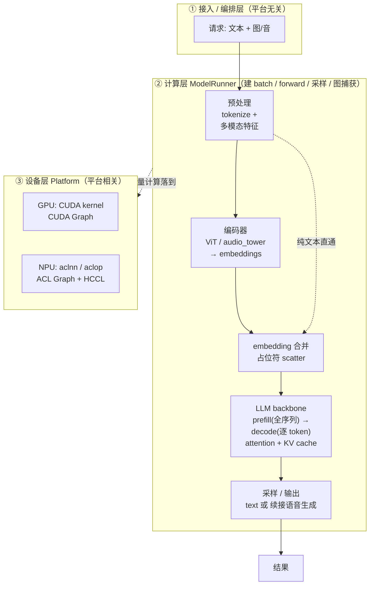
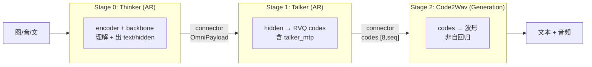
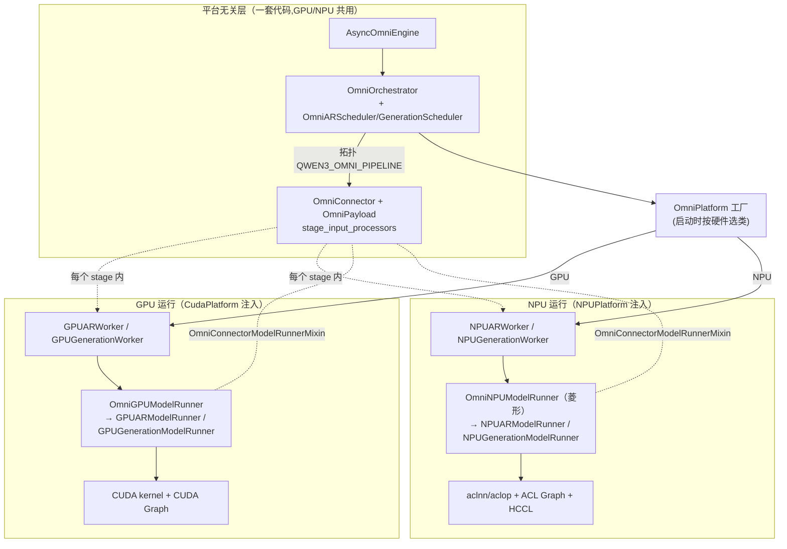

---
tags:
  - vllm
  - vllm-omni
  - vllm-ascend
  - 多模态
  - 全流程
  - 架构
  - GPU
  - NPU
---

# 多模态模型在 GPU/NPU 上的全流程,与 omni 框架类的关联

> 一个问题：**把前面的零散笔记拼起来——一个多模态模型从请求进来到结果出去,在 GPU / NPU 上宏观上到底怎么跑?omni 框架里那一堆类(engine / orchestrator / connector / worker / runner / platform)又分别卡在这条流程的哪一段?**
>
> 本文是一篇**收口性综述**,只讲宏观原理与"类↔运行位置"的对应,不深入任何单点细节——每个环节都给出指向专题笔记的链接。先看一张端到端全流程图,再把 omni 的类一层层贴上去。

## 一、宏观全流程:多模态模型在设备上怎么跑

抛开框架,任何多模态自回归模型的运行都可以抽象成**横向五段 × 纵向三层**。横向是数据经历的阶段,纵向是它落在哪一层抽象上:

三层的分工(也是后面贴类的坐标):

- **① 接入/编排层**:管"请求怎么排队、怎么在多阶段间流转"。**平台无关**。
- **② 计算层(ModelRunner)**:管"一个 forward 怎么算"——建 batch、跑前向、采样、图捕获。骨架平台无关,**底层算子/图捕获平台相关**。
- **③ 设备层(Platform)**:GPU 走 CUDA,NPU 走昇腾。**完全平台相关**,被前两层通过抽象隔离。

横向五段里,**多模态与纯文本的唯一分叉**在"预处理→编码器→合并"前段(详见 [全模态与纯文本路径区别](multimodal-vs-text-path.md)):图/音要跑 encoder 再 scatter 进占位符,文本直通 `embed_tokens`;**过了合并点,backbone 之后两者同构**。

## 二、omni 的现实:把"一个模型"拆成三段流水线

上面是通用单模型视角。omni(以 Qwen3-Omni 为例)把 backbone 之后的部分**拆成三个独立 stage,各自是一个带 worker/runner 的"模型"**,用连接器串起来(详见 [Qwen3-Omni 在 NPU 上是怎么跑起来的](qwen3-omni-npu.md)):

关键认知:

- **横向五段图里的"encoder + backbone"主要落在 Stage 0 Thinker**;Talker/Code2Wav 是 omni 特有的"输出侧"延伸。
- **AR(自回归)vs Generation(非自回归)** 是 stage 的两种角色 —— 这正是 [worker 继承梳理](worker-class-hierarchy.md) 里 `*ARWorker` / `*GenerationWorker` 两个叶子的来历。
- **输入模态决定前段 encoder,输出模态决定后段 Talker/Code2Wav** —— 两根正交的轴。

## 三、把 omni 的类贴到流程上(关联关系)

现在把框架的类按"① 接入/编排 → ② 计算 → ③ 设备"三层对号入座。**这一节是本文的核心**。

| 层 | 类 / 组件 | 职责 | 平台相关? |
|---|---|---|---|
| **① 接入** | `AsyncOmniEngine` | 异步引擎入口,收请求发结果 | 无关 |
| **① 编排** | `OmniOrchestrator` | 多阶段协调器(asyncio 后台线程),驱动 stage 流转 | 无关 |
| **① 编排** | `OmniARScheduler` / `OmniGenerationScheduler` | 多阶段感知调度器 | 无关 |
| **① 编排** | `QWEN3_OMNI_PIPELINE` / `StagePipelineConfig` | 拓扑定义:几个 stage、谁连谁 | 无关 |
| **① 数据通路** | `OmniConnector` / `SharedMemoryConnector` + `OmniPayload` | 跨 stage 搬张量(full_payload / async_chunk) | 无关(但载荷有[隐式格式契约](worker-class-hierarchy.md)) |
| **① 数据通路** | `stage_input_processors`(`thinker2talker_*` …) | stage 间张量重打包 | 无关 |
| **②/① 桥** | `*Worker`(进程/设备层) | 持有 runner,管设备初始化、显存、KV、调度 `execute_model` | **相关**(GPU/NPU 分叉起点) |
| **②** | `*ModelRunner`(计算层) | 建 batch、forward、采样、图捕获 | 骨架无关,**底层相关** |
| **② 数据面** | `OmniConnectorModelRunnerMixin` | runner 侧统一连接器 I/O | 无关 |
| **② KV** | `OmniKVTransferManager` | KV cache 跨 stage / PD 传递 | 偏相关(打包格式) |
| **③ 设备** | `OmniPlatform`(+ 菱形继承 `CudaPlatform`/`NPUPlatform`) | 平台 hook、工厂,选择具体 worker/runner 类 | **完全相关** |
| **③ 注册** | `OmniModelRegistry` | 模型/拓扑注册 | 无关 |

读这张表的方法:**从上往下,平台无关性逐渐丧失**。①层完全不知道 GPU/NPU 的存在;到 `*Worker` 开始分叉(GPU 走 `GPUARWorker`、NPU 走 `NPUARWorker`);`*ModelRunner` 的编排骨架还是共享的(NPU 复用 GPU 的 `capture_model`),但底层算子/图捕获已彻底分家;`OmniPlatform` 这层就是纯粹的平台相关,负责在启动时**把正确的平台类工厂注入**给上层。

## 四、类↔运行位置的总关联图

把上面三层和 GPU/NPU 分叉合成一张图——**这是"omni 框架类"与"GPU/NPU 运行"的关联全貌**:

一句话读图:**上面一坨平台无关的编排,在 `OmniPlatform` 这个工厂处"分流",注入 GPU 或 NPU 的 worker→runner→设备三件套;无论分到哪边,跨 stage 的连接器与载荷格式都是同一套。**

## 五、GPU vs NPU 在这条流程上的差异点(索引)

宏观流程相同,差异集中在计算层与设备层的若干点,各有专题:

| 差异点 | 在流程的哪一段 | 详见 |
|---|---|---|
| worker 继承:NPU 直接继承 `WorkerBase`、runner 复用 `GPUModelRunner` | ②/③ 桥 | [worker 继承梳理](worker-class-hierarchy.md) |
| 菱形继承:`OmniNPUModelRunner` 同时拿 omni + 昇腾特性 | ② 计算层 | [worker 继承梳理](worker-class-hierarchy.md) |
| 图捕获:NPU 复用 GPU 编排 + monkeypatch 原语、replay 要刷参数 | ② 图捕获 | [图模式在 runner 里的实现](npu-gpu-graph-in-runner.md) |
| 多模态前段:encoder 变长形状难进图 | ② encoder | [全模态与纯文本路径区别](multimodal-vs-text-path.md) |
| HF 依赖在 NPU 的失灵(`is_tracing`) | ② backbone/掩码 | [is_tracing 在 NPU 失灵](transformers-is-tracing-npu.md) |
| 嵌套图 / talker_mtp 不可图算子 | ② Talker 段 | [嵌套图捕获](nested-graph-capture.md) · [talker_mtp 图安全](talker-mtp-graph-safety.md) |
| 数据流隐式格式契约(载荷/codes/KV) | ① 数据通路 + ② | [数据流对齐契约](worker-class-hierarchy.md)（§十） |
| 平台解耦机制(hook/工厂/菱形) | ③ 设备层 | [平台无关/相关解耦](platform-decoupling.md) |

## 六、一句话总结

宏观上,多模态模型的运行是**横向五段(预处理→编码→合并→backbone→输出)× 纵向三层(编排/计算/设备)**;omni 把 backbone 之后拆成 Thinker→Talker→Code2Wav 三段流水线。框架的类按三层对号入座:**编排层(engine/orchestrator/connector)完全平台无关,`*Worker` 是 GPU/NPU 分叉的起点,`*ModelRunner` 共享骨架但底层分家,`OmniPlatform` 是纯平台相关的工厂**。整张图的精髓:**一套平台无关的编排,在 OmniPlatform 处分流到 GPU/NPU 的 worker→runner→设备三件套,而跨 stage 的数据通路始终是同一套。**

## 关键文件 / 延伸阅读

- 总览:[Qwen3-Omni 在 NPU 上是怎么跑起来的](qwen3-omni-npu.md) · [核心组件与请求流转](components-request-flow.md) · [模块导图](vllm-omni-npu.md)
- 路径分叉:[全模态与纯文本路径区别](multimodal-vs-text-path.md)
- 类结构:[三处 worker 的职责与继承关系梳理](worker-class-hierarchy.md)
- 设备层:[平台无关/相关解耦](platform-decoupling.md) · [platforms/npu 架构导读](npu-platform-architecture.md)
- 图模式:[概念篇](../vllm/cudagraph-modes.md) · [runner 实现差异](npu-gpu-graph-in-runner.md)
