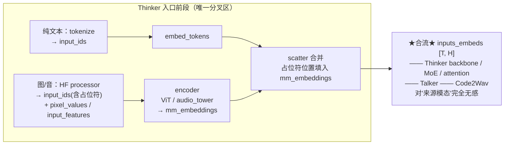

---
tags:
  - vllm
  - vllm-omni
  - Qwen3-Omni
  - 多模态
  - 全模态
  - encoder
  - mrope
  - 请求流转
---

# 全模态(图/音)与纯文本用例的路径区别——以 Qwen3-Omni 为例

> 一个问题：**给 Qwen3-Omni 喂一段文字、和喂一张图 / 一段音频,在 vllm-omni 内部走的路径差在哪?差异从哪儿开始,又到哪儿就合流了?**
>
> 三段式流水线(Thinker → Talker → Code2Wav)与跨 stage 流转,前文 [Qwen3-Omni 在 NPU 上是怎么跑起来的](qwen3-omni-npu.md)、[核心组件与请求流转](components-request-flow.md) 已经讲透。本文不重复,只盯一件事:**输入模态的不同,具体让哪一段路径分叉**。结论会有点反直觉——**分叉范围比想象中小得多**。

## 一、先给结论:前段分叉,入 backbone 即合流

把一次请求的处理从左到右铺开,文字与图/音的路径差异**只集中在 Thinker 的最前段**(预处理 → 编码器 → embedding 合并)。一旦拼出 `inputs_embeds` 进入 LLM 主干,后面**完全是同一条路**:



记住这张图的两个判断,后面都是展开:

1. **分叉点**:HF processor 的输出 + encoder 是否被调用 + embedding 怎么拼。
2. **合流点**:`inputs_embeds` 一旦成型,主干、Talker、Code2Wav 看到的都只是张量,**不知道也不关心**它来自文字还是图/音。

## 二、纯文本路径:几乎"无事发生"

文本是最短路径:

```
prompt 文本 ──tokenize──► input_ids [T] ──embed_tokens──► inputs_embeds [T, H] ──► backbone
```

- 没有 HF 的多模态 processor,只走 tokenizer。
- 没有任何 encoder 被调用(ViT / audio_tower 全程不参与)。
- `MultiModalKwargs` 为空,vLLM 的 encoder cache、占位符展开逻辑全部跳过。
- 位置编码:走普通 RoPE 的一维位置(下文 §五 会讲这里其实仍有个隐藏分叉)。

一句话:纯文本就是普通 LLM 的 prefill+decode,**omni 的多模态机制对它几乎透明**。

## 三、图/音路径:三步额外动作

多模态输入在进 backbone 前多做三件事,这三件就是路径差异的全部来源。

### 3.1 预处理:processor 产出"占位符 + 原始特征"

HF 的 `Qwen3OmniMoeProcessor`(底层含 `WhisperFeatureExtractor` 等)把多模态输入拆成两部分:

```
图：image            ──► pixel_values + image_grid_thw   ＋ 在 input_ids 里插入 <|image_pad|> 占位符
音：audio waveform   ──► input_features + feature_mask   ＋ 在 input_ids 里插入 <|audio_pad|> 占位符
文：text             ──► 正常 token id
```

关键:**input_ids 里出现一串占位符 token**,数量 = 该图/音将来要展开成的 embedding 个数(图按 `grid_thw` 决定,音按帧数决定)。这串占位符是后面"往哪填 encoder 输出"的坐标。

### 3.2 编码器:只有这一步真正"看见"原始模态

vLLM 的标准多模态模型接口 `get_multimodal_embeddings()` 在 Thinker 内被调用,把原始特征过编码器:

```
pixel_values     ──► Qwen3Omni_VisionTransformer (ViT) ──► 图 embeddings [n_img_tok, H]
input_features   ──► audio_tower                        ──► 音 embeddings [n_aud_tok, H]
```

- **这是整个全模态用例里唯一处理"非文本原始信号"的地方**。过了这里,一切都变成 `[*, H]` 的 embedding,和文本 embedding 同构。
- encoder 的输入形状**高度可变**(图分辨率、音频时长各不同)→ 这是后面计算/图捕获差异的根源(§六)。
- vLLM 用 **encoder cache** 缓存这些 mm_embeddings(按 mm_hash 索引),保证 [chunked prefill](../vllm/cudagraph-modes.md) 跨 chunk 时**不重复跑 encoder**——文本路径没有这层缓存,因为根本不需要。

### 3.3 合并:把 encoder 输出 scatter 进占位符位置

`get_input_embeddings(input_ids, multimodal_embeddings)` 做合流前的最后一步:

```
inputs_embeds = embed_tokens(input_ids)         # 先把所有 token(含占位符)正常查表
mask = (input_ids == 占位符id)  # is_multimodal 掩码
inputs_embeds[mask] = multimodal_embeddings      # 把 encoder 输出按位置覆盖进去
```

- 文本 token 用词表 embedding,占位符位置被 encoder 输出**原地替换**。
- 输出 `inputs_embeds [T, H]` —— **此刻文字与图/音彻底同构,合流完成**。

## 四、合流之后:主干 / Talker / Code2Wav 一视同仁

过了 §三 的 scatter,后面的所有计算**不再区分模态**:

| 阶段 | 看到的输入 | 是否感知输入模态 |
|---|---|---|
| Thinker backbone(MoE / attention) | `inputs_embeds [T, H]` | **否**,就是一串 embedding |
| Thinker → Talker(`thinker2talker_*`) | hidden_states / embed | **否**,只搬张量 |
| Talker(含 talker_mtp) | 投影后的 hidden | **否** |
| Code2Wav | RVQ codes `[8, seq]` | **否** |

也就是说:**Talker 不知道这次语音是"看图说话"还是"读文回答"出来的**;它只拿到 Thinker 的 hidden,照常生成 codes。跨 stage 的 connector(`thinker2talker_full_payload` 等,见 [组件与请求流转](components-request-flow.md))对两种输入模态走的是**同一套搬运逻辑**,载荷字段都不变。

> 这解释了一个常见困惑:为什么 Talker / Code2Wav 的代码里几乎找不到"if 图 / if 音"的分支?因为模态差异在它们上游的 scatter 那一步就被抹平了。

## 五、一个隐藏分叉:M-RoPE 的位置编码

上面说"入 backbone 即完全合流",有**一个例外**值得单独点出:**位置编码**。

Qwen 系全模态用 **M-RoPE(多模态旋转位置编码)**:文本 token 是一维位置;而图/音占位符对应的是**多维位置**(时间 / 高 / 宽)。所以即便都进了 backbone:

- 纯文本:位置 id 退化为普通一维序列。
- 图/音:需要按 `grid_thw` / 帧结构算出多维 position ids,再喂给 attention 的 rope。

这个分叉**藏在 attention 内部**,不改变"inputs_embeds 同构"的事实,但它是 backbone 里唯一仍残留模态信息的地方。除此之外,MoE、FFN、norm 对两种输入完全一致。

## 六、差异落到计算与调度上:为什么多模态 prefill"更难"

路径分叉虽小,但它带来的**计算画像**差异不小,且主要压在 prefill:

| 维度 | 纯文本 | 图/音输入 |
|---|---|---|
| 额外算子 | 无 | ViT / audio_tower 前向(可观的算力) |
| prefill 序列长度 | = 文本 token 数 | 文本 + **大量视觉/音频占位符**(一张图可达上千 token) |
| 形状稳定性 | 较规整 | encoder 输入与占位符数**高度变长** |
| 图捕获 | decode 易上 FULL | encoder 段形状多变,通常 eager / [PIECEWISE](../vllm/cudagraph-modes.md);见 [嵌套图捕获为什么不行](nested-graph-capture.md) |
| 调度 | 普通 | 受 **encoder cache / mm encoder budget** 约束,chunked prefill 要兼顾 encoder 不被切碎 |

在 NPU 上还要叠一层:encoder 这类**变长、含 data-dependent 行为**的子图,正是图捕获的雷区——这与 [is_tracing 在 NPU 失灵](transformers-is-tracing-npu.md)、[talker_mtp 的不可图算子](talker-mtp-graph-safety.md) 是同一类问题在输入侧的体现。

## 七、别混淆:输入模态 ≠ 输出模态(另一根正交轴)

最后澄清一个极易混的点。本文讲的是**输入**(喂文字还是图/音)。还有一根**完全正交**的轴是**输出**(要不要语音):

```
输入模态  →  决定 §三：encoder 跑不跑、embedding 怎么拼          （Thinker 入口前段）
输出模态  →  决定 Talker / Code2Wav 启不启动                      （流水线后两段跑不跑）
```

- "看图 → 只要文字答案":走 encoder(输入是图),但**不启动 Talker/Code2Wav**(输出是文本)。
- "读文字 → 要语音回答":**不跑 encoder**(输入是文本),但**启动 Talker+Code2Wav**(输出是语音)。

所以"全模态用例"其实是两个开关的组合:**输入侧的 encoder 分叉**(§三)和**输出侧的 stage 分叉**(由请求是否要 audio 决定,见 [qwen3-omni-npu](qwen3-omni-npu.md) 三段式)。把这两根轴分开看,整条路径就不会乱。

## 八、一句话总结

文字与图/音在 Qwen3-Omni 里的路径差异,**只集中在 Thinker 入口的三步**:processor 产占位符、encoder 把原始信号变 embedding、scatter 把 embedding 填进占位符位置。过了这步 `inputs_embeds` 同构,backbone(除 M-RoPE 位置编码外)、Talker、Code2Wav 对来源模态**完全无感**。真正的代价不在"分叉的逻辑",而在多模态 prefill 带来的**变长形状与 encoder 算力**,以及它在 NPU 图捕获上的连锁麻烦。记住:**输入模态决定前段 encoder,输出模态决定后段 Talker/Code2Wav,两者正交。**

## 关键文件 / 延伸阅读

- [Qwen3-Omni 在 NPU 上是怎么跑起来的](qwen3-omni-npu.md) —— 三段式流水线与逐跳数据流
- [核心组件与请求流转](components-request-flow.md) —— connector / payload / stage 调度
- [图模式：eager / PIECEWISE / FULL](../vllm/cudagraph-modes.md) —— 为什么变长形状难进图
- [嵌套图捕获为什么不行（#4519）](nested-graph-capture.md) · [talker_mtp 与图安全](talker-mtp-graph-safety.md) —— 输出侧的图捕获雷区
