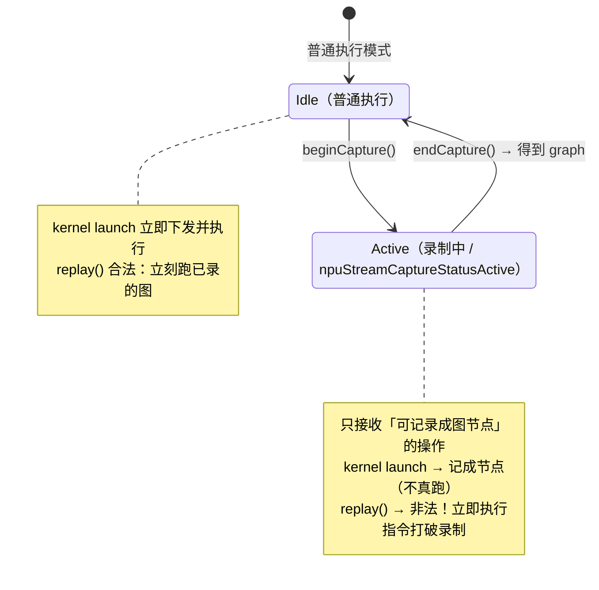
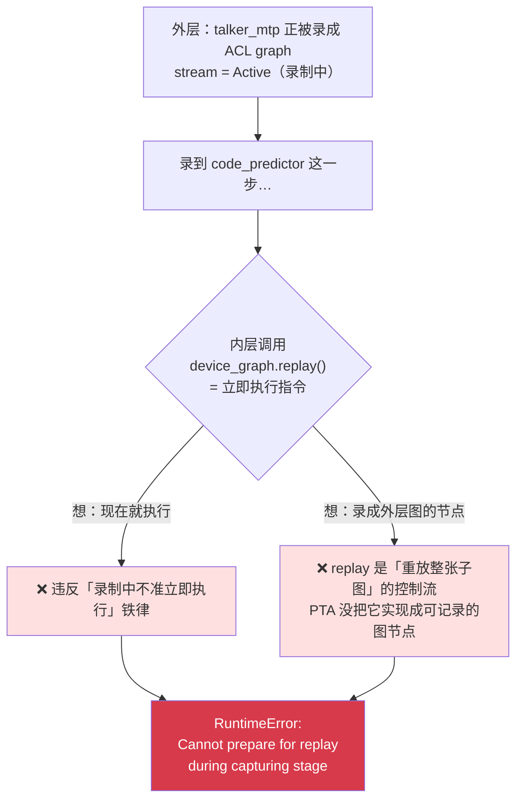
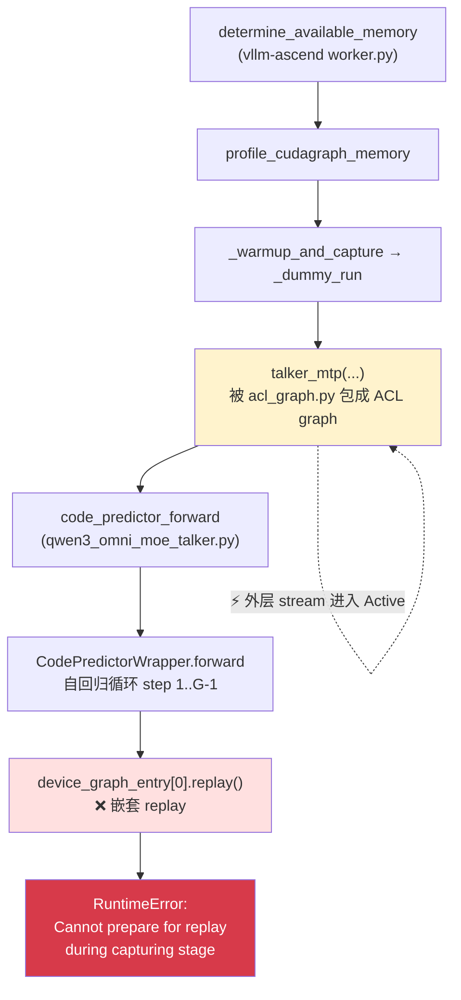
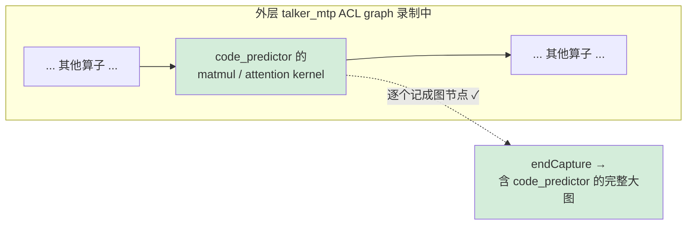

---
tags:
  - vllm-omni
  - vllm-ascend
  - CUDAGraph
  - ACLGraph
  - NPU
  - 图捕获
  - Qwen3-Omni
---

# 嵌套图捕获为什么不行（以 Qwen3-Omni NPU 崩溃 #4519 为例）

> 一个问题：**为什么在「外层正在把 talker_mtp 录成图」的时候，内层 code_predictor 调一次 `graph.replay()` 就会直接崩？**
>
> 本文从 capture / replay 的状态机讲起，拆清「录制中不准立即执行」这条铁律，再回到 vllm-omni 在昇腾 NPU 上的真实崩溃链路（issue [#4519](https://github.com/vllm-project/vllm-omni/issues/4519)），最后看「回退 eager」的修复为什么合法。基于 `vllm-omni` / `vllm-ascend` 源码核对。

## 一、Graph 的两个阶段：先画图纸，再开工

GPU/NPU 上每个 kernel 下发都要走 **host(CPU) → device** 的提交流程（调度、查 stream、校验参数、塞队列）。对又小又多的算子（如 code_predictor 这种逐 codebook 的自回归小循环），**host 侧下发开销**经常比 kernel 真正计算还长，device 在等 CPU 喂命令，出现气泡。

Graph 的解法：把一串 kernel 的下发**录成一张静态图**，之后让 device 自己按图执行，host 几乎零参与。它分两阶段：

| 阶段 | 在做什么 | host 角色 | 类比 |
|---|---|---|---|
| **Capture（捕获）** | 在一条 stream 上「走」一遍模型，但**不真算**，只把每个 kernel 的 launch 记录进 graph 对象 | 全程参与，记录拓扑 | 画施工图 |
| **Replay（重放）** | 让 device 直接执行已录好的 graph | 几乎不参与 | 按图开工 |

关键：**capture 阶段的流是「录制模式」，不是「执行模式」**。

## 二、Stream 的捕获状态机

每条 stream 有一个捕获状态，CUDA / NPU 都是这套：



当 stream 处于 `Active`（崩溃日志里的 `npuStreamCaptureStatusActive`）时，运行时有一条铁律：

> **录制中的流，只允许接收「可被记录成图节点」的操作，不允许任何「立即向 device 提交并要求执行/同步」的操作。**

因为 capture 的本质是「描述一张将来要执行的图」，不是「现在就算」。任何要求「现在就执行」的调用都会打破这个描述过程。

## 三、矛盾点：replay 是「立即执行」，capture 不许「立即执行」

`graph.replay()` 是一个**立即执行**指令——「现在就把这张已录好的图提交给 device 跑」。把它放进一条正在 capture 的 stream 里，运行时面对一个无法回答的问题：



- 当「现在执行」→ 违反铁律；
- 当「录进外层图」→ `replay()` 不是普通 kernel，而是「重放一整张子图」的控制流操作；PTA 根本没把这条 API 实现成可记录的图节点（CUDA 有 child-graph 节点概念，但走 `replay()` 这条路同样不支持）。

于是 PTA 直接拒绝：

```text
RuntimeError: Cannot prepare for replay during capturing stage.
Current npuStreamCaptureStatus: npuStreamCaptureStatusActive
```

## 四、回到 #4519：真实崩溃链路

启动时 vllm-ascend 做显存探测，会把 `talker_mtp` 整体录成 ACL graph（外层 capture 开始）；而内层 code_predictor 在自回归循环里**无条件** `replay()` 自己预捕获的 device graph —— 正好撞进上面的矛盾。



根因来自 commit `9d1392dc`（`[NPU] Support code predictor NPU graph`）：它给 code predictor 加了「自捕获 + replay」快路径，但没考虑这个 replay 可能发生在外层 warmup 捕获窗口内。CUDA 对 PIECEWISE 较宽松没暴露，NPU(PTA) 严格检查直接报错。

> code predictor 为什么要自己捕获图？因为它是逐 codebook 的小算子自回归循环，host 下发开销占比高，自捕获 replay 能省 CPU 气泡——优化本身合理，只是没料到会被嵌进外层捕获。

## 五、修复：捕获中回退到 eager，反而内联进外层图

修复是给内层 replay 加一道守卫：**外层正在 capture 时不 replay，改调普通 `model_fwd`**。

```python
# qwen3_code_predictor.py
if device_graph_entry is not None and not _is_stream_capturing():
    device_graph_entry[0].replay()      # 快路径：正常推理，无外层捕获
    hidden_out = device_graph_entry[1]
else:
    hidden_out = model_fwd(...)          # 外层捕获中 → 走 eager/compiled
```

```python
def _is_stream_capturing() -> bool:
    try:
        if current_omni_platform.is_npu():
            return bool(torch.npu.is_current_stream_capturing())
        return bool(torch.cuda.is_current_stream_capturing())
    except (AttributeError, RuntimeError):
        return False
```

为什么合法且不丢性能：`model_fwd` 内部是**一串普通 kernel launch**，而普通 launch 正是 capture 阶段唯一欢迎的东西，会被乖乖记成外层图的节点。结果 code_predictor 的算子被**内联进外层 talker_mtp 这张大图**，将来一并高速 replay。



| 时机 | `_is_stream_capturing()` | 走的路径 | 结果 |
|---|---|---|---|
| 启动 warmup（外层在 capture） | True | `model_fwd`（eager/compiled） | 算子被外层图录进去，**不崩** |
| 正常推理（无外层 capture） | False | `device_graph.replay()` | 仍走快路径，**无性能回退** |

## 六、一句话总结

> capture 是「画施工图」的阶段，只能往图上**画**节点；`replay()` 是「现在就开工执行另一张图」的命令。画图纸时喊开工，逻辑自相矛盾，被运行时禁止。CUDA 对 PIECEWISE 容忍度高没崩，NPU(PTA) 严格检查直接报错——修复就是「画图纸时别喊开工，老老实实把这段活也画进图里」。

延伸阅读：[图模式：eager / PIECEWISE / FULL](../vllm/cudagraph-modes.md) · [Qwen3-Omni 在 NPU 上是怎么跑起来的](qwen3-omni-npu.md)
