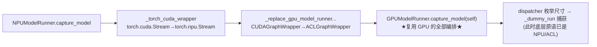

---
tags:
  - vllm
  - vllm-ascend
  - vllm-omni
  - CUDAGraph
  - ACLGraph
  - ModelRunner
  - 图模式
  - NPU
---

# 图模式在 runner 里的实现:NPU 与 GPU 的细节差异

> 一个问题：**eager / PIECEWISE / FULL 的概念清楚了(见 [图模式：eager / PIECEWISE / FULL](../vllm/cudagraph-modes.md)),但落到 model runner 里——NPU 的 ACL Graph 和 GPU 的 CUDA Graph,捕获/replay 到底是怎么实现的?差在哪?**
>
> 本文不重复概念,只看 runner 层的机械细节。核心结论先抛出来:**NPU 没有另写一套图捕获编排,而是直接复用 GPU runner 的 `capture_model`,在运行时把 CUDA 原语 monkeypatch 成 NPU 等价物。** 真正的差异收敛在四个点上,omni 在此之上再收窄一层。三处 runner 的继承关系见 [worker 继承梳理](worker-class-hierarchy.md);行号对照源码核对。

## 一、三层 runner 各管图模式的哪一段

| runner | 图模式职责 |
|---|---|
| `GPUModelRunner`(vllm) | 图捕获**编排骨架**:`capture_model` → dispatcher 枚举 capture 尺寸 → `_dummy_run` 捕获 |
| `NPUModelRunner`(vllm-ascend) | **复用骨架,替换原语**:monkeypatch 成 ACL Graph,叠加 NPU 特有的 replay 刷新 / attention 门控 |
| `OmniNPUModelRunner`(vllm-omni) | 在上面再**收窄**:当前只跑 eager / PIECEWISE;Code2Wav 生成段基本 eager |

## 二、核心手法:NPU 复用 GPU 的 `capture_model`,再 monkeypatch 原语

这是整件事最该看懂的一处。NPU 的 `capture_model` 不重写捕获逻辑,而是**包一层上下文,把 CUDA 调用偷换成 NPU 调用,再调用 GPU 的实现**(`vllm_ascend/worker/model_runner_v1.py:4962`):

```python
def capture_model(self) -> int:
    parent_module_name = _get_gpu_model_runner_module_name(self)
    with _torch_cuda_wrapper(), _replace_gpu_model_runner_function_wrapper(parent_module_name):
        cuda_graph_size = GPUModelRunner.capture_model(self)   # ← 直接调 GPU 的编排
    ...
```

两个上下文管理器干的事:

```python
# :5055 —— 把 CUDA 流类换成 NPU 流类
torch.cuda.Stream = torch.npu.Stream
# :5100 —— 把图包装器换成 ACL 版
setattr(target_module, "CUDAGraphWrapper", ACLGraphWrapper)
```



**意义**:GPU runner 那套"按 capture 尺寸枚举 → warmup → 捕获"的编排骨架,NPU 一行不改地继承;只在最底层把"用什么流、用什么图包装器"替换掉。这也是为什么 [worker 梳理](worker-class-hierarchy.md) 里 `NPUModelRunner` 要继承 `GPUModelRunner` —— 复用的就是这套编排。

## 三、差异①:捕获原语——自定义 NPU 流上下文 + ACLGraphWrapper

GPU 用 `torch.cuda.graph` + vllm 的 `graph_capture()`。NPU 自定义了一份**同名但基于 NPU 流**的上下文(`model_runner_v1.py:196-215`):

```python
@dataclass
class GraphCaptureContext:
    stream: torch.npu.Stream          # ← NPU 流,不是 CUDA 流

@contextmanager
def graph_capture(device: torch.device):
    graph_capture_context = GraphCaptureContext(torch.npu.Stream(device=device))
    ...
    with torch.npu.stream(stream), maybe_ca_context:
        yield graph_capture_context
```

模型本体则在开启 full 图时被 `ACLGraphWrapper` 包住(`:3743`),并额外建一条 `update_stream`(`:3742`)专门用于 replay 时刷新参数(见 §四):

```python
self.update_stream: torch.npu.Stream = torch.npu.Stream()    # :3742
self.model = ACLGraphWrapper(self.model, self.vllm_config, runtime_mode=CUDAGraphMode.FULL, ...)  # :3743
```

## 四、差异②:replay 不是"纯重放"——NPU 每次 forward 要刷新图参数

这是 GPU 与 NPU **最实质**的差异。

- **GPU**:图捕获后是**静态**的,replay 时输入张量地址固定,直接重放。
- **NPU**:在 FULL 图下,每次 forward **前或后**要调 `update_full_graph_params(...)` 刷新图内参数(地址、attention 元数据等),保证 replay 用到正确的张量。

实现见 `_update_full_graph_params_if_needed`(`model_runner_v1.py:2747`):

```python
def _update_full_graph_params_if_needed(self, forward_context, num_tokens_padded, positions):
    if (forward_context.cudagraph_runtime_mode == CUDAGraphMode.FULL
            and not forward_context.capturing
            and not self.use_sparse and not self.use_compress):     # ← 稀疏/压缩模型不走这条
        ...
        update_full_graph_params(self.attn_backend, self.update_stream, forward_context,
                                 num_tokens_padded, ...)            # :2762
```

调用时机还和 `enable_enpu` 有关——ENPU 下在 forward **前**刷新,否则在 forward **后**刷新(`:2796` / `:2802`)。

两个隐含约束值得记:

1. **`use_sparse` / `use_compress` 为真时不刷新** —— 即稀疏注意力 / 压缩 KV 模型**不能用 FULL 图**,会落回非 FULL 路径。
2. NPU 的"replay"实际是 **刷新参数 + replay** 的两步,比 GPU 多一层运行期开销与正确性约束。

## 五、差异③:attention 门控——AscendAttentionState vs backend 能力

谁决定 attention 进不进图、能不能 FULL?

- **GPU**:由 attention backend 自身的"是否支持被图捕获"能力决定;PIECEWISE 时把 attention 留在图外(`force_attention = (mode == FULL)`,`gpu_model_runner.py:6673`)。
- **NPU**:显式用一个状态枚举 **`AscendAttentionState`** 来 gate(`model_runner_v1.py:316`)。`_build_attn_state`(`:1518`)按批次形态判定状态:

```
PrefillNoCache / ChunkedPrefill / DecodeOnly / SpecDecoding
                         ↓
with_prefill = attn_state not in [DecodeOnly, SpecDecoding]      # :811
```

`with_prefill` 为真(含 prefill 的批)通常无法走 decode-only 的 FULL 图。也就是说,**NPU 把"能不能进 FULL 图"显式编码进了 attention 状态机**,而不是隐式交给 backend。这与 [图模式概念篇](../vllm/cudagraph-modes.md) 里"decode 批适合 FULL、prefill/混合批只能 PIECEWISE"的判断一一对应,只是 NPU 用枚举落地。

## 六、差异④:捕获尺寸要显式注册

捕获哪些 batch size,两边都来自 `cudagraph_capture_sizes`(升序),这点相同。但 NPU 多一步:**把尺寸显式注册给 ACL 图包装器**(`model_runner_v1.py:4925-4938`):

```python
capture_sizes = sorted({*cudagraph_batch_sizes, ...})
if self.use_aclgraph:
    set_graph_params(capture_sizes)                  # ← GPU 没有这步,尺寸隐式走 dispatcher
    if self.speculative_config:
        set_draft_graph_params(capture_sizes)
```

此外 NPU 还有 FIA(Full Intra-layer Attention)的 padding 约束 `_pad_query_start_loc_for_fia`(`:725`):TND 布局下,`hidden_states` 第一维必须等于 `actual_seq_lengths_q` 末元素——GPU 没有这层约束。

## 七、310P:一份独立的图契约

`_310p/model_runner_310p.py` 的类 docstring 把它和 910B 的差异写得很清楚(`:62`):

> Capture: ACLGraphWrapper records the full forward inside `torch.npu.graph`. 310P attention calls NPU ops directly (paged / splitfuse), **without** mainline `full_graph_fia` / `full_graph_pa` graph_task registration.
> Replay: refresh shared runner buffers (block_table, seq_lens, query_start_loc, slot_mapping via **CPU prepare + copy_to_gpu**) so tensor addresses stay stable, then `aclgraph.replay()`.

要点:

- **slot_mapping 走 CPU**:310P 用不了 Triton slot-mapping kernel,只能 CPU 准备再上传(`:241`)。
- **硬约束**:page attention 要求 `block_size * head_size <= 128 * 128`(`:752`),这是 310P 用 FRACTAL_NZ 格式 + CPU slot mapping 的根因。
- **直接 raise 的限制**:310P 不支持 KV transfer、稀疏注意力、MLA(各自 `raise ValueError`)。

## 八、omni 的收窄:当前只跑 eager / PIECEWISE

`OmniNPUModelRunner._dummy_run` 开头有一行注释和一句 assert(`npu_model_runner.py:73-74`):

```python
# only support eager mode and piecewise graph now
assert cudagraph_runtime_mode is None or cudagraph_runtime_mode.valid_runtime_modes()
```

这里要**精确**理解,别被注释误导:

- `valid_runtime_modes()` 返回的是 `frozenset({NONE, PIECEWISE, FULL})`(`vllm/config/compilation.py:94`)——**FULL 在里面**。所以这句 assert **并不禁止 FULL**,它只是排除 `FULL_DECODE_ONLY` / `FULL_AND_PIECEWISE` 这类**组合(dispatch 期)模式**,要求传进来的是单一 runtime 模式。
- "只支持 eager + piecewise" 是**注释表达的当前现状/意图**,真正"不跑 FULL"是由配置与 dispatcher 决定的,**不是这行 assert 强制的**(事实上该 assert 调的是返回非空集合的类方法,近乎恒真)。

至于 Code2Wav 那段:`NPUGenerationModelRunner` 继承同一个 `_dummy_run`,但生成段是非自回归、变长输出,**实践中基本只走 eager**,不捕获图。真正吃图收益的是 AR 段(Thinker / Talker)的 decode。

## 九、汇总:GPU ↔ NPU ↔ omni 的图模式实现差异

| 维度 | GPU(vllm) | NPU(vllm-ascend) | 310P | omni |
|---|---|---|---|---|
| 捕获编排 | `capture_model` 原生 | **复用 GPU 的**,monkeypatch 原语 | 同 NPU | 继承 |
| 图原语 | `torch.cuda.graph` / CUDA 流 | `torch.npu` 流 + `ACLGraphWrapper` | 同 NPU(`torch.npu.graph`) | 继承 |
| replay | 静态重放 | **每次 forward 刷 `update_full_graph_params`** | CPU 刷新 buffer + replay | 继承 |
| attention 门控 | backend 图能力 | `AscendAttentionState` 枚举 | 同 NPU,无 FIA 注册 | 同 NPU |
| 捕获尺寸 | dispatcher 隐式 | **显式 `set_graph_params`** | 同 NPU | 继承 |
| FULL 支持 | 是 | 是(非 sparse/compress) | 是 | 现状未启用(见 §八) |
| 特有限制 | — | sparse/compress 禁 FULL | block×head≤128²、CPU slot、禁 KV transfer/sparse/MLA | 生成段 eager |

## 十、一句话总结

NPU 的图模式不是"另起炉灶",而是**借 GPU runner 的编排骨架,在底层把 CUDA 原语换成 ACL 原语**(流、图包装器)。真正分叉的是四件事:NPU 每次 replay 要 `update_full_graph_params` 刷新(GPU 图是静态的)、用 `AscendAttentionState` 显式 gate FULL、捕获尺寸要 `set_graph_params` 显式注册、以及 sparse/compress/310P 的一串硬限制。omni 在此之上当前只实际启用 eager/PIECEWISE,FULL 的"未启用"来自配置与 dispatcher,而非那行常被误读的 assert。

## 关键文件 / 延伸阅读

- 概念篇:[图模式：eager / PIECEWISE / FULL](../vllm/cudagraph-modes.md)
- runner 继承关系:[三处 worker 的职责与继承关系梳理](worker-class-hierarchy.md)
- 图捕获在 NPU 的雷区:[嵌套图捕获为什么不行（#4519）](nested-graph-capture.md) · [talker_mtp 与图安全](talker-mtp-graph-safety.md) · [is_tracing 为什么在 NPU 失灵](transformers-is-tracing-npu.md)
- 源码:`vllm/v1/worker/gpu_model_runner.py`(`capture_model`/`_capture_cudagraphs`/`_dummy_run`) · `vllm_ascend/worker/model_runner_v1.py`(`graph_capture`/`capture_model`/`_update_full_graph_params_if_needed`/`_build_attn_state`) · `vllm_ascend/_310p/model_runner_310p.py` · `vllm_omni/platforms/npu/worker/npu_model_runner.py`
