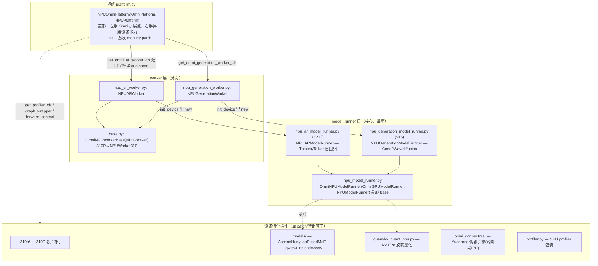

---
tags:
  - vllm-omni
  - vllm-ascend
  - NPU
  - platforms
  - 架构
  - 源码导读
---

# platforms/npu 架构导读：读 vllm-omni 昇腾后端的入口地图

> 一个问题：**`vllm-omni/vllm_omni/platforms/npu/` 这一坨是怎么组织的?从哪开始读、怎么跟代码才不迷路?**
>
> 本文基于 `vllm-omni` `main` 分支 `vllm_omni/platforms/npu/` 全量源码梳理,给一张「模块地图 + 跟读路线」。类名/方法名可靠,行号随版本漂移。相关:[Omni 平台无关/相关解耦](platform-decoupling.md)、[npu_model_runner 上游适配困境与解耦](snippets/npu-runner-decoupling.md)。

## 一句话定位

`platforms/npu` 是 **vllm-omni 的昇腾后端**：用「**平台 hook 工厂 + 菱形继承 + monkey patch**」三件套,把下层 **vllm-ascend(设备能力)** 和上层 **vllm-omni(多阶段编排)** 缝在一起。**所有东西都从 `platform.py` 这个枢纽进入。**

## 一、分层架构



各文件职责速查：

| 文件 | 角色 | 关键点 |
|---|---|---|
| `platform.py` | **入口枢纽** | hook 工厂：worker 类名 / diffusion op qualname / profiler / `ACLGraphWrapper` / `set_ascend_forward_context`；`__init__` 里跑 `apply_qwen3_tts_code2wav_patch()` + `apply_310p_patches()` |
| `worker/base.py` | worker 基类 | `OmniNPUWorkerBase(NPUWorker)`，310P 换 `NPUWorker310` |
| `worker/npu_ar_worker.py`·`npu_generation_worker.py` | 薄壳(各19行) | `(OmniWorkerMixin, OmniNPUWorkerBase)`，`init_device` 里挂对应 runner |
| `worker/npu_model_runner.py` | **runner 菱形 base** | `OmniNPUModelRunner(OmniGPUModelRunner, NPUModelRunner)`；`load_model` 走昇腾，`_model_forward` 合并两边签名(`num_tokens_padded`) |
| `worker/npu_ar_model_runner.py` | **主战场①** | Thinker/Talker；`execute_model` / `sample_tokens` / `_capture_talker_mtp_graphs`(ACL graph) |
| `worker/npu_generation_model_runner.py` | **主战场②** | Code2Wav/diffusion；`execute_model` / `_run_generation_model` / `profile_run` |
| `_310p/` | 310P 补丁 | `is_310p()` 检测 + worker/qwen3_tts talker patch + `disable_jit_compile` |
| `models/` | NPU 特化算子 | `AscendHunyuanFusedMoE`、code2wav conv2d 走 aclnn 的 runtime |
| `quant/kv_quant_npu.py` | KV 量化 | FP8 旋转量化 `fp8_rotate_quant_fa` |
| `omni_connectors/` | 跨阶段传输 | Yuanrong transfer engine(可选，import 失败置 `None`) |
| `profiler.py` | 性能分析 | `NPUTorchProfilerWrapper`，`_create_profiler` 里 `import torch_npu` |

## 二、三件套是怎么缝合的

### 1. 平台 hook 工厂（platform.py）

`NPUOmniPlatform` 不直接 new 对象，而是**返回「全限定类名字符串」让上层动态加载**：

```python
@classmethod
def get_omni_ar_worker_cls(cls) -> str:
    return "vllm_omni.platforms.npu.worker.npu_ar_worker.NPUARWorker"
```

profiler / graph wrapper / forward context 也都走这种 hook。这是 omni 平台解耦做得**干净**的部分（详见 [platform-decoupling](platform-decoupling.md) 的「三支柱」）。

### 2. 菱形继承（设备能力 × omni 逻辑）

```
NPUOmniPlatform   → OmniPlatform(扩展点)        + NPUPlatform(vllm-ascend 设备)
OmniNPUModelRunner → OmniGPUModelRunner(平台无关骨架) + NPUModelRunner(vllm-ascend 设备实现)
```

`OmniNPUModelRunner` 一边拿 omni 的多阶段骨架，一边拿昇腾的 attention/forward context/图捕获，靠 MRO 把两边方法拼起来（`load_model` 显式走 `NPUModelRunner.load_model(self, ...)`）。

### 3. monkey patch（设备特化的隐藏控制流）

`platform.py.__init__` 一被实例化就跑：

```python
apply_qwen3_tts_code2wav_patch()   # models/qwen3_tts_code2wav.py：conv2d 走 aclnn
apply_310p_patches()               # _310p/：仅当 is_310p() 时替换 worker / talker
```

> ⚠️ 这是**运行时替换**模型方法。读模型行为时若发现「代码和实际跑的对不上」，先去 `models/` 和 `_310p/patch/` 找 patch。这也是 omni 平台解耦的「泄漏点」之一——特化没走注册表，而是全局 patch。

## 三、两条必须先理顺的主线

**主线 1：菱形继承怎么读**——看懂 `super()` 落在谁身上的最快办法是打印 MRO（在 NPU 机器上，mac 因缺 `torch_npu` import 不了）：

```python
from vllm_omni.platforms.npu.worker.npu_ar_model_runner import NPUARModelRunner
print("\n".join(f"{c.__module__}.{c.__name__}" for c in NPUARModelRunner.__mro__))
```

一眼看出 `super().execute_model()` 到底落在 `OmniGPUModelRunner` 还是 `NPUModelRunner`。

**主线 2：一次请求怎么流转**

```
platform.py 被选中 (OmniPlatformEnum.NPU)
  └─ get_omni_ar_worker_cls() 返回字符串 → 动态加载 NPUARWorker
       └─ init_device() → new NPUARModelRunner
            └─ execute_model() → _model_forward()(昇腾算子) → sample_tokens()
                 └─ 产出 OmniModelRunnerOutput（字段路由坑见下方解耦笔记）
```

## 四、跟代码的具体建议

1. **对照 GPU 版读差异**：每个 NPU runner 都有 GPU 镜像 `vllm_omni/worker/gpu_ar_model_runner.py`。开两窗 diff，立刻分清「设备特化」vs「抄 GPU 的平台无关逻辑」——后者正是 [npu-runner-decoupling](snippets/npu-runner-decoupling.md) 讲的耦合点。
2. **用编辑器跳转**：`F12` 进 `OmniGPUModelRunner` 看骨架；`Go to Symbol in Workspace` 搜 `execute_model` 一次列出 GPU/NPU/XPU 三版；`Show Call Hierarchy` 看调用链。（本地跨仓库跳转配置见站点其他笔记。）
3. **patch 是隐藏控制流**：行为对不上先翻 `models/qwen3_tts_code2wav.py`、`_310p/patch/`。
4. **阅读优先级**（从枢纽往主战场）：
   `platform.py` → `worker/base.py` + 两个 worker 薄壳 → `worker/npu_model_runner.py`(base) → 按关心的阶段进 `npu_ar_model_runner.py` 或 `npu_generation_model_runner.py` → 最后按需 `quant/` `models/` `_310p/` `omni_connectors/`。

---

## 小结

| 关注点 | 落在哪 |
|---|---|
| 入口 / 平台被选中 / hook | `platform.py` |
| 进程模型 / 设备初始化 | `worker/base.py` + 两个 worker 薄壳 |
| 跑模型的主逻辑 | `worker/npu_*_model_runner.py`（菱形 base + AR/Generation 两个主战场） |
| 设备特化（芯片代次/算子/量化/传输） | `_310p/` `models/` `quant/` `omni_connectors/` |
| 隐藏控制流 | `platform.py.__init__` 触发的 monkey patch |

!!! info "说明"
    继承关系与 hook 基于 `main` 分支源码核对，行号随版本漂移，以实际仓库为准。重点是结构与跟读次序，而非逐行。
