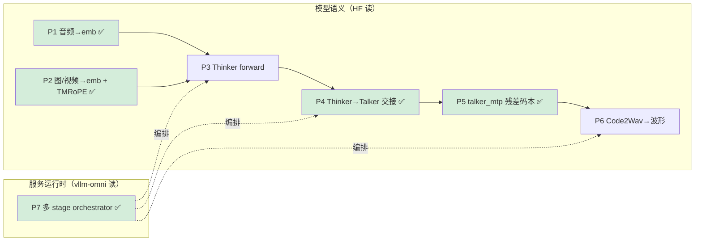

---
tags:
  - vllm-omni
  - Qwen3-Omni
  - 方法论
  - 阅读地图
  - Thinker
  - Talker
  - Code2Wav
  - TMRoPE
---

# 吃透 Qwen3-Omni：七条路径的覆盖地图与阅读方法

> 一个问题：**"吃透一个模型"到底吃透什么？** 对 Qwen3-Omni 这种多模态多阶段模型，答案是可枚举的——把它拆成有限几条数据路径 P1–P7，每条都能画出 10–20 行调用链 + 说清关键数据结构，就到头了。
>
> 本文是一张**覆盖地图（coverage map）**：标出哪条路径已在其它笔记里拿下、哪条还是缺口，并给出读"模型"（区别于读"系统"）特有的方法。运行时/NPU 落地见 [Qwen3-Omni 怎么跑起来](qwen3-omni-npu.md)，语义骨架三段式见 [talker_mtp 图安全](talker-mtp-graph-safety.md)。

## 一句话方法论

**读系统靠断点抓栈找路径；读模型多一招——双代码库三角定位：HF transformers 读语义、vllm-omni 读工程、官方 repo 对边界。精度/性能问题永远发生在这三者的 diff 缝里。** 而"吃透"不是通读权重定义，是让 P1–P7 每条路径都可画链、可复现。

## 一、把"吃透"拆成七条路径

| # | 路径（一个可跑的问题） | 现有覆盖 | 状态 |
|---|---|---|---|
| **P1** | 一段**音频**如何 mel → AuT encoder → embedding → scatter 进 Thinker 序列 | [audio-encoder-path](audio-encoder-path.md) 双库对照链已通 | ✅ 静态 |
| **P2** | 一张**图/视频**如何 ViT → embedding，以及 **TMRoPE** 怎么给音视频对齐时间戳 | [vision-tmrope-path](vision-tmrope-path.md) 双库对照链已通 | ✅ 静态 |
| **P3** | **Thinker** 前向：多模态 embedding 合并 → Qwen3-MoE backbone → text token + hidden | 宏观有，细节空白 | 🟨 半 |
| **P4** | **Thinker hidden → Talker** 交接：哪个 hidden、怎么喂、Talker 自回归产 layer-0 码 | [thinker-talker-handoff](thinker-talker-handoff.md) 双库对照链已通 | ✅ 静态 |
| **P5** | **talker_mtp / code_predictor** 产残差码本 layer 1..G-1 + summed_embedding 回喂 | [talker_mtp 图安全](talker-mtp-graph-safety.md) | ✅ |
| **P6** | **Code2Wav** 多码本 → 波形，流式 / 跨请求合批 | [tts-serving-path](tts-serving-path.md)（骨架待填） | 🟨 骨架 |
| **P7** | 上面如何被 **vllm-omni 多 stage orchestrator** 串成服务流水 | [orchestrator](engine-orchestrator.md) / [qwen3-omni-npu](qwen3-omni-npu.md) | ✅ |

> **吃透 = P1–P7 每条都能画出 10–20 行调用链 + 说清关键数据结构。** 七条路径**语义缺口已全部补齐**：P1/P2/P4/P5/P7 静态链均通（部分待真机补实测值），P3（Thinker MoE backbone）按减法当普通 LLM 黑盒、其输入输出已由 P1/P2→P4 夹住，P6 仍是骨架。剩下的活是把各链上的 `⟨待真机填⟩` 用抓栈法坐实，以及填 P6 Code2Wav 实链。

## 二、读"模型"特有招式：双代码库三角定位

读一个**系统**（vLLM 引擎）靠断点抓栈；读一个**模型**多一招——三份代码互为坐标：

- **HF `transformers`（`modeling_qwen3_omni*.py`）= 语义 ground truth。** 单文件式、无调度噪声，是数学真相：encoder 结构、TMRoPE 怎么算、Talker 怎么 condition、Code2Wav 卷积栈长什么样。**读它是为了知道"正确结果应该是什么"**——将来 NPU 精度对不齐时，这就是对照系。
- **vllm-omni = 工程/服务版。** 同一个 forward 在这里被拆成 stage、加了 KV cache / 图捕获 / 占位符 scatter。**只 diff 语义变化点**，透传部分黑盒。
- **官方 `Qwen3-Omni` repo（config + 权重命名）= 边界对齐器。** 拿来对齐两边的模块边界与命名。

> 精度问题查 HF↔vllm-omni 的 diff；边界含糊查官方 config↔两边命名。**HF 读语义，vllm-omni 读工程，官方 repo 对边界。**

## 三、必须先钉死的数据结构（比控制流值钱）

模型代码本质是把这几个对象在阶段间搬运变形，钉住它们控制流自明：

| 数据结构 | 为什么是题眼 | 属于路径 |
|---|---|---|
| **占位符 token → embedding 的 scatter 约定** | 图/音各用什么 placeholder id，`get_input_embeddings` 后怎么按 mask 塞回去；NPU 上最容易错 | P1 / P2 |
| **TMRoPE 位置张量** | 音视频时间对齐靠它，是 Qwen-Omni 区别于普通 VLM 的题眼 | P2 |
| **Thinker → Talker 传的 hidden** | 是最后一层还是特定层、拼不拼 text embedding | P4 |
| **多码本 codes 张量布局 `[G, T]`** | layer-0（Talker 产）vs layer 1..G-1（mtp 产）的边界 | P5 ✅ |
| **Code2Wav 流式状态** | 因果卷积的 cache / receptive field，决定能否低延迟出流 | P6 |

## 四、这个模型里该黑盒什么（ROI 的减法）

- Qwen3-MoE backbone 本身的 attention / MoE 实现——当成普通 LLM，除非查精度问题。
- 采样、logits processor、generation config 的常规分支。
- HF 里的 `if not use_cache` / 训练路径 / `output_attentions` 等推理无关分支。
- ViT 的 dynamic-resolution patch 细节，第一遍知道"进图出 embedding"即可。
- **⚠️ 反转规则**：我们做 NPU，`torch_npu` / ACLGraph / 平台 if-else 对别人是噪声，对我们恰恰是主线——**"重要分支"由你的问题决定**，这就是为什么第一步永远是定问题。

## 五、下一步（不是泛泛读，是补链）

1. ~~**补 P1** → 新建 `audio-encoder-path.md`~~ ✅ 已完成静态双库对照链，见 [audio-encoder-path](audio-encoder-path.md)；只剩真机补两个实测值（encoder 出口 shape、占位符帧数 vs 输出帧数）。
2. ~~**补 P4**~~ ✅ 已完成静态双库对照，见 [thinker-talker-handoff](thinker-talker-handoff.md)。结论：接的是 `accept_hidden_layer`（=24）非最后层，文本位走词嵌入+text_projection、多模态位走 layer-24+hidden_projection，speaker 是查表 id 注入。P3→P4→P5(已有) 已串上，只剩 P6 骨架转实链。
3. ~~收尾 **P2**（视觉 / TMRoPE）~~ ✅ 已完成静态双库对照，见 [vision-tmrope-path](vision-tmrope-path.md)。结论：ViT 可黑盒，题眼是 deepstack 多尺度旁路 + `[3,B,S]`(t,h,w) 三维位置、`use_audio_in_video` 音视频交织编号。至此语义缺口全部补齐。
4. **填 P6** → 把 [tts-serving-path](tts-serving-path.md) 的"待补行号 / 待画图"用抓栈法落实，在 Code2Wav batching 断点确认是否跨请求合批，骨架转实链。
5. **回填各链 `⟨待真机填⟩`**：P1(2)/P2(3)/P4(3) 的实测值，真机跑 example 抓栈坐实。

> P1+P2+P4 拿下后，Qwen3-Omni 七条路径语义缺口全部补齐，只剩 P6 骨架转实链 + 各链真机实测值回填。

## Open questions

- [ ] AuT encoder 与 Qwen2-Audio 的 Whisper-style encoder 有何结构差异？（P1 深挖，见 [audio-encoder-path](audio-encoder-path.md) 块对角窗口注意力）
- [x] TMRoPE 在 vllm-omni 里预处理算还是 runtime 算？→ **占位符交织布局预处理算、3D 位置张量运行期 MRoPE 出**（[vision-tmrope-path](vision-tmrope-path.md)）；NPU 专用 kernel 待真机确认。
- [x] Thinker→Talker 传的 hidden 是否跨 stage 走 connector？→ 目前是 `HiddenStatesStruct` CPU payload（非 KV connector），见 [thinker-talker-handoff](thinker-talker-handoff.md)；与 [跨 stage 数据面](distributed-connectors-kv.md) 的关系待并。
