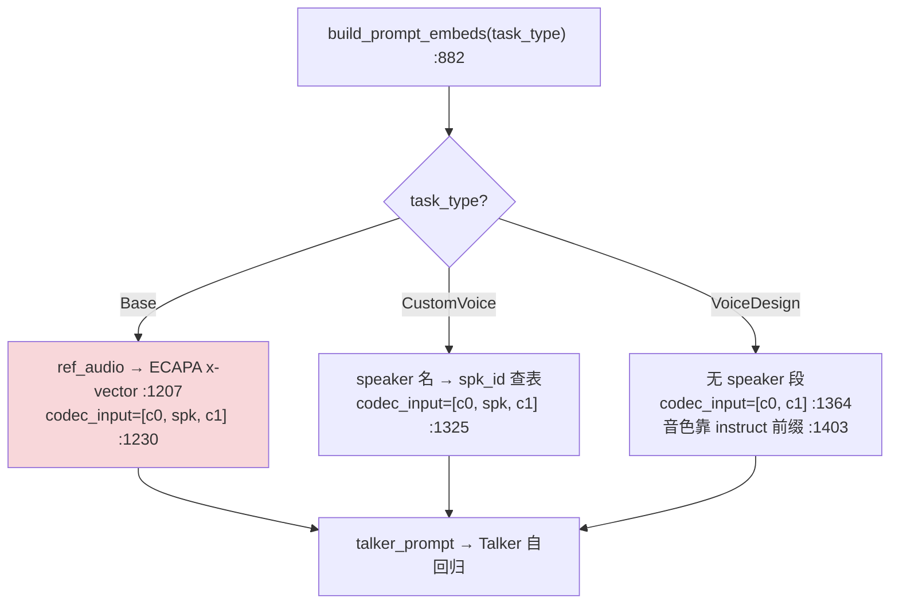
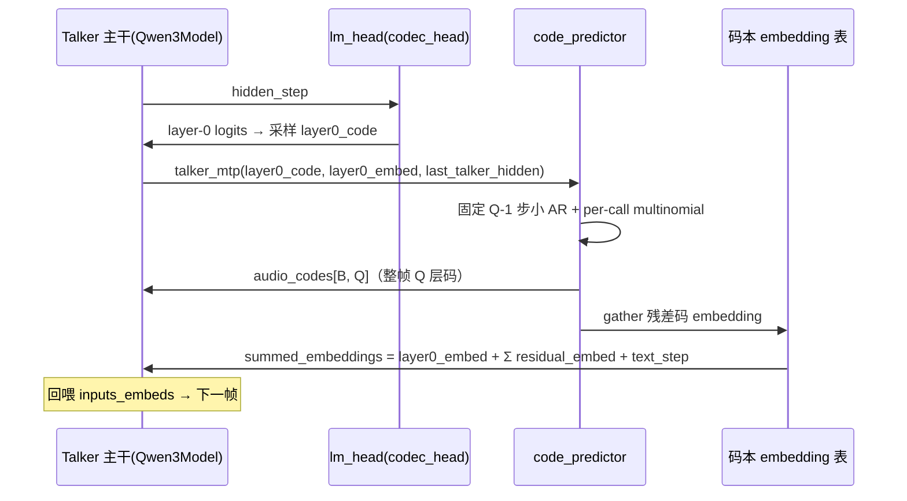
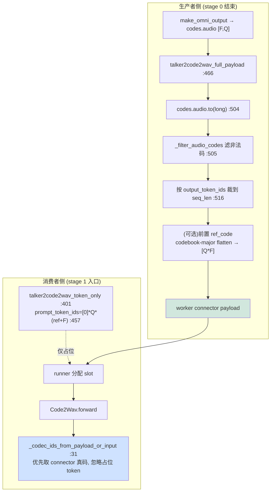
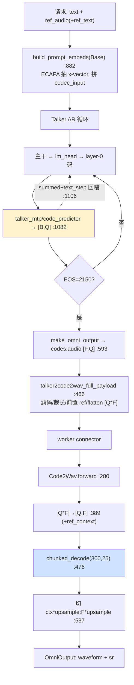

---
tags:
  - vllm-omni
  - Qwen3-TTS
  - TTS
  - Talker
  - Code2Wav
  - code_predictor
  - RVQ
  - 声码器
  - 端到端
  - 专题
---

# Qwen3-TTS 专题：从模型架构到 vllm-omni 源码端到端读通

> **文档版本**: 1.0 ·**分析代码版本**: `~/git/vllm_omni/vllm-omni`（`vllm_omni/model_executor/models/qwen3_tts/`，容器 `/vllm-workspace/vllm-omni/...`）·**最后更新**: 2026-07-09 ·**模型类型**: 纯 TTS（文本 → 语音），两 stage 异构流水
>
> 本篇是 **Qwen3-TTS 的端到端脊梁**：把散在各专题里的片段串成一条读得通的链，只在每一环留一个"深挖入口"链接，不重复它们的细节。已有专题：三种音色模式看 [Base/VoiceDesign/CustomVoice（含 enc_dim）](qwen3-tts-voice-modes.md)；残差码本预测器的图安全看 [talker_mtp 是什么](talker-mtp-graph-safety.md)；与 Qwen3-**Omni** 的 speaker 交接对照看 [P4 Thinker→Talker](thinker-talker-handoff.md) 与 [ECAPA 三来源](audio-encoder-path.md)；服务链路骨架看 [语音/TTS 服务链路](tts-serving-path.md)；编排层看 [Orchestrator](engine-orchestrator.md)。
>
> **一句话结论**：Qwen3-TTS ≠ 一个模型，而是 **两 stage 冻结流水**——`Qwen3TTSTalker`（LLM_AR，文本→RVQ 码）→ `Qwen3TTSCode2Wav`（GENERATION，码→波形）。全链的题眼只有三处缝：① Talker 每步只产 **layer-0 码**，其余 **Q-1 层残差**由 `code_predictor`（即 talker_mtp）在同一步补齐；② 两 stage 之间**真正的码序列不走 token、走 worker connector 的 `codes.audio` payload**，token 只占位（对长度）；③ Code2Wav 吃的是 **codebook-major 扁平 `[Q*F]`**，reshape 回 `[Q,F]` 后 `chunked_decode` 出波形，切片按 **codec 帧 × upsample** 的整数边界。任一处对不齐 → 要么静默垃圾音、要么 consumer 挂住。

---

## 文档概述

- **读者**：要在 GPU/NPU 上把 Qwen3-TTS 跑通/调试/移植的人；已知道 Transformer/AR 解码，但没串过 TTS 的"文本→码→波形"三段。
- **覆盖**：模型架构（Talker/code_predictor/Code2Wav/speaker/tokenizer）→ 文本预处理 → Talker 自回归 → 跨 stage 交接 → 声码解码，逐环带 `file:line`。
- **不覆盖**（有专链）：三种音色模式的 `build_prompt_embeds` 分支细节（→ [voice-modes](qwen3-tts-voice-modes.md)）、talker_mtp 的 CUDAGraph/ACLGraph 图安全（→ [talker-mtp](talker-mtp-graph-safety.md)）。
- **读法**：先看下面「两 stage 总图」建立骨架，再顺着第 2→6 部分走一遍数据流；工程排错直接跳第 7 部分「必须钉死的张量布局」和附录 A 代码索引。

---

## 两 stage 总图（先建骨架）

```mermaid
flowchart LR
    subgraph S0["Stage 0 · Talker (LLM_AR)"]
        direction TB
        T0["文本 + speaker/instruct"] --> T1["Qwen3TTSTokenizer<br/>+ build_prompt_embeds"]
        T1 --> T2["Qwen3 decoder 主干<br/>每步 lm_head → layer-0 码"]
        T2 --> T3["code_predictor / talker_mtp<br/>补 layer 1..Q-1 残差码"]
        T3 -.summed_embeddings 回喂.-> T2
        T3 --> T4["make_omni_output<br/>codes.audio = [F, Q]"]
    end
    subgraph HANDOFF["跨 stage 交接"]
        H1["token_only: 占位 token [0]*Q*(ref+F)<br/>(仅对长度/调度)"]
        H2["full_payload: 真码 codes.audio<br/>→ worker connector"]
    end
    subgraph S1["Stage 1 · Code2Wav (GENERATION)"]
        direction TB
        C1["_codec_ids_from_payload_or_input<br/>取真码, 忽略占位 token"] --> C2["[Q*F] → reshape [Q,F]<br/>(+ ref_context 拼接)"]
        C2 --> C3["decoder.chunked_decode<br/>chunk=300, left=25"]
        C3 --> C4["切 ctx*upsample : F*upsample<br/>→ waveform (fp32)"]
    end
    T4 --> H2 --> C1
    T4 -.finished.-> H1 -.占位.-> C1
    C4 --> OUT["OmniOutput audio + sr"]
    style T3 fill:#fff3cd
    style H2 fill:#d1e7dd
    style C3 fill:#cfe2ff
```



拓扑冻结在 `pipeline.py`：

```python
# 文件: qwen3_tts/pipeline.py :16
QWEN3_TTS_PIPELINE = PipelineConfig(
    model_type="qwen3_tts",
    model_arch="Qwen3TTSTalkerForConditionalGeneration",
    stages=(
        StagePipelineConfig(  # stage 0
            stage_id=0, model_stage="qwen3_tts",
            execution_type=StageExecutionType.LLM_AR,          # :24 自回归
            owns_tokenizer=True, engine_output_type="latent",  # :26-27 产码不落文本
            async_chunk_process_next_stage_input_func="...qwen3_tts.talker2code2wav_async_chunk",   # :28 流式
            custom_process_next_stage_input_func="...qwen3_tts.talker2code2wav_full_payload",        # :29 整段
            sampling_constraints={"detokenize": False, "stop_token_ids": [2150]},                    # :30 talker EOS=2150
        ),
        StagePipelineConfig(  # stage 1
            stage_id=1, model_stage="code2wav",
            execution_type=StageExecutionType.LLM_GENERATION,  # :38
            input_sources=(0,), final_output=True, final_output_type="audio",  # :39-41
            model_arch="Qwen3TTSCode2Wav",                                      # :43
            sync_process_input_func="...qwen3_tts.talker2code2wav_token_only",  # :51 同步占位
        ),
    ),
)
```

> **关键洞察**：`engine_output_type="latent"`（:27）说明 stage 0 的"产物"不是文本 token 而是**声学码**；两 stage 之间没有共享 KV，靠 stage_input_processor 的三个回调（`full_payload` / `token_only` / `async_chunk`）搬运。这与 Qwen3-Omni 的 **三** stage（thinker→talker→code2wav）差一段——TTS 没有 thinker，文本直接进 talker（见 [与 Qwen3-Omni 的异同](#与-qwen3-omni-的异同)）。

---

# 第一部分：Qwen3-TTS 模型架构

## 1.1 四个部件与它们的 config

Qwen3-TTS 的权重其实是**四个子模型**打包，配置在 `configuration_qwen3_tts.py`：

| 部件 | 类 / config | 作用 | 关键超参（config 默认，真实以 checkpoint 为准） |
|---|---|---|---|
| **Talker 主干** | `Qwen3Model` + `lm_head`(=codec_head) | Qwen3 decoder-only，逐步产 **layer-0** 码 | `hidden_size=1024`、`vocab_size=3072`（talker :379-380）、`num_code_groups=32` |
| **code_predictor** | `common.qwen3_code_predictor.CodePredictorWrapper` | 一步内补 **layer 1..Q-1 残差码本** | `vocab_size=2048`、`hidden_size=1024`（cp :194-195），`num_code_groups=32`（:215） |
| **speaker_encoder** | `Qwen3TTSSpeakerEncoder`（ECAPA-TDNN） | **仅 Base**：从参考音频抽 x-vector | `enc_dim=1024`（spk :52），`sample_rate=24000`（:59） |
| **Code2Wav 声码器** | `Qwen3TTSTokenizerV2Decoder`（SpeechTokenizer V2/12Hz） | RVQ 码 → 波形 | `num_quantizers`、`total_upsample`、`output_sample_rate`（从 `speech_tokenizer` 子目录 config 读） |

> **命名雷点**：`num_code_groups` = `num_quantizers` = **Q（RVQ 码本层数，默认 32）**，是贯穿全链的第一常数。Talker vocab（3072）比 code_predictor vocab（2048）大：因为 layer-0 从 talker 词表采样，含 EOS(2150) 等特殊 token；只有 `[0, 2048)` 是"真码"，`compute_logits` 会把非法码位 mask 成 `-inf`（talker :529），Code2Wav 前也会再滤一遍（`_filter_audio_codes_qwen3_tts`）。

## 1.2 Talker：不是普通 LM head，是 codec head

`Qwen3TTSTalkerForConditionalGeneration.__init__`（talker :285）搭出主干 + 三个侧挂：

```python
self.model = Qwen3Model(vllm_config=vllm_config, ...)              # :322 Qwen3 decoder 主干
self.lm_head = ParallelLMHead(talker_config.vocab_size, hidden_size)  # :325 = 官方 codec_head
self.text_embedding = nn.Embedding(text_vocab_size, text_hidden_size)  # :338 文本走独立表(2048维)
self.text_projection = Qwen3TTSTalkerResizeMLP(2048→2048→1024, ...)    # :339 文本 hidden → talker hidden
# speaker_encoder(ECAPA) 稍后按 config 构造(:347+)，仅 Base 用
```

权重映射把官方 `talker.codec_head.*` 收敛到 vLLM 的 `lm_head.*`（`hf_to_vllm_mapper` :276），`talker.model.codec_embedding.*` → `model.embed_tokens.*`（:274）。**这就是"Talker 的 embedding 表是码本表、输出头是码本头"**——它读的是码、写的也是码，文本只是通过 `text_embedding + text_projection` 作为**条件**注入。

三个给 runner 的能力标志值得记（talker :302-320）：

| 标志 | 值 | 含义 |
|---|---|---|
| `have_multimodal_outputs` | True | 产物是 audio codes，不是文本 |
| `mtp_hidden_size` | `talker_config.hidden_size`(1024) | 供 `OmniGPUModelRunner` 走 GPU MTP 快路径 |
| `talker_mtp_output_key` | `("codes","audio")` | runner 把 talker_mtp 输出塞进这个 key |
| `requires_full_prefix_cached_hidden_states` | False | postprocess 只读 `hidden_states[-1]`，省一次 GPU→CPU 合并（#3665） |

## 1.3 code_predictor：一步内的 Q-1 步小 AR

`common/qwen3_code_predictor.py` 里是个**极短序列的小 transformer**（`CodePredictorAttention` + `CodePredictorMLP` + `_RMSNorm` + `_RotaryEmbedding`，:110/:254/:272）。Qwen3-TTS 的 vLLM 封装只是薄壳：

```python
# 文件: qwen3_tts/qwen3_tts_code_predictor_vllm.py :23
class Qwen3TTSTalkerCodePredictorForConditionalGenerationVLLM(CodePredictorWrapper):
    # wrapper_config: use_cuda_graphs=True(:38), sampling_mode="per_call"(:42),
    #                 use_projection=(cp.hidden!=talker.hidden)(:40) —— 两边都 1024 时不投影
```

它的图加速（每 bucket 一张自己的内层 device graph，`_capture_npu_graphs` :723）与 talker_mtp 是否被外层图封装**无关**——这条正是 [talker-mtp 图安全](talker-mtp-graph-safety.md) 的核心：`code_predictor` 内含 `multinomial` 采样，**不可被外层 FULL 图捕获**，性能来自它自己的内层图。

## 1.4 tokenizer：25Hz(V1) vs 12Hz(V2)，Code2Wav 用 V2

`Qwen3TTSTokenizer`（`qwen3_tts_tokenizer.py:47`）是对两个 speech tokenizer 的 HF 风格包装：

| 版本 | model_type | encode 产物 | decode 需要 | 谁用 |
|---|---|---|---|---|
| **25Hz / V1** | `qwen3_tts_tokenizer_25hz` | `audio_codes` + `xvectors` + `ref_mels`（:243/:273） | 三者都要（:338） | Base 抽 ref（`encode_ref_audio_to_code`） |
| **12Hz / V2** | `qwen3_tts_tokenizer_12hz` | 仅 `audio_codes`（:243） | 只要 codes（:367） | **Code2Wav 声码器**（`Qwen3TTSTokenizerV2Decoder`） |

> **注意**：Code2Wav stage 直接构造 **V2 decoder**（`Qwen3TTSCode2Wav.__init__` :95-100，从 `speech_tokenizer` 子目录读 config），**绕过** `Qwen3TTSTokenizer.decode()` 这层 HF 包装，避免 GPU→CPU→GPU 往返（code2wav :294）。25Hz 那条只在 Base 音色模式抽参考音频时才走。

---

# 第二部分：文本 → Talker prompt（预处理）

## 2.1 整体：文本是"条件"，码是"序列"

Talker 的输入序列不是纯文本 token，而是 `build_prompt_embeds`（`prompt_embeds_builder.py:882`）组装的 **talker_prompt**：

```
talker_prompt = [role_embed] + codec_prefix + (可选 speaker 段) + text/codec 条件
```

三种音色模式**几乎所有差异都集中在 `codec_input` 里有没有 speaker 段、那段从哪来**——这条已被 [voice-modes 专题](qwen3-tts-voice-modes.md) 钉死，本篇只放最小对照：



要点（细节见 voice-modes）：`enc_dim`（ECAPA 输出维，1024）**只对 Base 有意义**；CustomVoice 的 speaker 走 `codec_embed(spk_id)` 码表 lookup（维度=talker hidden）；VoiceDesign 根本没有 speaker 段。

## 2.2 长度镜像：为什么 stage-1 要一个"只算长度"的占位

`build_prompt_embeds` 有一个**长度-only 的镜像** `estimate_prompt_len_from_additional_information`（voice-modes 记为 :1415）。这条呼应下游第四部分的 `talker2code2wav_token_only`：**stage-1 的占位 token 长度必须精确等于 `Q*(ref_frames + audio_frames)`**，否则调度分配的 slot 与真码对不齐。改任一分支的拼接，都要同步改这个估算——这是 TTS 最隐蔽的一类 bug。

---

# 第三部分：Talker 自回归 —— layer-0 + Q-1 残差

## 3.1 每一步做两件事

Talker 是逐帧 AR：**主干每步只解 layer-0 一个码**，同一步内 `talker_mtp`/`code_predictor` 把 layer 1..Q-1 的残差码补齐，再把整帧 Q 层码的 embedding 求和**回喂**给下一步。



`talker_mtp` 的 GPU 快路径（`qwen3_tts_talker.py:1041`）：

```python
def talker_mtp(self, input_ids, input_embeds, last_talker_hidden, text_step, ...):
    q = int(self.talker_config.num_code_groups)   # :1057  Q=32
    max_steps = q - 1                              # :1067  只补残差 1..Q-1
    audio_codes = self.code_predictor(             # :1082  → [B, Q]
        layer0_code=input_ids.reshape(bsz, 1),
        layer0_embed=last_id_hidden,
        last_talker_hidden=past_hidden,
        do_sample=..., temperature=0.9, top_k=50, top_p=1.0,   # :1073-1080 子采样默认
    )
    # 非法 layer-0（EOS 等）→ PAD=0，避免声码器解到假码
    invalid0 = (layer0 < 0) | (layer0 >= self._codebook_vocab_size)   # :1095
    audio_codes = torch.where(invalid0.expand_as(...), 0, audio_codes)  # :1096
    # 一次 stacked gather 代替 Q-1 次串行 embedding kernel
    gathered = embed_weight[row_idx, residual_ids_t]                    # :1104
    summed = last_id_hidden.squeeze(1) + gathered.sum(dim=1)           # :1105 残差求和
    inputs_embeds_out = (summed + text_step)                           # :1106 + 文本条件 → 回喂
    return inputs_embeds_out, audio_codes.to(torch.long)               # :1107
```

> **三处要记死**：① `max_steps = Q-1`（layer-0 已由主干产，predictor 只补残差）；② `invalid0 → 0`（:1096）把 EOS 这类非码位映射成 PAD，否则声码器解到垃圾；③ `summed + text_step`（:1106）——回喂 embedding = 本帧码 embedding 和 **+ 文本条件**，文本就是这样逐帧"读出来"的。

## 3.2 收尾：把整段码打成 codes.audio

AR 停在 `stop_token_ids=[2150]`（pipeline :30）后，`make_omni_output`（talker :535）把每步的 `codes.audio` 沿帧维拼接成 **`[F, Q]`**，并携带 `ref`（Base 的参考码）、`ref_code_len`、`codec_streaming` 等 meta：

```python
audio_codes = torch.cat(audio_codes_list, dim=0)   # :593  [F, Q]
mm: OmniPayload = {"codes": {"audio": audio_codes}} # :596
mm["codes"]["ref"] = ref_code_list                  # :603  Base 参考码(按请求对齐)
mm["meta"]["ref_code_len"] = ...                    # :598  参考前缀帧数
return OmniOutput(text_hidden_states=hidden, multimodal_outputs=mm)  # :606
```

注意 `audio_codes` 是 **帧-major `[F, Q]`**；下游 Code2Wav 要的是 **codebook-major 扁平 `[Q*F]`**——这个转置由跨 stage 处理器负责（第四部分）。

---

# 第四部分：Talker → Code2Wav 跨 stage 交接

## 4.1 为什么码不走 token，走 connector

两 stage 没有共享 KV。交接有两种模式，由 `deploy.async_chunk` 分派（pipeline docstring :5）：

| 模式 | 谁搬真码 | 谁占位 | 场景 |
|---|---|---|---|
| **整段 full_payload** | `talker2code2wav_full_payload`（:466）读 `pooling_output["codes.audio"]`，**经 worker connector** 送 | `talker2code2wav_token_only`（:401）给 `[0]*Q*(ref+F)` 占位 token（**只对长度/调度**） | 非流式，一次出全 |
| **流式 async_chunk** | `talker2code2wav_async_chunk`（:152）分块直送 consumer | 无需预处理 | 流式音频 |



`_codec_ids_from_payload_or_input`（code2wav :31）是这条设计的落点——**占位 token 只是给 scheduler 看的，真码从 `runtime_info["codes"]["audio"]` 取**：

```python
if isinstance(codes, dict):
    audio = codes.get("audio")
    if isinstance(audio, torch.Tensor) and audio.numel() > 0:
        return audio.reshape(-1).to(dtype=torch.long)   # :46  真码优先
return input_ids.reshape(-1).to(dtype=torch.long)       # :49  兜底才用占位 token
```

> **NPU/排错一号坑**：`talker2code2wav_full_payload` 里若 `codes.audio` 缺失或空，会返回 `_qwen3_tts_empty_finished_payload()` 并 **warning「consumer wait gate may hang」**（:497-503）——即消费者 stage 会**挂住等一个永不来的 payload**。遇到 Code2Wav 卡死，先查生产者这条 warning。

## 4.2 占位长度公式（必须与真码同源）

`token_only`（:445-446）与 `full_payload` 都用同一个长度口径：

```
prompt_len = num_quantizers * (ref_frames + audio_frames)     # 即 Q*(ref+F)
```

`ref_frames` 由 `_normalize_ref_code` + `_coerce_ref_code_len`（:442-443）从 Base 的参考码算出；非 Base 时 `ref_frames=0`。**这条必须与第二部分的 `estimate_prompt_len_from_additional_information` 镜像一致**，否则占位 slot 与真码错位 → 尾部多余 padding 掉质量，或长度不整除触发下游 malformed 警告。

---

# 第五部分：Code2Wav —— RVQ 码 → 波形

## 5.1 输入布局与解码主干

`Qwen3TTSCode2Wav.forward`（code2wav :280）是全链末端。输入布局（docstring :291）：

```
input_ids per request: [codec_context_frames, *flat_codes]，flat_codes 是 codebook-major [Q*F]
```

核心三步：**扁平 `[Q*F]` → `[Q,F]` → `chunked_decode` → 切片**：

```python
q = self._num_quantizers                                  # :301  Q
upsample = self._total_upsample                           # :302  每 codec 帧 → 多少波形采样
...
if n == 0 or n % q != 0:  # 长度不整除 → malformed，跳过并去重告警 :374-386
frames = n // q                                           # :387
codes_qf = flat.reshape(q, frames)                        # :389  [Q*F] → [Q, F]
...
wav_batch = decoder.chunked_decode(                       # :476
    codes_bqf, chunk_size=self._decode_chunk_frames,      # 300
    left_context_size=self._decode_left_context_frames,   # 25
)  # [B, 1, wav_len]
```

解码是 **SpeechTokenizer V2 decoder 的分块流式解码**（`chunk=300` 帧、`left_context=25` 帧，code2wav :70-71），这样长音频不必一次性进显存，也天然对齐流式输出窗口。

## 5.2 切片：按整数 codec 帧 × upsample

解出的波形要去掉参考/左上下文前缀，切片**按整数 codec 帧边界 × upsample**（不是按比例）：

```python
start = max(0, ctx_frames * upsample)              # :537
end   = max(start, actual_frames * upsample)       # :538
wav = wav[start : min(end, wav.shape[0])]          # :546
audios[idx] = wav.to(float32).reshape(-1)          # :549
```

`OmniOutput` 带回 `model_outputs`(波形) 与 `sr`(=`output_sample_rate`)（:555-557）。

> **性能提示**：切片用 `ctx_frames * upsample` 的**整数**边界（:537）而不是按时长比例，是因为 codec 帧与波形样本是**严格整数倍**关系（`total_upsample`）；按比例切会引入半帧漂移，累积成可听的咔哒声。

## 5.3 两个吞吐机制：frame-bucket 批处理 + ref_context 缓存

**① Frame-bucket 批处理**（:503-524）：把不同请求的码按帧数**分桶**（`_get_decode_batch_bucket_frames`），同桶内 stack 成 `[B,Q,F]` 一次解码；超过 `_decode_batch_max_size` 再切子批。这是高并发下 Code2Wav 真正的跨请求合批点——回答了 [tts-serving-path](tts-serving-path.md) 骨架里"Code2Wav 的 cross-request batching 怎么复用"。等长桶直接 stack，不等长且够长（≥ `chunk+left+1`）才走 `batched_chunked_decode` 变长批（:446-451）。

**② ref_context 缓存**（流式必需，:390-408）：流式模式下第一 chunk 带 `ref_code`，Code2Wav 把它 `_cache_ref_context(ref_req_id, ...)`（:398）按 request_id 存进 LRU；后续 chunk 不再带 ref，从缓存取出 `torch.cat((cached_ref, codes_qf), dim=1)`（:407）拼回前缀。请求 `finished` 时 `_pop_ref_context`（:553）清掉。缓存有**条目数 + 字节数双上限**（`_evict_ref_context_cache_if_needed` :219）。

```mermaid
flowchart LR
    A["chunk#0: ref_code + codes"] -->|_cache_ref_context :398| CACHE[(ref_context LRU<br/>按 request_id)]
    B["chunk#k: 仅 codes"] -->|_get_ref_context :400| CACHE
    CACHE -->|cat(cached_ref, codes) :407| DEC["chunked_decode"]
    F["finished"] -->|_pop_ref_context :553| CACHE
    style CACHE fill:#fff3cd
```

> **流式一号坑**：若后续 chunk 到达时 `_get_ref_context` 返回 `None`（首 chunk 没带 ref，或缓存被提前 evict），直接 `raise ValueError("Missing Qwen3-TTS ref context cache ...")`（:401-405）。流式音色克隆必须保证首 chunk 携带 ref_code。

---

# 第六部分：端到端一次 forward 串讲

把六部分拼成一次请求（非流式 Base 克隆为例）：



---

# 第七部分：必须钉死的张量布局与常数

| 数据结构 / 常数 | 值 / 约定 | 锚点 `file:line` |
|---|---|---|
| Q（RVQ 码本层数 = num_quantizers = num_code_groups） | 默认 **32** | talker config :215/397，code2wav `_num_quantizers` :102 |
| Talker vocab / code_predictor vocab | **3072 / 2048**（只有 `[0,2048)` 是真码） | talker :379 / cp :194，`_codebook_vocab_size` :294 |
| Talker EOS（AR 停止） | **2150** | pipeline :30，talker_mtp `invalid0` 归零 :1095 |
| Talker `make_omni_output` 产物 | `codes.audio` **帧-major `[F, Q]`** | talker :593 |
| 跨 stage 真码布局 | **codebook-major 扁平 `[Q*F]`**，经 connector（非 token） | code2wav :291/:46 |
| stage-1 占位长度 | `Q * (ref_frames + audio_frames)` | 处理器 :446/:457 |
| Code2Wav 输入 per-request | `[codec_context_frames, *flat_codes]`，reshape `[Q,F]` | code2wav :291/:389 |
| upsample（codec 帧 → 波形样本） | `total_upsample`（整数倍） | code2wav :104/:537 |
| 解码分块 | `chunk=300` 帧, `left_context=25` 帧 | code2wav :70-71 |
| speaker `enc_dim`（ECAPA，仅 Base） | **1024** | spk config :52，voice-modes 专题 |
| 采样率 | ECAPA 输入 24000；输出 `output_sample_rate` | spk :59 / code2wav :103 |

---

# 附录

## A. 关键代码位置索引

| 组件 | 文件 | 关键类 / 函数 |
|---|---|---|
| Stage 拓扑 | `qwen3_tts/pipeline.py` | `QWEN3_TTS_PIPELINE`（:16） |
| Talker 入口 | `qwen3_tts/qwen3_tts_talker.py` | `Qwen3TTSTalkerForConditionalGeneration`（:265），`talker_mtp`（:1041），`make_omni_output`（:535） |
| Talker prompt 组装 | `qwen3_tts/prompt_embeds_builder.py` | `build_prompt_embeds`（:882），长度镜像（:1415） |
| speaker encoder | `qwen3_tts/qwen3_tts_talker.py` | `Qwen3TTSSpeakerEncoder`（:201，ECAPA-TDNN） |
| code_predictor | `common/qwen3_code_predictor.py` | `CodePredictorWrapper`（:404），`CodePredictorAttention`（:110） |
| code_predictor 壳 | `qwen3_tts/qwen3_tts_code_predictor_vllm.py` | `Qwen3TTSTalkerCodePredictorForConditionalGenerationVLLM`（:23） |
| 跨 stage 处理器 | `stage_input_processors/qwen3_tts.py` | `talker2code2wav_full_payload`（:466），`talker2code2wav_token_only`（:401），`talker2code2wav_async_chunk`（:152） |
| Code2Wav | `qwen3_tts/qwen3_tts_code2wav.py` | `Qwen3TTSCode2Wav`（:52），`forward`（:280），`_codec_ids_from_payload_or_input`（:31） |
| Code2Wav（NPU） | `platforms/npu/models/qwen3_tts_code2wav.py` | NPU 子类 |
| tokenizer（25/12Hz） | `qwen3_tts/qwen3_tts_tokenizer.py` | `Qwen3TTSTokenizer`（:47） |
| config | `qwen3_tts/configuration_qwen3_tts.py` | `Qwen3TTSConfig`（:459），`Qwen3TTSTalkerConfig`（:264），`Qwen3TTSSpeakerEncoderConfig`（:21） |

## B. 与 Qwen3-Omni 的异同

| 维度 | Qwen3-**TTS** | Qwen3-**Omni** |
|---|---|---|
| stage 数 | **2**（talker → code2wav） | **3**（thinker → talker → code2wav） |
| 文本入口 | 文本直接进 talker（无 thinker） | thinker 先理解，交接 layer-0/layer-24 hidden 给 talker（[P4](thinker-talker-handoff.md)） |
| speaker 来源 | **三种**：ECAPA x-vector(Base) / id 查表(CustomVoice) / instruct(VoiceDesign)（[voice-modes](qwen3-tts-voice-modes.md)） | **仅 id 查表**（enrolled speaker，无 ECAPA） |
| 残差码本 | `code_predictor`（`talker_mtp`），共享 `common.qwen3_code_predictor` | 同一份共享 code predictor |
| 图安全 | `talker_mtp_graph_safe` 未设 → NPU 从不封装（天然规避 [#4519](nested-graph-capture.md)） | 有独立 talker → 曾被 `has_separate_talker` 误封装 → [talker-mtp 修复](talker-mtp-graph-safety.md) |

> **一句话**：把 Qwen3-TTS 看成"砍掉 thinker、把三种 speaker 来源摊开"的 Qwen3-Omni 语音后半段；若要给 Omni 加 zero-shot 克隆，本质就是移植 TTS 的 Base(ECAPA) 这条链。

## C. 术语表

| 术语 | 英文 | 说明 |
|---|---|---|
| 残差矢量量化 | RVQ | Residual Vector Quantization，Q 层码本逐层编码残差 |
| 层-0 码 | layer-0 code | Talker 主干直接采样的第 0 层码；1..Q-1 由 code_predictor 补 |
| 声码器 | Code2Wav / vocoder | RVQ 码 → 波形，本模型用 SpeechTokenizer V2 decoder |
| 说话人嵌入 | x-vector | ECAPA-TDNN 从参考音频抽的固定维向量（`enc_dim`） |
| 帧-major / 码本-major | frame-major / codebook-major | `[F,Q]` vs 扁平 `[Q*F]`，跨 stage 要转置 |
| 上采样率 | upsample | 每 codec 帧对应的波形样本数（整数倍） |

## D. 复现与待真机补测

- **可跑 example**：`examples/offline_inference/text_to_speech/qwen3_tts`、`examples/online_serving/text_to_speech/qwen3_tts`。
- [ ] 断 `Code2Wav.forward`（code2wav :389）确认 `q`、`upsample`、`output_sample_rate` 真实值（config 默认 Q=32，真值以 checkpoint 为准）：⟨待真机填⟩
- [ ] 断 `talker_mtp`（:1082）确认 `code_predictor` 返回 `[B, Q]` 且 layer-0 与主干采样一致：⟨待真机填⟩
- [ ] 高并发下断 `_decode_group_chunks`（code2wav :441）确认 frame-bucket 是否真的跨请求合批（承接 [tts-serving-path](tts-serving-path.md)）：⟨待真机填⟩
- [ ] 流式断 `_get_ref_context`（:400）确认首 chunk ref_code 缓存命中：⟨待真机填⟩

## E. 参考资料

- 源码：`vllm_omni/model_executor/models/qwen3_tts/`、`.../common/qwen3_code_predictor.py`、`.../stage_input_processors/qwen3_tts.py`
- 本站关联：[voice-modes](qwen3-tts-voice-modes.md) · [talker-mtp](talker-mtp-graph-safety.md) · [thinker-talker-handoff](thinker-talker-handoff.md) · [audio-encoder-path](audio-encoder-path.md) · [tts-serving-path](tts-serving-path.md) · [engine-orchestrator](engine-orchestrator.md) · [架构地图](architecture-map.md)
</content>
</invoke>
