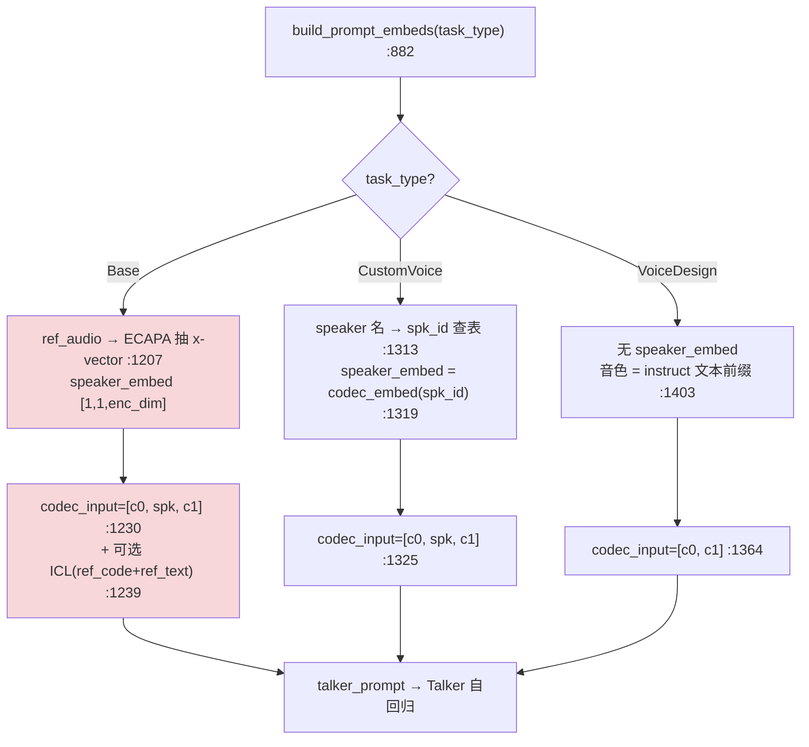

---
tags:
  - vllm-omni
  - Qwen3-TTS
  - Base
  - VoiceDesign
  - CustomVoice
  - ECAPA
  - speaker
  - enc_dim
  - 音色克隆
---

# Qwen3-TTS 三种音色模式：Base / VoiceDesign / CustomVoice 的异同（含 enc_dim）

> 承接 [ECAPA 与 speaker conditioning 三来源](audio-encoder-path.md) 和 [P4 Thinker→Talker 交接](thinker-talker-handoff.md) 里「speaker 从哪进来」的讨论。上两篇讲的是 Qwen3-**Omni**（走 id 注入、无 ECAPA）；本篇拆 Qwen3-**TTS**——它把**三种音色身份来源同时摆进代码**，是理解 speaker conditioning 分类的最佳标本。
>
> 代码位置：`vllm_omni/model_executor/models/qwen3_tts/`（容器 `/vllm-workspace/vllm-omni/...`）。
>
> **一句话结论**：三种模式**几乎全部差异集中在一个函数** `build_prompt_embeds`（prompt_embeds_builder.py:882）里组装 `codec_input` 的那一段——**有没有 speaker 段、那段从哪来**。`enc_dim` 是 ECAPA-TDNN 说话人编码器的输出维，**只对 Base 有意义**。

## 一、使用场景：音色身份从哪来

builder docstring 自己写死了：*"speaker_encoder: ECAPA-TDNN speaker encoder **used by the Base task**"*（:290）。

| task | 音色身份来源 | 必需输入 | 场景 |
|---|---|---|---|
| **Base** | ref 参考音频 → 现场抽 **ECAPA x-vector** | `ref_audio`（+可选 `ref_text` 走 ICL） | **zero-shot 声音克隆**：给段样音，模仿它 |
| **CustomVoice** | 预置说话人 **id 查表** | `speaker`（名字，如 `ethan`） | **内置音色库**：从 `spk_id` 表挑已有嗓音 |
| **VoiceDesign** | **自然语言描述**（无说话人身份） | `instruct`（如"低沉磁性男声"） | **文字造声**：用描述"设计"新嗓音 |

## 二、运行异同：核心在 codec_input 组装

三者的 `talker_prompt = [role_embed] + codec_prefix + text/codec`，**唯一实质差异是 codec_input 里有没有 speaker 段、以及那段从哪来**：

```python
# Base（:1230）
codec_input = torch.cat([codec_input_0, speaker_embed, codec_input_1], dim=1)
#                                        └─ ECAPA x-vector [1,1,enc_dim]，:1207 extract_speaker_embedding

# CustomVoice（:1319/1325）
spk_embed   = codec_embed(spk_id_tensor)          # 码表 lookup，dim = talker hidden（非 enc_dim）
codec_input = torch.cat([codec_input_0, speaker_embed, codec_input_1], dim=1)

# VoiceDesign（:1364）
codec_input = torch.cat([codec_input_0, codec_input_1], dim=1)   # ← 没有 speaker 段
#             音色靠 instruct 文本前缀承载（:1403 talker_prompt = cat([instruct_embed, talker_prompt]))
```



其余运行差异：

| 维度 | Base | CustomVoice | VoiceDesign |
|---|---|---|---|
| speaker_embed | ECAPA 连续向量 `[1,1,enc_dim]` | 码表 lookup `codec_embed(spk_id)` | 无 |
| `non_streaming_mode` 默认 | **False（流式）** | True（非流式） | True（非流式）(:930) |
| 是否碰音频 | **是**：normalize→ECAPA 抽 spk→`encode_ref_audio_to_code` 出 ref_code→LRU 缓存 | 否 | 否 |
| 特有分支 | **ICL/in-context**(:1239 拼 ref_code+ref_text) vs `x_vector_only_mode`(:1037) | dialect 方言 language_id 覆盖(:968) | 纯 instruct 前缀(:1403) |
| 缺 speaker 处理 | 缺 `ref_audio` 抛错(:1070) | 名字不在 `spk_id` 表抛错(:1315) | 不需要 |

> `instruct` 前缀对三者都可选(:940-946)，但**只有 VoiceDesign 靠它承载音色身份**；Base/CustomVoice 的 instruct 只是附加指令。

## 三、enc_dim 专题

**`enc_dim` = ECAPA-TDNN speaker encoder 的输出（说话人嵌入）维度**，挂在 `Qwen3TTSSpeakerEncoderConfig`（configuration_qwen3_tts.py:21/62）。

### 它就是教科书 ECAPA-TDNN

`qwen3_tts_talker.py:195` 的 speaker encoder `__init__` 逐行搭出 ECAPA 全套：

```python
TimeDelayNetBlock(mel_dim, enc_channels[0], ...)                 # TDNN 起始 :204
SqueezeExcitationRes2NetBlock(...) × N                            # SE-Res2Net（ECAPA 核心创新）:212
self.mfa = TimeDelayNetBlock(...)                                # 多层特征聚合 MFA :226
self.asp = AttentiveStatisticsPooling(...)                       # 注意力统计池化 :228
self.fc  = nn.Conv1d(enc_channels[-1]*2, config.enc_dim, 1)      # → 说话人嵌入 enc_dim :227
```

### 三条要点

1. **只对 Base 有意义**：Base 的 `speaker_embed` 形状即 `[1,1,enc_dim]`，ECAPA `fc` 产出后原样 concat 进 codec_input(:1230)。
2. **CustomVoice 不走 enc_dim**：其 speaker_embed 来自 `codec_embed`（Talker 码本嵌入表），维度是 talker hidden。VoiceDesign 根本没有 speaker_embed。
3. **取值别照 docstring**：docstring 默认 `192`（经典 ECAPA 维）(:30)，但构造器实参默认 `1024`(:52)——真实值以加载的模型 config 为准。

### 一个 hybrid 旁路（易混）

`talker.py:459` 加载离线 `custom_voice_dir` 音色档时，用 `speaker_encoder_config.enc_dim` **校验档案里 `speaker_embedding` 的维度**——说明那些"离线自定义音色"存的其实是 **Base 口径的 ECAPA 向量**（按 name 缓存复用），是 Base 与 CustomVoice 之间的旁路。**别和 `task_type=="CustomVoice"` 的 id 查表混为一谈**：前者存 ECAPA 连续向量、后者查离散 id。

## 四、工程/NPU 注意点

- **enc_dim 对齐是 Base 头号雷点**：档案维度 vs config、ECAPA `fc` 输出 vs codec_input 期望，任一处对不齐 → concat 维度炸或静默错位。CustomVoice/VoiceDesign 天然规避整条声学链，更稳，但代价是不能克隆任意音色。
- **Base 独占流式默认**（:930）：`non_streaming_mode=False`，走逐 token decode；CustomVoice/VoiceDesign 默认非流式，把全文塞进 prefill 用 PAD decode(:1274/:1332/:1371)。改流式行为要认这条默认。
- **length 估算须镜像**：`estimate_prompt_len_from_additional_information`(:1415) 是 `build_prompt_embeds` 的"长度-only 镜像"，Stage-0 占位 prompt 长度必须和模型侧 `inputs_embeds` 一致，否则多余 padding 掉质量——改任一分支的拼接都要同步改这个估算。

## Open questions

- [ ] Base 的 ICL(in-context) 模式 `_generate_icl_prompt`(:1263) 具体怎么把 ref_code+ref_text 编进 prompt？与 x-vector-only 的质量/延迟权衡。
- [ ] `encode_ref_audio_to_code`（ref_audio → ref_code）走的是哪个 tokenizer（`tokenizer_12hz` vs `tokenizer_25hz`）？与 code2wav 帧率的关系。
- [ ] Qwen3-TTS 的 speaker_encoder（ECAPA）与 Qwen3-Omni 的对比：Omni 无 ECAPA 走 id 注入，TTS 有——若给 Omni 加 zero-shot 克隆，是否就是移植这条 Base 链？（承接 [P4 笔记](thinker-talker-handoff.md) 结尾）
