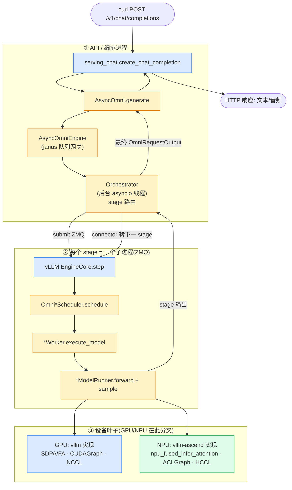

---
tags:
  - vllm
  - vllm-omni
  - vllm-ascend
  - 请求流转
  - 架构
  - NPU
  - GPU
  - 端到端
---

# 从 curl 到返回：一个请求的完整生命周期（GPU/NPU × vllm / vllm-omni / vllm-ascend）

> 一个问题：**一条 HTTP 请求打进来，到吐出文本/音频，中间经过哪些关键节点？哪一段是 vllm，哪一段到了 vllm-omni，哪一段又到了 vllm-ascend？GPU 和 NPU 在哪里分叉？**
>
> 本文把三个仓库（`vllm` / `vllm-omni` / `vllm-ascend`）的源码串成一条端到端时间线，每个节点都标注**归属仓库**和 **GPU/NPU 差异**。行号对照 `/Users/fayespica/git/vllm_omni/{vllm,vllm-omni,vllm-ascend}` 源码，可能随版本漂移。前置阅读：[组件与请求流转](components-request-flow.md)（omni 编排层细节）、[三处 worker 继承关系](worker-class-hierarchy.md)（执行层继承网）。

## 结论速览：三个心智模型

1. **omni 是套在 vllm 外面的"编排外壳"**。plain vLLM 的请求路径是 `serving → AsyncLLM → 一个 EngineCore → scheduler → worker`。omni 把"**一个** EngineCore"换成"**N 个 stage 子进程**"，前面加一层 `Orchestrator` 在 stage 之间路由（Thinker→Talker→Code2Wav）。**每个 stage 内部，又几乎是一条完整的 plain-vLLM 路径。**

2. **GPU 与 NPU 只在最底层分叉**。从 HTTP 入口一路到 scheduler、到 output 组装，**全是设备无关的 vllm/omni 代码，GPU 和 NPU 跑的是同一份**。真正分叉发生在叶子：`worker.init_device` / `model_runner.forward` / `attention kernel` / `graph capture` / `集合通信`。GPU 走 vllm 自带实现，NPU 走 **vllm-ascend**。

3. **依赖方向恒定 `omni → ascend → vllm`**。omni 通过菱形继承把 ascend 的设备能力和自己的 omni 能力缝在一起（`NPUOmniPlatform(OmniPlatform, NPUPlatform)`），ascend 通过 entry-point 插件机制接进 vllm，**vllm 不知道下游存在**。



> 颜色：<span style="color:#3b82f6">蓝=vllm</span> · <span style="color:#d97706">黄=vllm-omni</span> · <span style="color:#16a34a">绿=vllm-ascend</span>。注意 EngineCore 是蓝的（vllm 原生进程循环），但里面的 scheduler/worker/runner 被 omni 换成了黄的；再往下的 attention/graph 在 NPU 上变绿。

---

## 一、阶段逐节点拆解（含归属 + GPU/NPU 差异）

下表是整条链路的"节点账本"。**owner** 列指明代码住在哪个仓库；**GPU/NPU** 列只在该节点会分叉时才填。

### 阶段 A · HTTP 入口与 serving（API 进程）

| # | 节点 | 文件:行 | owner | 说明 |
|---|---|---|---|---|
| A1 | FastAPI 路由 `/v1/chat/completions` | `vllm-omni` entrypoints/openai（包 vllm 的路由） | omni | omni 有自己的 `entrypoints/openai/serving_chat.py`，但路由壳复用 vllm |
| A2 | `OpenAIServingChat.create_chat_completion` | omni `serving_chat.py:1`（import AsyncOmni） | omni | 解析 ChatCompletionRequest、渲染 chat template、抽多模态输入 |
| A3 | `engine_client.generate(...)` | vllm `…/chat_completion/serving.py:358` | vllm 协议 | serving 把 omni 引擎**当成普通 vLLM 引擎**调用——因为 AsyncOmni 实现了 vllm 的 `EngineClient` 协议 |

> 关键衔接：**AsyncOmni 冒充成 vLLM 的 `EngineClient`**，所以上游 OpenAI serving 代码无需改动就能驱动 omni。这就是"哪段是 vllm、哪段是 omni"的第一个交界面。

### 阶段 B · omni 编排层（API 进程，omni 独有）

| # | 节点 | 文件:行 | owner | 说明 |
|---|---|---|---|---|
| B1 | `AsyncOmni.generate` | omni `entrypoints/async_omni.py:110/249` | omni | 异步入口，`generate()` 逐个 yield `OmniRequestOutput` |
| B2 | `AsyncOmniEngine` | omni `engine/async_omni_engine.py:187` | omni | janus 队列网关：`request_queue` / `output_queue`，主线程薄代理 |
| B3 | 启动 `Orchestrator`（后台线程） | `async_omni_engine.py:304` | omni | 独立 asyncio loop，真正的多 stage 协调在这 |
| B4 | Stage-0 输入处理 | omni `engine/stage_init_utils.py:53` `build_stage0_input_processor` | omni（桥接 vllm `InputProcessor`） | tokenize + 多模态特征，保留 `prompt_embeds`/`additional_information`，产出 `OmniEngineCoreRequest` |
| B5 | `Orchestrator._handle_add_request` → submit stage0 | omni `orchestrator.py:424` | omni | 建 `OrchestratorRequestState`，投给 StagePool |
| B6 | `StagePool` / `StageClient` | omni `engine/stage_pool.py:47` · `stage_client.py:18` | omni | 一个逻辑 stage 多副本，负载均衡 + 粘性路由；包 `StageEngineCoreClient` |

**此层 GPU/NPU 无差异**——编排是纯设备无关逻辑。

### 阶段 C · 进入单个 stage 的 EngineCore（ZMQ 进程边界）

| # | 节点 | 文件:行 | owner | 说明 |
|---|---|---|---|---|
| C1 | StageClient → stage 子进程（ZMQ） | omni `stage_engine_core_proc` | omni（壳）/ vllm（核） | omni 把 vLLM 的 `EngineCore` 跑在每个 stage 的独立子进程里 |
| C2 | `EngineCore.add_request` / `.step()` | vllm `v1/engine/core.py:372 / 479` | **vllm** | stage 内的主循环就是 vLLM 原生 `step()`：schedule→execute→update |

> 这里有**两层 ZMQ**：① omni Orchestrator ↔ stage 子进程；② （若 stage 内用 multiproc executor）EngineCore ↔ worker 进程。plain vLLM 只有第②层；omni 多包了第①层来串多 stage。

### 阶段 D · stage 内调度 → 执行（worker/runner 工厂）

| # | 节点 | 文件:行 | owner | GPU / NPU |
|---|---|---|---|---|
| D1 | 调度 `schedule()` | omni `core/sched/omni_ar_scheduler.py`（继承 vllm `Scheduler`） | omni ⊃ vllm | 同一份；多了 KV-transfer 反压 |
| D2 | worker 类工厂 `resolve_worker_cls` | omni `stage_init_utils.py:150` | omni | `get_omni_ar_worker_cls()` / `get_omni_generation_worker_cls()` 按平台返回类路径 |
| D3 | `*Worker.execute_model` | GPU: omni `worker/gpu_ar_worker.py:24`<br/>NPU: omni `platforms/npu/worker/npu_ar_worker.py` | omni | **GPU**:`OmniGPUWorkerBase`←vllm `GPUWorker`<br/>**NPU**:`OmniNPUWorkerBase`←vllm-ascend `NPUWorker` |
| D4 | `init_device` 建 ModelRunner | 同上 worker | omni | **GPU** 建 `GPUARModelRunner`；**NPU** 建 `NPUARModelRunner` |

> 这是 GPU/NPU 的**第一个分叉点**：worker 基座不同（vllm `GPUWorker` vs vllm-ascend `NPUWorker`）。详见 [worker 继承网](worker-class-hierarchy.md)。

### 阶段 E · 前向 + 注意力 + 图捕获（设备叶子，分叉最深）

| # | 节点 | GPU（owner） | NPU（owner） |
|---|---|---|---|
| E1 | ModelRunner 基类 | `OmniGPUModelRunner`←vllm `GPUModelRunner`（omni⊃vllm） | `OmniNPUModelRunner`←(omni `OmniGPUModelRunner` + ascend `NPUModelRunner`) 菱形（omni⊃ascend⊃vllm） |
| E2 | forward 调用 | vllm `gpu_model_runner.py:3793` `self.model(...)` | vllm-ascend `worker/model_runner_v1.py:253`（用 `_torch_cuda_wrapper` 抹平 CUDA/NPU 差异） |
| E3 | 注意力后端选择 | vllm `Platform.get_attn_backend_cls`（`platforms/interface.py:363`） | vllm-ascend `platform.py:819` `get_attn_backend_cls`（MLA/SFA/DSA/FA3/标准） |
| E4 | **注意力 kernel** | vllm 的 FlashAttention/FA·SDPA | **vllm-ascend** `attention/attention_v1.py:1095/1115` `torch_npu.npu_fused_infer_attention_score[_v2]`（layout=TND） |
| E5 | 图捕获 | vllm CUDAGraph（`get_static_graph_wrapper_cls`→CUDA 实现） | **vllm-ascend** `compilation/acl_graph.py` `ACLGraphWrapper`（`torch.npu.NPUGraph()` / `torch.npu.graph()`） |
| E6 | 采样 | vllm `GPUModelRunner.sample_tokens`/`_sample`（`gpu_model_runner.py:4435`） | vllm-ascend `AscendSampler`（`model_runner_v1.py:315`） |
| E7 | 设备同步/显存 | vllm `torch.cuda.*` | **vllm-ascend** `torch.npu.synchronize` / `mem_get_info`（`worker/worker.py:215/355`） |
| E8 | 集合通信 | vllm NCCL communicator | **vllm-ascend** `NPUCommunicator`(HCCL)（`distributed/device_communicators/npu_communicator.py:23`） |

> **要点**：E 整层在 GPU 上几乎全是 vllm 原生代码（omni 只在 runner 外面包了一层）；在 NPU 上几乎全被 vllm-ascend 接管（attention/graph/sampler/sync/通信全部换成昇腾实现）。这正是"哪段到了 vllm-ascend"的答案——**就在这一层，且只在 NPU 路径上**。

### 阶段 F · stage 输出 → 跨 stage → 最终响应

| # | 节点 | 文件:行 | owner | 说明 |
|---|---|---|---|---|
| F1 | runner 产出 `OmniModelRunnerOutput` | omni `gpu_ar_model_runner.py`（AR 经 `pooler_output`/`multimodal_outputs` 带 hidden/codes） | omni | 见 [worker 笔记 §10](worker-class-hierarchy.md) 的 wire 契约 |
| F2 | stage 输出回 Orchestrator | omni `orchestrator.py:632` `_orchestration_output_handler` | omni | 非 final stage → `_forward_to_next_stage`（:1158）；经 connector 打包 `OmniPayload` 转下一站 |
| F3 | 跨 stage 数据通路 | omni `distributed/omni_connectors/*`（SharedMemory/Mooncake/Yuanrong） | omni | 张量序列化 + KV transfer；NPU 上常用 Yuanrong connector |
| F4 | 多模态输出累积 | omni `engine/output_processor.py:1` `MultimodalOutputProcessor`（继承 vllm `OutputProcessor`） | omni ⊃ vllm | 跨 stage 累积 `mm_accumulated`，detokenize 文本仍走 vllm |
| F5 | 组装 `OmniRequestOutput` | omni `outputs.py:60` / `engine/mm_outputs.py:17` | omni | `final_output_type` 决定模态（text/audio/image） |
| F6 | yield 回 serving → HTTP | omni `async_omni.py:249` → omni serving_chat | omni | 文本走 OpenAI delta；音频/图嵌进响应（audio 字段/base64） |

**此层 GPU/NPU 无差异**——输出组装也是设备无关。

---

## 二、GPU vs NPU：到底在哪几行分家

把分叉点单独拎出来，一张表说清"同一条路在哪里岔开"：

| 维度 | GPU 路径 | NPU 路径 | 分叉发生在 |
|---|---|---|---|
| 平台类 | `CudaOmniPlatform(OmniPlatform, CudaPlatformBase)` | `NPUOmniPlatform(OmniPlatform, NPUPlatform)` | omni `platforms/{cuda,npu}/platform.py` |
| 平台来源 | vllm 内置探测 | vllm-ascend 经 `vllm.platform_plugins` entry-point 注册（`setup.py:541`→`register()`） | 插件加载期 |
| Worker 基座 | vllm `GPUWorker` | vllm-ascend `NPUWorker`（←`WorkerBase`） | D3 |
| ModelRunner | omni`OmniGPUModelRunner`←vllm`GPUModelRunner` | omni`OmniNPUModelRunner`←菱形(omni+ascend) | E1 |
| 注意力 kernel | vllm FA/SDPA | vllm-ascend `torch_npu.npu_fused_infer_attention_score` | E4 |
| 图捕获 | CUDAGraph | vllm-ascend `ACLGraphWrapper`/`torch.npu.NPUGraph` | E5 |
| 采样器 | vllm Sampler | vllm-ascend `AscendSampler` | E6 |
| 同步/显存 | `torch.cuda.*` | `torch.npu.*` | E7 |
| 集合通信 | NCCL | HCCL (`NPUCommunicator`) | E8 |
| dispatch_key | （CUDA） | `"PrivateUse1"`（`platform.py:165`） | torch 注册期 |

**一句话**：从 curl 到 stage 调度（A→D2）GPU/NPU 跑同一份代码；**D3 起 worker 基座分家，E 整层在 NPU 上换成 vllm-ascend**；F 之后又汇合成同一份 omni 输出逻辑。

---

## 三、进程与 IPC 边界模型

```
┌─ API/编排进程 ───────────────────────────────────────────┐
│ serving_chat → AsyncOmni → AsyncOmniEngine               │
│ └─ Orchestrator (后台 asyncio 线程)                       │  [omni]
└───────────┬──────────────────────────────────────────────┘
            │ ① ZMQ (Orchestrator ↔ 各 stage)   ← omni 多包的一层
   ┌────────┴────────┬─────────────────┬─────────────────┐
   ▼                 ▼                 ▼
┌─ Stage0 子进程 ─┐ ┌─ Stage1 子进程 ─┐ ┌─ Stage2 子进程 ─┐
│ vLLM EngineCore │ │ vLLM EngineCore │ │ vLLM EngineCore │  [vllm 核 + omni sched/worker]
│ scheduler       │ │ ...             │ │ ...             │
│   │ ② ZMQ/MQ (EngineCore ↔ worker, 若 multiproc)        │
│   ▼ worker → model_runner → forward                     │
│        └─ GPU: vllm kernel  /  NPU: vllm-ascend kernel  │  ← 设备叶子分叉
└─────────────────┘ └─────────────────┘ └─────────────────┘
   跨 stage 数据：omni_connectors (SharedMemory/Mooncake/Yuanrong) + OmniPayload
```

- **① 是 omni 独有的一层**：plain vLLM 没有 Orchestrator↔stage 这层，它只有一个 EngineCore。
- **② 是 vLLM 原生的进程切分**：API 进程 ↔ EngineCore ↔ worker，靠 ZMQ / multiprocessing MessageQueue。
- plain vLLM 的等价路径（无 omni）：`serving → AsyncLLM(async_llm.py:559 add_request) → ZMQ(core_client.py:1121) → EngineCore.step → Scheduler.schedule → MultiprocExecutor → Worker.execute_model → GPUModelRunner → sample → 回流 detokenize(output_processor/detokenizer) → RequestOutput`。**omni 把这条路径塞进了每个 stage 子进程里。**

---

## 四、关键文件索引（按仓库分）

### vllm（设备无关引擎核）
| 角色 | 文件:行 |
|---|---|
| OpenAI serving 调引擎 | `vllm/entrypoints/openai/chat_completion/serving.py:358` |
| AsyncLLM 提交/输出 | `vllm/v1/engine/async_llm.py:559 / 656` |
| 输入处理 | `vllm/v1/engine/input_processor.py:370` |
| ZMQ 客户端 | `vllm/v1/engine/core_client.py:1121` |
| EngineCore 循环 | `vllm/v1/engine/core.py:372 / 479` |
| 调度器 | `vllm/v1/core/sched/scheduler.py:388` |
| 多进程执行器 | `vllm/v1/executor/multiproc_executor.py:307` |
| GPU worker/runner | `vllm/v1/worker/gpu_worker.py:836` · `gpu_model_runner.py:3793 / 4435` |
| 平台分发 | `vllm/platforms/__init__.py:211` · `platforms/interface.py:363` |
| 类路径解析 | `vllm/utils/import_utils.py:104` `resolve_obj_by_qualname` |

### vllm-omni（编排外壳 + omni 执行扩展）
| 角色 | 文件:行 |
|---|---|
| 入口 | `entrypoints/async_omni.py:110` · `entrypoints/openai/serving_chat.py` |
| 引擎/编排 | `engine/async_omni_engine.py:187 / 304` · `orchestrator.py:424 / 632 / 1158` |
| stage 管理 | `engine/stage_pool.py:47` · `stage_client.py:18` · `stage_engine_core_proc.py` |
| worker 工厂/类 | `engine/stage_init_utils.py:150` · `worker/gpu_ar_worker.py:24` · `platforms/npu/worker/npu_ar_worker.py` |
| runner | `worker/gpu_model_runner.py:76` · `gpu_ar_model_runner.py` · `platforms/npu/worker/npu_model_runner.py` |
| 平台 | `platforms/interface.py:31` · `platforms/__init__.py` · `platforms/{cuda,npu}/platform.py` |
| 输出 | `outputs.py:60` · `engine/mm_outputs.py:17` · `engine/output_processor.py:1` |

### vllm-ascend（NPU 设备实现）
| 角色 | 文件:行 |
|---|---|
| 平台注册 | `setup.py:541`（entry-point） · `vllm_ascend/__init__.py:40` `register()` |
| NPUPlatform | `vllm_ascend/platform.py:155`（`get_attn_backend_cls:819` · `get_static_graph_wrapper_cls:896` · `dispatch_key:165`） |
| worker/runner | `worker/worker.py:88`（`init_device:450`） · `worker/model_runner_v1.py:253` |
| 注意力 kernel | `attention/attention_v1.py:1095 / 1115` · `_310p/attention/attention_v1.py` |
| 图捕获 | `compilation/acl_graph.py:65` |
| 通信 | `distributed/device_communicators/npu_communicator.py:23`（HCCL） |

---

!!! info "说明"
    本文综合三仓库源码阅读 + 三路并行 trace 整理；类名/调用关系可靠，行号随版本漂移，以实际仓库为准。核心结论：**编排与输出层设备无关（GPU/NPU 同一份 omni/vllm 代码），分叉只在 worker 基座以下的设备叶子；NPU 叶子由 vllm-ascend 接管**。延伸：[组件与请求流转](components-request-flow.md)、[worker 继承网](worker-class-hierarchy.md)、[平台解耦](platform-decoupling.md)。
