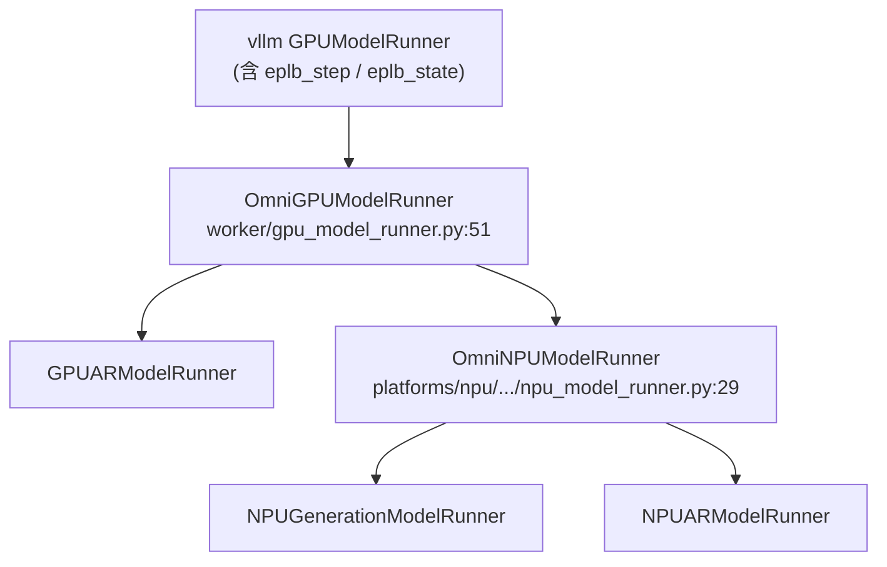

---
tags:
  - vllm-omni
  - vllm-ascend
  - vllm
  - EPLB
  - MoE
  - 继承
  - 专家并行
---

# EPLB 是什么、在代码里怎么工作、为什么 vllm-omni 也有相关判断

> 三问连答:① EPLB(Expert Parallelism Load Balancer / 专家并行负载均衡)解决什么、② 它在 vllm / vllm-ascend 代码里怎么跑、③ 为什么 vllm-omni 自己不实现 EPLB 却到处是 EPLB 判断。
>
> 基于本地 `~/git/workspace/{vllm,vllm-ascend,vllm-omni}` 源码梳理。类名/继承关系可靠,行号可能随版本漂移。相关阅读:[npu_model_runner 上游适配困境与解耦](npu-runner-decoupling.md)、[昇腾量化特性支持速查](../../vllm-ascend/snippets/ascend-quantization.md)。

## 一、EPLB 解决什么

MoE 每个 token 经路由(gating)只激活 Top-K 个专家。当专家被切到不同卡上(**Expert Parallel, EP**),流量天然不均:**热专家**所在卡打满、**冷专家**所在卡闲置。EP 是同步的,**整个 step 由最慢(最热)那张卡决定**,少数热卡拖慢全局,卡越多越严重。

EPLB 抹平这个长尾,两招:

1. **冗余专家(redundancy)**:把热专家**复制多份**放到不同卡,分摊流量。
2. **动态重排(rearrange)**:按历史负载周期性重算「专家→物理槽位」映射,热专家摊开、冷专家合并。

## 二、在 vllm 主干里怎么工作

核心:**两张映射表 + 一个负载窗口 + 周期性重排**。

### ① 状态与映射表 — `vllm/distributed/eplb/eplb_state.py`

`EplbModelState`(`:91`)持有每个 MoE 模型的核心数据:

| 字段 | 行 | 含义 |
|---|---|---|
| `physical_to_logical_map` | `:94` | `(层, 物理专家)` 物理槽位→逻辑专家。冗余复制就体现在这:`[0,1,2,3,0,1]` = 逻辑 0、1 各 2 个物理副本 |
| `logical_to_physical_map` | `:110` | `(层, 逻辑专家, 冗余+1)` 反向稀疏表,`-1` 占位;路由时用它把逻辑 ID 翻成物理槽位 |
| `logical_replica_count` | `:134` | 每个逻辑专家有几个副本 |
| `expert_load_pass` | `:150` | 本次 forward 各物理专家处理的 token 数 |
| `expert_load_window` | `:157` | 最近 `window_size` 次 pass 的负载滑动窗口 |

### ② 负载怎么统计 — 路由里顺手记

`vllm/model_executor/layers/fused_moe/router/base_router.py` 路由选出 Top-K 后调 `eplb_map_to_physical_and_record()`(融合 kernel),**同时**做:逻辑→物理映射 + **原子累加** `expert_load_pass`。统计跟着路由走,几乎零额外开销。

### ③ 谁驱动 / 何时重排 — 每个 step 末尾

`vllm/v1/worker/gpu_model_runner.py` 的 `execute_model()` 结尾调 `eplb_step()`:

```python
def eplb_step(self, is_dummy=False, is_profile=False):
    if not self.parallel_config.enable_eplb or self.eep_eplb_suppressed:
        return                       # ← 没开 EPLB 直接 return
    self.eplb_state.step(is_dummy, is_profile, log_stats=...)
```

`EplbState.step()`(`eplb_state.py:477`):灌负载进窗口并清零 → `expert_rearrangement_step += 1` → 达阈值重排:

```python
if self.expert_rearrangement_step >= self.expert_rearrangement_step_interval:
    self.expert_rearrangement_step = 0
    self.rearrange()                 # eplb_state.py:596
```

`rearrange()`(`:662`)四步:**all-reduce 汇总全局逻辑专家负载 → `policy.rebalance_experts()` 算新放置 → `rearrange_expert_weights_inplace()` 搬专家权重 → 提交新映射表**。

### ④ 配置 — `vllm/config/parallel.py`

`enable_eplb`(`:171`)总开关;`EPLBConfig`(`:57`):`window_size=1000`、`step_interval=3000`、`num_redundant_experts`、`use_async=True`(异步非阻塞重排)、`policy`(重排策略)。

> 一句话:`enable_eplb` 开 → 路由时累加负载 → 每 step `eplb_step()` 推进 → 攒够 `step_interval` 步就 all-reduce + 重算 + 搬权重。

## 三、vllm-ascend 的改造:同步重排 → 后台异步子进程

vllm 主干 `rearrange()` 是**同步**的(卡主线程搬权重)。vllm-ascend 在 `vllm_ascend/eplb/` 另起一套**异步**实现:

- `ascend_config.py:709` `EplbConfig`:`dynamic_eplb`(开后台进程)、`expert_heat_collection_interval=400`、`algorithm_execution_interval=30`、`eplb_policy_type`(0 default / 1 flashlb / 2 random / 3 multi-stage)。
- `eplb/eplb_updator.py` `EplbUpdator`:`multiprocessing` 跑后台进程算重排,主线程只在 forward 前后挂两个 hook:
  - `forward_before()`(`:104`):有待迁移则发起 **D2D(Device-to-Device)专家权重异步传输**。
  - `forward_end()`(`:127`):`compute_and_set_moe_load()` 显式 all_gather 负载 → 唤醒后台进程。
- `eplb/adaptor/vllm_adaptor.py` `VllmEplbAdaptor`:适配昇腾量化权重格式(W8A8/W4A8/MXFP4)+ 维护 `log2phy_map_per_layer`。

**所以昇腾上的接口不是 `eplb_step()`,而是 `dynamic_eplb` + `eplb_updator.forward_before()/forward_end()`。这是理解 omni 判断的钥匙。**

| 方面 | vllm 主干 | vllm-ascend |
|---|---|---|
| 重排触发 | 同步(`EplbState.step`) | 异步后台进程 + 主线程 hook |
| 负载收集 | 路由 kernel 自动累积 | `compute_and_set_moe_load()` 显式 all_gather |
| 权重转移 | 通用 communicator | D2D 专用 loader + HCCL |
| 策略库 | default | default / flashlb / random / multi-stage |
| 配置 | `ParallelConfig.eplb_config` | `AscendConfig.eplb_config`(额外字段) |

## 四、为什么 vllm-omni 也有 EPLB 判断 —— 继承/透传,不自己实现

omni 的 runner 继承链直接坐在上游之上:



因为继承了带 EPLB 的 runner,omni **重写执行路径时必须把上游的 EPLB 钩子接回去**,否则 EPLB 就断了。三类判断:

### ① GPU 路径 — 透传上游 `eplb_step()`

`vllm-omni/worker/gpu_model_runner.py:1160`(在 `_dummy_run()` 里):

```python
if not skip_eplb:
    self.eplb_step(is_dummy=True, is_profile=is_profile)
```

`eplb_step()` omni **没有定义**,完全用上游的(测试里直接 monkeypatch 它即证据)。dummy run 也触发,是因为 DP 多 rank 要同步 rearrangement。

### ② NPU 路径 — 接昇腾 `dynamic_eplb` + updator hook

omni 的 NPU runner 重写了 `execute_model`,得手动把昇腾那对 hook 插回。`platforms/npu/worker/npu_model_runner.py:96` 与 `:319`:

```python
if not is_profile and self.dynamic_eplb:
    self.eplb_updator.forward_before()   # forward 前:D2D 权重迁移
...
if self.dynamic_eplb:
    self.eplb_updator.forward_end()      # forward 后:更新专家负载
```

同样的判断在 `npu_ar_model_runner.py:574,1108`、`npu_generation_model_runner.py:298,499,625,848` 反复出现 —— omni 有多种 runner(AR 自回归 / generation),每条 forward 路径各接一次。`dynamic_eplb`、`eplb_updator` omni **不初始化**,都来自上游昇腾 runner。

### ③ 模型层 — 把 `enable_eplb` 透传给 FusedMoE

- `models/hunyuan_image3/hunyuan_image3.py:1640`:读 `enable_eplb`,算 `n_physical_experts = 逻辑 + 冗余`,传给上游 `SharedFusedMoE`。
- `models/qwen3_omni/qwen3_moe.py:170`:反过来从 `FusedMoE` 实例**读取** `n_logical/n_physical/n_redundant_experts`,自己不算。

### 结论

> vllm-omni **完全不实现 EPLB**。这些判断纯粹因为它继承/重写了上游(vllm + vllm-ascend)带 EPLB 的 runner 与 MoE 模型,必须在重写路径里把上游钩子(`eplb_step` / `eplb_updator.forward_before/end`)和配置(`enable_eplb` / `dynamic_eplb`)**接续回去**。这与 [npu_model_runner 解耦困境](npu-runner-decoupling.md) 是同一类问题:omni 重写 runner,就得逐个接回上游散落的特性钩子。

## 五、文件索引

| 内容 | 文件 |
|---|---|
| EPLB 核心状态/映射/重排 | `vllm/distributed/eplb/eplb_state.py` |
| 负载记录(路由 kernel) | `vllm/model_executor/layers/fused_moe/router/base_router.py` |
| 驱动点 `eplb_step()` | `vllm/v1/worker/gpu_model_runner.py` |
| 配置 `EPLBConfig` | `vllm/config/parallel.py` |
| 昇腾异步 EPLB | `vllm_ascend/eplb/{eplb_updator,adaptor/vllm_adaptor,core/eplb_device_transfer_loader}.py` |
| 昇腾配置 | `vllm_ascend/ascend_config.py`(`EplbConfig`) |
| omni GPU 透传 | `vllm_omni/worker/gpu_model_runner.py:1160` |
| omni NPU hook | `vllm_omni/platforms/npu/worker/npu_{model,ar_model,generation_model}_runner.py` |
| omni MoE 模型 | `vllm_omni/model_executor/models/{hunyuan_image3,qwen3_omni}/...` |
