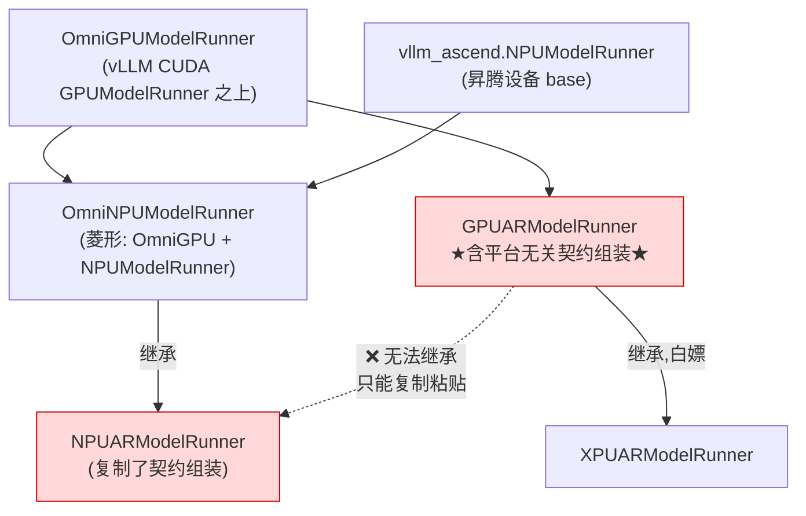

---
tags:
  - vllm-omni
  - vllm-ascend
  - npu_model_runner
  - 解耦
  - 继承
  - wire-contract
---

# npu_model_runner 的上游适配困境：为什么每次都要跟 GPU 联动，怎么解耦

> 一个具体问题：从 [vllm-omni PR #4454](https://github.com/vllm-project/vllm-omni/pull/4454) 出发——**为什么 GPU runner 一改，NPU runner 就得手动追平?这种「联动」能不能解耦?**
>
> 本文基于 `vllm-omni` 源码(`vllm_omni/worker/` 与 `vllm_omni/platforms/{npu,xpu}/worker/`)梳理。类名/继承关系可靠,行号可能随版本漂移。相关阅读:[Omni 平台无关/相关解耦：现状与演进](../platform-decoupling.md)。

## 一句话

`GPUARModelRunner` 里**缠着两类本该分开的逻辑**——「设备相关」和「平台无关的 wire 契约组装」。XPU 因为设备 base 与 GPU 兼容,直接继承 GPU 叶子、白嫖契约;**NPU 设备 base 是昇腾的,无法继承 GPU 叶子,只能在叶子层 fork、被迫复制那份平台无关逻辑**——于是 GPU 每改一次契约,NPU 的副本就过期一次。**解耦 = 把平台无关的契约组装从 GPU 叶子里抽出来,放到三套 runner 都能共享的地方。**

---

## 一、PR #4454 修的是症状

症状链条：

1. 上游 omni #1601(Output Processor Phase 2)把多模态数据从 `OmniEngineCoreOutput.pooling_output`(类型 `torch.Tensor | None`)迁到专用字段 `multimodal_output`。
2. **同一 commit 只改了 GPU runner**;NPU 的 AR / Generation runner 还在用 `pooler_output=` 塞 dict。
3. `pooler_output` 继承自 vLLM 原生 `ModelRunnerOutput`,msgspec 上挂的是**张量 dec_hook**(`dtype, shape, data = arr`)。orchestrator 跨 ZMQ 解码时拿 dict 去解张量：

   ```text
   msgspec.ValidationError: too many values to unpack (expected 3) - at `$[1][0][4]`
   ```

4. #4454 的修法:dict 改走 `multimodal_outputs=`,并把 GPU 的 `_ensure_tensor_values` **逐字抄一份**到 NPU(PR 自述 "Mirrors `gpu_ar_model_runner._ensure_tensor_values`")。

修对了,但治标——**它没有消除「下次 GPU 再改、NPU 再抄」的结构性必然。**

## 二、根因：同一份逻辑三份拷贝，NPU 是断链的那份

AR/Generation runner 在仓库里有三套，继承关系是关键：

```
vllm_omni/worker/gpu_ar_model_runner.py
    GPUARModelRunner(OmniGPUModelRunner, OmniConnectorModelRunnerMixin)

vllm_omni/platforms/xpu/worker/xpu_ar_model_runner.py
    XPUARModelRunner(GPUARModelRunner)            # ← 继承 GPU 叶子,白嫖

vllm_omni/platforms/npu/worker/npu_ar_model_runner.py
    NPUARModelRunner(OmniNPUModelRunner)          # ← 只继承 base,没继承 GPU 叶子
```



- **XPU 是对的**：`XPUARModelRunner(GPUARModelRunner)` 直接继承 GPU 叶子,#1601 的迁移它**零改动白拿**。
- **NPU 是断的**：`NPUARModelRunner(OmniNPUModelRunner)` 只继承 base,**不继承 `GPUARModelRunner`**。于是 `_ensure_tensor_values`、`_build_multimodal_outputs`、`pooler→multimodal` 字段路由全是**复制的副本**,GPU 一改副本就过期。

注意:base 层其实**有**共享——`OmniNPUModelRunner(OmniGPUModelRunner, NPUModelRunner)` 是菱形继承,把 omni-GPU base 逻辑和昇腾设备 base 缝在一起。**但断链发生在叶子层(AR/Generation),在共享点的下游。**

## 三、为什么 NPU 不能像 XPU 那样继承 `GPUARModelRunner`

因为 `GPUARModelRunner` 里缠着两类逻辑：

| | 性质 | 例子 |
|---|---|---|
| (1) | **设备相关** | 建立在 vLLM CUDA `GPUModelRunner` 之上的张量搬运、forward context |
| (2) | **平台无关** | `_ensure_tensor_values`、`_build_multimodal_outputs`、`OmniModelRunnerOutput` 走哪个 wire 字段(`pooler_output` vs `multimodal_outputs`)——纯 msgspec 契约,与 CUDA/NPU 无关 |

- XPU 设备 base 与 GPU 兼容(走 `torch_cuda_wrapper` 垫片),继承 `GPUARModelRunner` 不冲突 → 顺带白拿 (2)。
- NPU 设备 base 是 `vllm_ascend.NPUModelRunner`,与 vLLM CUDA `GPUModelRunner` 互斥。NPU 若 `(GPUARModelRunner, …)`,MRO 会把 CUDA 设备 base 拖进昇腾链 → 这正是要躲的。**只能在叶子层 fork,代价是重抄 (2)。**

> **一句话:(2) 是无辜的平台无关逻辑,却因为和 (1) 同住一个类,被设备耦合「连坐」。**

## 四、怎么解耦（力度递增）

核心动作:**把 (2) 从 GPU 叶子抽出来,放到不带设备 base 的地方,让三套 runner 共享。**

### 方案 A —— 抽 Mixin（成本最低、收益最大，推荐先做）

把 `_ensure_tensor_values`、`_build_multimodal_outputs`、multimodal_outputs 分支组装、`OmniModelRunnerOutput` 拼装,抽进一个**纯逻辑、无设备依赖**的 `OmniAROutputMixin`：

```python
class OmniAROutputMixin:            # 不继承任何 device runner
    def _ensure_tensor_values(self, payload): ...
    def _build_multimodal_outputs(self, per_req_payloads): ...
    def _build_ar_runner_output(self, ...): ...   # 决定走哪个 wire 字段

class GPUARModelRunner(OmniAROutputMixin, OmniGPUModelRunner, OmniConnectorModelRunnerMixin): ...
class NPUARModelRunner(OmniAROutputMixin, OmniNPUModelRunner): ...
class XPUARModelRunner(OmniAROutputMixin, OmniGPUModelRunner, ...): ...   # 或仍继承 GPU 叶子
```

`_ensure_tensor_values` 从此只有一份。**#1601 那种迁移 → 改 mixin 一处,三平台同步移动。断链从根上消失。**

### 方案 B —— wire 契约收归 `outputs.py`（更彻底）

「从原始 model output 造 wire payload」本质归 `OmniModelRunnerOutput` 自己管。提供工厂：

```python
OmniModelRunnerOutput.from_multimodal(raw_outputs, engine_output_type, ...)
```

runner 只管调用,**任何 runner 都不再编码「pooler 还是 multimodal」这个知识**。#1601 退化成 `outputs.py` 改一行。这与 [平台解耦笔记](../platform-decoupling.md) 里「算子层从 `if is_npu()` 收敛到注册表」是同一思路——**把易变契约收敛到单一 owner**。

### 方案 C —— 模板方法把设备差异变成 hook

base 上把输出组装写成**平台无关骨架(标 final)**,只把真正设备相关的几步(`_detach_to_cpu`、张量搬运)留成可 override 的 hook,NPU 只重写 hook、不碰骨架。这是平台解耦「hook 体系应覆盖到契约粒度」在 runner 层的落地。

### 配套：把「隐式耦合」变「显式耦合」

现在 GPU↔NPU 没有任何编译期链路逼着同步,漂移只能靠线上崩溃发现。除了上面的共享,再加一个**按 {GPU, NPU, XPU} 参数化的 contract test**,断言三者产出的 `OmniModelRunnerOutput` wire shape 一致——这样 #1601 那类改动会在 CI 挂掉,而不是在昇腾上 `EngineDeadError`。

---

## 小结

| 项 | 现状 | 解耦后 |
|---|---|---|
| 契约组装逻辑份数 | 3 份(GPU 源 + XPU 继承 + NPU 复制) | 1 份(Mixin / 工厂) |
| GPU 改契约的连带成本 | NPU 手动追平,易漏(#4454 就是漏了) | 改一处,三平台同步 |
| 漂移发现时机 | 线上崩溃 | CI contract test |
| NPU 与 GPU 的耦合 | 隐式、靠人盯 | 显式、靠类型/测试 |

!!! info "说明"
    继承关系基于 `main` 分支源码核对;`_ensure_tensor_values` 等方法名以实际仓库为准。重点是结构:**平台无关逻辑被锁死在设备相关叶子里,导致非 GPU 平台只能复制**。
