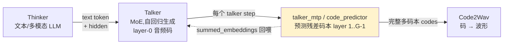
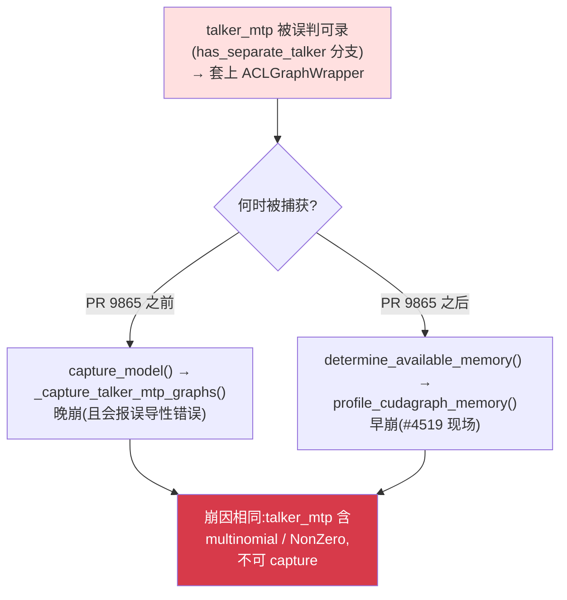

---
tags:
  - vllm-omni
  - vllm-ascend
  - Qwen3-Omni
  - talker_mtp
  - code_predictor
  - CUDAGraph
  - ACLGraph
  - NPU
  - 图安全性
---

# talker_mtp 是什么,我们面临的是什么问题

> 接着 [嵌套图捕获为什么不行(#4519)](nested-graph-capture.md):那篇讲清了"嵌套 replay 为何非法",这篇回答更上层的两个问题——**talker_mtp 到底是什么**,以及 **Qwen3-Omni 在 NPU 上崩溃的真正问题是什么、该怎么修**。结论:不是 PR 9865 制造了 bug,而是一个非 graph-safe 的子模块被错误地当成可录图,PR 9865 只是让它"早崩"。

## 一、背景:Qwen3-Omni 的三段式架构

Qwen3-Omni 是"文本→语音码→波形"的语音对话模型,推理分三段(vllm-omni 的多 stage 流水线):



| 阶段 | 角色 | 输出 |
|---|---|---|
| **Thinker** | 文本/多模态理解,产出文本 token 与 hidden state | text token + hidden |
| **Talker** | MoE,自回归地生成音频码的**第 0 层码本**(layer-0) | 每步一个 layer-0 code |
| **talker_mtp**(code_predictor) | 给定 layer-0 码 + talker hidden,**预测其余残差码本 layer 1..G-1** | 该 step 的完整 G 层码 + 回喂 embedding |
| **Code2Wav** | 多码本 codes 解码成音频波形 | waveform |

## 二、talker_mtp 是什么

**talker_mtp 是 talker 自回归解码循环里的"残差码本预测器"。** Qwen3-Omni 的音频用 **G 层码本(codebook)**表示每个音频帧:talker 主体只生成第 0 层,剩下的 layer 1..G-1 由 talker_mtp(内部即 `code_predictor`)在同一个时间步里补齐——因为一步预测多个码本,形态上类似 **MTP(multi-token prediction)**,故名 `talker_mtp`。

它在 `qwen3_omni.py:talker_mtp` 里做三件事:

1. 调 `code_predictor_forward` → 对每个 talker 位置,用 `code_predictor` 把 layer-0 码"再 prefill"成 layer 1..G-1 的残差码;
2. 把各码本的 codec embedding 求和得 `summed_embeddings`;
3. 加上 `text_step`,产出**回喂给 talker 下一步的 embedding**,并返回这一步的完整码。

`code_predictor` 内部是个小 transformer(`CodePredictorAttention` + MLP),对长度仅 `G+1` 的极短序列做 re-prefill + 内联采样(`multinomial`)。

### 关键:两层图加速栈

`code_predictor` 算子又小又多(逐码本的 AR 小循环),host 下发开销占比高,于是它**自带两层加速**:

1. `_compiled_model_fwd`(NPU 上 eager,注意力走融合算子 `npu_fusion_attention`);
2. 每 bucket 一张**自己的内层 NPU device graph**(`_capture_npu_graphs`),AR 每步 `replay()` 干掉 launch 开销。

**CodePredictorAttention 的性能,正是来自这第 2 层"code_predictor 自己的内层 device graph",与 talker_mtp 整体是否被外层图封装无关。** 记住这一点,后面修复不丢性能的根据就在这。

## 三、哪些模型支持 talker_mtp

`vllm_omni/model_executor/models/` 下定义了 `talker_mtp` 的模型共 **3 个**:

| 模型 | 文件 | `talker_mtp_graph_safe` | 有独立 talker(`self.talker`)? | code predictor | NPU 上是否被 FULL 封装 |
|---|---|---|---|---|---|
| **Fish Speech**(Slow AR) | `fish_speech/fish_speech_slow_ar.py` | ✅ `True` | 否(模型本身即 talker) | 自带 `fast_ar`(`FishSpeechFastAR`) | **会**(显式声明可录,符合预期) |
| **Qwen3-TTS**(Talker) | `qwen3_tts/qwen3_tts_talker.py` | ❌ 未设(=False) | 否(TTS 模型本身即 talker) | 共享 `common.qwen3_code_predictor` | **不会**(非 graph_safe 且无独立 talker) |
| **Qwen3-Omni** | `qwen3_omni/qwen3_omni.py` | ❌ 未设(=False) | ✅ 有 | 共享 `common.qwen3_code_predictor` | **修复前会**(踩 `has_separate_talker` 分支)→ #4519 |

要点:

1. **只有 Qwen3-Omni 触发了 bug。** Fish Speech 靠 `graph_safe=True` 被正当封装;Qwen3-TTS 既非 graph_safe 也无独立 talker,从不封装;唯独 Qwen3-Omni 有独立 talker 又没声明 graph_safe,被 `has_separate_talker` 误判。NPU 修复(只认 `talker_mtp_graph_safe`)因此只改变 Qwen3-Omni 的行为,另两个不受影响。
2. **共享 code predictor 的范围比 talker_mtp 更广。** `common.qwen3_code_predictor`(含 `CodePredictorWrapper` / `CodePredictorAttention`)被 **Qwen3-TTS、Qwen3-Omni、MOSS-TTS** 三方复用;但 **MOSS-TTS 不定义 `talker_mtp`**(直接用 `CodePredictorBaseModel`,走不同路径),不在本名单内。
3. **Fish Speech 用的是自带的 fast AR code predictor**(`fish_speech_fast_ar.py`),并做过 capture-safe 改造(commit `cb4d13a6`),所以敢声明 `talker_mtp_graph_safe=True`。

## 四、我们面临的问题

### 现象

```shell
vllm serve Qwen/Qwen3-Omni-30B-A3B-Instruct --omni --port 8091
# 启动即崩:
# RuntimeError: Cannot prepare for replay during capturing stage.
# Current npuStreamCaptureStatus: npuStreamCaptureStatusActive
```

### 根因:一个非 graph-safe 的 talker_mtp 被当成可录图

talker_mtp 内部有 **data-dependent 算子**——`multinomial` 采样、boolean-mask 赋值带出的 `NonZero`——这些在 stream capture 阶段**一律非法**。也就是说 **talker_mtp 根本不可能被 FULL 图捕获**。

但封装门控判断错了。`gpu_model_runner._init_talker_mtp`:

```python
has_separate_talker = getattr(self.model, "talker", None) is not None
talker_mtp_graph_safe = getattr(self.model, "talker_mtp_graph_safe", False)
if cudagraph_mode.has_full_cudagraphs() and (has_separate_talker or talker_mtp_graph_safe):
    self.talker_mtp = graph_wrapper_cls(talker_mtp, ..., runtime_mode=CUDAGraphMode.FULL)
```

`talker_mtp_graph_safe` 是模型自报的"我可被录图"标志(由 commit `cb4d13a6` 引入,**只有 Fish Speech 设了 `True`**)。Qwen3-Omni 没设它(=False,确实不可录),却因为 `has_separate_talker=True` 这条 OR 分支**仍被套上 FULL 图 wrapper**。

### PR 9865 只是"提前引爆",不是元凶

[vllm-ascend PR 9865](https://github.com/vllm-project/vllm-ascend/pull/9865)(对齐上游 vLLM #30515)在 `determine_available_memory()` 里**新增了一个 KV cache 分配前的图显存估算**(`profile_cudagraph_memory`)。它会在 init 期就调用一次被封装的 talker_mtp → 触发 ACL graph 捕获 → 内层 code_predictor 的 `replay()` 嵌套进外层捕获 → 崩。



要点:**determine_available_memory 是纯启动期估算,不进 serving;但崩溃就发生在这一步,服务直接起不来。** 即便没有 PR 9865,这个被误封装的 talker_mtp 在真正的 `capture_model()` 里**照样会崩**——PR 9865 只是把崩溃从"晚"提前到了"早"。根因始终是:**非 graph-safe 的 talker_mtp 被 FULL 封装了。**

## 五、修复:NPU 子类收窄图安全策略,且零性能损失

崩溃是 NPU/PTA 专属(嵌套 replay 致命)且由 vllm-ascend PR 9865 触发,因此**不动共享的 GPU 基类**,而在 `OmniNPUModelRunner` 里 override `_init_talker_mtp`:在 NPU 上**只有模型显式声明 `talker_mtp_graph_safe=True` 才封装**。

```python
# vllm_omni/platforms/npu/worker/npu_model_runner.py
def _init_talker_mtp(self) -> None:
    ...
    self.talker_mtp = talker_mtp
    self.has_talker_mtp = True
    cudagraph_mode = self.compilation_config.cudagraph_mode
    if cudagraph_mode.has_full_cudagraphs() and getattr(self.model, "talker_mtp_graph_safe", False):
        graph_wrapper_cls = current_omni_platform.get_graph_wrapper_cls()
        self.talker_mtp = graph_wrapper_cls(talker_mtp, self.vllm_config, runtime_mode=CUDAGraphMode.FULL)
    ...  # buffer 分配镜像基类
```

这与 `npu_ar_model_runner._capture_talker_mtp_graphs` 已经声明的契约一致(它的失败信息就写着 "for a model that declared `talker_mtp_graph_safe=True`")。

### 为什么不丢性能

| | talker_mtp 是否封装 | 影响 |
|---|---|---|
| Qwen3-Omni | 不封装(eager) | **零损失**——它本来就不可录图,FULL 加速从来拿不到 |
| CodePredictorAttention | 不受影响 | 加速来自 code_predictor **自己的内层 device graph**,与 talker_mtp 封装独立 |
| Fish Speech(`graph_safe=True`) | 仍封装 | 行为不变 |

不封装后,talker_mtp 在 **profiling / capture_model / runtime** 三个阶段全程 eager、合法一致;`_capture_talker_mtp_graphs` 的 `isinstance(..., ACLGraphWrapper)` 守卫自然 no-op。

## 六、一句话总结

> **talker_mtp** 是 Qwen3-Omni talker 解码循环里的残差码本预测器(code predictor),内含 `multinomial`/`NonZero` 这类不可录图的算子。**问题**是它被 `has_separate_talker` 分支误判为可录图、套上了 FULL 图 wrapper;PR 9865 新增的启动期显存估算把这个"不可录却被录"的矛盾**提前引爆**成嵌套 replay 崩溃。**修复**是让 NPU 只对显式声明 `talker_mtp_graph_safe` 的模型封装——零性能损失,因为真正的加速(CodePredictorAttention)来自 code_predictor 自己的内层 device graph。

延伸阅读:[嵌套图捕获为什么不行(#4519)](nested-graph-capture.md) · [图模式:eager / PIECEWISE / FULL](../vllm/cudagraph-modes.md) · [Qwen3-Omni 在 NPU 上是怎么跑起来的](qwen3-omni-npu.md)
