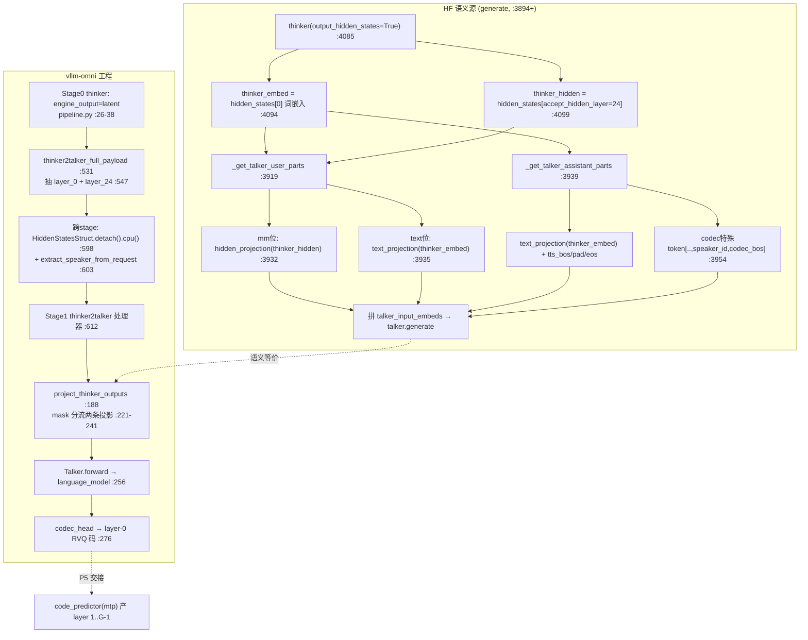

---
tags:
  - vllm-omni
  - Qwen3-Omni
  - Thinker
  - Talker
  - hidden交接
  - accept_hidden_layer
  - speaker
  - 跨stage
  - NPU
  - P4
---

# P4：Thinker hidden → Talker 交接机制

> [覆盖地图](qwen3-omni-mastery-roadmap.md) 里 ROI 第一的半缺口。[talker_mtp 图安全](talker-mtp-graph-safety.md) 讲了 Talker 的角色（P5），但「Thinker 到底把**哪个 hidden**、**怎么拼**、**speaker 怎么进来**」一直没落地。本文用 P1 同款双库对照把交接机制钉死：HF `modeling_qwen3_omni_moe.py` 读语义，vllm-omni（talker 模型 + 跨 stage 处理器）读工程。
>
> **一句话结论**：交接不是「把最后一层 hidden 喂给 Talker」这么简单，而是**三件事同时发生**——① 取的是 thinker **第 `accept_hidden_layer`（本模型=24）层**，不是最后一层；② **文本位**用 thinker **词嵌入(layer 0)** 过 `text_projection`，**多模态位**才用 layer-24 hidden 过 `hidden_projection`，两条投影 MLP 各自独立；③ **speaker 是查表 id**（如 `Ethan`→id），作为 codec 特殊 token 拼进 Talker 输入序列——**不是** ECAPA 式声学抽取（见 [ECAPA 三种 speaker conditioning 来源](audio-encoder-path.md) 的对比）。NPU 上错一处，Talker 直接产垃圾码。

## 调用链（双库对照）



## 一、HF 语义源：交接在 `generate` 里，不在某个 forward

顶层 `Qwen3OmniMoeForConditionalGeneration`（:3894）持有 `self.thinker / self.talker / self.code2wav`（:3908-3909）。交接逻辑全在 `generate`（:4000 起），分四步：

### 1. 取两个 thinker 张量：词嵌入 + 特定层 hidden

```python
thinker_kwargs["output_hidden_states"] = True                      # :4085
thinker_embed  = cat([hs[0]  for hs in thinker_result.hidden_states], dim=1)   # :4094 ← layer 0 = 词嵌入
thinker_hidden = cat([hs[self.config.talker_config.accept_hidden_layer] ...])  # :4099 ← 特定层(=24)，非最后层
```

**这是 P4 最反直觉的点**：Talker 要的深层语义取自 `accept_hidden_layer`（config 指定，本模型 24），而文本本身走的是最底层词嵌入。roadmap 里「是最后一层还是特定层、拼不拼 text embedding」——答案是**特定层 + 两者都拼，按位置分流**。

### 2. 两条独立投影 MLP

Talker hidden size ≠ Thinker，所以要投影（`Qwen3OmniMoeTalkerResizeMLP` :2372，`Linear(thinker_hidden_size → talker intermediate)` :2375）。关键是**两条各自独立**：

```python
self.text_projection   = Qwen3OmniMoeTalkerResizeMLP(config)  # :3132  给文本位/词嵌入
self.hidden_projection = Qwen3OmniMoeTalkerResizeMLP(config)  # :3133  给多模态位/深层hidden
```

### 3. 按 user / assistant 分段组装（题眼数据结构）

- **user 段**（`_get_talker_user_parts` :3919）：多模态位 `hidden_projection(thinker_hidden[mm_mask])`（:3932），文本位 `text_projection(thinker_embed[~mm_mask])`（:3935）。**逐位置 mask 分流**，和 vllm 的 `project_thinker_outputs` 一字不差。
- **assistant 段**（要被"读出来"的回复文本，`_get_talker_assistant_parts` :3939）：整段走 `text_projection(thinker_embed)`（:3942），再包上 `tts_bos/pad/eos` 和一串 **codec 特殊 token**：

```python
codec_special_tokens = [codec_nothink_id, codec_think_bos_id, codec_think_eos_id,
                        speaker_id, codec_pad_id, codec_bos_id]   # :3954-3963
input_embeds = assistant_text_hidden + assistant_codec_hidden     # :3987  文本条件 ⊕ codec 起始
```

### 4. speaker = 查表 id，作为 token 注入

```python
speaker: str = "Ethan"                                             # :4000 默认
speaker_id = self.config.talker_config.speaker_id.get(speaker.lower())  # :4029 名字→id 查表
if speaker_id is None: raise NotImplementedError(...)              # :4030 不在表里直接报错
```

`speaker_id` 就是上面 codec 序列里的一个 token（:3960）。**这坐实了 [ECAPA 那条](audio-encoder-path.md) 的判断**：Qwen3-Omni 走 enrolled-id（CustomVoice 侧），音色来自预置说话人表，没有从参考音频声学抽取——所以整个模型里没有 ECAPA 式 speaker encoder。

## 二、vllm-omni 工程源：交接被拆成「pooling 抓层 + 跨 stage 搬运 + 投影」

### 1. 流水拓扑（`pipeline.py`）

三 stage 冻结拓扑：`thinker(0) → talker(1) → code2wav(2)`。交接靠 stage0 的 `engine_output_type="latent"` + 两个回调：

```python
custom_process_next_stage_input_func = "...qwen3_omni.thinker2talker_full_payload"  # :36 生产者侧打包
# stage1:
custom_process_input_func            = "...qwen3_omni.thinker2talker"               # :47 消费者侧组装
stop_token_ids = [2150]                                                             # :53 talker EOS
```

### 2. 抓哪一层：pooling 输出的 layer_0 + layer_24

HF 的 `hidden_states[accept_hidden_layer]` 在 vllm 里变成 thinker runner 的 **pooling 输出**，按层号 key 取（`stage_input_processors/qwen3_omni.py`）：

```python
# 注释直接点名：Pooling output layer keys: "0" = word embedding, "24" = accept_hidden_layer   :36
payload = { 0:  pooling_output.get("hidden_states.layer_0"),    # :547  词嵌入
            24: pooling_output.get("hidden_states.layer_24") }  # :548  accept_hidden_layer
"hidden_states": {"output": thinker_hid_prefill.detach().cpu()}  # :598  ← 跨 stage 前落 CPU
speaker = extract_speaker_from_request(request)                  # :603  speaker 从 request 抽
```

### 3. 投影：`project_thinker_outputs`（talker 模型 :188）

HF 两个 `_get_talker_*_parts` 的位置分流，在 vllm 收敛成一个函数（`qwen3_omni_moe_talker.py`）：

```python
if is_multimodal_mask.any():                                    # :230 多模态位
    output[is_multimodal_mask]  = self.hidden_projection(thinker_hidden_states[is_multimodal_mask])
if (~is_multimodal_mask).any():                                 # :236 文本位
    output[~is_multimodal_mask] = self.text_projection(thinker_embeds[~is_multimodal_mask])
```

投影后进 `Talker.forward`（:243）→ `language_model.model` 自回归 → `codec_head`（:107/:276）出 **layer-0 RVQ 码**，即 [P5 talker_mtp](talker-mtp-graph-safety.md) 的入口（layer 1..G-1 由 code_predictor 产）。

## 三、必须钉死的数据结构

| 数据结构 | 值 / 约定 | HF 锚点 | vllm 锚点 |
|---|---|---|---|
| thinker 词嵌入 | `hidden_states[0]`，给文本位 | :4094 | layer_0 :547 |
| thinker 深层 hidden | `hidden_states[accept_hidden_layer]`，本模型=**24** | :4099 | layer_24 :548 |
| 两条投影 | `text_projection` / `hidden_projection`，各自独立 ResizeMLP | :3132-3133 | :106 |
| 位置分流约定 | mm 位→hidden_projection，文本位→text_projection | :3919-3936 | `project_thinker_outputs` :221-241 |
| speaker | 名字→id 查表（`Ethan`…），作为 codec token 注入 | :4029 / :3960 | `extract_speaker_from_request` :603 |
| codec 起始序列 | `[nothink,think_bos,think_eos,speaker_id,pad,codec_bos]` | :3954-3963 | 处理器组装 |
| talker 产物 | `codec_head` → layer-0 RVQ 码；EOS=2150 | — | :276 / :53 |

## 四、HF ↔ vllm 的 diff 缝（NPU 优先查这里）

1. **抓层机制**：HF 直接 `hidden_states[24]`（generate 内，:4099）；vllm 靠 thinker runner 的 **pooling 输出**按 key 取 layer_0/layer_24（:547-548）。**若 pooling 没捕获到第 24 层，或捕获成别的层 → Talker 收到错 hidden → 全程垃圾码**，且不报错。NPU 一号嫌疑。
2. **跨 stage device→CPU→device**：vllm 在 stage 边界 `.detach().cpu()`（:598/:484）再传给 talker stage。HF 全程同卡张量。CPU↔NPU 搬运 + dtype 是精度/对齐易错点。
3. **流式 chunk 拼接**：vllm 有 `async_chunk` 变体（:435/:265），把 thinker hidden 分块 `torch.cat` 累积（:499/:317）。分块边界拼错 → 序列错位。HF 无此复杂度（一次性 generate）。
4. **speaker 注入位置**：两边都是 id 查表 + token 注入，但 vllm 从 request/prompt 抽（:30-31），HF 是 generate 入参默认 `Ethan`。不在 speaker 表里：HF 直接 raise（:4030），vllm 需确认兜底。
5. **文本位用词嵌入而非深层 hidden**：容易想当然「都用 accept_hidden_layer」，实际文本位用 layer_0。投影搞混 → 音色/内容错乱。

## 五、待真机补的实测值

- [ ] 断 vllm `thinker2talker_full_payload`（:547）确认 `accept_hidden_layer` 实际层号（本笔记按注释记 24，跨模型规模可能变）：⟨待真机填⟩
- [ ] 断 `project_thinker_outputs`（:230/:236）确认 `is_multimodal_mask` 在纯文本 TTS 时是否全 False（即是否只走 text_projection）：⟨待真机填⟩
- [ ] 确认 `speaker_id` 表内容与 `codec_bos_id` 等特殊 token 的真实数值：⟨待真机填⟩

> 复现路径：`examples/offline_inference/qwen3_omni` 跑带语音输出的请求，在上述三处断点。

## Open questions（承接 roadmap）

- [x] Thinker→Talker 传的 hidden 是最后一层还是特定层、拼不拼 text embedding？→ **特定层(accept_hidden_layer=24) + 两者都拼、按位置分流**。P4 语义链已通。
- [ ] 该 hidden 跨 stage 是否走 [连接器/KV 数据面](distributed-connectors-kv.md)？目前看是 `HiddenStatesStruct` CPU payload（:598），非 KV connector——与骨架笔记的关系待并。
- [ ] `accept_hidden_layer=24` 在不同规模（30B vs 更大）是否变？pooling 抓层配置从哪读？
- [ ] P4→P5 边界：`codec_head` 出的 layer-0 码进 code_predictor 的确切张量布局，与 [P5 `[G,T]` 布局](talker-mtp-graph-safety.md) 对齐确认。
