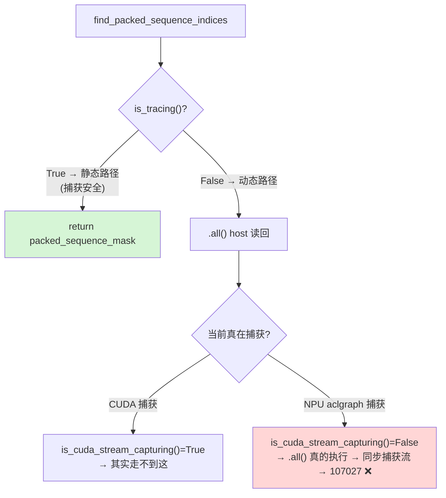

---
tags:
  - vllm-omni
  - transformers
  - is_tracing
  - stream-capture
  - ACLGraph
  - NPU
  - CUDA中心主义
  - 根因分析
---

# transformers 的 `is_tracing` 为什么在 NPU 上失灵——一个 CUDA 中心主义的根因

> 配套 [vLLM-Omni 为什么依赖 transformers](why-depend-on-transformers.md):那篇讲"依赖关系",这篇把其中最典型的一处裂缝单独拆开——`is_tracing()`。它是 Code2Wav 在 NPU 图捕获时崩溃的**直接技术根因**,也是"第三方库的 CUDA 默认假设如何泄漏成第二类后端 bug"的标准样本。

## 一、症状回顾

NPU 上捕获 Qwen3-Omni Code2Wav 时,崩在 transformers 的这一行(`masking_utils.py`):

```python
# find_packed_sequence_indices(position_ids)
packed_sequence_mask = (position_diff != 1).cumsum(-1)
if not is_tracing(packed_sequence_mask) and (packed_sequence_mask[:, -1] == 0).all():
    return None
return packed_sequence_mask
```

`(...).all()` 在 `if` 里被转成 Python bool → `_local_scalar_dense` → 同步被捕获的 stream → `Not allow to synchronize captured-stream` / 错误码 107027。

注意:**HF 其实知道这行危险**,所以前面加了 `if not is_tracing(...)` 来守它。问题是这个守卫在 NPU 上**没生效**。要搞懂为什么,得看 `is_tracing` 是干嘛的。

## 二、`is_tracing` 是什么:一个"我现在不能做动态控制流"的开关

很多 HF 模型代码里有这种"eager 快捷路径":用一次 host 读回(`.all()`/`.item()`/`if tensor:`)判断个条件,好提前返回、少算点东西。但这种 host 读回在**图化语境**下是非法或无意义的:

- `torch.compile`(dynamo)/`torch.export`:动态控制流会打断图;
- `torch.jit` / `torch.fx`:tracing 时张量是符号代理,读不出真值;
- **CUDA stream capture**:捕获态同步 stream 直接报错;
- FakeTensor / jax.jit:同理没有真值。

所以 HF 用一个统一开关 `is_tracing()` 把这些语境**一网打尽**:为真时,跳过 host 读回,改走**静态/符号路径**(多算一点但形状固定、可图化)。`find_packed_sequence_indices` 就是典型——`is_tracing()` 为真时直接 `return packed_sequence_mask`(静态张量),不做 `.all()`。

transformers 5.1.0 的实现(`transformers/utils/import_utils.py`):

```python
def is_tracing(tensor=None) -> bool:
    # dynamo(含 export)/ jit / CUDA stream capture
    _is_tracing = is_torchdynamo_compiling() or is_jit_tracing() or is_cuda_stream_capturing()
    if tensor is not None:
        _is_tracing |= is_torch_fx_proxy(tensor)
        _is_tracing |= is_fake_tensor(tensor)
        _is_tracing |= is_jax_jitting(tensor)
    return _is_tracing
```

**设计是对的**:它确实想覆盖"流捕获"这个语境(看 `is_cuda_stream_capturing()`)。坑在覆盖得**不完整**。

## 三、根因:`is_cuda_stream_capturing` 只认 CUDA

顺着 `is_cuda_stream_capturing` 看到底:

```python
def is_cuda_stream_capturing() -> bool:
    try:
        import torch
        return torch.cuda.is_current_stream_capturing()   # ← 只问 torch.cuda
    except Exception:
        return False
```

它**只问 `torch.cuda`**。而昇腾 NPU 的图捕获走的是 `torch.npu`(`torch.npu.NPUGraph` / `torch.npu.graph` / aclgraph),捕获状态要用 **`torch.npu.is_current_stream_capturing()`** 才查得到。在 NPU 上:

- `torch.cuda.is_current_stream_capturing()` 要么返回 `False`,要么抛异常被 `except` 吞掉 → 返回 `False`;
- 于是 `is_tracing()` 返回 `False`;
- 于是 `if not is_tracing(...) and (...).all()` 里的 `.all()` **照常执行** → host 同步捕获流 → 崩。

一句话:**HF 想守"流捕获",但它的"流捕获"只有 CUDA 一种;NPU 的捕获它根本看不见。**



## 四、这不是个例,是"CUDA 中心主义"的系统性模式

`is_tracing` 只是冰山一角。它背后的根问题是:

> **PyTorch 生态的"加速器抽象"长期不完整,`torch.cuda` 是历史默认,大量库把"GPU"硬编码成"CUDA"。** 第二类后端(NPU / XPU / MPS …)只要走到这些路径,就会"假阴性"——明明在图化/捕获,却被判定为不在。

同类隐患的通用形态:

| 形态 | 例子 | 在 NPU 上的后果 |
|---|---|---|
| capture 检测写死 CUDA | `torch.cuda.is_current_stream_capturing()` | 捕获态下放行了 host 读回 → 崩(本文) |
| device 默认 "cuda" | `if device.type != "cuda": return`(Code2Wav 内层图守卫) | NPU 上整条优化路径被跳过 → 退化 |
| 算子可用性按 CUDA 假定 | 默认某算子可捕获 | NPU 落到 aclop → 不可捕获 → 崩 |

所以"NPU 上的 transformers bug"往往不是某个孤立错误,而是**同一类 CUDA 假设在不同位置反复出现**。修一个会再撞下一个(我们正是先撞 `is_tracing`,再撞 `conv_transpose` 的 aclop)。

## 五、修复:按"层"归位,别在最末端打补丁

同一个根因,可以在四个层修,**越靠上游越根治**:

| 层 | 修法 | 评价 |
|---|---|---|
| **transformers(最根)** | 把 `is_tracing` / `is_cuda_stream_capturing` 改成**设备无关**:用 `torch.accelerator` 查当前加速器,或提供"capture 检测"注册钩子让各后端自注册 | 一劳永逸,惠及所有非 CUDA 后端;需上游 PR |
| **torch_npu** | 让 `torch.cuda.is_current_stream_capturing()` 在 NPU 上正确返回(若 torch_npu 对 `torch.cuda` 做了 shim),或让 transformers 改查 `torch.npu` | 治本之一,取决于 torch_npu 的 cuda 兼容层覆盖度 |
| **vllm-ascend(最佳近期落点)** | 平台层 monkeypatch:把 `is_cuda_stream_capturing` 包一层,OR 上 `torch.npu.is_current_stream_capturing()` | vllm-ascend 本就大量 patch transformers 做昇腾适配,这里收敛最合理,惠及所有模型 |
| **vllm-omni(当前止血)** | 在 NPU runner 启动时打同样的 patch | 能跑,但"omni 偷偷改 transformers"不是正经归属,应上移到 vllm-ascend |

### 一个关键的工程坑:patch 要打对模块

`is_tracing` 和 `is_cuda_stream_capturing` **都定义在 `transformers.utils.import_utils`**,而 `is_tracing` 在调用时从**自己所在模块(import_utils)的 globals** 解析 `is_cuda_stream_capturing` 这个名字。所以:

- ✅ 正确:patch `transformers.utils.import_utils.is_cuda_stream_capturing`
- ❌ 无效:patch `transformers.masking_utils.is_cuda_stream_capturing`(masking_utils 只 `import is_tracing`,根本没有 `is_cuda_stream_capturing` 这个属性,改它不影响 `is_tracing` 的解析)

止血 patch 的核心逻辑(语义正确、捕获外零开销):

```python
import torch
import transformers.utils.import_utils as iu

_orig = iu.is_cuda_stream_capturing

def _is_accel_stream_capturing() -> bool:
    try:
        if _orig():            # 仍尊重 CUDA
            return True
    except Exception:
        pass
    try:
        return bool(torch.npu.is_current_stream_capturing())   # 补上 NPU
    except Exception:
        return False

iu.is_cuda_stream_capturing = _is_accel_stream_capturing
```

打了之后:捕获态 `is_tracing()=True` → `find_packed_sequence_indices` 走静态路径返回 `[[0,...,0]]`(对非打包输入与 `None` 语义等价)→ 不再 host 同步;**捕获外 `torch.npu.is_current_stream_capturing()=False`,行为与性能完全不变。**

## 六、给"第二类后端"的可复用排查清单

遇到"在 CUDA 上好好的、在 NPU 上崩在第三方库里"的问题,按这个清单查:

1. **崩点是不是 host 读回**:`.item()` / `.all()` / `.any()` / `.tolist()` / `if tensor:` / `int(t)` / `bool(t)`,在捕获态都会同步 stream。
2. **上游有没有"tracing/compiling/capturing"守卫**:有的话,确认它**认不认 NPU**(大概率只认 CUDA)。
3. **grep 这些 CUDA 硬编码**:`is_current_stream_capturing`、`device.type == "cuda"`、`torch.cuda.` 直接调用。
4. **确认捕获 API**:NPU 用 `torch.npu.is_current_stream_capturing()` / `torch.npu.NPUGraph`,别假设 `torch.cuda` 能代理。
5. **决定修复层级**:能上游就上游(transformers/torch_npu),次选平台层(vllm-ascend),最后才是应用层(omni)止血,并标注根因 + issue。

## 七、结论

- `is_tracing` 的**设计意图是对的**(把"不能做动态控制流"的语境统一拦截),**实现却带着 CUDA 中心假设**:它的"流捕获"只有 `torch.cuda` 一种。
- 这不是孤立 bug,而是 PyTorch 生态"加速器抽象不完整 + CUDA 是历史默认"在 transformers 里的一次具体显形;NPU 等第二类后端会反复踩同型坑。
- 正确修法是**按层归位**:根治在 transformers/torch_npu,平台适配收敛到 vllm-ascend,omni 只留薄止血层。
- 工程上记住两点:**host 读回 + CUDA 中心守卫**是这类崩溃的固定组合;patch 要打到符号**解析所在的模块**(`import_utils`),不是调用方模块(`masking_utils`)。

> 一句话:**`is_tracing` 不是不想保护你,是它眼里的"加速器"只有 CUDA;在 NPU 上,你得替它把另一只眼睛装上。**

---

**延伸阅读**

- [vLLM-Omni 为什么依赖 transformers](why-depend-on-transformers.md)——依赖关系全景,本问题是其中一处裂缝
- [talker_mtp 是什么与我们面临的问题](talker-mtp-graph-safety.md)——另一类捕获不安全:NonZero / multinomial / `.item()`
- [嵌套图捕获为什么不行（#4519）](nested-graph-capture.md)——捕获态的合法/非法操作
- [Omni 平台无关/相关解耦：现状与演进](platform-decoupling.md)——平台相关代码该收敛到哪一层
