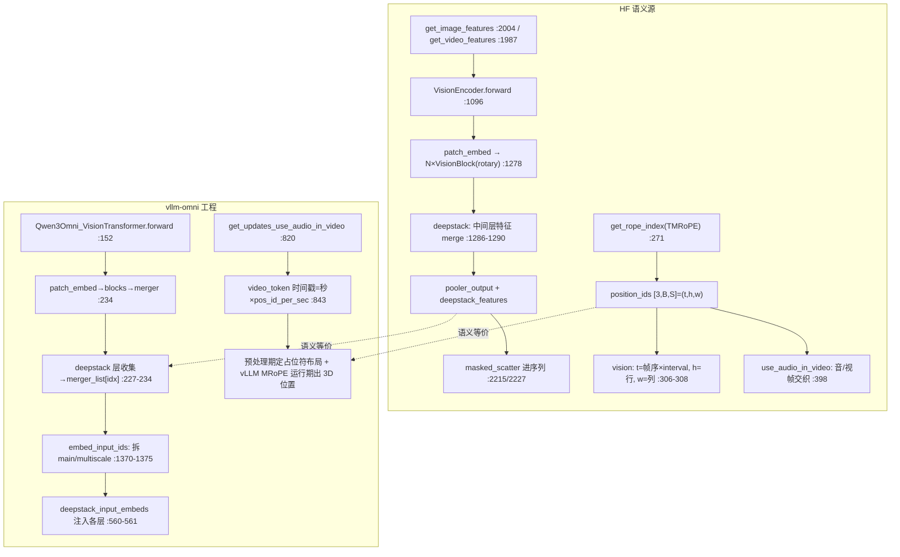

---
tags:
  - vllm-omni
  - Qwen3-Omni
  - ViT
  - TMRoPE
  - deepstack
  - 位置编码
  - use_audio_in_video
  - NPU
  - P2
---

# P2：图/视频 → ViT → embedding，以及 TMRoPE 怎么给音视频对齐时间戳

> [覆盖地图](qwen3-omni-mastery-roadmap.md) 里最后一个语义缺口。补完这条，七路全线打通。方法同 [P1 音频](audio-encoder-path.md) / [P4 交接](thinker-talker-handoff.md)：HF 读语义、vllm-omni 读工程。
>
> **一句话结论**：这条路有**两个题眼，一个可黑盒、一个必须钉死**。① 视觉 ViT 本体继承上游 Qwen3-VL，「进图出 embedding」即可黑盒——Qwen3-Omni 特有的只是 **deepstack 多尺度**（从中间层抽特征、各自 merge、拼进主 embedding）。② **TMRoPE 才是 Omni 区别于普通 VLM 的真题眼**：位置不是一维递增，而是 `[3, batch, seq]` 的 **(时间, 高, 宽)** 三维张量；音视频靠 `temporal = 帧序 × interval` 对齐到同一时间轴，`use_audio_in_video` 时音频帧和视频帧还要交织编号。NPU 上位置算错 → 时间错位、音画不同步，且不报错。

## 调用链（双库对照）



## 一、视觉路径：ViT 可黑盒，deepstack 是 Omni 特色

### 1. ViT 本体：继承上游，第一遍别陷进去

vllm `Qwen3Omni_VisionTransformer`（:137）继承上游 `Qwen3_VisionTransformer`，子类只为修 `sequence_lengths` 参数兼容（docstring :138）。前向（:152）标准 ViT：`patch_embed → 可选 abs pos → N×VisionBlock(带 rotary_pos_emb) → merger`。**patch 动态分辨率细节按 roadmap 减法原则黑盒**，知道「进 pixel_values + grid_thw，出 `[patches, hidden]`」即可。HF 对应 `Qwen3OmniMoeVisionEncoder`（:1096）。

### 2. deepstack 多尺度：Qwen3-Omni 特有，且和 P1 scatter 联动

真正要看的是 deepstack。ViT 在 `deepstack_visual_indexes` 指定的**中间层**额外抽特征，各自过独立 merger：

```python
# vllm :227-234
if layer_num in deepstack_visual_indexes:
    hidden_states_list.append(hidden_states)          # 中间层特征
...
hidden_states = self.merger(hidden_states)            # 主特征
for idx, x_ds in enumerate(hidden_states_list):
    x_ds = self.merger_list[idx](x_ds)                # 各尺度独立 merge
```

产出的视觉 embedding **最后一维是 `visual_dim × (multiscale_len+1)`**（主 + 各 deepstack 层拼一起）。回到 [P1 讲过的 `embed_input_ids`](audio-encoder-path.md)：:1370-1375 按 `shape[-1] != text_hidden` 判定是视觉，`torch.split` 出主尺度和多尺度，多尺度经 `_merge_multimodal_embeddings` 写进 `deepstack_input_embeds`（:1392），再在 backbone 的指定层 `hidden_states += deepstack_input_embeds[layer]`（:560-561）注入。**这是视觉相对音频多出来的一条旁路**——音频只 scatter 主 embedding，视觉还额外把多尺度特征喂进 backbone 中间层。

## 二、TMRoPE：3D 位置张量，音视频对齐的题眼

HF `get_rope_index`（:271）是语义真相，docstring（:284-312）直接画出了排布规律。

### 1. 位置张量形状与语义

返回 `position_ids` 形状 **`[3, batch, seq]`**，3 = (temporal, height, width)：

- **纯文本**：三维相同、一维递增，退化成普通 RoPE（`[0,1,2,3,4]` ×3）。
- **视觉**（docstring :305-311 示例）：
  - temporal：`帧序 × interval`，`interval = tokens_per_second × temporal_patch_size / fps`（例 `25×2/1=50`），→ `[0,0,0,0, 50,50,50,50, 100,...]`，**同一帧内 t 不变**，跨帧跳 interval。
  - height / width：帧内的行/列号，`h=[0,0,1,1,...]`、`w=[0,1,0,1,...]`。
  - 文本接在视觉后：从 `max(vision pos)+1` 起续（:312/380）。

关键 config：`position_id_per_seconds`（:344）、`spatial_merge_size`（:338）。返回还带 `mrope_position_deltas`（:336）供增量 decode 对齐。

### 2. use_audio_in_video：音频帧和视频帧交织编号

`use_audio_in_video=True` 时，同一段视频的音轨和画面要在**同一时间轴上交替**排位置（:367-398）：`video_nums` 改数 `audio_start_token`（:368），交织处 `bos_len=eos_len=2`（:398）。这是 Qwen-Omni 相对普通 VLM 的独门逻辑——普通 VLM 没有"视频里的声音"这个模态耦合。

### 3. vllm 侧：占位符布局预处理算，3D 位置运行期出

vllm **重写了** `use_audio_in_video` 处理（thinker :767 注释明说 *"Qwen3-Omni reimplements this function to handle use_audio_in_video"*）。`get_updates_use_audio_in_video`（:820）在**多模态预处理期**算好占位符交织布局，视频 token 时间戳 = `second_per_grid_t × position_id_per_seconds`（:843），在 prompt update 阶段应用（:936）。而喂给模型的 `[3,B,S]` 位置张量走 vLLM 通用 **MRoPE**（`SupportsMRoPE`）在运行期生成。**即：交织/占位符布局是预处理产物，3D 位置张量是运行期产物**——这一点回答了 roadmap 的 Open question 2（部分，运行期具体函数待真机确认）。

## 三、必须钉死的数据结构

| 数据结构 | 值 / 约定 | HF 锚点 | vllm 锚点 |
|---|---|---|---|
| 位置张量 | `position_ids [3, batch, seq]`=(t,h,w) | :335/351 | vLLM MRoPE |
| 视觉时间步长 | `interval = tokens_per_second×temporal_patch_size/fps`（例 50） | :304 | `pos_id_per_sec` :843 |
| 视觉 grid | `image/video_grid_thw [n,3]`=(t,h,w) | :318-321 | 同 |
| deepstack 多尺度维 | 视觉 embed 末维 = `visual_dim×(multiscale_len+1)` | :1136 | `multiscale_dim` :1182 |
| deepstack 注入 | 多尺度写 `deepstack_input_embeds`，backbone 指定层相加 | :1278-1290 | :560-561 |
| 音视频交织 | `use_audio_in_video` 时音/视帧交替编号，bos/eos_len=2 | :398 | `get_updates_use_audio_in_video` :820 |

## 四、HF ↔ vllm 的 diff 缝（NPU 优先查这里）

1. **TMRoPE 预处理 vs 运行期分工**：HF 在 `get_rope_index` 一把算完；vllm 拆成「预处理定占位符交织布局（:820/:936）+ 运行期 MRoPE 出 3D 位置」。两段任一处 `position_id_per_seconds`/`interval` 不一致 → 音视频时间错位。**NPU 一号嫌疑**。
2. **use_audio_in_video 被重写**：vllm 显式 reimplement（:767），与 HF 逻辑须逐位对齐；交织边界（bos/eos_len=2）易错。
3. **deepstack 旁路**：视觉比音频多一条「多尺度特征注入 backbone 中间层」（:560-561）。层号 `deepstack_visual_indexes` 抓错 / split 维度算错 → 视觉质量塌，且不报错。
4. **视觉 embed 末维判定**：`embed_input_ids` 靠 `shape[-1] != text_hidden` 区分视觉 vs 音频（:1370）。若 deepstack 拼接维度不对，音频/视觉分流会错。
5. **grid_thw 与占位符数一致**：视觉占位符数须等于 ViT 输出 patch 数（同 [P1](audio-encoder-path.md) 音频帧数对齐问题的视觉版）。

## 五、待真机补的实测值

- [ ] 断 vLLM MRoPE 出口，dump 一个含视频的请求的 `position_ids[3,:,:]`，比对 HF `get_rope_index` 同输入产物是否逐元素一致：⟨待真机填⟩
- [ ] 确认 `deepstack_visual_indexes` 实际层号 + 视觉 embed 末维 `visual_dim×(multiscale_len+1)` 的真实数值：⟨待真机填⟩
- [ ] `use_audio_in_video=True` 时，音/视帧交织后的 temporal position 是否与音频真实时长对齐：⟨待真机填⟩

> 复现路径：`examples/offline_inference/qwen3_omni` 跑「视频 + use_audio_in_video」请求，在 MRoPE 出口与 deepstack split 处断点。

## Open questions（承接 roadmap）

- [x] TMRoPE 在 vllm-omni 里预处理算还是 runtime 算？→ **占位符交织布局预处理算（:820），3D 位置张量运行期 MRoPE 出**。运行期具体函数待真机钉。
- [ ] NPU 上是否有 MRoPE 专用 kernel，还是走通用 elementwise？位置张量 `[3,B,S]` 的 device 计算开销。
- [ ] deepstack 中间层注入与 ACLGraph 图捕获的关系：多尺度相加发生在 backbone 内，是否落在 [图安全](talker-mtp-graph-safety.md) 关注的捕获边界内？
