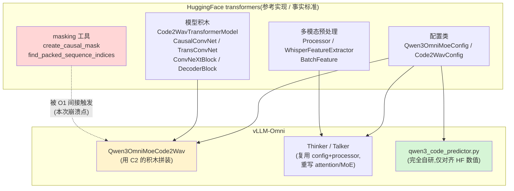

---
tags:
  - vllm-omni
  - transformers
  - Qwen3-Omni
  - Code2Wav
  - masking
  - ACLGraph
  - NPU
  - 依赖关系
---

# vLLM-Omni 为什么依赖 transformers——从一个 Code2Wav 捕获崩溃说起

> 接着 [嵌套图捕获为什么不行(#4519)](nested-graph-capture.md) 和 [talker_mtp 是什么与我们面临的问题](talker-mtp-graph-safety.md):那两篇讲"图捕获里哪些算子不能录"。这篇换一个角度——**为什么 vLLM-Omni 明明是个推理引擎,却深度依赖 HuggingFace transformers**,以及这种依赖在 NPU 上会以什么形式"反咬一口"。用一个真实崩溃当线索:Qwen3-Omni 的 Code2Wav 在 NPU 图捕获时崩在了 transformers 的 masking 代码里。

## 一、一个 bug 引出的问题

在 NPU 上启动 Qwen3-Omni,profiling 通过了,却在 `capture_model`(真正录图)阶段崩溃。完整调用栈一路从 vLLM 的捕获流程钻进了 **transformers 库内部**:

```text
_dummy_run → self.model(...)                         # vLLM-Omni:外层 stage FULL aclgraph 捕获
  └─ qwen3_omni.forward → generate_audio
      └─ code2wav.chunked_decode_streaming → forward
          └─ self.pre_transformer(inputs_embeds=hidden)        # ← 这是一个 transformers 模块
              └─ transformers/modeling_qwen3_omni_moe.py: create_causal_mask(...)
                  └─ transformers/masking_utils.py: find_packed_sequence_indices(position_ids)
                      └─ if not is_tracing(...) and (packed_sequence_mask[:, -1] == 0).all():
                          # .all() → bool(tensor) → _local_scalar_dense → 同步被捕获的 stream → 107027 崩溃
```

崩溃点 `(packed_sequence_mask[:, -1] == 0).all()` 不在 vLLM-Omni 的代码里,也不在 vllm-ascend 里,**在 transformers 的 `masking_utils.py`**。这立刻引出一个问题:一个号称"重写了模型、自己管图、自己做 kernel"的推理引擎,**为什么会在自己的图捕获里跑到 transformers 的函数?**

答案是:**vLLM-Omni 并没有把模型从零重写,它大量复用 transformers 的实现。** Code2Wav 的 `pre_transformer` 字面上就是一个 transformers 类的实例。

## 二、vLLM-Omni 到底依赖 transformers 的什么

依赖不是"装个包"那么浅,而是分层渗透进模型定义、预处理、配置、权重的方方面面。以 Qwen3-Omni 为例:



具体落到代码(`vllm_omni/model_executor/models/qwen3_omni/`):

| 依赖层 | 来自 transformers 的东西 | vLLM-Omni 怎么用 |
|---|---|---|
| **配置** | `Qwen3OmniMoeConfig`、`Qwen3OmniMoeCode2WavConfig` | 直接当作 `model_config.hf_config`,决定层数/维度/采样率等全部结构 |
| **模型积木** | `Qwen3OmniMoeCode2WavTransformerModel`、`CausalConvNet`、`CausalTransConvNet`、`ConvNeXtBlock`、`DecoderBlock` | **Code2Wav 直接 import 这些类拼出自己**(`pre_transformer`、`upsample`、`decoder` 全是 HF 积木) |
| **masking 工具** | `create_causal_mask` / `find_packed_sequence_indices` | 不是显式调用,而是**藏在 HF 模块的 forward 里**被间接触发(本次 bug 即此) |
| **多模态预处理** | `processing_qwen3_omni_moe`、`WhisperFeatureExtractor`、`BatchFeature` | Thinker 侧的音频/图像/文本预处理 |
| **权重与版本** | checkpoint 的命名约定、`transformers.__version__` | 权重加载映射、按版本做兼容分支 |

全仓有 **130+ 个文件** import transformers。这说明依赖是**结构性**的,不是边角料。

## 三、为什么要这样依赖——四个动机

vLLM-Omni 是"在 vLLM 引擎上跑 Omni 多模态模型"的项目,它选择**复用 transformers 而非全自研**,理由很实在:

1. **模型覆盖速度**。Omni 模型(Qwen3-Omni、TTS、各种 VL)更新极快,且结构复杂(thinker+talker+code2wav 三段)。HF 通常是新模型的**首发参考实现**。复用积木意味着新模型几天就能跑,而不是几周重写。

2. **数值保真**。语音/扩散这类模型对数值误差敏感(误差会沿自回归步累积成可听的杂音)。直接用 HF 的层 = 天然对齐参考实现的数值。omni 自研的 `code_predictor` 文件头甚至专门写了"HF-numerics-compatible layers",就是因为一旦自研就必须**逐算子对齐 HF**,成本很高。

3. **配置与权重兼容**。HF 的 config 类和 checkpoint 命名是**事实标准**。复用它们,用户的 HF 权重能直接加载,不用做转换。

4. **预处理生态**。多模态输入(音频重采样、图像 patch、chat template)的预处理逻辑庞杂且易错,HF 的 Processor/FeatureExtractor 是经过广泛验证的现成件。

一句话:**transformers 是 Omni 模型的"参考实现 + 事实标准 + 生态入口",复用它是用工程时间换正确性和覆盖面。**

## 四、依赖的代价:这个 bug 就是教科书案例

复用 HF 积木的代价是——**你也继承了 HF 的假设和局限**。本次崩溃精确暴露了这一点:

- **HF 假设"加速器=CUDA"**。`find_packed_sequence_indices` 里那行 `(...).all()` 是数据依赖的 host 读回,HF **知道**它在图捕获时危险,所以用 `is_tracing()` 守着——但 `is_tracing()` 只认 `torch.cuda.is_current_stream_capturing()`,**完全不知道昇腾 NPU 的 aclgraph 捕获**。于是在 CUDA 上岁月静好的代码,在 NPU 上直接同步被捕获的 stream → 崩。

- **依赖越深,泄漏越深**。Code2Wav 因为是"用 HF 积木拼的",HF 模块内部的 masking 逻辑就成了 vLLM-Omni 捕获图的一部分。omni 自己**根本没写**那行 `.all()`,却要为它的后果买单。

- **修复也被迫"打补丁到上游"**。我们当时的临时修法,本质都是绕 HF/torch_npu 的假设:让 `is_cuda_stream_capturing` 认识 NPU 捕获、把 Code2Wav 的转置卷积从不可捕获的 aclop 切到 aclnn(`allow_internal_format=False`)。这些都不是 omni 的"正经实现",而是**为上游的平台假设兜底**。真正的根因在 transformers(CUDA 中心主义)和 torch_npu/CANN(缺 aclnn 算子),omni 只是最先撞上的人。

> 这正是"依赖"的双刃:transformers 帮你快速跑起模型,但它的每一个 **CUDA 默认假设**,都可能在 NPU 这种第二类后端上变成你的 bug。

## 五、依赖的边界:omni 重写了什么,复用了什么

值得注意的是 vLLM-Omni **并非无脑全盘复用**,而是有一条清晰的取舍线——这条线本身就解释了"为什么会撞上这个 bug":

| 组件 | 策略 | 原因 |
|---|---|---|
| **Thinker / Talker 的 attention、MoE** | **重写**(vLLM 的并行/分页/量化算子) | 这是性能与显存的核心,必须用 vLLM 的 kernel 和 KV-cache 体系 |
| **code_predictor(talker_mtp)** | **完全自研**,仅对齐 HF 数值 | 自回归热点 + 需要自管 NPU 图,值得花成本重写 |
| **Code2Wav** | **复用 HF 积木拼装** | vocoder 不是主要热点,重写性价比低 → 于是**继承了 HF masking 的 NPU 不兼容** |

换句话说:**omni 在"性能关键路径"上重写、在"非热点"上复用**。Code2Wav 被划到了"复用"一侧,所以它把 HF 的 CUDA 假设也一起带进了 NPU 执行——bug 出在这里不是偶然,而是这条取舍线的必然结果。

对照 vLLM 主仓也是同理:vLLM 重写 LLM 的 attention/采样以求极致吞吐,但 config、tokenizer、processor、不少视觉塔仍然依赖 transformers。**"重写热点、复用其余"是 vLLM 系项目的通用范式**,Omni 只是把这个范式延伸到了语音/多模态,并因此延伸到了 NPU 上的兼容性风险。

## 六、结论与启示

1. **vLLM-Omni 依赖 transformers 是设计选择,不是偶然**:用复用换"模型覆盖速度 + 数值保真 + 权重/预处理兼容"。

2. **依赖是分层、深入到 forward 内部的**:不只是 config,连模型积木和 masking 这种执行期逻辑都来自 HF。所以 HF 的运行期假设会直接出现在 omni 的执行路径里。

3. **代价集中在"第二类后端"(NPU)**:transformers 的 CUDA 中心假设(`is_tracing`/`is_cuda_stream_capturing`)、torch_npu 的算子缺口(aclnn conv_transpose),都会通过这层依赖泄漏成 omni 的崩溃。

4. **正确的修复方向是"分层归位"**:能上游的上游(transformers 做设备无关捕获检测、torch_npu 补 aclnn),平台相关的收敛到 vllm-ascend,omni 自身只保留薄薄的适配层。临时打的补丁要标注根因与上游 issue,别让它伪装成正经实现。

> 一句话总结:**vLLM-Omni 站在 transformers 的肩膀上快速支持 Omni 模型,但 transformers 的肩膀是按 CUDA 浇筑的——在 NPU 上,你既继承了它的高度,也继承了它的裂缝。**

---

**延伸阅读**

- [嵌套图捕获为什么不行(#4519)](nested-graph-capture.md)——图捕获里哪些操作非法
- [talker_mtp 是什么与我们面临的问题](talker-mtp-graph-safety.md)——非 graph-safe 子模块的判定
- [Omni 平台无关/相关解耦:现状与演进](platform-decoupling.md)——平台相关代码该收敛到哪一层
- [图模式:eager / PIECEWISE / FULL](../vllm/cudagraph-modes.md)——FULL 捕获的代价与边界
