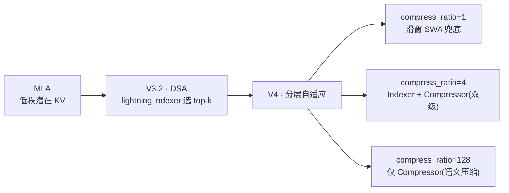
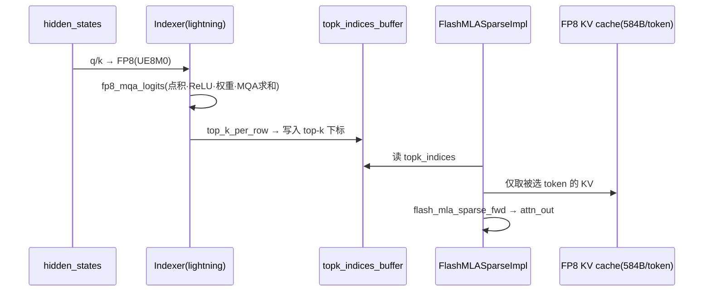

---
tags:
  - vLLM
  - DeepSeek
  - DeepSeek-V4
  - MLA
  - DSA
  - 稀疏注意力
  - MoE
  - 从原理到实现
---

# DeepSeek V4 Flash:从原理到 vLLM 实现(含昇腾落地)

> **版本**:v1 · 2026-07 · 对齐基线 `vllm 6c427dd40 · vllm-ascend 12c8da7a`
> **数据来源声明**:DeepSeek V4 晚于本人知识截止,本文**全部以本地源码树 `~/git/vllm_omni/{vllm,vllm-ascend}` 的真实实现为准**,不凭记忆推测。类名/结构可靠,`file:line` 为基线 SHA 下的位置,行号可能随版本漂移。
> **三层结构**:① 原理 → ② vLLM(GPU)实现 → ③ 昇腾 NPU 落地。

## 文档概述

- **面向读者**:想从「机制原理」一路读到「vLLM 里到底怎么写的」,并关心昇腾适配的工程读者。
- **阅读指引**:先读 [§一 演进](#evolution) 建立坐标,再按 [§二 原理](#principles) → [§三 vLLM 实现](#vllm-impl) → [§四 昇腾落地](#npu) 纵深。每个机制都遵循「原理一段 → 代码 hunk(带 file:line)」。
- **一句话抓住 V4 Flash**:在 MLA(低秩 KV)之上叠加**分层自适应稀疏**(`compress_ratio ∈ {1,4,128}`:轻则滑窗、中则 indexer 选 top-k、重则语义压缩),并由 **FlashMLA Sparse** 内核 + **FP8 KV cache** 把长上下文的访存/算力打下来。
- **关联板块**:原理侧见 [LLM 基础 · 注意力变体](../llm-basics/attention-variants.md) 与 [MoE 基础](../llm-basics/moe-basics.md);昇腾对齐侧见 [NPU 适配](../npu-adaptation/index.md)。

## 一、从 V3 到 V4:稀疏化的演进 { #evolution }

| 模型 | 注意力 | 稀疏机制 | vLLM 承载 |
|---|---|---|---|
| DeepSeek-V2/V3 | **MLA**(低秩潜在 KV) | 无(全序列) | `models/deepseek_v2.py` |
| DeepSeek-V3.2 | MLA | **DSA**:单一 lightning indexer 全局选 top-k | 同上,`is_v32 = hasattr(config,"index_topk")` |
| **DeepSeek-V4** | MLA | **分层自适应**:indexer + **Compressor**,`compress_ratio ∈ {1,4,128}` | 独立包 `vllm/models/deepseek_v4/` |

演进主线一句话:**V3 省 KV(MLA)→ V3.2 省注意力范围(DSA 选 token)→ V4 让稀疏"按层自适应"并加入 KV 语义压缩**。



## 二、原理层:四个核心机制 { #principles }

### 2.1 MLA(Multi-head Latent Attention)—— 低秩潜在 KV

**要解决的问题**:标准 MHA 的 KV Cache 随头数×层数线性膨胀,长上下文下访存爆炸([回顾](../llm-basics/attention-variants.md))。
**做法**:不直接存每头的 K/V,而是把隐状态投影到一个**低秩潜在空间** `kv_lora_rank`,存潜在向量;用时再用上投影 B 展开。Q 同样走 `q_lora_rank` 低秩。RoPE 只作用在一小段维度上(`qk_rope_head_dim=64`),与不带位置的 NoPE 部分分离。

### 2.2 DSA(DeepSeek Sparse Attention)—— lightning indexer

**要解决的问题**:即便有了 MLA,注意力仍要遍历全部历史 token,长上下文是 O(N)。
**做法**:用一个**廉价的指示器**先给每个 query 对所有 context token 打分(FP8 MQA logits:点积 → ReLU → 逐头权重 → 跨头求和),再选出 **top-k**(如 ~2048)个最相关 token;真正的注意力**只在这 top-k 上算**。指示器用 FP8 是为了"打分要快到几乎免费"。

### 2.3 分层自适应压缩(V4 相对 V3.2 的关键跃迁)

V4 不再"一刀切"用一个全局 indexer,而是**每层按 `compress_ratio` 选择策略**:

| `compress_ratio` | 策略 | 含义 |
|---|---|---|
| 1 | 滑窗 SWA 兜底 | 局部注意力,不压缩 |
| 4(C4) | **Indexer + Compressor** 双级 | 先压 4:1,再 top-k 选择 |
| 128(C128) | **仅 Compressor** | 128:1 语义压缩,不再 indexer |

**Compressor** 把连续 `compress_ratio` 个 token 压成 1 个,配合 **APE(Adaptive Positional Embedding)** 补偿位置信息,并在压缩后做 RMSNorm + RoPE + FP8 量化再写 cache。

### 2.4 MoE

标准 DeepSeek MoE:`gate` 路由(V3 起用 `noaux_tc` 门控偏置)→ 每 token 选 Top-K 路由专家 + 常驻**共享专家**,由 `FusedMoE` 承载,支持专家分组(`n_group`/`topk_group`)。工程侧负载均衡见 [EPLB 笔记](../vllm-omni/snippets/eplb-inheritance.md)。

## 三、vLLM 实现层(GPU) { #vllm-impl }

### 3.1 模型注册与平台分派

`DeepseekV4ForCausalLM` 注册到**独立包** `vllm/models/deepseek_v4/`(不同于 V2/V3 的 `model_executor/models/deepseek_v2.py`),入口按平台分派:

```python
# vllm/models/deepseek_v4/__init__.py:17-25
if current_platform.is_rocm():
    from .amd.model import DeepseekV4ForCausalLM
elif current_platform.is_xpu():
    from .xpu.model import DeepseekV4ForCausalLM
else:
    from .nvidia.model import DeepseekV4ForCausalLM  # 默认 NVIDIA
```

V3/V3.2 则复用 `deepseek_v2.py`,靠配置字段区分:

```python
# model_executor/models/deepseek_v2.py:999
self.is_v32 = hasattr(config, "index_topk")   # index_topk 存在即 V3.2/V4 稀疏路径
```

### 3.2 MLA 实现

低秩投影(Q 走 `q_lora_rank`,KV 走 `kv_lora_rank`),以及 NoPE/RoPE 分离:

```python
# deepseek_v2.py:960-967  KV 低秩 → 上投影展开
self.kv_a_layernorm = RMSNorm(self.kv_lora_rank, eps=...)
self.kv_b_proj = ColumnParallelLinear(
    self.kv_lora_rank,
    self.num_heads * (self.qk_nope_head_dim + self.v_head_dim),
)

# deepseek_v2.py:541-556  只对 q_pe/k_pe 施加 RoPE,NoPE 部分不带位置
q_nope, q_pe = q.split([self.qk_nope_head_dim, self.qk_rope_head_dim], dim=-1)
kv_a, _ = latent_cache.split([self.kv_lora_rank, self.qk_rope_head_dim], dim=-1)
q_pe, k_pe = self.rotary_emb(positions, q_pe, k_pe)
```

### 3.3 DSA 指示器实现

`Indexer` 把 Q/K 量化为 FP8(UE8M0 分块量化),再交给 `SparseAttnIndexer` 算 top-k:

```python
# deepseek_v2.py:729-741  Q 分块 FP8 量化 + 权重缩放
q_fp8, q_scale = per_token_group_quant_fp8(q, self.quant_block_size, use_ue8m0=True)
weights = weights.unsqueeze(-1) * q_scale * self.softmax_scale * self.n_head**-0.5

# deepseek_v2.py:665-674  指示器算子(topk_tokens 来自 config.index_topk)
self.indexer_op = SparseAttnIndexer(
    self.k_cache, self.quant_block_size, self.scale_fmt,   # "ue8m0"
    self.topk_tokens, self.head_dim, self.max_model_len,
    self.max_total_seq_len, self.topk_indices_buffer,
)
```

指示器的打分内核(prefill 走 `fp8_fp4_mqa_logits`,decode 走 paged 版),核心是"点积→ReLU→逐头权重→跨头求和(MQA)":

```python
# v1/attention/ops/triton_fp8_mqa_logits.py:120-132  (节选)
scores = tl.dot(q_block, kv_block, input_precision="ieee")
scores = scores * kv_scales[None, :]   # 反量化
scores = tl.maximum(scores, 0.0)       # ReLU
scores = scores * w_block              # 逐头权重
scores = tl.sum(scores, axis=0)        # MQA:跨头求和 → [M,N] logits
```

`SparseAttnIndexer` 注册为 custom op,**原地写** `topk_indices_buffer`:

```python
# model_executor/layers/sparse_attn_indexer.py:397-403
direct_register_custom_op(
    op_name="sparse_attn_indexer",
    op_func=sparse_attn_indexer,
    mutates_args=["topk_indices_buffer"],   # 输出:每个 query 的 top-k token 下标
    ...
)
```

### 3.4 V4 Attention / Compressor

V4 的 `DeepseekV4Attention` 按 `compress_ratio` **有条件地**装配 indexer 与 compressor:

```python
# vllm/models/deepseek_v4/attention.py:248-268  仅 C4 装 indexer
if self.compress_ratio == 4:
    self.indexer = DeepseekV4Indexer(..., compress_ratio=self.compress_ratio, ...)

# attention.py:309-318  compress_ratio>1 装 compressor
if self.compress_ratio > 1:
    self.compressor = DeepseekCompressor(
        vllm_config, compress_ratio=self.compress_ratio,
        hidden_size, head_dim, rotate=True, ...)
```

Compressor 的压缩流水:分离 KV/Score → APE 融合 → 存中间态 → 融合内核(压缩→RMSNorm→RoPE→FP8 量化→写 cache):

```python
# vllm/models/deepseek_v4/compressor.py:220-237  APE + 融合 wkv/wgate
self.ape = nn.Parameter(torch.empty((compress_ratio, self.coff*self.head_dim), ...))
self.fused_wkv_wgate = MergedColumnParallelLinear(
    self.hidden_size, [self.coff*self.head_dim, self.coff*self.head_dim])
# compressor.py:274-399 forward:compress_norm_rope_store_fn(... compress_ratio ...)
```

### 3.5 "Flash":FlashMLASparse 后端 + FP8 KV cache

"Flash" 指 `FlashMLASparseBackend`(`get_name() == "FLASHMLA_SPARSE"`,bf16,支持 `fp8_ds_mla` cache)。它的 **FP8 cache 布局**(源码 NOTE,V4 每 token **584 字节**)是理解性能的关键:

| 段 | 大小 | 内容 |
|---|---|---|
| NoPE | 448 B | 448 个 `float8_e4m3` |
| RoPE | 128 B | 64 个 `bfloat16`(不量化) |
| Scale | 8 B | 7 个 `ue8m0` 缩放 + 1B pad |

```python
# v1/attention/backends/mla/flashmla_sparse.py:66-87 (NOTE 节选)
# For DeepSeek V4: each token's KV cache is 584 Bytes:
#   448B "quantized NoPE" (448 float8_e4m3) | 128B "RoPE" (64 bf16) | 8B scales (7 ue8m0 + 1 pad)
```

稀疏前向:从 indexer 拿 `topk_indices`,只在被选 token 上跑 flash 内核(按 fp8/bf16、mixed-batch/分离 prefill-decode 分派):

```python
# flashmla_sparse.py:857-894  forward_mqa(节选)
topk_indices = self.topk_indices_buffer[:num_actual_toks]
if not use_fp8_cache:
    attn_out = self._forward_bf16_kv(q, kv_c_and_k_pe_cache, topk_indices, attn_metadata)
elif attn_metadata.fp8_use_mixed_batch:
    attn_out = self._forward_fp8_kv_mixed_batch(q, ..., topk_indices, attn_metadata)
else:
    attn_out = self._forward_fp8_kv_separate_prefill_decode(q, ..., topk_indices, attn_metadata)
```

### 3.6 稀疏两步 pipeline



**性能收益一句话**:top-k(~2048)把 O(N) 注意力砍到近似 O(k);FP8 cache 把每 token 从 ~1152B 降到 584B;flash 内核融合反量化+注意力 —— 长上下文(百 K 级)下访存/算力降约 8–16×。

## 四、昇腾 NPU 落地层 { #npu }

昇腾侧把上面的 GPU 概念映射为 `torch_npu` / `torch.ops._C_ascend.*` 算子,核心在 `vllm_ascend/attention/dsa_v1.py`(`AscendDSABackend`)与 `sfa_v1.py`。

### 4.1 两个后端:DSA vs SFA

- **DSA**(`dsa_v1.py:179` `AscendDSABackend`):显式稀疏索引,用 `torch.ops._C_ascend.npu_fused_sparse_attn_score` 等,prefill/decode 分离,支持上下文并行(`dsa_cp.py`)。
- **SFA**(`sfa_v1.py:75`,Sparse Flash Attention):基于 `MLAAttentionImpl` 的变体,indexer 内建 top-k,统一 metadata、面向 `UNIFORM_BATCH` 图捕获;DSA-CP 关闭或无显式 compressor 时使用。

### 4.2 DSV4 压缩元数据:Hadamard + 压缩位置 + compress_sin/cos

```python
# dsa_v1.py:415-429  按模型读 compress_ratio,并为 indexer 预建 Hadamard 矩阵
self.compressor_ratio = getattr(kv_cache_spec, "compress_ratio", 0)
if hf_config.model_type == "deepseek_v4":
    indexer_head_dim = hf_config.index_head_dim
    dim_padded = 2 ** math.ceil(math.log2(indexer_head_dim))
    AscendDSAMetadataBuilder.hadamard = torch.tensor(
        hadamard(dim_padded, dtype=float), ...).to(torch.bfloat16)

# dsa_v1.py:657-668  压缩位置:每 compress_ratio 取一个并回移、右填
def _get_padded_compressed_position(prefill_input_positions, compress_ratio):
    if compress_ratio <= 1: return prefill_input_positions
    mask = ((prefill_input_positions + 1) % compress_ratio) == 0
    input_positions = (prefill_input_positions[mask] + 1) - compress_ratio
    ...  # F.pad 到目标长度
```

压缩后的 RoPE 表按 `compress_ratio` 单独预算并缓存(键 `f"c{ratio}_cos"/"_sin"`),作为 metadata 传入 —— 与 GPU 内联 RoPE 不同。

### 4.3 压缩 KV cache 管理

`CompressAttentionManager`(`core/single_type_kv_cache_manager.py`)把 token 数按 `compress_ratio` 折算,块大小相应放大:

```python
# single_type_kv_cache_manager.py
num_tokens //= self.compress_ratio                 # 分配量按压缩比缩减
block_size = self.block_size * self.compress_ratio # 块粒度放大
# 仅 MLA 且 compress_ratio>1 时切到 CompressAttentionManager
if isinstance(kv_cache_spec, MLAAttentionSpec) and kv_cache_spec.compress_ratio > 1:
    max_compressed_tokens = max_model_len // compress_ratio
```

sparse-c8 indexer 的量化 cache(呼应 [runner-compare](../npu-adaptation/runner-compare/index.md) 里 `_allocate_sparse_c8_indexer_tensors`):A5 用 `float8_e4m3fn`,其余用 `int8`;量化前先做 Hadamard 旋转:

```python
# sfa_v1.py:997 附近
k_li = k_li @ AscendSFAImpl.k_hadamard
k_li, k_li_scale = torch_npu.npu_dynamic_quant(k_li.view(-1, self.head_dim),
                                               dst_type=self.c8_k_cache_dtype)
```

### 4.4 与 GPU 实现的差异(对齐视角)

| 维度 | GPU(FlashMLASparse) | 昇腾(DSA/SFA) |
|---|---|---|
| 算子 | flash 内核 / triton | `torch_npu.*`、`_C_ascend.*` |
| RoPE | 内联进注意力 | 压缩位置**预算 RoPE 表**,作 metadata 传入 |
| Hadamard | 可能融进内核 | indexer 前**显式** `@ hadamard` |
| 稀疏模式 | 动态 top-k | **静态 metadata 驱动**,利于图捕获 |
| 量化 cache | fp8_ds_mla(584B) | sparse-c8:A5 fp8 / 其余 int8 |

> 这张表正是 [NPU 适配 · 对齐漂移](../npu-adaptation/alignment-drift.md) 要盯的一条轴:昇腾把"GPU 的动态 Top-K 注意力"转成"静态元数据驱动的 NPU 核函数",一旦上游 DSA 语义变化,NPU 侧的 Hadamard/压缩位置/cache 布局都要同步。

## 五、代码位置索引(附录)

| 组件 | 文件:行 |
|---|---|
| V4 平台分派入口 | `vllm/models/deepseek_v4/__init__.py:17-25` |
| V4 Attention(条件装配) | `vllm/models/deepseek_v4/attention.py:248-318` |
| Compressor(APE/融合) | `vllm/models/deepseek_v4/compressor.py:188-399` |
| MLA 低秩 + RoPE 分离 | `deepseek_v2.py:541-556, 927-967` |
| DSA Indexer | `deepseek_v2.py:603-743`(`is_v32`:999) |
| SparseAttnIndexer op | `model_executor/layers/sparse_attn_indexer.py:82-442` |
| FP8 MQA logits 内核 | `v1/attention/ops/triton_fp8_mqa_logits.py:120-166` |
| FlashMLA Sparse 后端 | `v1/attention/backends/mla/flashmla_sparse.py:66-127, 857-894` |
| DSA indexer 后端 | `v1/attention/backends/mla/indexer.py:201-217` |
| 昇腾 DSA 后端 | `vllm-ascend/vllm_ascend/attention/dsa_v1.py:179, 415-429, 657-668` |
| 昇腾 SFA(sparse-c8) | `vllm-ascend/vllm_ascend/attention/sfa_v1.py:75, 485-493, 997` |
| 昇腾压缩 KV 管理 | `vllm-ascend/vllm_ascend/core/single_type_kv_cache_manager.py:27-274` |

## 六、延伸与关联

- 原理前置:[注意力变体 GQA/MQA/MLA](../llm-basics/attention-variants.md)、[MoE 基础](../llm-basics/moe-basics.md)、[两阶段与 Roofline](../llm-basics/prefill-decode-roofline.md)(理解为何稀疏对 decode 收益大)
- 工程对齐:[NPU 适配 · 对齐漂移](../npu-adaptation/alignment-drift.md)、[model_runner 四方对比](../npu-adaptation/runner-compare/index.md)(`use_compress`/压缩位置/sparse-c8 的 runner 侧痕迹)
- 并行:[EP/DP/TP/SP(从 FusedMoE 讲起)](ep-dp-tp-sp-fused-moe.md)
