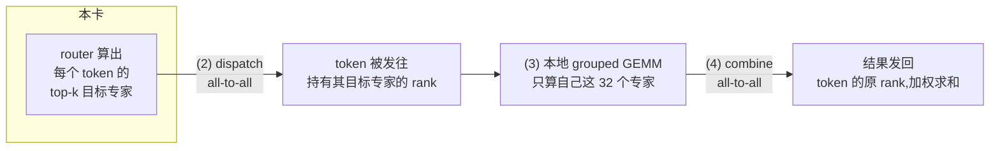
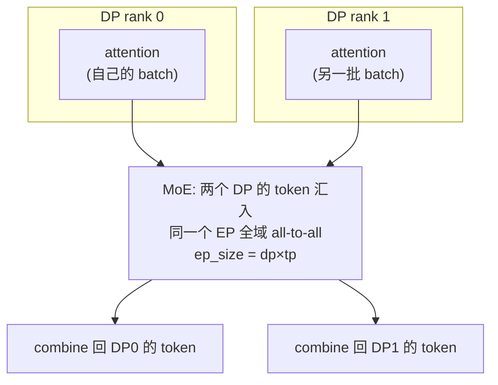
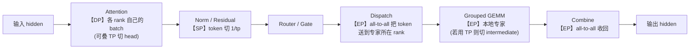

---
tags:
  - vllm
  - FusedMoE
  - MoE
  - 并行
  - EP
  - DP
  - TP
  - SP
---

# EP / DP / TP / SP 到底切的是什么轴——从 FusedMoE 算子讲起

> 一个问题：**EP、DP、TP、SP 这四个并行维度天天一起出现,到底有什么区别?**
>
> 抽象地背"专家并行/数据并行/张量并行/序列并行"很容易混。本文换一个落点：盯着 **MoE 层那一个 `FusedMoE` 算子**,看它的前向被这四个维度分别**沿哪根轴切开**、各自要付出**什么通信**。把一个算子拆清楚,四个名词的边界就自然分明了。
>
> 配置语义对照 vLLM 的 `FusedMoEParallelConfig`(`vllm/model_executor/layers/fused_moe/config.py`)与 `FusedMoE`(`.../fused_moe/layer.py`)。
>
> 家族里还有第 5 根轴 **CP(上下文并行)**——切的是**序列/KV 维**而非权重,专治长上下文,见 [上下文并行 CP:PCP 与 DCP](context-parallel-pcp-dcp.md)。

## 一、先把 FusedMoE 前向拆成四个阶段

一个 MoE 层,输入是 `[num_tokens, hidden]` 的一批 token 隐状态,内部干四件事:

```
                      ┌─────────────── 一个 FusedMoE 前向 ───────────────┐
 hidden [T, H] ──► (1)router/gate ──► (2)dispatch ──► (3)grouped GEMM ──► (4)combine ──► out [T, H]
                    选 top-k 个专家      把 token 送到      每个专家做                 把 k 路结果
                    打分               目标专家处         w1/w3→act→w2            按权重加权回收
```

四个阶段各自"吃"的张量轴不一样,这正是四种并行能插进来的地方:

- **token 轴 `T`**：阶段 (1)(2)(4) 都按 token 组织 —— 谁来处理"这一批 token"。
- **专家轴 `E`**(`global_num_experts`,如 256)：阶段 (3) 按专家分组 —— 权重 `w1/w2/w3` 是「每个专家一份」。
- **专家内部的 hidden / intermediate 轴 `H / I`**：阶段 (3) 每个专家的 GEMM 自身还能再切。

记住这三根轴(`T` / `E` / `H,I`),下面四个维度其实就是**各挑一根轴来切**。

## 二、一张表先给结论

| 维度 | 全称 | 切哪根轴 | 每个 rank 持有什么 | MoE 里的主通信 |
|---|---|---|---|---|
| **DP** | Data Parallel | **token 轴 `T`** | 全量专家权重(或与 EP 叠加)、**不同的一批 token** | 跨 DP 同步 token 数 / 配合 EP 的 all-to-all |
| **TP** | Tensor Parallel | **专家内部 `I` 轴** | **全部专家**,但每个专家只有 `1/tp` 的 intermediate 切片 | 输出 **all-reduce** |
| **EP** | Expert Parallel | **专家轴 `E`** | **一部分专家的完整权重**(`E/ep` 个) | dispatch/combine 的 **all-to-all** |
| **SP** | Sequence Parallel | **token/序列轴 `T`**(在 TP 组内) | 围绕 MoE 的 norm/residual 等只算 `1/tp` 的 token | all-reduce 拆成 **reduce-scatter + all-gather** |

一句话区分:

- **DP 切"哪批 token"**(数据并行,经典含义),
- **TP 切"每个专家的权重切片"**(专家都在,权重各拿一片),
- **EP 切"哪些专家"**(专家被分到不同卡,token 反过来去找专家),
- **SP 切"token 的序列摆放"**(把 TP 里本来冗余复制的 token 沿序列摊开,省激活和重复算)。

下面逐个对着 FusedMoE 看。

## 三、TP：专家都在,各拿一片权重

张量并行对 MoE 的做法,和对普通 MLP 一模一样 —— **每个专家的两段 GEMM 沿 intermediate 维切**:

```
专家 e 的权重:
  w1/w3 (gate/up):  [H, I]  ──TP沿 I 切──►  每个 rank 持 [H, I/tp]
  w2    (down):     [I, H]  ──TP沿 I 切──►  每个 rank 持 [I/tp, H]
```

- 每个 rank **拥有全部 `E` 个专家**,只是每个专家的"中间宽度"只有 `1/tp`。
- 阶段 (3) 各算各的 `I/tp` 分片,阶段 (4) combine 之后,各 rank 的部分和需要一次 **all-reduce** 才得到完整输出。
- token 不需要搬:输入隐状态在整个 TP 组内是**复制**的,大家看到的是同一批 token。

> TP 的代价:专家数多时,每张卡都要存**全部专家**的权重切片 —— 显存按"专家总数"走,省不掉。这正是 EP 出场的理由。

## 四、EP：专家被分家,token 去找专家

专家并行换了个切法 —— **不切专家内部,而是把"专家"整个分到不同 rank**:

```
global_num_experts = 256, ep_size = 8
  rank0: 专家 0..31    (完整 w1/w2/w3)
  rank1: 专家 32..63
  ...
  rank7: 专家 224..255
每个 rank 只存 E/ep = 32 个专家,但每个都是完整权重
```

代价转移到了 **token 的搬运** 上。阶段 (2)/(4) 变成两次 all-to-all:



- 每个 rank 只存 `E/ep` 个专家 → **显存随 ep_size 线性下降**,这是 EP 对大稀疏 MoE(DeepSeek-V3 256 专家)的关键价值。
- 通信从 TP 的 all-reduce 换成 **两次 all-to-all**(dispatch + combine),数据量取决于 token 数 × top-k × hidden,且负载可能**不均**(热门专家所在 rank 更忙)。

### EP 与 TP 在 MoE 里是"二选一"的同一批卡

这是最容易绕晕的点:**EP 和 TP 不是叠加,而是同一组卡的两种用法**。看 vLLM 的 `FusedMoEParallelConfig.make` 逻辑(语义简化):

```python
# MoE 能用的卡数 = tp_size * dp_size
if not enable_expert_parallel:
    # TP 模式:每卡全部专家、切 intermediate
    tp_size = tp_size_;  ep_size = 1
else:
    # EP 模式:专家分家,tp 维"塌缩"为 1
    ep_size = tp_size_ * dp_size_      # 整个 tp×dp 网格都拿来分专家
    ep_rank = dp_rank * tp_size_ + tp_rank
    tp_size = 1                         # 专家不再切 intermediate
```

要点:

- **开 EP 后,MoE 的 `tp_size` 变成 1** —— 专家不再做 intermediate 切片,改成整块整块地分到 `ep_size = tp×dp` 个 rank 上。
- 同一批 GPU,要么"全专家 + 切权重(TP)",要么"分专家 + 搬 token(EP)"。选择取决于:**专家多、单专家小** → EP 省显存更划算;**专家少、单专家大** → TP 更省通信。
- 注意:这里说的 `tp_size=1` **只针对 MoE 专家部分**;模型里 attention / 稠密层的 TP 不受影响,照样切。

## 五、DP：经典数据并行,以及它和 EP 的化学反应

DP 是最"老实"的维度 —— **不同 rank 处理不同的一批请求 token**,各跑各的前向。难点在于 **DP 撞上 MoE** 时,token 批不再对齐。

在 vLLM 的 **"DP attention + EP MoE"** 范式里(DeepSeek 系标配):

- **Attention 阶段**:纯 DP。每个 DP rank 拿自己那批请求,KV cache 各自独立,互不通信。
- **MoE 阶段**:把 `dp × tp` 个 rank 合成**一个大的 EP 全域**(上面 `ep_size = tp_size_ * dp_size_` 正是这个意思),所有 DP rank 的 token 一起参与 all-to-all,被路由到全域 `ep_size` 张卡上的专家。



所以 DP 在 FusedMoE 视角下的存在感,主要体现在两件事:

1. **token 数不一致**:各 DP rank 的有效 token 数不同,进 all-to-all 前要先**互相同步 token 计数**(`num_tokens_across_dp`),好让每张卡知道该收发多少。
2. **它把自己的 rank 数"借给"了 EP**:DP 不直接切 MoE 权重,而是扩大了 EP 的全域规模。

> 为什么不让 attention 也用 EP/TP?因为 attention 的瓶颈是 **KV cache 显存**,DP 让每张卡只扛自己那批请求的 KV,扩并发最划算;而 MoE 的瓶颈是**专家权重显存**,适合 EP。两者诉求相反,于是"attention 走 DP、MoE 走 EP"成了主流拼法。

## 六、SP：把 TP 里冗余复制的 token 沿序列摊开

序列并行不是独立的第五种切法,而是 **TP 的搭档**,专治 TP 的一个浪费:在 TP 区段之间(layernorm、residual、dropout 这些**逐 token elementwise** 的算子),每张卡其实持有**完整的全部 token**,做着**重复的计算**、占着**重复的激活显存**。

SP 的做法:在这些非 GEMM 区段,把 token **沿序列轴切成 `1/tp`**,每张卡只算自己那段:

```
         TP 区(GEMM):token 复制,权重切片        SP 区(norm/residual):token 切片,无权重
hidden ──► all-gather ──► [全量 token, 权重 1/tp] ──► reduce-scatter ──► [token 1/tp] ──► ...
            ▲                                                              │
            └──────────────── 原本 TP 末尾的 all-reduce ───────────────────┘
                              被拆成 reduce-scatter + all-gather
```

和 FusedMoE 的关系:

- SP 主要作用在 **MoE 层外围的 norm / residual** 区段,不改专家 GEMM 本身。
- 它把 TP 经典的一次 **all-reduce**,等价拆成 **reduce-scatter + all-gather** 两半 —— 总通信量不变,但**中间的激活显存和 elementwise 计算降到 `1/tp`**。
- 对 MoE 而言,SP 影响的是"进 router 之前 token 怎么摆放":token 以 `1/tp` 的切片形态在 SP 区流转,在需要全量 token 的边界(如进 GEMM 或 all-to-all)再 all-gather 回来。

一句话:**TP 切权重省的是权重显存,SP 切 token 省的是激活显存**,二者互补,通常一起开。

## 七、四维同框：一次前向里它们怎么排布

把一个 DeepSeek 式层的前向走一遍,四个维度各管一段:



| 阶段 | 主导维度 | 通信原语 |
|---|---|---|
| Attention | **DP**(±TP) | 无(DP 各自独立) / TP 内 all-reduce |
| Norm·Residual | **SP** | reduce-scatter / all-gather |
| Dispatch | **EP** | all-to-all |
| Expert GEMM | **EP**(或 **TP**) | EP:无额外 / TP:all-reduce |
| Combine | **EP** | all-to-all |

## 八、选型直觉

- **专家多、单专家小(稀疏大 MoE)** → 优先 **EP**,显存随 ep_size 下降;接受 all-to-all 与负载不均。
- **专家少、单专家大** → **TP** 更稳,通信是规整的 all-reduce,无路由不均问题。
- **要扩请求并发 / KV 显存吃紧** → attention 上 **DP**,顺手把 DP rank 并进 EP 全域。
- **激活显存吃紧(长序列)** → 叠 **SP**,把 norm/residual 区的 token 摊到 `1/tp`。
- 实际大模型部署常是 **DP(attention) + EP(MoE) + TP(稠密/attention 切 head) + SP(norm)** 四者同时在场,各切各的轴,互不冲突 —— 这也是为什么它们总一起出现。

## 九、一句话总结

四个名词的区别,落到 FusedMoE 一个算子上就清清楚楚:**DP 切 token 批、TP 切专家内部权重、EP 切专家本身、SP 切 token 的序列摆放**。EP 与 TP 是同一批卡处理 MoE 的"二选一"(开 EP 则 MoE 的 tp 塌缩为 1),DP 把自己的 rank 借给 EP 扩大全域,SP 是 TP 的省激活搭档。记住"各切一根轴",就不会再混。
