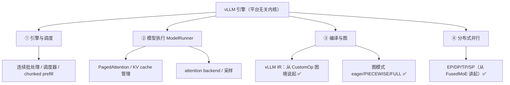

# vLLM 内核

记录 vLLM 推理引擎本身的原理与机制：引擎骨架、算子分发、编译与中间表示等平台无关的核心设计。

## 知识脉络

把 vLLM 内核按"一个请求自上而下经过的层"来组织，分四层。每层都是一组可以独立深挖的主题：



**建议阅读顺序**：

1. **编译与图**（当前主线）——[vLLM IR 是什么：从 CustomOp 的困境说起](vllm-ir-and-customop.md) ✅ 解释了为什么需要 IR；[图模式：eager / PIECEWISE / FULL](cudagraph-modes.md) ✅ 讲清三种图捕获，是理解 GPU/NPU 性能的关键。
2. **分布式并行**——[EP/DP/TP/SP（从 FusedMoE 讲起）](ep-dp-tp-sp-fused-moe.md) ✅ 用一个算子串起四个并行维度。
3. **模型执行 / 引擎调度**——PagedAttention、KV cache、连续批处理等推进方向。

> ✅ = 已有笔记；其余为推进方向。平台相关的落地（昇腾/omni）见 [vllm-ascend](../vllm-ascend/index.md) 与 [vllm-omni](../vllm-omni/index.md)。

## 目录

> 随着学习推进逐步补充。建议每个主题单独建一篇 `.md`，并在下方与 `mkdocs.yml` 的 `nav` 中登记。

- [vLLM IR 是什么：从 CustomOp 的困境说起](vllm-ir-and-customop.md)
- [图模式：eager / PIECEWISE / FULL（GPU·NPU·omni 三层串讲）](cudagraph-modes.md)
- [EP / DP / TP / SP 区别：从 FusedMoE 算子讲起](ep-dp-tp-sp-fused-moe.md)
- [多模态处理全流程：v0.25.1 三阶段源码核对（MMProcessor）](multimodal-processor-flow.md)

另见 [碎片知识](snippets/index.md)：速查、排错、源码片段等零散条目。

## 如何新增一篇笔记

1. 在 `docs/vllm/` 下新建 Markdown 文件，例如 `docs/vllm/scheduler.md`
2. 在 `mkdocs.yml` 的 `nav` → `vLLM` 下添加一行：

   ```yaml
   - 调度器: vllm/scheduler.md
   ```

3. 本地预览：`mkdocs serve`，推送到 `main` 后自动部署
