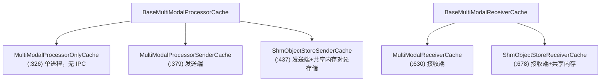
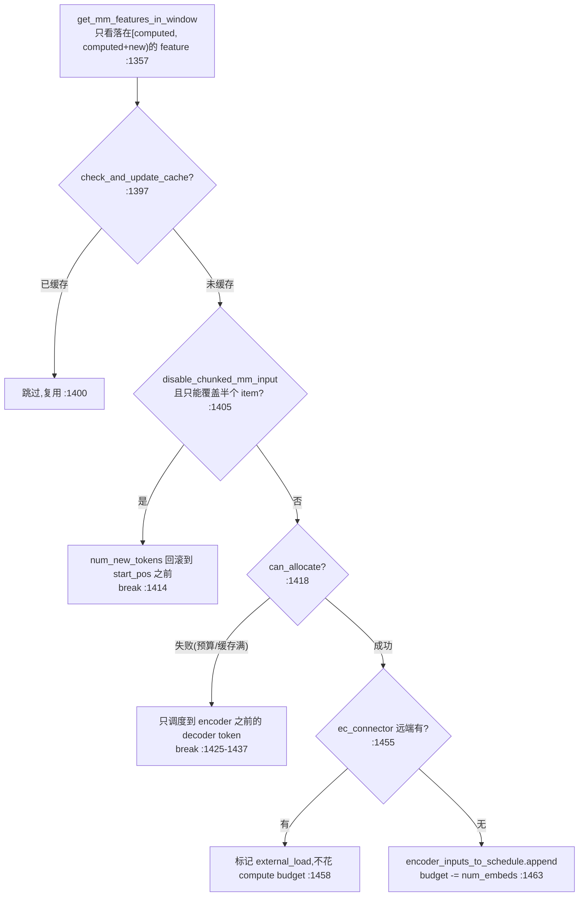
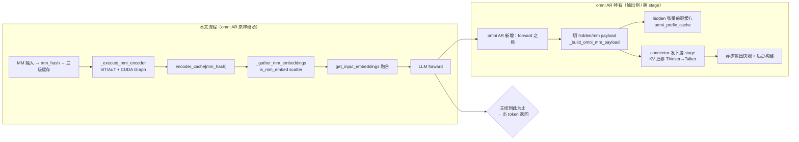

---
tags:
  - vllm
  - vllm-omni
  - 多模态
  - MMProcessor
  - 源码分析
  - v0.25.1
---

# vLLM 多模态处理全流程（v0.25.1 源码核对 · 三阶段拆解）

> 一个问题：**一张图 / 一段音频 / 一段视频，从 API 请求进来，到最终变成 LLM 输入序列里的 embedding，中间到底经过哪些类、哪些进程、哪些缓存？**
>
> 本文以本地 `vllm` 仓库 **`v0.25.1` tag**（detached `752a3a504`）源码为准，对照 [JaredforReal/vllm-notes · MMProcessor.md](https://github.com/JaredforReal/vllm-notes/blob/main/MMProcessor.md) 的三阶段框架，逐段核对到**真实文件 + 行号**。参考 notes 基于更新的 main 分支，与 v0.25.1 存在若干命名/结构差异，本文在 §0 单列版本对齐，正文一律以 v0.25.1 为准。

---

## 〇、版本对齐：notes（newer main） vs 本地 v0.25.1

参考 notes 里几个关键抓手在 v0.25.1 的落点如下。整体架构一致，差异主要在「处理器已包化」「缓存已明确拆成 Sender/Receiver + SHM 对象存储」两处：

| notes 里的抓手 | v0.25.1 实际落点 | 差异 |
|---|---|---|
| `AsyncMultiModalContentParser` | `vllm/entrypoints/chat_utils.py:1065` | ✅ 存在，位于 chat 消息解析层（OpenAI messages → MM data） |
| MM 入口 `vllm/renderers/base.py:686-724` | `BaseRenderer`（`renderers/base.py:72`），核心 `_process_multimodal`（`:728`） | ✅ 存在，`renderers` 抽象已取代旧 `InputPreprocessor` |
| `vllm/multimodal/processing/processor.py` | 同名，但 `processing` 已是**包**（`processor.py` / `context.py` / `inputs.py` / `dummy_inputs.py`），无单文件 `processing.py` | 结构差异 |
| `MultiModalHasher`（`hasher.py:50-162`） | `hasher.py:50` `MultiModalHasher`，默认 **blake3**，兜底 sha256/sha512（FIPS） | ✅ 一致 |
| 「三级缓存」 | 明确成 `MultiModalProcessorOnlyCache` / `…SenderCache` / `ShmObjectStoreSenderCache` + 对应 Receiver（`cache.py`） | notes 说法抽象，代码更细 |
| `_execute_mm_encoder()` / `_gather_mm_embeddings()` | `gpu_model_runner.py:2940` / `:3149` | ✅ 一致 |
| `EncoderCudaGraphManager`（`encoder_cudagraph.py`） | 同名 `:53`，且已含 **DP 分片**与 **dual-path** 捕获 | v0.25.1 已相当成熟 |
| `EncoderCacheManager`（`encoder_cache_manager.py:17-266`） | 同名 `:17`，另有 `compute_mm_encoder_budget`、`EncoderDecoderCacheManager` | ✅ 一致 |

> 注意：本地仓库根目录是 `…/vllm_omni/vllm/`，Python 包在其下的 `vllm/`，故真实路径是 `…/vllm_omni/vllm/vllm/multimodal/…`。下文行号均指包内路径。

---

## 一、三阶段全景

一次多模态请求可以按「跨进程边界」切成三段。vLLM V1 是 **API server 进程** 与 **EngineCore/Worker 进程** 分离的：

```mermaid
flowchart LR
  subgraph P0["Phase 0 · API Server 进程（CPU）"]
    A["chat_utils<br/>AsyncMultiModalContentParser"] --> B["BaseRenderer<br/>_process_multimodal"]
    B --> C["MultiModalHasher<br/>算 mm_hash（blake3）"]
    C --> D["HF Processor<br/>BaseMultiModalProcessor.apply"]
    D --> E["Sender Cache<br/>命中→只发元数据"]
  end
  subgraph P1["Phase 1 · IPC（ZMQ + msgpack + SHM）"]
    E --> F["MultiModalKwargs 序列化<br/>SHM 对象存储 / GPU IPC 池"]
  end
  subgraph P2["Phase 2 · Worker 进程（GPU）"]
    F --> G["Receiver Cache<br/>还原 features"]
    G --> H["_execute_mm_encoder<br/>ViT/AuT 前向 + CUDA Graph"]
    H --> I["encoder_cache[mm_hash]"]
    I --> J["_gather_mm_embeddings<br/>按窗口取 + is_mm_embed 掩码"]
    J --> K["模型 get_input_embeddings<br/>文本+MM embedding 融合"]
  end
```



贯穿三段的是**两条主线**：

1. **`mm_hash`（内容指纹）** —— Phase 0 算出，作为三级缓存、编码器缓存、跨进程去重的统一 key。
2. **`PlaceholderRange` / `mm_position`** —— HF Processor 阶段确定「每个 MM item 在 token 序列里占哪一段」，Phase 2 靠它把 embedding scatter 回正确位置。

---

## 二、Phase 0 · 前端 CPU 预处理

### 2.1 入口：从 chat 消息到 MM data

OpenAI 风格消息（`image_url` / `input_audio` / 视频）在 `vllm/entrypoints/chat_utils.py` 被解析：`AsyncMultiModalContentParser`（`:1065`，与同步版 `MultiModalContentParser:917` 共享 `BaseMultiModalContentParser:846`）。异步版把「下载 + 解码」丢进共享线程池，避免阻塞事件循环——这是 notes 强调的 ThreadPoolExecutor 异步预处理点。

解码走各模态的 MediaIO：`ImageMediaIO`（PIL）、视频后端（OpenCV / PyAV 等）、音频（soundfile/PyAV + `AudioResampler`），位于 `vllm/multimodal/{image,video,audio}.py`。

### 2.2 渲染器：`BaseRenderer._process_multimodal`

真正的 MM 处理编排在 `vllm/renderers/base.py`。链路是
`process_for_engine_async`（`:961`）→ `_process_singleton_async`（`:878`）→ `_process_tokens`（`:768`）→ **`_process_multimodal`（`:728`）**。核心 40 行（`:728-766`）：

```python
def _process_multimodal(self, prompt, mm_data, mm_uuids, mm_processor_kwargs, ...):
    mm_req_id = f"renderer{self.api_process_rank}-mm-{self._mm_req_counter.inc(1)}"
    mm_processor = self.get_mm_processor()                      # BaseMultiModalProcessor
    mm_data_items = mm_processor.info.parse_mm_data(mm_data)    # 归一到 MultiModalDataItems
    mm_uuid_items = parse_mm_uuids(mm_uuids)
    mm_uuid_items = self._process_mm_uuids(...)                 # 见 2.3
    mm_processor_inputs = MMProcessorInputs(prompt, mm_data_items, mm_uuid_items, ...)
    with set_default_torch_num_threads():                      # 防启动期线程争抢
        mm_inputs = mm_processor.apply(mm_processor_inputs, mm_timing_ctx)  # HF 处理 + 缓存
    self.update_mm_cache_stats()
    return mm_inputs
```

### 2.3 内容指纹与 UUID：`mm_hash` 从哪来

`MultiModalHasher`（`hasher.py:50`）负责把「一个 MM item」序列化成字节流再 hash。默认 **blake3**，`_get_hasher_factory`（`:23`）也支持 sha256/sha512 以满足 FIPS。`serialize_item`（`:51`）对不同类型分别处理——`PIL.Image` 会把 `mode + np.asarray(data) + palette` 一起纳入；若 EXIF 里带 `ImageID`（UUID）则直接用它，避免重复解码大图。

`_process_mm_uuids`（`renderers/base.py:699`）有一个**关键短路**（`:718-724`）：当用户**同时**关闭 prefix caching 和 `mm_processor_cache_gb == 0` 时，跨请求根本不会复用 MM 特征，于是直接用 `f"{mm_req_id}-{modality}-{i}"` 作为标识、跳过内容 hash——省掉大图/长视频的哈希开销。

### 2.4 HF Processor + prompt 占位符替换

`BaseMultiModalProcessor`（`processing/processor.py:972`）的 `apply` 做四件事：调 HF processor、算 `_get_mm_fields_config`、生成并应用 **prompt updates**、合并缓存。prompt 占位符替换是一套完整机制：

- `PromptUpdate` / `PromptInsertion`（`:354`）/ `PromptReplacement`（`:423`），`PromptIndexTargets`（`:141`：`start/prefix/end`）定位插入点；
- `find_mm_placeholders`（`:934`）+ `_iter_placeholders`（`:865`）在 token 序列里找占位区间，产出 `PlaceholderFeaturesInfo`（`:676`），其 `to_range()`（`:687`）给出 **`PlaceholderRange`**——即「该 MM item 占 token `[offset, offset+length)`」。

这个 `PlaceholderRange` 就是 Phase 2 `_gather_mm_embeddings` 用来 scatter 的坐标依据。

---

## 三、Phase 1 · 跨进程 IPC 与缓存

### 3.1 三级缓存的真身：Sender / Receiver + SHM 对象存储

notes 说的「process-local / IPC 元数据 / 共享内存」在 v0.25.1 落成 `vllm/multimodal/cache.py` 里一组明确的类：



关键语义：

- **发送端命中**（`is_cached_item` / `is_cached`，`:268/:283`）→ 该 item 的重张量**不再序列化过 ZMQ**，只发 `mm_hash` 元数据；`touch_sender_cache_item`（`:303`）维持 LRU。
- **`ShmObjectStoreSenderCache`**（`:437`）把 payload 放进共享内存对象存储，跨进程零拷贝；`address_as_item`（`:567`）返回「地址即 item」的句柄，`remove_dangling_items`（`:560`）清悬挂项。
- **接收端**（Worker 侧）`get_and_update_features`（`:589`）按 `mm_hash` 从共享内存/本地还原成 `MultiModalFeatureSpec`，`touch_receiver_cache_item`（`:611`）同步 LRU。

发送端与接收端各持一份 LRU（`get_lru_cache`，`:158`；容量按 `mm_processor_cache_gb` 折算，`get_item_size`/`get_item_complexity` 估算字节，`:120/:142`），**元数据与 payload 分离**正是 notes 强调的「IPC 只传元数据」的实现。

### 3.2 序列化：`MultiModalKwargs` 与 msgpack

跨 ZMQ 的载体是 `vllm/multimodal/inputs.py` 里的 `MultiModalKwargs` / `MultiModalKwargsItem` / `MultiModalFeatureSpec`。张量走 vLLM 的 msgpack 编码（`MsgpackEncoder`，`vllm/v1/serial_utils.py`），大张量优先落共享内存而非拷进消息体。

### 3.3 GPU 侧 IPC 内存池（v0.25.1 新增，notes 未覆盖）

`vllm/multimodal/gpu_ipc_memory.py` 提供 `MultiModalGPUMemoryPool`（`:49`）+ `MultiModalGPUMemoryLease`（`:27`，支持 `with` 上下文），以 `acquire/release`（`:75/:98`）租借一块 GPU 显存用于「编码器输出直接在 GPU 间 IPC 传递」。`maybe_init_mm_gpu_ipc_pool`（`:122`）按需初始化。这是为 **EPD 分离（Encoder/Prefill/Decode disaggregation）** 场景准备的通道——编码器产物不必回 CPU 再进 LLM 进程。

---

## 四、Phase 2 · GPU 编码器执行与调度侧缓存

### 4.1 调度侧：`EncoderCacheManager`（谁该被编码、谁该被驱逐）

`vllm/v1/core/encoder_cache_manager.py:17`。它**不存张量**，只做「以 encoder embedding 数量为单位」的容量记账，让调度器决定哪些 MM item 本步进编码器。核心状态（`:67-79`）：

- `cached: dict[mm_hash, set[request_id]]` —— 谁在引用这份编码结果；
- `freeable: OrderedDict[mm_hash, num_embeds]` —— 引用归零、可回收（LRU，先进先出）；
- `freed: list[mm_hash]` —— 已驱逐、待通知 Worker 删缓存。

四个关键动作：

| 方法 | 行号 | 作用 |
|---|---|---|
| `check_and_update_cache` | `:94` | 命中则把 `request_id` 记入引用集；若原本可回收则从 `freeable` 取回 |
| `can_allocate` | `:123` | 先查 compute budget，再查 free/freeable；**驱逐就发生在这里**（`:177-182` 循环 `popitem(last=False)`），但物理显存要等 Worker 收到 scheduler_output 才真正释放 |
| `allocate` | `:184` | 记账：占用 `num_free_slots`/`num_freeable_slots` |
| `free_encoder_input` / `free` | `:216/:243` | 请求结束，引用归零后转入 `freeable`（**不立即物理释放**） |
| `get_freed_mm_hashes` | `:255` | 返回并清空 `freed`，供调度器通知 Worker |

预算由 `compute_mm_encoder_budget`（`:269`）算出：`encoder_compute_budget = max(max_num_encoder_input_tokens, 单item最大token)`，`encoder_cache_size = max(encoder_cache_size, 单item最大token)`（`:309-314`）。`disable_chunked_mm_input` 且单 item 超过 `max_num_batched_tokens` 时直接报错（`:298-307`）。

> 记账单位是「MM embedding 数」，item 之间的文本/break token **不计**（docstring `:41-45`），因此缓存槽位对齐的是编码器产物而非原始序列。

`MultiModalBudget`（`multimodal/encoder_budget.py:44`）在启动期把这些预算与「每 prompt/每 batch 最多几个 item」一次算好（`_get_max_items`，`:140`），并区分 **tower 模态**（过编码器塔）与 **embedding-only 模态**（`enable_mm_embeds`，预算只占缓存不过塔，`:79-83`）。

### 4.1b 调度环：谁被编码、chunked 怎么回滚、何时释放

§4.1 的 `EncoderCacheManager` 只是记账台,真正的调用方是**调度器** `vllm/v1/core/sched/scheduler.py`。它持有 `self.encoder_cache_manager`(`:225`),每步给一个 `encoder_compute_budget = max_num_encoder_input_tokens`(`:423`)。核心决策在 **`_try_schedule_encoder_inputs`(`:1315`)** ——逐请求判断本步该编码哪些 MM item:



四个易踩点:

1. **整体编码,不许拆一半**(`:1402-1417`):编码器用双向注意力,`disable_chunked_mm_input` 时若本步窗口只覆盖 item 的一部分,就把 `num_new_tokens` **回滚到 `start_pos` 之前**,这一步只跑到该 item 之前的 decoder token,下一步再整块编码。
2. **预算/缓存满则截断**(`:1418-1437`):`can_allocate` 失败时,只调度 encoder 之前的 decoder token 并 break;prefix caching 下会出现 `num_computed_tokens > start_pos` 但编码结果不在的情况,此时本步该请求 `num_new_tokens = 0`。
3. **远端编码器缓存**(EC connector,`:1455-1461`):`ec_connector.has_cache_item` 命中则走 `external_load_encoder_input`,**不消耗本地 compute budget**(编码在远端已算好,只需拉取)。
4. **window 化去重**(`:1357`+`mm_hashes_to_schedule`):同一 `mm_hash` 一步内只排一次。

决策完成后,调度器对每个入选 input `allocate`(`:616`/`:1002`),把 `scheduled_encoder_inputs` 写进 `SchedulerOutput`(`:1098`),并附带 **`free_encoder_mm_hashes = get_freed_mm_hashes()`**(`:1106`)——即 §4.1 里被 `can_allocate` 驱逐的 hash 列表,通知 Worker 从 `self.encoder_cache` 物理删除(`gpu_model_runner.py:1185` `encoder_cache.pop`)。

**释放时机** `_free_encoder_inputs`(`:1915`):当某 item 的占位区间已完全进入 decoder KV、且越过 drafter 的 +1 前瞻时释放——

```python
spec_lookahead = 1 if self.use_eagle else 0                              # :1926 与 gather 的兜底对齐
if start_pos + num_tokens + spec_lookahead <= num_computed_tokens - num_output_placeholders:
    self.encoder_cache_manager.free_encoder_input(request, input_id)     # :1939-1946 引用归零→转入 freeable
```

encoder-decoder(Whisper)特例:生成第一个 token 后 cross-attention KV 已算好,立即释放(`:1934-1938`)。

至此 §4.1 的五个方法全部闭环:`check_and_update_cache`/`can_allocate`/`allocate` 在调度**入口**,`free_encoder_input`/`get_freed_mm_hashes` 在**消费后**——记账(调度器)与物理张量(Worker `encoder_cache`)始终分离,驱逐先记账、后由 `SchedulerOutput` 通知 Worker 真删。

### 4.2 Worker 侧编码：`_execute_mm_encoder`

`gpu_model_runner.py:2940`。流程：

1. `_batch_mm_inputs_from_scheduler`（`:2943`）把本步要编码的 item 攒成批，返回 `(mm_hashes, mm_kwargs, mm_lora_refs)`。
2. **`prompt_embeds` 直通**（`:2955-2975`）：这类「已在 embedding 空间」的输入不过编码器，直接塞进 `self.encoder_cache[mm_hash]`，再从待编码列表里剔除。
3. **按模态分组批处理** `group_and_batch_mm_kwargs`（`:3064`）：同模态才合批，多模态混批时逐个处理以保序（`:2983-2989` 的 FIXME 明说这是权宜）。
4. **CUDA Graph 优先**（`:3122-3134`）：若 `encoder_cudagraph_manager` 支持该模态，走 `manager.execute(mm_kwargs_batch)`；否则回退 `model.embed_multimodal(**mm_kwargs_batch)`（eager）。
5. **视频特例**（`:3081-3109`）：`is_multimodal_pruning_enabled` 或 `requires_sequential_video_encoding` 时，视频**逐条**微批编码，防止调度器按剪枝后 token 数低估、把太多视频塞进一批爆显存。
6. 结果按 `mm_hash` 写入 `self.encoder_cache`（`:3142-3145`），并 `maybe_save_ec_to_connector`（供 KV/EC connector 复用）。

（LoRA tower/connector 的 mapping 构造在 `:2992-3059`，为 encoder 塔与 connector 单独建 `LoRAMapping`。）

### 4.3 编码器 CUDA Graph：预算图 + DP 分片

`EncoderCudaGraphManager`（`encoder_cudagraph.py:53`）是 notes「budget-aware / power-of-2 / 贪心装箱 / eager 回退」的实现：

- **2 的幂预算** `_generate_budgets`（`:191`）：从 `min_budget` 翻倍到 `max_budget`，末尾补上 `max_budget`（`:198-200`），得到一组 token 预算。
- **不变式** `max_batch_size <= min(budgets)`（`:78-98`）：保证 `per_image_output = budget // max_batch_size >= 1`，否则 capture 会因空张量 reshape 崩溃。
- **选桶** `_find_smallest_fitting_budget_given_tokens`（`:293`）：给定实际 token 数，选**最小的能装下**的预算图；装不下就 eager 回退。
- **执行** `execute`（`:803`）：`use_dp`（`mm_encoder_tp_mode == "data"` 且 TP>1，`:148-153`）时先 `_dp_shard`（`:672`）把图按 rank 分片、各 rank 跑 `_execute_local`、再 `_dp_gather`（`:736`）聚合；否则直接 `_execute_local`。命中率 `graph_hits/misses` 周期性打日志（`:838-848`）。
- **dual-path**（`:161-179`）：对「global image + local patches」两条路径分别建预算图（`global_token_budgets` / `local_token_budgets`，后者含 0 以覆盖小图无 local patch 的情况）。

图捕获 `capture`（`:213`）按预算从大到小逐个 `_capture_budget_graph`。

### 4.4 取回与融合：`_gather_mm_embeddings`

`gpu_model_runner.py:3149`。它把编码结果按**本步调度窗口**切片、scatter 回序列位置：

```python
is_mm_embed = torch.zeros(total_num_scheduled_tokens, dtype=torch.bool, ...)  # :3157
for req_id in self.input_batch.req_ids:
    lo, hi = get_mm_features_in_window(mm_features, start=..., end=...)        # :3176 只看落在窗口内的 feature
    for i in range(lo, hi):
        start_idx = max(num_computed_tokens - start_pos, 0)                   # :3187 chunked prefill 下的偏移
        end_idx   = min(..., num_encoder_tokens)
        encoder_output = self.encoder_cache.get(mm_hash, None)                # :3202 命中编码器缓存
        if encoder_output is None: raise RuntimeError("Encoder cache miss")   # :3212（drafter +1 前瞻例外）
        mm_embeds_item = encoder_output[curr_embeds_start:curr_embeds_end]    # :3216 按 is_embed 精确切片
        is_mm_embed[req_start_pos+start_idx : req_start_pos+end_idx] |= is_embed  # :3223/:3227 掩码
        mm_embeds_req.append(mm_embeds_item)
```

要点：

- **窗口化**支持 chunked prefill——一个大图/长视频可以跨多步编码，`start_idx/end_idx` 精确到本步该取哪一段（`:3187-3195`）。
- **`is_mm_embed` 布尔掩码**（CPU pin_memory，`:3157-3162`）标出序列里哪些位置是 MM embedding；`|=` 是为了处理 `use_audio_in_video` 等**重叠占位**（`:3221-3229`）。这块 CPU→GPU 掩码传输正是 notes 点名的高优先级瓶颈之一。
- **mrope 重算**（`:3232-3243`）：pruning + mrope 模型下，剪枝改变了 token 数，需 `recompute_mrope_positions` 同步位置。

最终 `(mm_embeds, is_mm_embed)` 交给模型的 `get_input_embeddings`：文本 token 走词嵌入，`is_mm_embed` 为真的位置用 `mm_embeds` 覆盖——**文本与多模态在同一序列里融合完成**，后续就是标准 LLM 前向。

---

## 五、性能瓶颈 → 真实代码落点

把 notes 的优先级榜对回 v0.25.1 代码，便于定位优化点：

| 优先级 | 瓶颈 | 代码落点 |
|---|---|---|
| 高 | HF Processor CPU 计算（尤其视频抽帧） | `processing/processor.py` `apply`；视频后端 `multimodal/video.py` |
| 高 | 编码器 GPU 前向 | `_execute_mm_encoder`（`gpu_model_runner.py:2940`）→ `model.embed_multimodal` / CUDA Graph |
| 高 | `is_mm_embed` 掩码 CPU→GPU | `_gather_mm_embeddings`（`:3157` 建掩码，`:3223` 填充） |
| 中 | CUDA Graph 预算 padding 浪费 | `_generate_budgets`（`:191`）+ `_find_smallest_fitting_budget_given_tokens`（`:293`） |
| 中 | 编码器与 LLM 串行 | 调度侧 `EncoderCacheManager` + Worker 先 encoder 后 decode（EPD 分离/GPU IPC 池是解法方向） |
| 低 | 共享内存序列化 | `ShmObjectStoreSenderCache`（`cache.py:437`）+ `MsgpackEncoder` |
| 低 | 占位符字符串匹配 | `find_mm_placeholders`（`processor.py:934`） |
| 低 | 编码器缓存字典查找 | `self.encoder_cache.get`（`:3202`） |

---

## 六、omni / NPU 视角的几个落点

- **编码器缓存清理**：权重热更新时 `encoder_cache.clear()`（`gpu_model_runner.py:957`）+ `EncoderCacheManager.reset()`（`:81`）成对使用，避免旧权重的 vision embedding 被复用——NPU 上做在线权重切换时同样要走这条路。
- **DP 编码器**（`mm_encoder_tp_mode == "data"`）在 NPU 多卡上对应 ViT/AuT 的数据并行分片，`_dp_shard/_dp_gather`（`encoder_cudagraph.py:672/736`）是对照实现的参照点。
- **`is_mm_embed` 掩码融合**是 GPU/NPU 通用的 scatter 语义，omni 侧「audio_in_video 重叠占位」正是靠 `|=`（`:3227`）合并——排查 omni 多模态位置错位时先看这里。
- **GPU IPC 内存池**（`gpu_ipc_memory.py`）是 EPD 分离的显存通道，NPU 侧若要做 encoder/prefill/decode 分离，这是需要对齐/替换的平台相关点。

---

## 七、一句话链路

```
chat_utils(解析) → BaseRenderer._process_multimodal → MultiModalHasher(mm_hash)
  → HF Processor.apply(占位符→PlaceholderRange) → SenderCache(命中只发元数据)
  → [ZMQ/msgpack/SHM] → ReceiverCache(还原)
  → EncoderCacheManager(调度记账/驱逐) → _execute_mm_encoder(ViT/AuT+CUDAGraph) → encoder_cache[mm_hash]
  → _gather_mm_embeddings(窗口切片+is_mm_embed) → get_input_embeddings(文本+MM 融合) → LLM 前向
```

---

## 八、延伸：本文流程 ↔ vLLM-Omni 的 AR 部分

本文分析的是**主线 vLLM 的多模态输入侧**（MM 进 → embedding → 融合进 prompt → 出 token）。vLLM-Omni 的 **AR runner**（`vllm_omni/worker/gpu_ar_model_runner.py` 的 `GPUARModelRunner`，及 NPU 版 `NPUARModelRunner`）是**多阶段生成流水线里的一个 stage 执行器**（Thinker / Talker 都跑在它上面）。两者的关系可以一句话概括：

> **本文的整条输入侧流程，在 omni AR 里是原样继承、一字不改的；区别全在「forward 之后」——omni AR 多做的事是把 hidden states / 多模态 payload 正确地交给下游 stage。**

### 8.1 输入侧：完全复用（无区别）

`GPUARModelRunner(OmniGPUModelRunner, OmniConnectorModelRunnerMixin)` 最终继承自 vLLM 的 `GPUModelRunner`，其 `execute_model` 里直接调 `self._execute_mm_encoder(scheduler_output)`、复用同一个 `self.encoder_cache`。所以本文 §2–§4 的全部机制——blake3 `mm_hash`、Sender/Receiver 三级缓存、`EncoderCacheManager` 调度记账/驱逐、`_gather_mm_embeddings` 的 `is_mm_embed` scatter——在 omni AR 里都是继承来的原物。

### 8.2 AR 部分新增：全在输出侧 / 跨 stage

| 维度 | 主线 vLLM（本文） | omni AR 部分 | omni 锚点 |
|---|---|---|---|
| 执行拆分 | `execute_model` 一把梭（forward+sample） | 拆成 `execute_model`（攒 hidden 状态）+ `sample_tokens`（出结果），中间挂 `ExecuteModelState` | `gpu_ar_model_runner.py:839`/`:1678`/`:257` |
| 跨 stage payload | 无下游，detokenize 后返回 | forward 后建 per-request payload 发下游：`_build_omni_mm_payload`/`_build_omni_pooler_payload`/`_resolve_req_hidden_states` | `:741`/`:793`/`:1303` |
| 前缀缓存层级 | KV block 级 | **多一层 hidden/mm 张量级前缀缓存**（`omni_prefix_cache`：`hidden_states_cache`/`mm_outputs_cache`）——Talker 要读 Thinker 的 hidden，不能只靠 KV | `_maybe_update_prefix_cache` `:595` |
| KV 迁移 | 单模型内 | Thinker→Talker 跨 stage KV 交接：`OmniKVTransferManager`、`get_kv_transfer_metadata` | `:886`/`:876` |
| 异步输出 | `AsyncGPUModelRunnerOutput` | `OmniAsyncGPUModelRunnerOutput`，快照 + 后台线程构建 payload，把 D2H/payload 挪出主步 | `:145` + H 簇 |
| 采样器桥接 | 标准 sampler | CosyVoice3/Talker 自带 sampler，要喂解码历史 `_build_model_sampler_output_token_ids` | `:329` |
| 下游路由 | 无 | 判断哪些请求需要给下游发 payload（`_request_needs_downstream_stage_payload` 等） | `:395` |

### 8.3 一图对齐



**一句话**：本文对应的是 omni AR runner 里 **`_execute_mm_encoder` 之前（含）** 的部分；AR 特有的复杂度全在它**之后**那一截。深挖那一截见 [L2 · AR runner 全函数解剖](../npu-adaptation/runner-compare/ar-runner-anatomy.md)。

---

> 核对基准：`vllm` @ `v0.25.1`（`752a3a504`），omni 锚点为本地 `vllm-omni/vllm_omni/worker/gpu_ar_model_runner.py`。所有 vLLM 行号以包内路径 `vllm/…` 为准；参考 notes 基于更新的 main，差异见 §0。
