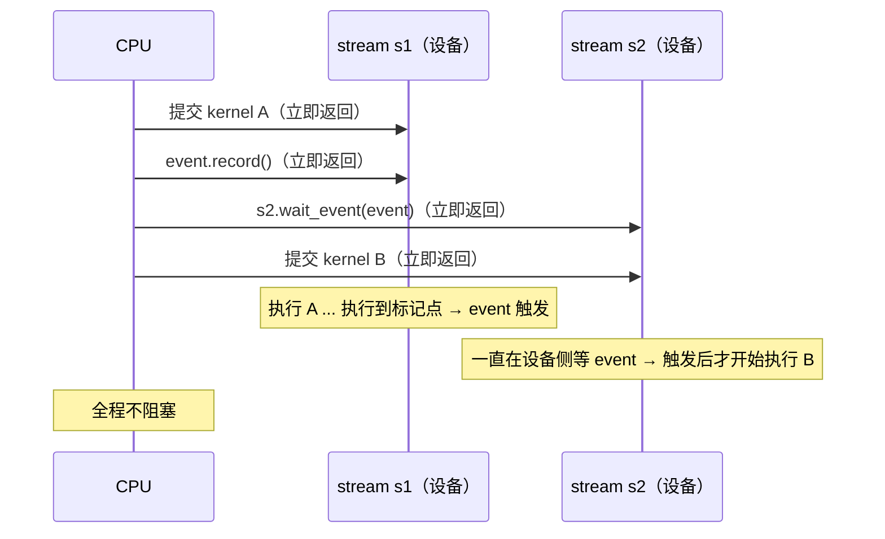

# cuda.Event / npu.Event：异步时间线上的路标

`torch.cuda.Event()` / `torch.npu.Event()` 本质上是**插在 stream（异步执行队列）时间线上的一个标记点**，是 CUDA event（NPU 上对应 ACL runtime event）的 Python 封装。它的存在完全是为了配合 GPU/NPU 的异步执行模型。

一句话总结：**event = 异步时间线上的路标，用来"掐表"、"排依赖"、"问进度"，避免代价高昂的全设备同步。**

## 为什么需要它

GPU/NPU kernel 的执行是异步的：CPU 调用 `model(x)` 只是把 kernel **提交**到 stream 里就立刻返回了，此时计算根本没做完。于是产生两个问题：

1. 我怎么知道"某个点之前的操作"做完了？
2. 两条 stream 之间怎么建立依赖，而不用把整个设备同步一遍？

Event 就是答案：`event.record(stream)` 在 stream 的当前位置插一个标记，当设备执行到这个位置时，event 被触发。



## 三大用途

### 1. 精确计时（最常见）

```python
start = torch.cuda.Event(enable_timing=True)
end   = torch.cuda.Event(enable_timing=True)

start.record()
model(x)
end.record()
torch.cuda.synchronize()          # 等设备真正跑完
print(start.elapsed_time(end))    # 毫秒，设备侧真实耗时
```

不能直接用 `time.time()` 掐表，因为异步提交后 CPU 立刻返回，你量到的只是"提交耗时"。Event 记录的是**设备时间线上**的时刻，才是 kernel 真实执行时间。

### 2. 跨 stream 同步（建立依赖而不阻塞全局）

```python
event = torch.cuda.Event()
with torch.cuda.stream(s1):
    y = compute(x)
    event.record()               # 在 s1 上打标记

with torch.cuda.stream(s2):
    s2.wait_event(event)         # s2 等到 s1 跑过标记点才继续
    z = use(y)
```

`wait_event` 是**设备侧等待**，CPU 完全不阻塞。这比 `torch.cuda.synchronize()`（同步整个设备、CPU 也卡住）便宜得多。

### 3. 非阻塞地查询完成状态

```python
event.query()        # True/False，立刻返回，不等待
event.synchronize()  # 只等这个 event，不等整个设备
```

## 三种同步方式的代价对比

| 方式 | 谁在等 | 等什么 | 代价 |
|---|---|---|---|
| `torch.cuda.synchronize()` | CPU 阻塞 | 整个设备所有 stream | 最贵，杀死 overlap |
| `event.synchronize()` | CPU 阻塞 | 只等这个标记点 | 中等 |
| `stream.wait_event(event)` | 设备侧等 | 只等这个标记点 | 最便宜，CPU 零阻塞 |
| `event.query()` | 不等 | 轮询是否已触发 | 近似免费 |

## 在 vLLM 中的角色

这正是 vLLM async output processing（异步输出处理）的核心机制：让 CPU 在设备还在算下一个 step 时，就去处理上一个 step 的采样输出——D2H 拷贝后用 event 标记，CPU 侧 `query()`/`synchronize()` 确认拷贝完成再取数，而不是每个 step 都 `torch.cuda.synchronize()` 硬等。多 stream + event 是"计算与通信/后处理重叠"这类优化的地基（omni NPU 侧适配见 vllm-omni #4476 async-output）。

## NPU 侧差异

`torch.npu.Event` 是 torch_npu 对同一套接口的镜像实现，底层走 `aclrtCreateEvent` / `aclrtRecordEvent` / `aclrtStreamWaitEvent`，语义与 CUDA 一致。个别行为差异值得留意：`enable_timing` 的计时精度、event 复用的限制，在 Ascend 上都有人踩过坑。
